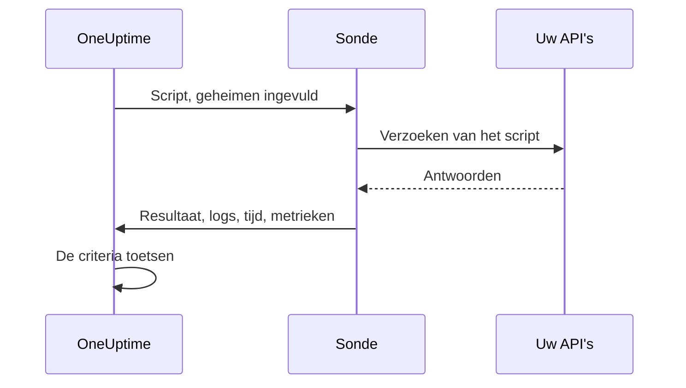

# Aangepaste-code-monitor

Een Custom Code-monitor voert volgens een schema een JavaScript-script uit dat u zelf schrijft, vanaf een sonde. Gebruik hem voor controles die de andere monitortypen niet kunnen uitdrukken: een aanmelding gevolgd door een geauthenticeerde API-aanroep, een transactie in meerdere stappen, of een waarde die u uit meerdere antwoorden berekent. Gooit het script een fout, dan mislukt de controle; wat het teruggeeft, is beschikbaar voor uw criteria en uw incidentsjablonen.

:::cards
- [De monitor maken](#een-custom-code-monitor-maken): Schrijf een script en kies de sondes die het uitvoeren.
- [Het script schrijven](#het-script-schrijven): Een uitvoerbare API-controle in meerdere stappen als startpunt.
- [Geheimen gebruiken](#monitorgeheimen-gebruiken): Houd wachtwoorden en tokens buiten het script.
- [Aangepaste metrieken vastleggen](#aangepaste-metrieken): Zet elk getal dat uw script berekent in een grafiek.
:::

## Zo werkt het

Bij elke controle voert een sonde uw script uit in een geïsoleerde JavaScript-sandbox, met uw monitorgeheimen al ingevuld. Het script roept aan wat het nodig heeft en geeft dan een resultaat terug of gooit een fout. De sonde rapporteert het resultaat, de logberichten van het script, hoe lang het liep en de vastgelegde metrieken, en OneUptime toetst daar uw criteria aan.



De sandbox is geen Node.js: er is geen `require`, geen `process`, geen `fetch` en geen bestandssysteem, alleen de [modules die hieronder staan](#modules-die-in-het-script-beschikbaar-zijn).

## Voordat u begint

- Een **sonde** die elk endpoint bereikt dat het script aanroept. Gebruik voor endpoints binnen uw netwerk een [aangepaste sonde](/docs/probe/custom-probe).
- Om een privéadres aan te roepen (zoals `10.0.0.5`), moet de sonde dat toestaan: stel `PROBE_ALLOW_PRIVATE_NETWORK_MONITORS=true` in op die sonde. Loopback-, link-local- en cloudmetadata-adressen worden altijd geweigerd. Zie [Toegang tot privénetwerk](/docs/self-hosted/private-network-access).
- Elk wachtwoord, elke API-sleutel en elk token dat het script nodig heeft, opgeslagen als [monitorgeheim](/docs/monitor/monitor-secrets).

## Een Custom Code-monitor maken

:::steps
### Een nieuwe monitor beginnen

Ga naar **Monitoren** en klik op **Monitor maken**. Klik onder **Monitortype** op **Meer monitortypen** en kies **Custom JavaScript Code** onder **Synthetic Monitoring**, of typ `script` in het zoekvak. Voer een **Naam** in en klik op **Volgende**.

### Het script toevoegen

Schrijf uw script in de editor **JavaScript-code**. Begin met het [voorbeeld hieronder](#het-script-schrijven).

### Het testen

Klik op **Monitor testen** om het script één keer vanaf een sonde uit te voeren, en controleer het resultaat.

### De criteria nakijken

De monitor begint met twee criteria: hij is offline, en verklaart een incident, als het script mislukt, en online als het niet mislukt. Pas ze aan of voeg uw eigen toe (zie [Criteria](#criteria)) en klik op **Volgende**.

### Sondes kiezen en maken

Selecteer de **Sondes** die uw endpoints bereiken en een **Bewakingsinterval** (Custom Code-monitoren krijgen intervallen van 5 minuten of langer aangeboden) en klik op **Monitor maken**.
:::

## Het script schrijven

Het script is de body van een `async`-functie: u kunt op het hoogste niveau `await` gebruiken, met `return` een resultaat teruggeven en met `throw` de controle laten mislukken. Dit voorbeeld meldt zich aan, roept met het verkregen token een endpoint aan en mislukt als het antwoord niet is wat het verwacht:

```javascript title="Custom code monitor script"
// 1. Log in. axios rejects a 4xx or 5xx response, which fails the check.
const login = await axios.post("https://api.example.com/v1/login", {
  username: "monitoring@example.com",
  password: "{{monitorSecrets.ApiPassword}}",
});

// 2. Call an endpoint that needs the token.
const orders = await axios.get("https://api.example.com/v1/orders?limit=10", {
  headers: { Authorization: `Bearer ${login.data.token}` },
  timeout: 10000,
});

// 3. Fail the check when the data is wrong, not only when the request fails.
if (!Array.isArray(orders.data.items)) {
  throw new Error("The orders endpoint returned no items");
}

console.log(`Fetched ${orders.data.items.length} orders`);

// 4. Return what the criteria and incident templates should see.
return {
  data: orders.data.items.length,
};
```

| Om | Doe dit | Wat OneUptime vastlegt |
| --- | --- | --- |
| Een resultaat te melden | `return { data: ... }` met een willekeurige JSON-waarde | Het **Resultaat**. Alleen de eigenschap `data` blijft bewaard: `return 5` legt geen resultaat vast. |
| De controle te laten mislukken | `throw new Error("...")` | De **Scriptfout**, die de standaardcriteria tot een incident maken. |
| Een spoor achter te laten | `console.log(...)` | De **Logberichten**, tot 1.000 per uitvoering. |

Om een uitvoering te bekijken, opent u het **Overzicht** van de monitor: de kaart **Monitorsamenvatting** toont de sonde, de uitvoeringstijd en de fout, en **Meer details weergeven** toont het resultaat, de scriptfout en de logberichten. **Monitoringlogboeken** heeft dezelfde samenvatting voor eerdere controles.

> [!NOTE]
> In deze sandbox volgt `axios` geen omleidingen, en gaan de verzoeken niet via een proxy die op de sonde is ingesteld. Vraag de uiteindelijke URL op.

## Monitorgeheimen gebruiken

Verwijs overal in het script naar een geheim met `{{monitorSecrets.NAME}}`. OneUptime vervangt de verwijzing door de waarde van het geheim, als platte tekst, voordat het script de sonde bereikt. Zet een geheim dus tussen aanhalingstekens om het als tekenreeks te gebruiken, en laat de aanhalingstekens weg om het als getal of boolean te gebruiken:

```javascript
// Used as a string: wrap it in quotes.
const apiKey = "{{monitorSecrets.ApiKey}}";

// Used as a number or a boolean: leave it bare.
const retryLimit = {{monitorSecrets.RetryLimit}};
const verbose = {{monitorSecrets.Verbose}};

// Check the secret was filled in without logging the secret itself.
console.log(apiKey.length > 0);
```

Een geheime waarde met een aanhalingsteken erin breekt de tekenreeks eromheen. Een verwijzing die de monitor niet mag gebruiken, blijft in het script staan zoals ze geschreven is. Hoe u een geheim aanmaakt en kiest welke monitoren het mogen gebruiken, leest u in [Monitor-geheimen](/docs/monitor/monitor-secrets).

## Aangepaste metrieken

Met de functie `oneuptime.captureMetric()` legt u vanuit uw script aangepaste metrieken vast. Deze metrieken worden in OneUptime opgeslagen en kunnen met de metriekverkenner in dashboards in grafieken worden gezet.

```javascript
oneuptime.captureMetric(name, value, attributes);
```

| Parameter | Type | Beschrijving |
| --- | --- | --- |
| `name` | string, verplicht | De naam van de metriek (bijv. `"api.response.time"`). Die wordt automatisch opgeslagen met het voorvoegsel `custom.monitor.`. |
| `value` | number, verplicht | De numerieke waarde van de metriek. Een waarde die geen getal is, wordt genegeerd. |
| `attributes` | object, optioneel | Sleutel-waardeparen voor extra context. Tekenreeksen, getallen en booleans worden vastgelegd (getallen en booleans als tekst, omdat metriekattributen dimensies zijn en geen metingen). Waarden van elk ander type worden genegeerd. |

### Voorbeeld

```javascript
const response = await axios.get("https://api.example.com/health");

// Capture a simple metric
oneuptime.captureMetric("api.response.time", response.data.latency);

// Capture a metric with attributes
oneuptime.captureMetric("api.queue.depth", response.data.queueDepth, {
  region: "us-east-1",
  environment: "production",
});

return {
  data: response.data,
};
```

Eenmaal vastgelegd, verschijnen deze metrieken in de metriekverkenner onder namen zoals `custom.monitor.api.response.time`, en op de pagina **Metrieken** van de monitor onder **Aangepaste metrieken**. OneUptime voegt de monitor en de sonde aan elk datapunt toe, zodat u ze in grafieken kunt zetten, erop kunt waarschuwen en kunt filteren op monitor, sonde of elk aangepast attribuut dat u hebt meegegeven.

### Limieten

| Limiet | Waarde | Boven de limiet |
| --- | --- | --- |
| Metrieken per scriptuitvoering | 100 | Verdere aanroepen worden genegeerd. |
| Lengte van de metrieknaam | 200 tekens | De naam wordt afgekapt. |
| Attributen per metriek | 50 | Verdere attributen worden verworpen. |
| Lengte van een attribuutsleutel | 200 tekens | De sleutel wordt afgekapt. |
| Lengte van een attribuutwaarde | 1000 tekens | De waarde wordt afgekapt. |

### Gereserveerde attribuutsleutels

Sommige attribuutnamen zijn van OneUptime zelf, en een script kan ze niet schrijven. Zet uw script er een, dan wordt het attribuut verworpen (de metriek zelf wordt wel vastgelegd) en wordt er een waarschuwing met de naam van de sleutel in de serverlogs van OneUptime geschreven. Het zijn:

- De identiteit van de monitor: `monitorId`, `projectId`, `monitorName`, `probeName`, `probeId`, `isCustomMetric`.
- Alles in de naamruimten `oneuptime.` of `resource.`: die dragen de identificatoren die OneUptime bij het innemen toevoegt.
- Attributen voor de identiteit van resources: `service.name`, `host.name`, `k8s.cluster.name`, `iot.fleet.name`, `proxmox.cluster.name`, `vmware.vcenter.name`, `ceph.cluster.name`, `storage.array.name` en `docker.swarm.cluster.name`.

Deze namen zijn niet zomaar labels: OneUptime leest ze terug als de bewering bij welke resource een datapunt hoort. Een metriek met `service.name: payments-api` zou op het tabblad Metrieken van die service verschijnen, en als u later een metriekmonitor gegroepeerd op `service.name` zou bouwen, zouden de waarschuwingen ervan aan die service gekoppeld worden, de eigenaren van die service oproepen en tijdens een onderhoudsvenster op die service zwijgen. Gebruik in plaats daarvan de eigen labels van de monitor om een monitor aan een service of host te koppelen.

## Criteria

De criteria van een Custom Code-monitor kunnen controleren:

| Filtertype | Wat het controleert | Filtervoorwaarden |
| --- | --- | --- |
| **Fout** | De fout die het script gooide, als die er is. | Bevat, Not Contains, Equal To, Not Equal To, Is Empty, Is Not Empty |
| **Result Value** | De `data` die het script teruggaf. Als getal vergeleken als het er een is. | Dezelfde, plus Greater Than, Less Than, Greater Than Or Equal To, Less Than Or Equal To, Waar en Onwaar |
| **Uitvoeringstijd (in ms)** | Hoe lang het script liep. | Numerieke vergelijkingen |

De standaardcriteria markeren de monitor als online als **Fout** leeg is, en als offline (met een incident dat zichzelf oplost zodra het script weer slaagt) als dat niet zo is. In incident- en waarschuwingssjablonen is de uitvoering beschikbaar als `{{result}}`, `{{scriptError}}`, `{{logMessages}}` en `{{executionTimeInMs}}`: zie [Incident- en waarschuwingstemplates](/docs/monitor/incident-alert-templating).

### Waarschuwen op de teruggegeven gegevens

Wat het script als `data` teruggeeft, is de **Result Value** van de monitor, en een criterium kan die vergelijken: bijvoorbeeld _Result Value is Equal To `UP`_.

Is `data` een object of een array, vul dan **Veldpad (optioneel)** in op het Result Value-filter om één veld ervan te vergelijken in plaats van de hele waarde. Gebruik punten voor geneste velden en `[n]` voor array-elementen:

```javascript
const response = await axios.get("https://api.example.com/health");

return {
  data: {
    status: response.data.status, // "UP"
    cpu_busy_percent: response.data.cpu, // 42
    healthy: response.data.healthy, // true
    checks: response.data.checks, // [{ name: "db", latency: 12 }]
  },
};
```

| Veldpad | Vergelijkt | Voorbeeldvoorwaarde |
| --- | --- | --- |
| `status` | `"UP"` | Not Equal To `UP` |
| `cpu_busy_percent` | `42` | Greater Than `90` |
| `healthy` | `true` | Onwaar |
| `checks[0].latency` | `12` | Greater Than `500` |

Voeg één filter toe per veld dat u wilt controleren; elk filter kan een eigen voorwaarde en waarde hebben.

- Laat het veldpad leeg om de hele waarde te vergelijken, zoals bij een script dat één getal of één tekenreeks teruggeeft.
- Greater Than, Less Than en de andere getalvoorwaarden komen alleen overeen met een getal, dus geef een veld terug als `42`, niet als `"42"`. Waar en Onwaar komen alleen overeen met een boolean.
- Een veld dat niet in de teruggegeven gegevens staat (een ontbrekende sleutel, of een array-index voorbij het einde) wordt als leeg vergeleken: **Is Empty** komt ermee overeen, en geen enkele andere voorwaarde.
- Een veld met een punt in de naam is niet bereikbaar met een pad.
- In Terraform stelt de `custom_code_monitor_options` van het filter het veldpad in: zie [Monitorstappen](/docs/terraform/monitor-steps#comparing-one-field-of-a-scripts-result).

## Modules die in het script beschikbaar zijn

| Naam | Wat het is |
| --- | --- |
| `axios` | Een HTTP-client op basis van promises: roep `axios(...)` aan, of `axios.get`, `post`, `put`, `patch`, `delete`, `head`, `options`, `request` en `create`. De grootte van verzoeken en antwoorden is beperkt (elk 10 MB), omleidingen worden niet gevolgd en de proxy van een sonde wordt niet gebruikt. |
| `crypto` | `createHash` en `createHmac` (roep `update()` één keer aan, dan `digest()`), `randomBytes`, `randomInt` en `randomUUID`. Het is niet de `crypto`-module van Node.js: er zijn geen cijfers en geen handtekeningen. |
| `http`, `https` | Alleen hun klasse `Agent`, om aan `axios` mee te geven, bijvoorbeeld `httpsAgent: new https.Agent({ rejectUnauthorized: false })`. Er is geen `request` en geen `get`. |
| `console.log` | Logt gegevens voor debugging. Alleen `console.log` bestaat; `console.error` en de andere niet. |
| `oneuptime.captureMetric` | Legt een aangepaste metriek vast. Zie [Aangepaste metrieken](#aangepaste-metrieken). |
| `setTimeout`, `clearTimeout`, `sleep(ms)` | Wachten binnen het script. Een vertraging loopt nooit voorbij de time-out van het script. |

## Om rekening mee te houden

- **Time-out.** Een script dat langer dan 60 seconden loopt, wordt gestopt en de controle mislukt met "Script execution timed out". Op een zelfgehoste sonde verandert `PROBE_CUSTOM_CODE_MONITOR_SCRIPT_TIMEOUT_IN_MS` de limiet.
- **Geheugen.** Elke uitvoering krijgt een eigen sandbox met een geheugenlimiet van 128 MB.
- **Omleidingen.** `axios` volgt ze niet, dus een URL die omleidt, laat het verzoek mislukken. Gebruik de uiteindelijke URL.

## Probleemoplossing

:::details De controle mislukt met "Script execution timed out"
Het script liep langer dan de tijdslimiet. Geef elk verzoek een eigen `timeout` (in milliseconden), zodat een traag endpoint snel mislukt, met een fout die het noemt.
:::

:::details Een verzoek mislukt met status 301 of 302
`axios` volgt hier geen omleidingen. Verander de URL in het adres waarnaar wordt omgeleid.
:::

:::details Een verzoek naar een intern adres wordt geweigerd
De sonde staat geen adressen uit privénetwerken toe. Stel `PROBE_ALLOW_PRIVATE_NETWORK_MONITORS=true` in op een sonde binnen uw netwerk en voer de monitor vanaf die sonde uit: zie [Toegang tot privénetwerk](/docs/self-hosted/private-network-access).
:::

:::details Een geheim wordt niet ingevuld
De monitor mag het geheim niet gebruiken, of de naam in de verwijzing komt niet precies overeen met de naam van het geheim. Zie [Monitor-geheimen](/docs/monitor/monitor-secrets).
:::

## Volgende stappen

:::cards
- [Synthetische monitor](/docs/monitor/synthetic-monitor): Een echte browser besturen in plaats van API's aan te roepen.
- [Monitor-geheimen](/docs/monitor/monitor-secrets): De inloggegevens bewaren die uw script gebruikt.
- [Incident- en waarschuwingstemplates](/docs/monitor/incident-alert-templating): Het resultaat en de logs van het script in incidenten zetten.
:::
