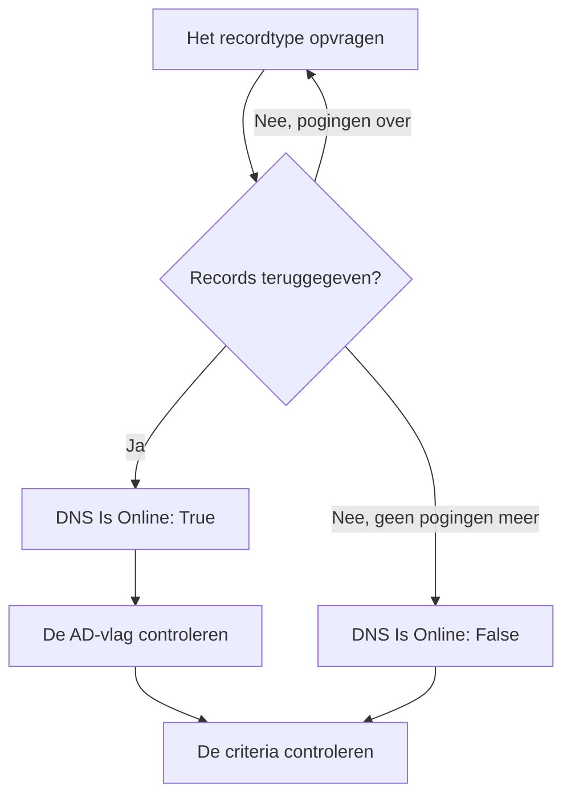

# DNS-monitor

Een DNS-monitor vraagt volgens een schema een DNS-record op en controleert het antwoord: dat de naam wordt omgezet, hoe snel, en wat de records zeggen. Gebruik hem om een DNS-storing, een gewijzigd of verdwenen record of een trage resolver op te merken voordat uw gebruikers het merken.

:::cards
- [De monitor maken](#een-dns-monitor-maken): Zes stappen in het dashboard.
- [Configuratieopties](#configuratieopties): De naam, het recordtype en de DNS-server.
- [Bewakingscriteria](#bewakingscriteria): Omzetting, records, responstijd en DNSSEC.
- [Problemen oplossen](#problemen-oplossen): Wanneer de monitor en `dig` het oneens zijn.
:::

## Hoe het werkt

Bij elke controle vraagt een sonde een DNS-server om één recordtype van één naam, zoals de `A`-records van `example.com`. De naam is online wanneer de server antwoordt met minstens één record van dat type. Een query die mislukt, een time-out krijgt of geen record teruggeeft, wordt een seconde later opnieuw geprobeerd, tot het aantal nieuwe pogingen dat u instelt. Daarna vraagt de sonde een validerende resolver of het antwoord de authenticated-data-vlag (AD) van DNSSEC draagt, en OneUptime beoordeelt het resultaat met de criteria van de monitor.



Een sonde die haar eigen netwerkverbinding kwijt is, meldt geen resultaat en kan uw DNS dus niet als offline markeren.

## Voordat u begint

- **Een rol die monitoren mag maken**: Project Owner, Project Admin, Project Member, Monitor Admin of Monitor Member, of een aangepaste rol met de machtiging Create Monitor.
- **Een sonde die de DNS-server kan bereiken.** De standaardsondes van uw project worden voor elke nieuwe monitor gekozen. Om een DNS-server in een privénetwerk op te vragen, zoals een interne resolver, gebruikt u een [aangepaste sonde](/docs/probe/custom-probe) in dat netwerk.

## Een DNS-monitor maken

:::steps
### Een nieuwe monitor beginnen

Ga naar **Monitoren** en klik op **Monitor maken**. Klik onder **Monitortype** op **Meer monitortypen** en kies **DNS** onder **DNS Monitoring**.

### Hem een naam geven

Voer een **Naam** in, zoals `example.com A records`, en klik op **Volgende**.

### De query invoeren

Voer de **Domeinnaam** in die moet worden opgevraagd, zoals `example.com`, en kies het **Recordtype**. Om een bepaalde server te vragen, vult u die in bij **DNS-server (optioneel)**; laat het veld leeg om de eigen resolver van de sonde te gebruiken.

### Hem testen

Klik op **Monitor testen**, kies een sonde onder **Selecteer sonde** en klik op **Test uitvoeren**. **Testresultaat van monitor** toont de records die de sonde terugkreeg.

### De criteria nakijken

**Monitorcriteria** begint met de [standaardcriteria](#standaardcriteria): offline wanneer de naam niet wordt omgezet, online wanneer dat wel gebeurt. Om te controleren wat de records zeggen, voegt u een filter **DNS Record Value** toe en klikt u op **Volgende**.

### Sondes kiezen en maken

Behoud of wijzig de **Sondes** en het **Bewakingsinterval** (het begint bij **Elke 5 minuten**) en klik op **Monitor maken**. De pagina van de monitor wordt geopend.
:::

## Configuratieopties

| Veld | Standaard | Wat u invult |
| --- | --- | --- |
| **Domeinnaam** | Geen | De naam die wordt opgevraagd, zoals `example.com` of `_sip._tcp.example.com`. Voor een `PTR`-record de omgekeerde naam, zoals `34.216.184.93.in-addr.arpa`. |
| **Recordtype** | `A` | Het recordtype dat wordt opgevraagd. Zie [Recordtypen](#recordtypen). |
| **DNS-server (optioneel)** | De resolver van de sonde | Een DNS-server die in plaats daarvan wordt gevraagd, zoals `8.8.8.8` of `ns1.example.com`. Elk recordtype, ook `CAA`, wordt aan deze server gevraagd. |
| **Poort** (onder **Meer velden**) | `53` | De poort van de server bij **DNS-server (optioneel)**. De DNSSEC-controle vraagt dezelfde poort. |
| **Time-out (ms)** (onder **Meer velden**) | `5000` | Hoe lang op een antwoord wordt gewacht, in milliseconden. |
| **Nieuwe pogingen** (onder **Meer velden**) | `3` | Nieuwe pogingen nadat de eerste mislukt. `0` betekent één enkele poging. |

### Recordtypen

Een criterium **DNS Record Value** vergelijkt uw tekst met elk record zoals de sonde het schrijft, dus houd u aan dit formaat:

| Recordtype | Wat het bevat | Formaat van de waarde, voor criteria |
| --- | --- | --- |
| `A` | IPv4-adressen | `93.184.216.34` |
| `AAAA` | IPv6-adressen | `2606:2800:220:1:248:1893:25c8:1946` |
| `CNAME` | De naam waarvan deze een alias is | `example.net` |
| `MX` | Mailservers | `10 mail.example.com` (prioriteit, dan de server) |
| `NS` | Naamservers | `ns1.example.com` |
| `TXT` | Tekst, zoals SPF- en verificatierecords | `v=spf1 include:_spf.example.com ~all` |
| `SOA` | De start of authority van de zone | `ns1.example.com hostmaster.example.com 2024010101 7200 3600 1209600 3600` (server, contact, serienummer, refresh, retry, expire, minimale TTL) |
| `PTR` | De naam waarnaar een adres terugverwijst (omgekeerde DNS) | `server1.example.com` |
| `SRV` | Services | `10 5 5060 sip.example.com` (prioriteit, gewicht, poort, doel) |
| `CAA` | De certificeringsinstanties die voor de naam mogen uitgeven | `0 letsencrypt.org` (vlag, dan de instantie) |

Een `TXT`-record dat in meerdere tekenreeksen is opgesplitst, wordt samengevoegd tot één waarde.

## Bewakingscriteria

Criteria bepalen wanneer de naam telt als online, verminderd of offline, en of dat een incident meldt of een waarschuwing aanmaakt. Elk criterium controleert een of meer filters:

| Filter | Voorwaarden | Wat het controleert |
| --- | --- | --- |
| **DNS Is Online** | **Waar**, **Onwaar** | Of de query minstens één record van het type heeft teruggegeven. |
| **DNS Response Time (in ms)** | **Greater Than**, **Less Than**, **Greater Than Or Equal To**, **Less Than Or Equal To** | Hoe lang de query duurde. |
| **DNS Record Exists** | **Waar**, **Onwaar** | Of er een record van het type terugkwam. |
| **DNS Record Value** | **Bevat**, **Not Contains**, **Starts With**, **Ends With**, **Equal To**, **Not Equal To** | De waarden van de records. Het filter komt overeen wanneer één record overeenkomt. |
| **DNSSEC Is Valid** | **Waar**, **Onwaar** | Of een validerende resolver de AD-vlag op het antwoord zet. |

**DNS Record Value** komt overeen wanneer _een willekeurig_ record overeenkomt. Met meerdere `A`-records komt **Equal To** `93.184.216.34` overeen wanneer een ervan dat adres is, en komt **Not Equal To** overeen wanneer een ervan dat niet is.

**DNSSEC Is Valid** vraagt de server bij **DNS-server (optioneel)**, op zijn **Poort**, of Google Public DNS (`8.8.8.8`) wanneer dat veld leeg is, dus de server die u instelt moet DNSSEC valideren. Het filter heeft geen waarde, en komt in geen enkele richting overeen, wanneer de sonde die controle niet kan uitvoeren. Voor een volledige controle van een ondertekende zone gebruikt u een [DNSSEC-monitor](/docs/monitor/dnssec-monitor).

Met twee of meer filters bepaalt **Overeenkomstvoorwaarde** of **Alle** filters moeten overeenkomen of dat **Elke** filter volstaat. De **Acties** van een criterium bepalen wat het doet: de monitorstatus wijzigen, een waarschuwing aanmaken, een incident melden, of meerdere daarvan.

### Standaardcriteria

Een nieuwe DNS-monitor begint met twee criteria:

- **Offline** — de naam wordt na alle nieuwe pogingen niet omgezet, of heeft geen record van het type. De monitor wordt als **Offline** gemarkeerd en er wordt een incident met de naam "_monitor name_ is offline" gemaakt. Het incident lost zichzelf op wanneer de naam weer wordt omgezet.
- **Bereikbaar** — de naam wordt omgezet. De monitor wordt als **Operationeel** gemarkeerd.

Criteria worden van boven naar beneden gecontroleerd, en het eerste dat overeenkomt bepaalt wat er gebeurt. Komt er geen overeen, dan toont de monitor zijn standaardstatus: **Operationeel**, tenzij u onder **Meer velden**, onder de criteria, een andere kiest.

### Over een periode evalueren

**Evalueer deze criteria over een bepaalde periode** is een selectievakje onder een filter, aangeboden voor **DNS Is Online** en **DNS Response Time (in ms)**. Zet het aan om een venster van eerdere controles te beoordelen in plaats van alleen de laatste: kies een aggregatie onder **Evalueren** en een venster, van 2 tot 60 minuten, onder **Voor de laatste (in minuten)**.

| Aggregatie | Komt overeen wanneer |
| --- | --- |
| **Gemiddelde**, **Som**, **Maximum Value**, **Minimum Value** | Die waarde over het venster aan de voorwaarde voldoet. Alleen **DNS Response Time (in ms)**. |
| **All Values** | Elke controle in het venster aan de voorwaarde voldoet. |
| **Any Value** | Minstens één controle in het venster aan de voorwaarde voldoet. |

**All Values** komt pas overeen wanneer het venster echt met gegevens is gevuld. Een monitor die net is gemaakt, of een waarvan de controles niet meer werden vastgelegd, heeft niet genoeg geschiedenis om iets over de laatste N minuten te zeggen, dus het criterium wacht in plaats van overeen te komen op de ene meting die het heeft. **Any Value** is de instelling voor "laat het me weten zodra één controle de grens overschrijdt" en gaat nog steeds meteen af.

**Als geen gegevens** bepaalt wat er gebeurt zolang het venster het criterium niet kan onderbouwen:

| Optie | Wat er gebeurt | Gebruik het voor |
| --- | --- | --- |
| **Ignore** (standaard) | Het criterium komt niet overeen. | Gewone drempelwaarschuwingen. |
| **Trigger** | De ontbrekende gegevens tellen als het probleem. | Controles waarbij stilte zelf een storing is. |
| **Treat As Zero** | Het venster wordt vergeleken als één enkele nul. | Tellers waarbij geen gebeurtenissen echt nul betekent. |

### Voorbeeldcriteria

| Doel | Filter | Voorwaarde | Waarde |
| --- | --- | --- | --- |
| Offline wanneer de naam niet meer wordt omgezet | **DNS Is Online** | **Onwaar** | — |
| Waarschuwen wanneer het enige `A`-record van een naam verandert | **DNS Record Value** | **Not Equal To** | `93.184.216.34` |
| Waarschuwen wanneer een `MX`-record buiten uw domein wijst | **DNS Record Value** | **Not Contains** | `example.com` |
| DNS als verminderd markeren wanneer het traag is | **DNS Response Time (in ms)** | **Greater Than** | `500` |
| Waarschuwen wanneer de DNSSEC-validatie mislukt | **DNSSEC Is Valid** | **Onwaar** | — |

## Problemen oplossen

:::details De monitor zegt offline, maar bij mij wordt de naam omgezet
De sonde heeft een andere server gevraagd, of naar een ander recordtype. Controleer het **Recordtype**: een naam met alleen een `CNAME`, of alleen `AAAA`-records, heeft geen `A`-record. Vergelijk met `dig` tegen dezelfde server:

```bash
dig @8.8.8.8 example.com A
```
:::

:::details Een criterium met Not Equal To gaat af terwijl het juiste adres er is
**DNS Record Value** komt overeen wanneer één record overeenkomt. Met meerdere records gaat **Not Equal To** af zodra een ervan afwijkt. Om te controleren dat een bepaalde waarde tussen de records staat, vertrouwt u op de volgorde van de criteria, want het eerste dat overeenkomt wint:

1. Houd het standaard offline-criterium bovenaan: **DNS Is Online** / **Onwaar**.
2. Voeg daaronder een criterium toe met **DNS Record Value** / **Equal To** / de verwachte waarde, dat de monitor als **Operationeel** markeert.
3. Voeg daaronder een criterium toe met **DNS Is Online** / **Waar**, dat de monitor als **Offline** markeert en een incident meldt. Het komt alleen overeen met antwoorden die de waarde niet hebben.
:::

:::details DNSSEC Is Valid komt nooit overeen
De server bij **DNS-server (optioneel)** valideert DNSSEC niet en zet dus nooit de AD-vlag, of de sonde kon de controle niet uitvoeren. Laat het veld leeg om met `8.8.8.8` te valideren, of gebruik een [DNSSEC-monitor](/docs/monitor/dnssec-monitor).
:::

## Volgende stappen

:::cards
- [DNSSEC-monitor](/docs/monitor/dnssec-monitor): De vertrouwensketen van een ondertekende zone valideren.
- [Domein-monitor](/docs/monitor/domain-monitor): De registratie en het verlopen van het domein in de gaten houden.
- [Aangepaste probes](/docs/probe/custom-probe): Interne DNS-servers vanuit uw eigen netwerk opvragen.
- [Incidenten – Overzicht](/docs/incidents/index): Wat er gebeurt nadat de monitor er een heeft gemeld.
:::
