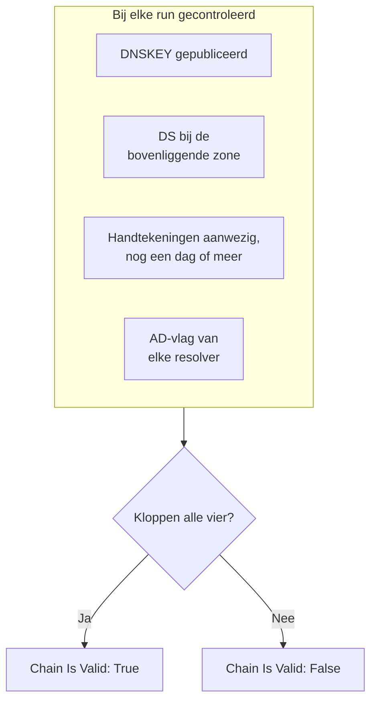

# DNSSEC-monitor

Een DNSSEC-monitor controleert of een ondertekende DNS-zone nog valideert: dat ze haar sleutels publiceert, dat de bovenliggende zone voor haar instaat, dat haar handtekeningen niet zijn verlopen en dat validerende resolvers haar accepteren. Gebruik hem om een gebroken vertrouwensketen op te merken voordat resolvers voor uw domein met `SERVFAIL` gaan antwoorden.

:::cards
- [De monitor maken](#een-dnssec-monitor-maken): Zes stappen in het dashboard.
- [Wat er wordt gecontroleerd](#hoe-het-werkt): De controles achter een geldige keten.
- [Bewakingscriteria](#bewakingscriteria): Geldigheid van de keten, sleutels, DS-records, handtekeningen, resolvers en naamservers.
- [Aanbevolen werkwijzen](#aanbevolen-werkwijzen): Drempels en resolvers die werken.
:::

## Hoe het werkt

Bij elke controle voert een sonde een reeks DNS-query's uit op de zone:

| Query | Gevraagd aan | Wat het u vertelt |
| --- | --- | --- |
| `DNSKEY` | De eerste resolver bij **Resolvers** | Of de zone haar ondertekeningssleutels publiceert. |
| `DS` | De eerste resolver bij **Resolvers** | Of de bovenliggende zone een delegation-signer-record voor de zone publiceert. |
| `SOA`, met DNSSEC-records | De eerste resolver bij **Resolvers** | Of de records van de zone zijn ondertekend (de `RRSIG` die haar `SOA`-record ondertekent), en wanneer de eerst verlopende handtekening verloopt. |
| `A`, met DNSSEC-validatie | Elke resolver bij **Resolvers** | Of elke validerende resolver de zone accepteert, wat hij aangeeft met de authenticated-data-vlag (AD). |
| `NS`, dan `SOA` | De eerste resolver, dan elke gezaghebbende naamserver die die noemt | Of elke naamserver hetzelfde SOA-serienummer levert. Alleen wanneer **Consistentie van naamservers controleren** aan staat. |

Validerende resolvers controleren de vertrouwensketen vanaf de root naar beneden, dus de AD-vlag vertelt u dat de hele keten standhoudt. De keten telt als geldig wanneer al het volgende klopt:

Een handtekening met minder dan een dag te gaan telt al als gebroken, zodat u het tot een dag eerder hoort dan dat resolvers de zone gaan weigeren. Een controle die de keten gebroken of de naamservers niet in de pas vindt, wordt een seconde later opnieuw uitgevoerd, tot het aantal nieuwe pogingen dat u instelt, voordat OneUptime het resultaat met de criteria van de monitor beoordeelt. Alle query's van één poging delen een deadline van drie keer de **Time-out (ms)**; een poging waarvan de tijd op is, meldt een time-out, geen oordeel over de zone.

## Voordat u begint

- **Een rol die monitoren mag maken**: Project Owner, Project Admin, Project Member, Monitor Admin of Monitor Member, of een aangepaste rol met de machtiging Create Monitor.
- **Een ondertekende zone.** De zone moet ondertekend zijn, en haar DS-record via uw registrar bij de bovenliggende zone gepubliceerd.
- **Uitgaand DNS vanaf de sonde** naar de resolvers die u opgeeft en, voor de consistentiecontrole van de naamservers, naar de gezaghebbende naamservers van de zone. De standaardsondes van uw project worden voor elke nieuwe monitor gekozen.

## Een DNSSEC-monitor maken

:::steps
### Een nieuwe monitor beginnen

Ga naar **Monitoren** en klik op **Monitor maken**. Klik onder **Monitortype** op **Meer monitortypen** en kies **DNSSEC** onder **DNS Monitoring**.

### Hem een naam geven

Voer een **Naam** in, zoals `example.com DNSSEC`, en klik op **Volgende**.

### De zone invoeren

Voer bij **Zone (domeinnaam)** de zone in die moet worden gevalideerd, zoals `example.com`. Behoud de standaard-**Resolvers**, of geef uw eigen op, gescheiden door komma's. Laat **Consistentie van naamservers controleren** aan staan, tenzij uw netwerk DNS naar willekeurige servers blokkeert.

### Hem testen

Klik op **Monitor testen**, kies een sonde onder **Selecteer sonde** en klik op **Test uitvoeren**. **Testresultaat van monitor** toont wat elke controle heeft gevonden.

### De criteria nakijken

**Monitorcriteria** begint met de [standaardcriteria](#standaardcriteria): offline wanneer de keten gebroken is, online wanneer ze geldig is. Om gewaarschuwd te worden voordat handtekeningen verlopen, voegt u een criterium toe (zie [Aanbevolen werkwijzen](#aanbevolen-werkwijzen)) en klikt u op **Volgende**.

### Sondes kiezen en maken

Behoud of wijzig de **Sondes** en het **Bewakingsinterval** (het begint bij **Elke 5 minuten**) en klik op **Monitor maken**. De pagina van de monitor wordt geopend.
:::

## Configuratieopties

| Veld | Standaard | Wat u invult |
| --- | --- | --- |
| **Zone (domeinnaam)** | Geen | De zone die wordt gevalideerd, zoals `example.com`. |
| **Resolvers** | `1.1.1.1, 8.8.8.8, 9.9.9.9` | Validerende resolvers die worden gevraagd, gescheiden door komma's. Elk ervan moet de AD-vlag teruggeven om de keten als geldig te laten tellen. |
| **Consistentie van naamservers controleren** | Aan | Elke gezaghebbende naamserver rechtstreeks vragen en hun SOA-serienummers vergelijken. Zet het uit als uw netwerk uitgaand DNS naar willekeurige servers blokkeert. |
| **Waarschuwing handtekeningvervaldatum (dagen)** (onder **Meer velden**) | `7` | Wordt met de monitor opgeslagen. Het filter **DNSSEC Signature Expires In Days** gebruikt de waarde die u het in het criterium geeft, dus stel uw drempel daar in. |
| **Time-out (ms)** (onder **Meer velden**) | `10000` | Hoe lang op elke DNS-query wordt gewacht, in milliseconden. Eén poging kan in totaal tot drie keer zo lang duren. |
| **Nieuwe pogingen** (onder **Meer velden**) | `3` | Nieuwe pogingen nadat de eerste mislukt. `0` betekent één enkele poging. |

## Bewakingscriteria

Criteria bepalen wanneer de zone telt als online, verminderd of offline, en of dat een incident meldt of een waarschuwing aanmaakt. Elk criterium controleert een of meer filters:

| Filter | Voorwaarden | Wat het controleert |
| --- | --- | --- |
| **DNSSEC Chain Is Valid** | **Waar**, **Onwaar** | Alle vier de controles hierboven kloppen: sleutels gepubliceerd, DS bij de bovenliggende zone, handtekeningen aanwezig met nog een dag of meer te gaan, en de AD-vlag van elke resolver. |
| **DNSSEC DNSKEY Record Exists** | **Waar**, **Onwaar** | De zone publiceert minstens één DNSKEY-record. |
| **DNSSEC DS Record Exists At Parent** | **Waar**, **Onwaar** | De bovenliggende zone publiceert een DS-record voor de zone. |
| **DNSSEC Signature Expires In Days** | **Greater Than**, **Less Than**, **Greater Than Or Equal To**, **Less Than Or Equal To** | Hele dagen totdat de eerst verlopende handtekening (RRSIG) verloopt. |
| **DNSSEC Resolver Consensus (AD Flag)** | **Waar**, **Onwaar** | Elke resolver bij **Resolvers** geeft de AD-vlag terug. |
| **DNSSEC Nameservers Are Consistent** | **Waar**, **Onwaar** | Elke gezaghebbende naamserver antwoordt met hetzelfde SOA-serienummer. Altijd **Waar** zolang **Consistentie van naamservers controleren** uit staat. |

Met twee of meer filters bepaalt **Overeenkomstvoorwaarde** of **Alle** filters moeten overeenkomen of dat **Elke** filter volstaat. De **Acties** van een criterium bepalen wat het doet: de monitorstatus wijzigen, een waarschuwing aanmaken, een incident melden, of meerdere daarvan.

### Standaardcriteria

Een nieuwe DNSSEC-monitor begint met twee criteria:

- **Keten gebroken** — **DNSSEC Chain Is Valid** is **Onwaar**. De monitor wordt als **Offline** gemarkeerd en er wordt een incident met de naam "_monitor name_ DNSSEC chain is broken" gemaakt. Het incident lost zichzelf op zodra de keten weer geldig is.
- **Keten geldig** — de monitor wordt als **Operationeel** gemarkeerd.

Criteria worden van boven naar beneden gecontroleerd, en het eerste dat overeenkomt bepaalt wat er gebeurt. Komt er geen overeen, dan toont de monitor zijn standaardstatus: **Operationeel**, tenzij u onder **Meer velden**, onder de criteria, een andere kiest.

De standaardcriteria houden het verlopen van handtekeningen en de consistentie van de naamservers niet uit zichzelf in de gaten. Voeg daar criteria voor toe, zoals hieronder.

### Voorbeeldcriteria

| Doel | Filter | Voorwaarde | Waarde |
| --- | --- | --- | --- |
| Offline wanneer de keten gebroken is (een standaardcriterium) | **DNSSEC Chain Is Valid** | **Onwaar** | — |
| Waarschuwen voordat handtekeningen verlopen | **DNSSEC Signature Expires In Days** | **Less Than** | `7` |
| Een delegatie opmerken die haar DS-record kwijt is | **DNSSEC DS Record Exists At Parent** | **Onwaar** | — |
| Resolvers opmerken die het oneens zijn | **DNSSEC Resolver Consensus (AD Flag)** | **Onwaar** | — |
| Naamservers opmerken die niet in de pas lopen | **DNSSEC Nameservers Are Consistent** | **Onwaar** | — |

## Aanbevolen werkwijzen

1. **Kies resolvers die altijd bereikbaar zijn.** Elke resolver moet de AD-vlag teruggeven om de keten als geldig te laten tellen, dus een resolver die de sonde niet kan bereiken laat de controle mislukken zodra de nieuwe pogingen op zijn. De standaardwaarden, `1.1.1.1`, `8.8.8.8` en `9.9.9.9`, worden door drie verschillende beheerders geleverd, wat ook een zone opmerkt die op de ene resolver valideert maar op de andere niet.
2. **Laat u waarschuwen voordat handtekeningen verlopen.** Ondertekenaars ondertekenen een zone opnieuw voordat haar handtekeningen verlopen, dus een handtekening die bijna verloopt, betekent dat het opnieuw ondertekenen is gestopt. Voeg een criterium toe met **DNSSEC Signature Expires In Days** / **Less Than** / `7` dat een waarschuwing aanmaakt, en een tweede op `2` dat een incident meldt. Sleep beide boven het criterium dat de keten als geldig markeert, dat van `2` dagen eerst, want het eerste criterium dat overeenkomt wint. Kies drempels die lager zijn dan de tijd die uw ondertekenaar normaal op een handtekening laat staan voordat hij opnieuw ondertekent, zodat ze stil blijven zolang het opnieuw ondertekenen werkt.
3. **Bewaak elke ondertekende zone.** Neem het apex-domein mee, ondertekende subdomeinen, en elke zone die aan een andere beheerder is gedelegeerd.
4. **Laat de consistentiecontrole van de naamservers aan staan,** en voeg er een criterium voor toe. Ze merkt een secundaire server op die geen overdrachten van de primaire meer ontvangt, wat DNSSEC-validatie alleen kan missen.

## Problemen oplossen

:::details De keten wordt als gebroken gemeld, maar de zone valideert met `dig`
Een van de resolvers bij **Resolvers** gaf de AD-vlag niet terug: hij was vanaf de sonde niet bereikbaar, of hij valideert DNSSEC niet. De tabel **Resolver Checks**, in **Testresultaat van monitor** en in de samenvatting van elke controle, toont het antwoord en de fout van elke resolver. Verwijder resolvers die de sonde niet kan bereiken, en geef alleen validerende op.
:::

:::details Naamservers worden direct na een wijziging als inconsistent gemeld
Secundaire servers kunnen na een wijziging van de zone een tijdje achterlopen op de primaire. De tabel **Nameserver Consistency** in de samenvatting van de controle toont het SOA-serienummer van elke naamserver. Blijft er een achter, dan ontvangt die secundaire server geen overdrachten meer. Toont elke naamserver een fout, dan wordt de sonde mogelijk verhinderd ze rechtstreeks te vragen: zet **Consistentie van naamservers controleren** uit.
:::

:::details De controle meldt een time-out
Alle query's van één poging delen drie keer de **Time-out (ms)**. Een trage of onbereikbare resolver gebruikt die tijd op; verwijder hem uit **Resolvers**, of verhoog de time-out.
:::

## Volgende stappen

:::cards
- [DNS-monitor](/docs/monitor/dns-monitor): Controleren of een naam wordt omgezet, en wat de records zeggen.
- [Domein-monitor](/docs/monitor/domain-monitor): De registratie en het verlopen van het domein in de gaten houden.
- [SSL-certificaat-monitor](/docs/monitor/ssl-certificate-monitor): De certificaten in de gaten houden die op het domein worden geleverd.
- [Incidenten – Overzicht](/docs/incidents/index): Wat er gebeurt nadat de monitor er een heeft gemeld.
:::
