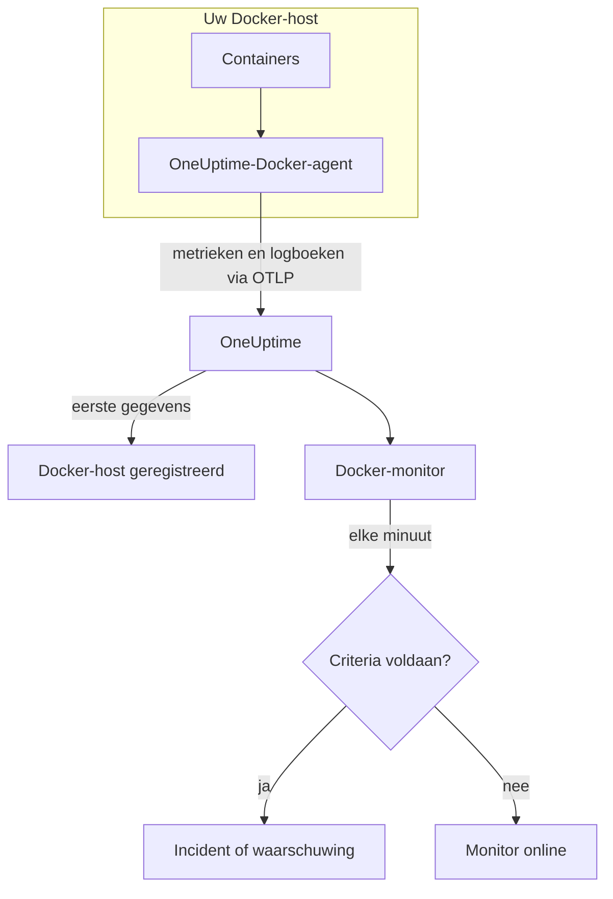

# Docker-monitor

Een Docker-monitor bewaakt de containers op één Docker-host en laat u weten wanneer een container heet loopt, door zijn geheugen raakt of in een herstartlus zit. Hij leest de metrieken die de OneUptime-Docker-agent vanaf de host verstuurt, dus er wordt niets van buitenaf gepeild: installeer de agent en maak de monitor dan vanuit een sjabloon of uw eigen query.

:::cards
- [De monitor maken](#een-docker-monitor-maken): Zes stappen in het dashboard.
- [Sjablonen](#kant-en-klare-waarschuwingssjablonen): Zes kant-en-klare waarschuwingen, één incident per container.
- [Metrieken](#verzamelde-metrieken): Wat de agent verzamelt, en wat elke metriek betekent.
- [Logboeken](#verzamelde-logboeken): Containerlogboeken, en het logstuurprogramma dat ze nodig hebben.
:::

## Hoe het werkt

De OneUptime-Docker-agent draait als container op de host. Elke 30 seconden leest hij containerstatistieken uit de Docker Engine-API, volgt hij de logbestanden van de containers en stuurt hij beide via OTLP naar OneUptime. De eerste gegevens van een host registreren hem in OneUptime.

Een Docker-monitor is aan één host gebonden. Elke minuut voert hij zijn query uit over de containermetrieken van die host en vergelijkt hij het resultaat met zijn criteria.



## Voordat u begint

- **Installeer de Docker-agent** op de host. De [handleiding voor de Docker-agent](/docs/telemetry/docker-host) behandelt installeren, bijwerken en controleren.
- **Controleer of de host is geregistreerd.** Hij verschijnt onder **Producten → Infrastructuur → Docker → Alle hosts**, genoemd naar de `DOCKER_HOST_NAME` van de agent, zodra zijn eerste gegevens binnenkomen.
- **Voor containerlogboeken** draait u de containers met het Docker-logstuurprogramma `json-file`. Zie [Vereist logstuurprogramma](#vereist-logstuurprogramma).

## Een Docker-monitor maken

:::steps
### Een nieuwe monitor beginnen

Ga naar **Monitoren** en klik op **Monitor maken**.

### Docker Container kiezen

Klik onder **Monitortype** op **Meer monitortypen** en kies **Docker Container** onder **Infrastructuur**, of typ `docker` in het zoekvak. Vul een **Naam** in – die wordt gebruikt in de titels van incidenten en waarschuwingen – en klik op **Volgende**.

### De host kiezen

Kies onder **Docker-monitorconfiguratie** de host in **Docker-host**. Elke host die gegevens heeft verstuurd, staat in de lijst.

### Kiezen wat u bewaakt

Kies een van de drie tabbladen:

- **Quick Setup** – klik op een [sjabloon](#kant-en-klare-waarschuwingssjablonen). Het stelt de metriek, de aggregatie, het tijdsbereik en de drempels in, en vervangt de criteria hieronder door die van het sjabloon. Het **Tijdsbereik** kunt u nog wijzigen.
- **Custom Metric** – kies één metriek in **Docker-metriek** en stel dan **Aggregatie** en **Tijdsbereik** in. **Containernaam** en **Container-image** beperken hem tot bepaalde containers.
- **Geavanceerd** – bouw zelf query's en formules onder **Selecteer metrieken**. Gebruik **Group by** `resource.container.name` om elke container afzonderlijk te beoordelen.

### De criteria controleren

Open elk criterium onder **Monitorcriteria** en controleer de **Metriek**, **Aggregatie**, **Voorwaarde** en **Threshold**. Een sjabloon vult deze in. Met **Custom Metric** of **Geavanceerd** begint de monitor met de [standaardcriteria](#standaardcriteria), die alleen opmerken dat een metriek naar nul zakt; stel daarom uw eigen drempel in.

### De monitor maken

Klik op **Monitor maken**. OneUptime opent de pagina van de monitor en evalueert hem elke minuut. Incidenten en waarschuwingen die hij opent, staan ook op de pagina's **Incidenten** en **Waarschuwingen** van de host.
:::

> [!TIP]
> Om meerdere sjablonen tegelijk in te stellen, opent u de host via **Producten → Infrastructuur → Docker** en gaat u naar **Recommendations**. Kies de sjablonen die u wilt en wie wordt opgeroepen, en OneUptime maakt één monitor per sjabloon.

## Monitorinstellingen

| Veld | Tabblad | Wat het doet |
| --- | --- | --- |
| **Docker-host** | Alle | Verplicht. Beperkt elke query tot de `resource.host.name` van de host. OneUptime voegt ook `resource.container.runtime = docker` aan elke query toe. |
| **Docker-metriek** | Custom Metric | Eén metriek uit de catalogus van de agent, gegroepeerd als CPU, geheugen, netwerk, blok-I/O en container. |
| **Containernaam** | Custom Metric, Geavanceerd | Optioneel. Exacte overeenkomst met `resource.container.name`, bijvoorbeeld `my-container`. |
| **Container-image** | Custom Metric, Geavanceerd | Optioneel. Exacte overeenkomst met `resource.container.image.name`, bijvoorbeeld `nginx:latest`. |
| **Aggregatie** | Custom Metric | Hoe metingen worden gecombineerd: **Gemiddelde**, **Maximum**, **Minimum**, **Som** of **Aantal**. Begint bij de gebruikelijke aggregatie van de metriek. |
| **Tijdsbereik** | Alle | Het schuivende venster dat de query leest, van **Past 1 Minute** tot **Past 365 Days**. Een nieuwe monitor begint bij **Past 1 Minute**; sjablonen stellen hun eigen in. |
| **Selecteer metrieken** | Geavanceerd | De querybouwer: **Metriek**, **Aggregate by**, **Filter by attributes**, **Group by**, plus **Metriek toevoegen** en **Formule toevoegen** om query's te combineren. |

## Kant-en-klare waarschuwingssjablonen

**Quick Setup** biedt zes sjablonen. Elk bouwt een complete monitor: een query gegroepeerd op `resource.container.name`, een criterium dat afgaat en een dat herstelt. Elke container wordt afzonderlijk beoordeeld, zodat een drukke container geen andere verbergt, en elke container over de drempel krijgt een eigen incident en een eigen waarschuwing. De drempels zijn uitgangspunten die u kunt aanpassen.

Tenzij de tabel iets anders zegt, gaat een criterium alleen af als de voorwaarde elke minuut van zijn venster geldt, en herstelt het 10% voorbij de drempel, zodat een waarde die rond de grens schommelt niet heen en weer springt.

| Sjabloon | Ernst | Bewaakt | Gaat af als | Herstelt als |
| --- | --- | --- | --- | --- |
| High Container CPU Usage | Warning | `container.cpu.utilization`, Max per container, laatste 5 minuten | Boven 80 (% van één kern) | Op of onder 72 |
| High Container Memory Usage | Warning | `container.memory.percent`, Max per container, laatste 5 minuten | Boven 85% | Op of onder 76,5% |
| Container Restart Loop | Kritiek | Groei van `container.restarts` per container, laatste 15 minuten | Meer dan 3 herstarts in het venster (Som) | 2,7 of minder |
| Container CPU Throttling | Warning | Groei van `container.cpu.throttling_data.throttled_time` in ms per container, laatste 5 minuten | Meer dan 1000 ms in het venster (Som) | 900 ms of minder |
| High Container Process Count | Warning | `container.pids.count`, Max per container, laatste 5 minuten | Boven 2000 | Op of onder 1800 |
| Container Down (Low Uptime) | Kritiek | `container.uptime`, Min per container, laatste 1 minuut | Gelijk aan 0 | Boven 0 |

**Ernst** is het label dat de keuzelijst toont. Het incident en de waarschuwing die een sjabloon maakt, beginnen op het zwaarste incident- en waarschuwingsernstniveau van uw project; wijzig ze in de criteria.

> [!NOTE]
> `container.cpu.utilization` is het getal dat `docker stats` toont: 100% is één volledige CPU-kern, niet de hele host, dus een container die twee kernen gebruikt, staat op 200. Op een host met meerdere kernen is de drempel van 80 een CPU-budget, geen aandeel van de machine.

> [!NOTE]
> `container.memory.percent` deelt door de geheugenlimiet van de container als die is ingesteld, en anders door het totale geheugen **van de host**. Controleer of de container met `--memory` is gestart voordat u een overschrijding behandelt als een dreigende beëindiging door geheugentekort.

> [!WARNING]
> `container.restarts` en `container.cpu.throttling_data.throttled_time` groeien alleen, dus die twee sjablonen waarschuwen op hoeveel ze in het venster zijn gegroeid: een Maximum- en een Minimum-query per minuut, door een formule van elkaar afgetrokken en opgeteld. Bij het uitlezen elke 30 seconden door de agent ziet dat ongeveer de helft van de echte activiteit, en de drempels houden daar al rekening mee. Als u het `collection_interval` van de agent op 60 seconden of meer zet, bevat elke minuut één meting en waarschuwen beide sjablonen niet meer.

> [!CAUTION]
> **Container Down (Low Uptime)** kan een container die stopt en gestopt blijft niet vangen. De agent rapporteert alleen draaiende containers, dus een gestopte container stuurt helemaal geen gegevens en zijn uptime staat nooit op 0. Bewaak voor een service die moet blijven draaien ook wat hij levert – bijvoorbeeld met een [API-monitor](/docs/monitor/api-monitor).

## Verzamelde metrieken

De agent gebruikt de OpenTelemetry-receiver `docker_stats` tegen de Docker-socket, elke 30 seconden. De metrieken van elke container dragen zijn identiteit als resourceattributen: `resource.container.name`, `resource.container.image.name`, `resource.container.id`, `resource.container.runtime` (`docker`) en `resource.host.name`.

### CPU

| Metriek | Beschrijving |
| --- | --- |
| `container.cpu.utilization` | CPU-gebruik, waarbij 100% één volledige CPU-kern is (de kolom CPU% van `docker stats`). |
| `container.cpu.usage.total` | Gebruikte CPU-tijd sinds de container startte, in nanoseconden. Een teller over de hele levensduur. |
| `container.cpu.throttling_data.throttled_time` | Nanoseconden dat de container sinds de start door zijn CPU-limiet is afgeknepen. Een teller over de hele levensduur. |
| `container.cpu.throttling_data.throttled_periods` | Perioden van afknijpen sinds de container startte. Een teller over de hele levensduur. |

### Geheugen

| Metriek | Beschrijving |
| --- | --- |
| `container.memory.usage.total` | Geheugen in gebruik, in bytes. |
| `container.memory.usage.limit` | Geheugenlimiet, in bytes. |
| `container.memory.percent` | Geheugengebruik als percentage van de limiet van de container, of van het totale geheugen van de host als de container geen limiet heeft. |

### Netwerk

| Metriek | Beschrijving |
| --- | --- |
| `container.network.io.usage.rx_bytes` | Ontvangen bytes. Een teller over de hele levensduur. |
| `container.network.io.usage.tx_bytes` | Verzonden bytes. Een teller over de hele levensduur. |

### Blok-I/O

| Metriek | Beschrijving |
| --- | --- |
| `container.blockio.io_service_bytes_recursive.read` | Van blokapparaten gelezen bytes. |
| `container.blockio.io_service_bytes_recursive.write` | Naar blokapparaten geschreven bytes. |

### Container

| Metriek | Beschrijving |
| --- | --- |
| `container.uptime` | Seconden sinds de container startte. Alleen draaiende containers rapporteren hem. |
| `container.restarts` | Hoe vaak de container is herstart sinds hij is gemaakt. Een teller over de hele levensduur. |
| `container.pids.count` | Taken in de container. De pids-controller van de cgroup telt threads net zo goed als processen. |

De lijst **Docker-metriek** biedt ook `container.cpu.usage.percpu`, `container.memory.rss`, `container.memory.cache` en de netwerkpakkettellers. De meegeleverde agentconfiguratie zet deze niet aan; controleer daarom de pagina **Metrieken** van de host voordat u erop bouwt. `container.cpu.throttling_data.throttled_periods` staat niet in de lijst; vraag hem op via **Geavanceerd**.

## Bewakingscriteria

Een criterium vergelijkt een van de query's of formules van de monitor met een drempel. De criteria van een Docker-monitor hebben geen **Filtertype**: elke regel controleert de metriekwaarde, met deze velden.

| Veld | Wat het doet |
| --- | --- |
| **Metriek** | De query of formule die wordt gecontroleerd, op naam van de variabele. |
| **Aggregatie** | Hoe de waarden in het venster één antwoord worden: **Gemiddelde**, **Som**, **Maximum Value**, **Minimum Value**, **All Values** (elke waarde moet overeenkomen) of **Any Value** (één is genoeg). |
| **Voorwaarde** | **Greater Than**, **Less Than**, **Greater Than Or Equal To**, **Less Than Or Equal To** of **Equal To** – of een anomalievoorwaarde: **Anomalously High**, **Anomalously Low** of **Anomalous**. |
| **Threshold** | De waarde waarmee wordt vergeleken. Ernaast staat een lijst met eenheden als de metriek een eenheid heeft. Niet getoond bij anomalievoorwaarden. |
| **Gevoeligheid** | Alleen bij anomalievoorwaarden. **Laag** (4σ), **Gemiddeld** (3σ, de standaard) of **Hoog** (2σ). |
| **Baseline-venster** | Alleen bij anomalievoorwaarden. 14 dagen (de standaard), 28, 60 of 90 dagen geschiedenis. |
| **Als geen gegevens** | Onder **Meer velden**. Wat er gebeurt als het venster geen metingen bevat: **Ignore** (de standaard), **Treat As Zero** of **Trigger**. |

Anomalievoorwaarden vergelijken elke waarde met hetzelfde uur van de week in de baseline. Ze blijven in een "Learning"-status, en geven niets, tot het baseline-venster genoeg geschiedenis bevat.

Elk criterium zegt ook wat er moet gebeuren als het overeenkomt: de monitorstatus wijzigen, een waarschuwing maken of een incident melden. Criteria worden van boven naar beneden gecontroleerd, en het eerste dat overeenkomt, beslist.

### Standaardcriteria

Een monitor die u niet vanuit een sjabloon maakt, begint met twee criteria:

| Volgorde | Criterium | Komt overeen als | Dan |
| --- | --- | --- | --- |
| 1 | Check if _monitor name_ is offline | Een willekeurige waarde van de eerste query `0` is | Markeert de monitor als **Offline** en meldt het incident "_monitor name_ is offline", dat zichzelf oplost als de monitor herstelt. |
| 2 | Check if _monitor name_ is online | Een willekeurige waarde boven `0` ligt | Markeert de monitor als **Operationeel**. |

> [!IMPORTANT]
> Stilte komt met geen van beide criteria overeen: een host die geen gegevens meer stuurt, laat de monitor zoals hij was. Om bericht te krijgen als er geen gegevens meer komen, zet u **Als geen gegevens** in een criterium op **Trigger**. Tijd waarin OneUptime zelf niet ontving, geldt nooit als ontbrekende gegevens: een controle waarvan het venster zulke tijd bevat, wacht in plaats daarvan, zoals [Als OneUptime geen gegevens ontvangt](/docs/monitor/when-oneuptime-is-not-receiving) uitlegt.

## Verzamelde logboeken

De agent volgt ook het bestand `*-json.log` van elke container en stuurt elke regel als OpenTelemetry-logrecord met:

| Veld | Waarde |
| --- | --- |
| `resource.host.name` | De host, uit `DOCKER_HOST_NAME`. |
| `resource.container.id` | De volledige container-ID. |
| `resource.container.runtime` | Altijd `docker`. |
| `attributes["log.iostream"]` | `stdout` of `stderr`. |
| `severityText` / `severityNumber` | Gelezen uit een niveausleutelwoord waar in de regel een niveau staat (`[ERROR]`, `app.INFO:`, `{"level":"warn"}`, `level=error`). Een regel zonder niveau valt terug op zijn stream: `stderr` is `ERROR`, `stdout` is `INFO`. |
| `body` | De regel die de container schreef. Regels die met witruimte of een sluitend haakje beginnen, zoals regels van een stacktrace, worden aan de vorige regel toegevoegd. |
| `time` | Het tijdstempel van de Docker-daemon voor de regel. |

Logboeken verschijnen op de pagina **Logboeken** van de host en op de pagina van elke container.

### Vereist logstuurprogramma

De agent kan alleen logboeken lezen van containers die het Docker-logstuurprogramma `json-file` gebruiken. Dat is de standaard van Docker, maar een container of de hele daemon kan een ander gebruiken:

| Stuurprogramma | Wat de agent ziet |
| --- | --- |
| `json-file` | Elke regel. |
| `local` | Niets: het bestand is binair en de agent kan het niet ontleden. |
| `journald`, `syslog`, `fluentd`, `gelf`, `awslogs`, `splunk`, … | Niets: de logboeken gaan ergens anders heen, dus er is geen bestand om te volgen. |
| `none` | Niets: de logboeken worden weggegooid. |

Controleer het stuurprogramma van een container, en de standaard van de daemon:

```bash
docker inspect <container> --format '{{.HostConfig.LogConfig.Type}}'
docker info --format '{{.LoggingDriver}}'
```

Schakel over op `json-file`. Docker legt het logstuurprogramma van een container vast bij het maken van de container; maak daarom elke container na de wijziging opnieuw – een herstart behoudt het oude stuurprogramma.

:::tabs
@tab Docker Compose
Stel het stuurprogramma per service in, met rotatie:

```yaml title="docker-compose.yml"
services:
  my-app:
    image: my-app:latest
    logging:
      driver: "json-file"
      options:
        max-size: "100m"
        max-file: "5"
```

Maak daarna de service opnieuw:

```bash
docker compose up -d --force-recreate <service>
```
@tab Docker-daemon
Maak `json-file` de standaard voor elke container die daarna wordt gemaakt:

```json title="/etc/docker/daemon.json"
{
  "log-driver": "json-file",
  "log-opts": {
    "max-size": "100m",
    "max-file": "5"
  }
}
```

Herstart de Docker-daemon, en verwijder daarna elke container en maak hem opnieuw:

```bash
docker rm -f <container>
docker run ... <image>
```
:::

## Problemen oplossen

:::details De host staat niet in de lijst Docker-host
Hosts registreren zichzelf uit de gegevens van de agent. Controleer of de agentcontainer draait en of de host onder **Producten → Infrastructuur → Docker → Alle hosts** staat. De [handleiding voor de Docker-agent](/docs/telemetry/docker-host) bevat de controles die u op de host uitvoert.
:::

:::details Metrieken komen binnen maar de pagina Logboeken is leeg
De containers gebruiken vrijwel zeker niet het logstuurprogramma `json-file`. Controleer ze met de opdrachten onder [Vereist logstuurprogramma](#vereist-logstuurprogramma), zet de containers om waarvan u de logboeken wilt, en maak ze opnieuw.
:::

:::details De agent logt "no files match the configured criteria"
De agent zoekt naar `/var/lib/docker/containers/*/*-json.log` en vond niets. Ofwel gebruikt geen enkele container op de host `json-file`, ofwel ontbreekt de koppeling `/var/lib/docker/containers` van de agent (`-v /var/lib/docker/containers:/var/lib/docker/containers:ro`) of is die leeg, ofwel draait de agent op Docker Desktop voor macOS, waarvan de containerbestanden in de Linux-VM staan.
:::

:::details Gegevens komen binnen onder de verkeerde hostnaam
OneUptime herkent een host aan `resource.host.name`, die de agent uit `DOCKER_HOST_NAME` haalt. Als u `DOCKER_HOST_NAME` na de eerste gegevens wijzigt, ontstaat er een tweede host in plaats van dat de eerste wordt hernoemd, en een monitor blijft gebonden aan de naam waarmee hij is gemaakt.
:::

:::details Een CPU-waarschuwing gaat nooit af
Groepeer de query op `resource.container.name` en aggregeer met **Maximum**, zoals het sjabloon **High Container CPU Usage** doet. Een gemiddelde over alle containers op een drukke host wordt omlaag getrokken door de inactieve. Bedenk dat 100% één volledige kern betekent, dus een container die meerdere kernen mag gebruiken, heeft een hogere drempel nodig.
:::

:::details Het sjabloon voor herstartlussen of afknijpen waarschuwt niet meer
Beide meten hoeveel een teller groeide tussen twee metingen in dezelfde minuut. Als het `collection_interval` van de agent 60 seconden of meer is, bevat elke minuut één meting, staat de groei altijd op 0 en gaat geen van beide sjablonen af. Houd de standaard van de agent van 30 seconden aan.
:::

## Volgende stappen

:::cards
- [Docker-agent](/docs/telemetry/docker-host): De agent installeren, bijwerken en problemen oplossen die deze monitor leest.
- [Podman-monitor](/docs/monitor/podman-monitor): Dezelfde monitor voor Podman-hosts.
- [Docker Swarm-monitor](/docs/monitor/docker-swarm-monitor): De taken van een Swarm-cluster bewaken.
- [Incidenten – Overzicht](/docs/incidents/index): Wat er gebeurt nadat een criterium een incident heeft gemeld.
:::
