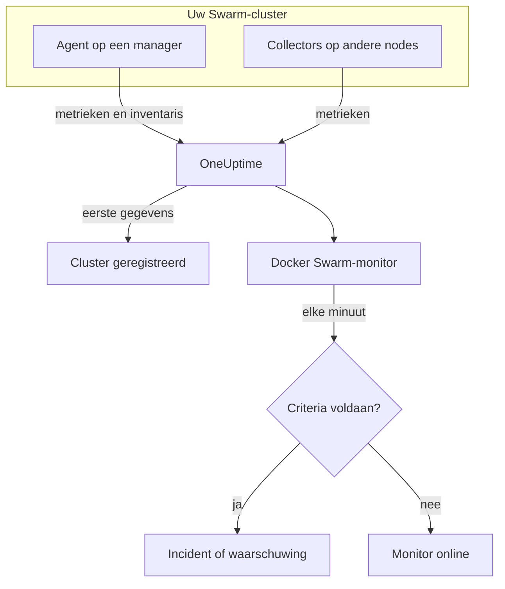

# Docker Swarm-monitor

Een Docker Swarm-monitor bewaakt de containers achter de servicetaken van een Swarm-cluster en laat u weten wanneer een taak herstart, heet loopt of door zijn geheugen raakt. Hij leest de containermetrieken die de OneUptime-Docker Swarm-agent verstuurt, dus er wordt niets van buitenaf gepeild: installeer de agent en maak de monitor dan vanuit een sjabloon of uw eigen query.

:::cards
- [De monitor maken](#een-docker-swarm-monitor-maken): Zes stappen in het dashboard.
- [Sjablonen](#kant-en-klare-waarschuwingssjablonen): Vier kant-en-klare waarschuwingen, één incident per taak.
- [Metrieken](#verzamelde-metrieken): De containermetrieken waarop u kunt waarschuwen.
- [Filters](#monitorinstellingen): Een monitor beperken tot een service, een taak of een image.
:::

## Hoe het werkt

De OneUptime-Docker Swarm-agent draait op een managernode. Zijn collector leest elke 30 seconden containerstatistieken uit de Docker-daemon van die node en voorziet elke batch van de naam van het cluster, `docker.swarm.cluster.name`. Een kleine inventarispoller ernaast leest elke 5 minuten de nodes, services en taken van het cluster uit de Swarm-API. De eerste gegevens registreren het cluster in OneUptime.

De collector ziet alleen containers op de node waarop hij draait. Voor metrieken van elke node draait u de collector op elke node met dezelfde `DOCKER_SWARM_CLUSTER_NAME`.

Een Docker Swarm-monitor is aan één cluster gebonden. Elke minuut voert hij zijn query uit over de containermetrieken van dat cluster en vergelijkt hij het resultaat met zijn criteria.

## Voordat u begint

- **Installeer de Docker Swarm-agent** op een managernode. De [handleiding voor de Docker Swarm-agent](/docs/telemetry/docker-swarm) behandelt installeren en bijwerken, en het draaien van de collector op de andere nodes.
- **Controleer of het cluster is geregistreerd.** Het verschijnt onder **Producten → Infrastructuur → Docker Swarm → Alle clusters**, genoemd naar de `DOCKER_SWARM_CLUSTER_NAME` van de agent, zodra zijn eerste gegevens binnenkomen.

## Een Docker Swarm-monitor maken

:::steps
### Een nieuwe monitor beginnen

Ga naar **Monitoren** en klik op **Monitor maken**.

### Docker Swarm kiezen

Klik onder **Monitortype** op **Meer monitortypen** en kies **Docker Swarm** onder **Infrastructuur**, of typ `swarm` in het zoekvak. Vul een **Naam** in – die wordt gebruikt in de titels van incidenten en waarschuwingen – en klik op **Volgende**.

### Het cluster kiezen

Kies onder **Docker Swarm Monitor Configuration** het cluster in **Docker Swarm Cluster**. Elk cluster dat gegevens heeft verstuurd, staat in de lijst.

### Kiezen wat u bewaakt

Kies een van de drie tabbladen:

- **Quick Setup** – klik op een [sjabloon](#kant-en-klare-waarschuwingssjablonen). Het stelt de metriek, de aggregatie, het tijdsbereik en de drempels in, en vervangt de criteria hieronder door die van het sjabloon. Het **Tijdsbereik** kunt u nog wijzigen.
- **Custom Metric** – kies één metriek in **Docker Swarm Metric** en stel dan **Aggregatie** en **Tijdsbereik** in. De [filters](#monitorinstellingen) beperken hem tot bepaalde taken.
- **Geavanceerd** – bouw zelf query's en formules onder **Selecteer metrieken**. Gebruik **Group by** `resource.container.name` om elke taak afzonderlijk te beoordelen.

### De criteria controleren

Open elk criterium onder **Monitorcriteria** en controleer de **Metriek**, **Aggregatie**, **Voorwaarde** en **Threshold**. Een sjabloon vult deze in. Met **Custom Metric** of **Geavanceerd** begint de monitor met de [standaardcriteria](#standaardcriteria), die alleen opmerken dat een metriek naar nul zakt; stel daarom uw eigen drempel in.

### De monitor maken

Klik op **Monitor maken**. OneUptime opent de pagina van de monitor en evalueert hem elke minuut. Incidenten en waarschuwingen die hij opent, staan ook op de pagina's **Incidenten** en **Waarschuwingen** van het cluster.
:::

> [!TIP]
> Om meerdere sjablonen tegelijk in te stellen, opent u het cluster via **Producten → Infrastructuur → Docker Swarm** en gaat u naar **Recommendations**. Kies de sjablonen die u wilt en wie wordt opgeroepen, en OneUptime maakt één monitor per sjabloon.

## Monitorinstellingen

| Veld | Tabblad | Wat het doet |
| --- | --- | --- |
| **Docker Swarm Cluster** | Alle | Verplicht. Beperkt elke query tot `resource.docker.swarm.cluster.name`. Dit is het enige resourceattribuut dat de agent meegeeft, dus de monitor voegt geen filter op `container.runtime` of `host.name` toe. |
| **Servicenaam** | Custom Metric, Geavanceerd | Optioneel. Exacte overeenkomst met `docker.swarm.service.name`, bijvoorbeeld `web`. |
| **Nodenaam** | Custom Metric, Geavanceerd | Optioneel. Exacte overeenkomst met `docker.swarm.node.name`, bijvoorbeeld `swarm-node-1`. |
| **Containernaam** | Custom Metric, Geavanceerd | Optioneel. Exacte overeenkomst met `resource.container.name`. De container van een taak heet `<service>.<slot>.<taskid>`, bijvoorbeeld `web.1.abc123`. |
| **Container-image** | Custom Metric, Geavanceerd | Optioneel. Exacte overeenkomst met `resource.container.image.name`, bijvoorbeeld `nginx:latest`. |
| **Docker Swarm Metric** | Custom Metric | Eén metriek uit de [catalogus](#verzamelde-metrieken). |
| **Aggregatie** | Custom Metric | Hoe metingen worden gecombineerd: **Gemiddelde**, **Maximum**, **Minimum**, **Som** of **Aantal**. Begint bij de gebruikelijke aggregatie van de metriek. |
| **Tijdsbereik** | Alle | Het schuivende venster dat de query leest, van **Past 1 Minute** tot **Past 365 Days**. Een nieuwe monitor begint bij **Past 1 Minute**; sjablonen stellen hun eigen in. |
| **Selecteer metrieken** | Geavanceerd | De querybouwer: **Metriek**, **Aggregate by**, **Filter by attributes**, **Group by**, plus **Metriek toevoegen** en **Formule toevoegen** om query's te combineren. |

> [!WARNING]
> De meegeleverde agent stelt `docker.swarm.service.name` en `docker.swarm.node.name` nog niet in, dus een monitor waarin **Servicenaam** of **Nodenaam** is ingevuld, vindt geen gegevens. Beperk in plaats daarvan met **Container-image**, of groepeer op `resource.container.name`.

## Kant-en-klare waarschuwingssjablonen

**Quick Setup** biedt vier sjablonen. Elk bouwt een complete monitor: een query gegroepeerd op `resource.container.name`, een criterium dat afgaat en een dat herstelt. Elke taak wordt afzonderlijk beoordeeld en krijgt een eigen incident en een eigen waarschuwing, waarvan de hoofdoorzaak de getroffen taken en hun waarden opsomt. De drempels zijn uitgangspunten die u kunt aanpassen.

Tenzij de tabel iets anders zegt, gaat een criterium alleen af als de voorwaarde elke minuut van zijn venster geldt, en herstelt het 10% voorbij de drempel, zodat een waarde die rond de grens schommelt niet heen en weer springt.

| Sjabloon | Ernst | Bewaakt | Gaat af als | Herstelt als |
| --- | --- | --- | --- | --- |
| Task Down (Low Uptime) | Kritiek | `container.uptime`, Min per taak, laatste 1 minuut | Een willekeurige waarde ligt onder 60 seconden | Elke waarde ligt op of boven 66 seconden |
| High Task CPU Usage | Warning | `container.cpu.utilization`, Avg per taak, laatste 5 minuten | Boven 80 (% van één kern) | Op of onder 72 |
| High Task Memory Usage | Warning | `container.memory.percent`, Avg per taak, laatste 5 minuten | Boven 85% | Op of onder 76,5% |
| High Task Process Count | Warning | `container.pids.count`, Max per taak, laatste 5 minuten | Boven 500 | Op of onder 450 |

**Ernst** is het label dat de keuzelijst toont. Het incident en de waarschuwing die een sjabloon maakt, beginnen op het zwaarste incident- en waarschuwingsernstniveau van uw project; wijzig ze in de criteria.

> [!NOTE]
> **Task Down (Low Uptime)** gaat af op één jonge meting, omdat een herstart een gebeurtenis is en geen niveau. Swarm geeft een vervangende taak een nieuwe container, en dus een nieuwe reeks; daarom zoekt het sjabloon naar een uptime onder een minuut in plaats van naar een 0. Een uitrol of een opschaling laat het ook afgaan, en het herstelt zodra de nieuwe taken een minuut uptime voorbij zijn. Een taak die sterft en niet wordt vervangen, stuurt niets en wordt dus niet opgemerkt.

## Verzamelde metrieken

De collector van de agent gebruikt de OpenTelemetry-receiver `docker_stats`, dus de metrieken zijn de standaard containermetrieken, één reeks per taakcontainer. Er zijn geen metrieken `docker_swarm_*`: nodes, services en taken worden als inventaris bijgehouden, op de pagina's **Services**, **Taken**, **Knooppunten** en verwante pagina's van het cluster.

### CPU

| Metriek | Eenheid | Beschrijving |
| --- | --- | --- |
| `container.cpu.utilization` | % | CPU-gebruik van de container van een taak, waarbij 100% één volledige CPU-kern is. |

### Geheugen

| Metriek | Eenheid | Beschrijving |
| --- | --- | --- |
| `container.memory.usage.total` | bytes | Geheugen dat de container van een taak gebruikt. |
| `container.memory.percent` | % | Gebruikt geheugen als percentage van de limiet van de container, of van het totale geheugen van de node als de service geen limiet instelt. |

### Netwerk

| Metriek | Eenheid | Beschrijving |
| --- | --- | --- |
| `container.network.io.usage.rx_bytes` | bytes | Door de container van een taak ontvangen bytes. Een teller over de hele levensduur. |
| `container.network.io.usage.tx_bytes` | bytes | Door de container van een taak verzonden bytes. Een teller over de hele levensduur. |

### Container

| Metriek | Eenheid | Beschrijving |
| --- | --- | --- |
| `container.pids.count` | aantal | Processen in de container van een taak. Een plotselinge stijging kan op een forkbom of een lek wijzen. |
| `container.uptime` | seconden | Hoe lang de container van een taak al draait. Een opnieuw ingeplande of herstarte taak begint een nieuwe container op 0. |

Elke reeks draagt de identiteit van de container als resourceattributen: `resource.container.name` (`<service>.<slot>.<taskid>`), `resource.container.image.name` en `resource.docker.swarm.cluster.name`.

## Bewakingscriteria

Een criterium vergelijkt een van de query's of formules van de monitor met een drempel. De criteria van een Docker Swarm-monitor hebben geen **Filtertype**: elke regel controleert de metriekwaarde, met deze velden.

| Veld | Wat het doet |
| --- | --- |
| **Metriek** | De query of formule die wordt gecontroleerd, op naam van de variabele. |
| **Aggregatie** | Hoe de waarden in het venster één antwoord worden: **Gemiddelde**, **Som**, **Maximum Value**, **Minimum Value**, **All Values** (elke waarde moet overeenkomen) of **Any Value** (één is genoeg). |
| **Voorwaarde** | **Greater Than**, **Less Than**, **Greater Than Or Equal To**, **Less Than Or Equal To** of **Equal To** – of een anomalievoorwaarde: **Anomalously High**, **Anomalously Low** of **Anomalous**. |
| **Threshold** | De waarde waarmee wordt vergeleken. Ernaast staat een lijst met eenheden als de metriek een eenheid heeft. Niet getoond bij anomalievoorwaarden. |
| **Gevoeligheid** | Alleen bij anomalievoorwaarden. **Laag** (4σ), **Gemiddeld** (3σ, de standaard) of **Hoog** (2σ). |
| **Baseline-venster** | Alleen bij anomalievoorwaarden. 14 dagen (de standaard), 28, 60 of 90 dagen geschiedenis. |
| **Als geen gegevens** | Onder **Meer velden**. Wat er gebeurt als het venster geen metingen bevat: **Ignore** (de standaard), **Treat As Zero** of **Trigger**. |

Anomalievoorwaarden vergelijken elke waarde met hetzelfde uur van de week in de baseline. Ze blijven in een "Learning"-status, en geven niets, tot het baseline-venster genoeg geschiedenis bevat.

Elk criterium zegt ook wat er moet gebeuren als het overeenkomt: de monitorstatus wijzigen, een waarschuwing maken of een incident melden. Criteria worden van boven naar beneden gecontroleerd, en het eerste dat overeenkomt, beslist.

### Standaardcriteria

Een monitor die u niet vanuit een sjabloon maakt, begint met twee criteria:

| Volgorde | Criterium | Komt overeen als | Dan |
| --- | --- | --- | --- |
| 1 | Check if _monitor name_ is offline | Een willekeurige waarde van de eerste query `0` is | Markeert de monitor als **Offline** en meldt het incident "_monitor name_ is offline", dat zichzelf oplost als de monitor herstelt. |
| 2 | Check if _monitor name_ is online | Een willekeurige waarde boven `0` ligt | Markeert de monitor als **Operationeel**. |

> [!IMPORTANT]
> Stilte komt met geen van beide criteria overeen: een cluster dat geen gegevens meer stuurt, laat de monitor zoals hij was. Om bericht te krijgen als er geen gegevens meer komen, zet u **Als geen gegevens** in een criterium op **Trigger**. Tijd waarin OneUptime zelf niet ontving, geldt nooit als ontbrekende gegevens: een controle waarvan het venster zulke tijd bevat, wacht in plaats daarvan, zoals [Als OneUptime geen gegevens ontvangt](/docs/monitor/when-oneuptime-is-not-receiving) uitlegt.

## Problemen oplossen

:::details Het cluster staat niet in de lijst Docker Swarm Cluster
Clusters registreren zichzelf uit de gegevens van de agent. Controleer of de agent op een managernode draait, of `DOCKER_SWARM_CLUSTER_NAME` is ingesteld en of het cluster onder **Producten → Infrastructuur → Docker Swarm → Alle clusters** staat. De [handleiding voor de Docker Swarm-agent](/docs/telemetry/docker-swarm) bevat de controles die u op de node uitvoert.
:::

:::details Alleen sommige taken hebben metrieken
De collector leest de Docker-daemon van de node waarop hij draait, dus hij ziet alleen de taken op die node. Draai de collector op elke node met dezelfde `DOCKER_SWARM_CLUSTER_NAME`.
:::

:::details Een monitor gefilterd op service of node vindt geen gegevens
**Servicenaam** en **Nodenaam** vergelijken met `docker.swarm.service.name` en `docker.swarm.node.name`, die de meegeleverde agent niet instelt. Maak ze leeg en beperk met **Container-image**, of groepeer op `resource.container.name`.
:::

:::details Elke taak verschijnt als één reeks
Groepeer op het resourceattribuut `resource.container.name`, zoals de sjablonen doen. De kale `container.name` komt met niets overeen, dus elke taak valt samen tot één reeks met een lege naam.
:::

## Volgende stappen

:::cards
- [Docker Swarm-agent](/docs/telemetry/docker-swarm): De agent installeren en bijwerken die deze monitor leest.
- [Docker-monitor](/docs/monitor/docker-monitor): De containers van één Docker-host bewaken.
- [Incidenten – Overzicht](/docs/incidents/index): Wat er gebeurt nadat een criterium een incident heeft gemeld.
- [Bereikbaarheidsschema's](/docs/on-call/schedules): Bepalen wie wordt opgeroepen als een taak stukgaat.
:::
