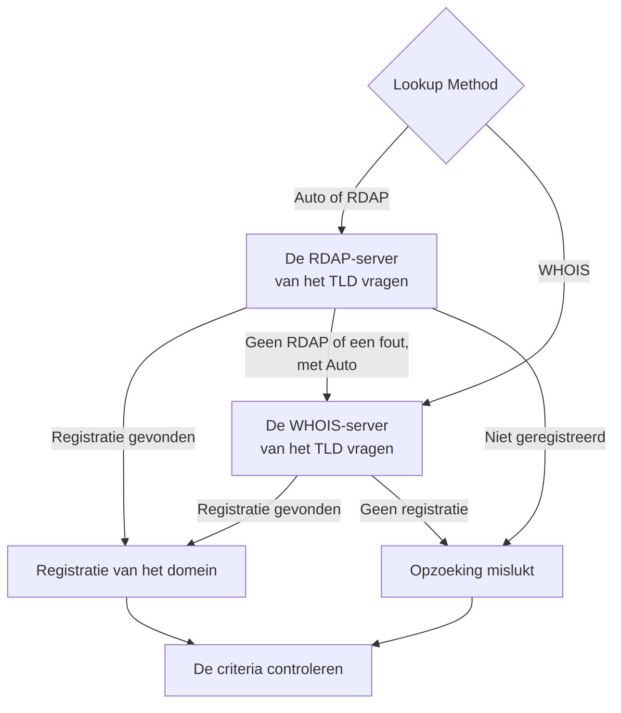

# Domein-monitor

Een domeinmonitor leest volgens een schema de registratie van uw domein, om de vervaldatum, de registrar, de naamservers en de statuscodes te volgen, en waarschuwt u voordat het verloopt. Gebruik hem voor elk domein waarvan uw websites, API's en e-mail afhankelijk zijn: een verlopen registratie haalt ze allemaal tegelijk onderuit.

:::cards
- [De monitor maken](#een-domeinmonitor-maken): Zes stappen in het dashboard.
- [Opzoekmethoden](#opzoekmethoden): RDAP, WHOIS, en waarom **Auto** de standaard is.
- [Standaardcriteria](#standaardcriteria): Een waarschuwing 30 dagen voor het verlopen, zonder instellen.
- [Problemen oplossen](#problemen-oplossen): Buiten gebruik gestelde WHOIS-servers, proxy's en ontbrekende data.
:::

## Hoe het werkt

Bij elke controle zoekt een sonde de registratie van het domein op via RDAP of WHOIS, afhankelijk van de **Lookup Method**, en normaliseert wat ze vindt: de vervaldatum, de registrar, de naamservers en de statuscodes. Een opzoeking die mislukt, wordt opnieuw geprobeerd, tot het aantal nieuwe pogingen dat u instelt. Daarna beoordeelt OneUptime de registratie met de criteria van de monitor.

Als een opzoeking geen registratiegegevens kan opleveren — omdat de dienst van het TLD buiten gebruik is, of het domein niet is geregistreerd —, wordt de monitor als **offline** gemeld met de reden in het sonde-antwoord van de monitor, in plaats van als gezond met een lege vervaldatum. Een registry die antwoordt "dit domein is beschikbaar" (bijvoorbeeld `Status: free` bij DENIC) wordt behandeld als **niet geregistreerd**, niet als een gezonde registratie.

Geïnternationaliseerde domeinnamen worden in beide vormen geaccepteerd: `münchen.de` wordt vóór de opzoeking omgezet naar zijn A-label (`xn--mnchen-3ya.de`).

## Voordat u begint

- **Een rol die monitoren mag maken**: Project Owner, Project Admin, Project Member, Monitor Admin of Monitor Member, of een aangepaste rol met de machtiging Create Monitor.
- **Uitgaande toegang vanaf de sonde** naar de registries. De standaardsondes van uw project worden voor elke nieuwe monitor gekozen; een [aangepaste sonde](/docs/probe/custom-probe) moet het volgende kunnen bereiken:

| Bestemming | Protocol | Gebruikt voor |
| --- | --- | --- |
| `https://data.iana.org/rdap/dns.json` | HTTPS, poort 443 | Het RDAP-bootstrapregister van IANA, dat zegt waar de RDAP-server van elk TLD staat. Eén keer opgehaald en 24 uur in de cache gehouden. |
| De RDAP-servers van de registries | HTTPS, poort 443 | RDAP-opzoekingen. |
| WHOIS-servers | TCP, poort 43 | WHOIS-opzoekingen. |

RDAP-verzoeken volgen de instellingen `HTTP_PROXY_URL` / `HTTPS_PROXY_URL` / `NO_PROXY` van de sonde. WHOIS loopt via een ruwe socket en doet dat niet. Als een sonde `data.iana.org` niet kan bereiken, valt **Auto** terug op WHOIS en probeert het IANA na vijf minuten opnieuw.

## Een domeinmonitor maken

:::steps
### Een nieuwe monitor beginnen

Ga naar **Monitoren** en klik op **Monitor maken**. Klik onder **Monitortype** op **Meer monitortypen** en kies **Domein** onder **Basic Monitoring**.

### Hem een naam geven

Voer een **Naam** in, zoals `example.com registration`, en klik op **Volgende**.

### Het domein invoeren

Voer de **Domeinnaam** in, zoals `example.com`. Laat **Lookup Method** op **Auto** staan, tenzij u een reden hebt om dat niet te doen (zie [Opzoekmethoden](#opzoekmethoden)).

### Hem testen

Klik op **Monitor testen**, kies een sonde onder **Selecteer sonde** en klik op **Test uitvoeren**. **Testresultaat van monitor** toont de registratie die de sonde las, en of RDAP of WHOIS antwoordde.

### De criteria nakijken

**Monitorcriteria** begint met de [standaardcriteria](#standaardcriteria): offline wanneer de registratie verlopen is of niet kan worden gelezen, een waarschuwing wanneer ze binnen 30 dagen verloopt. Wijzig ze als dat nodig is en klik op **Volgende**.

### Sondes kiezen en maken

Behoud of wijzig de **Sondes** en het **Bewakingsinterval** (het begint bij **Elke 5 minuten**) en klik op **Monitor maken**. De pagina van de monitor wordt geopend.
:::

## Configuratieopties

| Veld | Standaard | Wat u invult |
| --- | --- | --- |
| **Domeinnaam** | Geen | Het geregistreerde domein, zoals `example.com`. Een geplakt adres werkt ook: `https://example.com/pricing` wordt gelezen als `example.com`. |
| **Lookup Method** | **Auto** | **Auto**, **RDAP** of **WHOIS**. Zie [Opzoekmethoden](#opzoekmethoden). |
| **Time-out (ms)** (onder **Meer velden**) | `10000` | Hoe lang op elke registratie-opzoeking wordt gewacht, in milliseconden. |
| **Nieuwe pogingen** (onder **Meer velden**) | `3` | Nieuwe pogingen nadat de eerste mislukt. `0` betekent één enkele poging. |

Elke mislukte opzoeking wordt opnieuw geprobeerd, met een pauze van een seconde tussen de pogingen. Dat geldt ook voor een registry die antwoordt dat het domein niet is geregistreerd, of dat ze geen registratiedienst heeft, voor het geval het antwoord een tijdelijke storing was. Alleen een ongeldige domeinnaam wordt meteen gemeld, zonder opzoeking.

De time-out geldt per verzoek, niet voor de hele controle: een controle met **Auto** die RDAP probeert en dan op WHOIS terugvalt, kan twee keer zo lang duren, of langer.

### Opzoekmethoden

Registratiegegevens kunnen via twee protocollen worden gelezen, en welk protocol werkt, hangt af van het TLD.

| Methode | Gedrag |
| --- | --- |
| **Auto** | Standaard. Gebruikt RDAP wanneer het TLD een RDAP-dienst publiceert, en valt terug op WHOIS wanneer dat niet zo is, of wanneer de RDAP-opzoeking mislukt. |
| **RDAP** | Alleen RDAP. Mislukt met een duidelijke fout als het TLD geen RDAP-dienst publiceert. |
| **WHOIS** | Alleen WHOIS. |

**RDAP** ([RFC 9083](https://www.rfc-editor.org/rfc/rfc9083)) is de door ICANN verplichte opvolger van WHOIS. De gezaghebbende server van elk TLD wordt gevonden via het [bootstrapregister van IANA](https://www.rfc-editor.org/rfc/rfc9224), zodat hij klopt als registries verhuizen. Elk gTLD publiceert er een. Wanneer de RDAP-server van het TLD zegt dat het domein niet is geregistreerd, neemt **Auto** dat als antwoord en vraagt het WHOIS niet.

**WHOIS** heeft geen vergelijkbaar ontdekkingsmechanisme — clients leveren een vaste koppeling van TLD naar WHOIS-host mee, en die koppelingen verouderen. Elk TLD van Identity Digital (`.digital`, `.email`, `.life`, `.today`, `.zone` en zo'n 290 andere) is nog gekoppeld aan een buiten gebruik gestelde host die nu elke query beantwoordt met de letterlijke tekst `TLD is not supported.` in plaats van een registratie. WHOIS blijft de enige optie voor de vele ccTLD's die helemaal geen RDAP-dienst publiceren, zoals `.io`, `.co`, `.de`, `.ch` en `.jp`.

## Bewakingscriteria

Criteria bepalen wanneer het domein telt als in orde of kapot, en of dat een incident meldt of een waarschuwing aanmaakt. Elk criterium controleert een of meer filters:

| Filter | Voorwaarden | Wat het controleert |
| --- | --- | --- |
| **Is Online** | **Waar**, **Onwaar** | Of de registratie-opzoeking zelf is gelukt. |
| **Is Request Timeout** | **Waar**, **Onwaar** | Of de opzoeking bij elke poging een time-out kreeg. |
| **Domain Expires In Days** | **Greater Than**, **Less Than**, **Greater Than Or Equal To**, **Less Than Or Equal To** | Dagen totdat de registratie verloopt, naar boven afgerond op een hele dag. |
| **Domain Is Expired** | **Waar**, **Onwaar** | Of de vervaldatum is verstreken. |
| **Domain Registrar** | **Bevat**, **Not Contains**, **Starts With**, **Ends With**, **Equal To**, **Not Equal To** | De naam van de registrar. |
| **Domain Name Server** | **Bevat**, **Not Contains**, **Starts With**, **Ends With**, **Equal To**, **Not Equal To** | De naamservers van het domein. Komt overeen wanneer een ervan overeenkomt. |
| **Domain Status Code** | **Bevat**, **Not Contains**, **Starts With**, **Ends With**, **Equal To**, **Not Equal To** | De EPP-statuscodes van het domein. Komt overeen wanneer een ervan overeenkomt. |

Statuscodes worden genormaliseerd naar hun EPP-namen (`clientTransferProhibited`), welk protocol ook antwoordde, zodat een criterium blijft overeenkomen wanneer **Auto** tussen RDAP en WHOIS wisselt. De _namen_ van registrars zijn wat de antwoordende dienst publiceert en kunnen tussen de twee protocollen iets verschillen, dus gebruik voor een criterium met **Domain Registrar** liever **Bevat** dan **Equal To**.

Data worden genormaliseerd naar ISO 8601. Een datum die een registry publiceert in een vorm die niet kan worden ingelezen, wordt weggelaten in plaats van opgeslagen, zodat een vervalcriterium niet kan beslissen en niet overeenkomt, in plaats van stilzwijgend voor altijd "niet verlopen" te antwoorden.

Met twee of meer filters bepaalt **Overeenkomstvoorwaarde** of **Alle** filters moeten overeenkomen of dat **Elke** filter volstaat. De **Acties** van een criterium bepalen wat het doet: de monitorstatus wijzigen, een waarschuwing aanmaken, een incident melden, of meerdere daarvan.

### Standaardcriteria

Een nieuwe domeinmonitor begint met drie criteria, zodat hij u zonder instellen waarschuwt voordat een registratie verloopt:

1. **Domeincontrole mislukt** — de registratie is verlopen, of de registratiegegevens konden niet worden gelezen. De monitor wordt als **Offline** gemarkeerd en er wordt een incident met de naam "_monitor name_ domain check failed" gemaakt. Het incident lost zichzelf op zodra de registratie weer wordt gelezen en actueel is.
2. **Domein verloopt binnenkort** — de registratie is niet verlopen, maar verloopt binnen 30 dagen. Er wordt een **waarschuwing** met de naam "_monitor name_ domain expires soon" aangemaakt.
3. **Domein is niet verlopen** — de monitor wordt als **Operationeel** gemarkeerd.

De waarschuwing "verloopt binnenkort" is een waarschuwing, geen incident: ze verschijnt niet op uw statuspagina's, ze roept niemand op tenzij u er een bereikbaarheidsbeleid aan toevoegt, en ze wijzigt de status van de monitor niet. Ze gebruikt de tweede waarschuwingsernst van uw project, **Low** in een nieuw project. Zodra de verlenging in de registratie verschijnt, lost de waarschuwing zichzelf op. Een registry die geen vervaldatum publiceert, geeft de waarschuwing niets om op af te gaan, dus die blijft stil.

Criteria worden van boven naar beneden gecontroleerd, en het eerste dat overeenkomt bepaalt wat er gebeurt. Daarom staat "verloopt binnenkort" boven "is niet verlopen": een domein dat bijna verloopt, is nog niet verlopen en zou dus met beide overeenkomen.

Om eerder gewaarschuwd te worden, wijzigt u de waarde van het filter **Domain Expires In Days** in het criterium "verloopt binnenkort", bijvoorbeeld in `60`. Om in plaats daarvan iemand op te roepen, opent u de **Acties** van dat criterium: zet **Wanneer filters overeenkomen, verklaar een incident.** aan, of houd de waarschuwing en voeg er onder **Bereikbaarheidsbeleid** een bereikbaarheidsbeleid aan toe.

:::details De waarschuwing toevoegen aan een monitor die van vóór de waarschuwing is
Monitoren die zijn gemaakt voordat OneUptime deze waarschuwing toevoegde, hebben geen criterium "verloopt binnenkort". Zo voegt u het toe:

1. Open bij de monitor **Configuratie → Criteria** en klik op **Bewakingscriteria bewerken**.
2. Klik op **Criteria toevoegen**. Zet het filter op **Domain Is Expired** / **Onwaar**, klik op **Filter toevoegen** en zet het tweede op **Domain Expires In Days** / **Less Than Or Equal To** / `30`. Laat **Overeenkomstvoorwaarde** op **Alle** staan (het verschijnt onder de filters zodra er twee zijn).
3. Zet onder **Acties** **Wanneer filters overeenkomen, maak een waarschuwing aan.** aan en laat **Wanneer filters overeenkomen, wijzig de monitorstatus.** uit, zodat het een waarschuwing aanmaakt en de monitorstatus niet wijzigt.
4. Sleep het nieuwe criterium boven het criterium dat de monitor als online markeert, en sla op.
:::

### Voorbeeldcriteria

| Doel | Filter | Voorwaarde | Waarde |
| --- | --- | --- | --- |
| Waarschuwen wanneer het domein binnen 30 dagen verloopt (een standaardcriterium) | **Domain Expires In Days** | **Less Than Or Equal To** | `30` |
| Offline wanneer het domein verlopen is | **Domain Is Expired** | **Waar** | — |
| Offline wanneer de registratie niet kan worden gelezen | **Is Online** | **Onwaar** | — |
| Waarschuwen wanneer de naamservers veranderen | **Domain Name Server** | **Not Contains** | `ns1.example.com` |
| Waarschuwen wanneer het domein is ontgrendeld voor een overdracht | **Domain Status Code** | **Not Contains** | `clientTransferProhibited` |

**Domain Name Server** en **Domain Status Code** komen overeen wanneer _een willekeurige_ waarde overeenkomt, dus **Not Contains** komt overeen zodra één naamserver, of één statuscode, de tekst niet bevat.

## Aanbevolen werkwijzen

1. **Geef uzelf tijd om te verlengen** — De standaardwaarschuwing komt 30 dagen voor het verlopen. Vraagt verlengen om goedkeuringen of een betaling die langer duurt, verhoog het dan naar 60 dagen.
2. **Vang mislukte opzoekingen op** — Neem een filter **Is Online** / **Onwaar** op in uw offline-criterium, zodat een onleesbare registratie niet voor een gezonde wordt aangezien. Nieuwe monitoren hebben het in hun standaardcriteria; een monitor die eerder is gemaakt, heeft het met de hand nodig. Om een WHOIS-server te doorstaan die de sonde af en toe afremt, vinkt u onder dat filter **Evalueer deze criteria over een bepaalde periode** aan en kiest u **All Values**: het domein gaat dan pas offline wanneer elke opzoeking in het venster is mislukt.
3. **Bewaak alle kritieke domeinen** — Neem de hoofddomeinen mee, apart geregistreerde subdomeinen, en alle domeinen die voor e-mail of API's worden gebruikt.
4. **Volg registrarwijzigingen** — Voeg een criterium toe met **Domain Registrar** / **Not Contains** / de naam van uw registrar, om een ongeautoriseerde overdracht op te merken.

## Problemen oplossen

:::details De WHOIS-server "answered without any registration data"
De WHOIS-host van het TLD is buiten gebruik, remt de sonde af, of heeft een korte storing. Een buiten gebruik gestelde host, zoals de host die nog voor de TLD's van Identity Digital is ingesteld, antwoordt elke keer `TLD is not supported.`. Blijft de fout bestaan met **Lookup Method** op **WHOIS**, schakel dan over naar **Auto**, zodat de sonde de RDAP-dienst van het TLD leest waar die bestaat.
:::

:::details De controle mislukt met "No RDAP service is published"
De monitor gebruikt **RDAP**, en het TLD publiceert geen RDAP-dienst, zoals veel ccTLD's. Zet **Lookup Method** op **Auto**, dat op WHOIS terugvalt.
:::

:::details Het domein wordt als niet geregistreerd gemeld
De registry antwoordde dat het domein beschikbaar is. Controleer de spelling, en dat u het geregistreerde domein hebt ingevoerd, zoals `example.com`, en geen subdomein.
:::

:::details Opzoekingen mislukken op een sonde achter een proxy
RDAP loopt via de proxy-instellingen van de sonde, WHOIS niet. Sta uitgaande TCP-poort 43 toe voor WHOIS, of gebruik **Auto** of **RDAP** voor TLD's die een RDAP-dienst publiceren.
:::

:::details De vervaldatum is leeg, en de vervalcriteria gaan nooit af
De registry publiceert geen vervaldatum, of een in een vorm die niet kan worden ingelezen. Vervalcriteria kunnen zonder datum niet beslissen, dus ze blijven stil. **Is Online** vertelt u nog steeds of de registratie kan worden gelezen.
:::

## Volgende stappen

:::cards
- [SSL-certificaat-monitor](/docs/monitor/ssl-certificate-monitor): Gewaarschuwd worden voordat de certificaten op het domein verlopen.
- [DNS-monitor](/docs/monitor/dns-monitor): Controleren of de records van het domein worden omgezet, en wat ze zeggen.
- [DNSSEC-monitor](/docs/monitor/dnssec-monitor): De vertrouwensketen van een ondertekende zone valideren.
- [Escalatieregels](/docs/on-call/escalation-rules): Bepalen wie door de waarschuwingen en incidenten wordt opgeroepen.
:::
