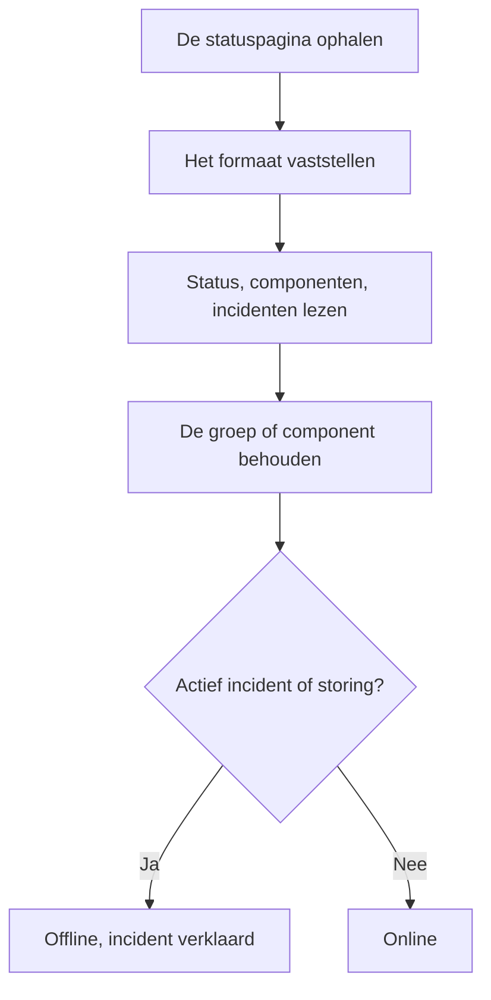

# Externe-statuspagina-monitor

Een monitor voor externe statuspagina's houdt de openbare statuspagina in de gaten van een dienst waarvan u afhankelijk bent — AWS, GCP, Azure, GitHub, OpenAI, Anthropic en vele andere — en waarschuwt u als die provider een storing of verminderde prestaties meldt. Gebruik hem om problemen bij uw leveranciers te horen zodra de provider ze meldt, en om ze te onderscheiden van uw eigen problemen.

:::cards
- [De monitor maken](#een-monitor-voor-externe-statuspaginas-maken): Plak de URL van een statuspagina en kies wat u wilt volgen.
- [Afbakenen](#configuratieopties): Volg één componentgroep of één component.
- [Criteria](#bewakingscriteria): Wat standaard als uitgevallen telt.
- [Populaire statuspagina's](#populaire-statuspagina-urls): URL's van de diensten waarvan de meeste teams afhankelijk zijn.
:::

## Zo werkt het

Bij elke controle haalt een probe de statuspagina op, stelt vast welk formaat die gebruikt, en leest de algemene status, de componenten en de actieve incidenten. Hebt u de monitor afgebakend tot een componentgroep of een component, dan tellen alleen die mee. Daarna beslissen de criteria of de monitor online of offline is.

U kunt hem gebruiken om:

- De beschikbaarheid te bewaken van diensten van derden waarvan uw applicatie afhankelijk is
- Gewaarschuwd te worden als uw leveranciers een storing hebben
- De status van afzonderlijke componenten te volgen
- De bewaking af te bakenen tot één componentgroep (bijvoorbeeld alleen de "APIs" van OpenAI), zodat incidenten elders op de pagina die er niets mee te maken hebben uw monitor niet laten afgaan
- Verminderde prestaties op te merken voordat uw gebruikers er last van hebben
- Uw eigen incidenten te koppelen aan problemen bij uw leveranciers

## Ondersteunde providers

| Provider | Beschrijving |
| ------------------------ | ---------------------------------------------------------------------- |
| **Auto** (standaard) | Stelt het formaat van de statuspagina automatisch vast |
| **Atlassian Statuspage** | Statuspagina's die draaien op Atlassian Statuspage (JSON-API) |
| **incident.io** | Statuspagina's die draaien op incident.io (bijv. `https://status.openai.com`) |
| **RSS** | Statuspagina's die een RSS-feed aanbieden |
| **Atom** | Statuspagina's die een Atom-feed aanbieden |

### Automatische detectie

Staat de provider op **Auto**, dan stelt OneUptime het formaat van de statuspagina automatisch vast, in deze volgorde:

1. Eerst probeert het de API voor statuspagina's van incident.io (`/proxy/<host>`).
2. Daarna probeert het de JSON-API van Atlassian Statuspage (`/api/v2/status.json`, `/api/v2/components.json` en `/api/v2/incidents/unresolved.json`).
3. Mislukken die, dan probeert het de pagina als RSS- of Atom-feed te lezen.
4. Als laatste terugvaloptie voert het een eenvoudige controle op HTTP-bereikbaarheid uit.

> [!NOTE]
> incident.io wordt als eerste gecontroleerd, omdat sommige statuspagina's van incident.io (zoals `https://status.openai.com`) ook een beperkt, met Atlassian compatibel endpoint aanbieden dat componentgroepen en actieve incidenten weglaat. Door incident.io eerst te controleren, worden de rijkere gegevens met groepen gebruikt.

De controle op bereikbaarheid is ook de terugvaloptie als een provider die u uitdrukkelijk hebt gekozen, faalt. Die vertelt u alleen of de pagina antwoordt — online bij een antwoord `2xx` of `3xx` — en meldt geen componenten of incidenten.

## Een monitor voor externe statuspagina's maken

:::steps
### Een nieuwe monitor beginnen

Ga naar **Monitoren** en klik op **Monitor maken**. Klik onder **Monitortype** op **Meer monitortypen** en kies **External Status Page** onder **Basic Monitoring**, of typ `statuspage` in het zoekvak. Voer een **Naam** in en klik daarna op **Volgende**.

### De URL van de statuspagina invoeren

Voer de **URL statuspagina** in. Laat de **Provider** op **Auto** staan, tenzij u het formaat kent.

### Afbakenen, als dat nodig is

Open **Meer velden** om een **Component Group Filter (Optional)** in te voeren, zoals `APIs`, en een **Filter op componentnaam (optioneel)** om één component te volgen (binnen de groep, als er een groep is ingesteld).

### Testen

Klik op **Monitor testen** om de pagina één keer op te halen, en controleer de provider, de componenten en de incidenten die hij vond.

### De criteria nakijken

De criteriastap begint met [de standaardcriteria](#standaardcriteria), die de monitor als offline markeren als de provider een actief incident of een storing binnen de afbakening meldt. Wijzig ze als dat nodig is, en klik daarna op **Volgende**.

### Probes kiezen en maken

Selecteer de **Sondes** en een **Bewakingsinterval** — dat begint op **Elke 5 minuten** — en klik daarna op **Monitor maken**.
:::

## Configuratieopties

| Optie | Wat u invoert | Standaard |
| --- | --- | --- |
| **URL statuspagina** | De URL van de statuspagina. Voor sites die draaien op Atlassian Statuspage en incident.io is dit meestal de hoofd-URL (bijv. `https://status.example.com`). Voer voor RSS-/Atom-feeds direct de URL van de feed in. | — |
| **Provider** | **Auto** om het formaat vast te stellen, of **Atlassian Statuspage**, **incident.io**, **RSS** of **Atom** als u het kent. | **Auto** |
| **Component Group Filter (Optional)** | De groep waartoe de monitor wordt afgebakend. Onder **Meer velden**. | Alle groepen |
| **Filter op componentnaam (optioneel)** | Het component dat u volgt. Onder **Meer velden**. | Alle componenten binnen de afbakening |
| **Time-out (ms)** | Hoe lang maximaal op de statuspagina wordt gewacht. Onder **Meer velden**. | `10000` (10 seconden) |
| **Nieuwe pogingen** | Hoe vaak opnieuw wordt geprobeerd, met een seconde ertussen, nadat de eerste poging is mislukt; `0` betekent één poging. Onder **Meer velden**. | `3` (tot 4 pogingen) |

### Component Group Filter

Deelt de statuspagina haar componenten in groepen in, dan kunt u de monitor afbakenen tot één groep. Op `https://status.openai.com` bakent u met `APIs` de monitor bijvoorbeeld af tot de API-diensten van OpenAI.

Is er een componentgroep ingesteld, dan worden het **aantal actieve incidenten** en de **algemene status** berekend met alleen de componenten in die groep — een incident in een groep die er niets mee te maken heeft (bijvoorbeeld ChatGPT) laat een monitor die tot de groep "APIs" is afgebakend, niet afgaan.

Filteren op componentgroep wordt ondersteund voor de providers **Atlassian Statuspage** en **incident.io**. RSS- en Atom-feeds kennen geen componentgroepen.

### Filter op componentnaam

Meldt de statuspagina de status van meerdere componenten, dan kunt u een componentnaam opgeven om alleen dat component te bewaken. Het filter komt overeen met elk component waarvan de naam bevat wat u invoert, zonder op hoofdletters te letten — `actions` komt overeen met een component met de naam "Actions".

Is er ook een componentgroep ingesteld, dan wordt het filter op componentnaam **binnen** die groep toegepast, zodat u één component in een grotere groep kunt kiezen. Is geen van beide filters opgegeven, dan worden alle componenten binnen de afbakening bewaakt. Bij een RSS- of Atom-feed wordt het naamfilter vergeleken met de titels van de items in de feed.

> [!WARNING]
> Een filter dat nergens mee overeenkomt, ziet er gezond uit: zonder componenten binnen de afbakening is er niets dat een storing kan melden. Controleer de spelling aan de hand van de statuspagina, en gebruik **Monitor testen** om te zien wat het filter overhoudt.

## Bewakingscriteria

U kunt criteria instellen die bepalen wanneer de externe dienst als online of offline geldt, op basis van:

| Filtertype | Wat het controleert | Filtervoorwaarden |
| --- | --- | --- |
| **External Status Page Is Online** | Of de statuspagina bereikbaar is en statusgegevens teruggeeft | Waar of Onwaar |
| **External Status Page Overall Status** | De algemene status die de pagina meldt | Equal To, Not Equal To, Bevat, Not Contains, Starts With, Ends With |
| **External Status Page Component Status** | De status van de componenten binnen de afbakening (met inachtneming van de filters op componentgroep / componentnaam): Operationeel, Under Maintenance, Degraded Performance, Partial Outage, Major Outage of Full Outage | Equal To, Not Equal To, Bevat, Not Contains, Starts With, Ends With |
| **External Status Page Active Incidents** | Het aantal momenteel actieve incidenten op de statuspagina (afgebakend tot de componentgroep / het component als er een filter is ingesteld) | Equal To, Not Equal To en de numerieke vergelijkingen |
| **External Status Page Response Time (in ms)** | Hoe lang het ophalen van de gegevens van de statuspagina duurt | Greater Than, Less Than, Greater Than Or Equal To, Less Than Or Equal To |

De algemene status is wat de pagina zegt, dus de waarden verschillen per provider: een Atlassian Statuspage meldt haar eigen omschrijving, zoals `All Systems Operational`; een feed meldt `operational` of `degraded_performance`; de controle op bereikbaarheid meldt `reachable` of `unreachable`. Bij deze vergelijkingen tellen hoofdletters mee. Om bij storingen te waarschuwen, zijn **External Status Page Active Incidents** en **External Status Page Component Status** meestal betrouwbaarder.

Bij een RSS- of Atom-feed tellen de items van de laatste 24 uur als actieve incidenten: een RSS-item op zijn publicatiedatum, een Atom-item op zijn bijwerkdatum.

### Standaardcriteria

Standaard maakt OneUptime criteria op basis van wat voor een statuspagina echt telt — de actieve incidenten en de gezondheid van de componenten, in plaats van alleen de bereikbaarheid:

| Criterium | Filters | Effect |
| --- | --- | --- |
| Offline | **Elke** van: de pagina is niet online; er is ten minste één actief incident binnen de afbakening; een component binnen de afbakening meldt Degraded Performance, Partial Outage, Major Outage of Full Outage | Markeert de monitor als offline en verklaart een incident, dat zichzelf oplost zodra het criterium niet meer overeenkomt |
| Online | **Alle** van: de pagina is online; er zijn geen actieve incidenten binnen de afbakening | Markeert de monitor als online |

Omdat het aantal actieve incidenten en de componentstatussen de filters op componentgroep / componentnaam volgen, richten deze standaardcriteria zich automatisch alleen op de componenten die voor u tellen.

## Sjabloonvariabelen

Als u incidenten of waarschuwingen maakt vanuit monitoren voor externe statuspagina's, kunt u deze variabelen gebruiken in titels, beschrijvingen en herstelnotities (zie [Incident- en waarschuwingstemplates](/docs/monitor/incident-alert-templating)):

| Variabele | Beschrijving |
| ------------------------- | ------------------------------------------------------------------------------- |
| `{{isOnline}}`            | Of de statuspagina online is (true/false) |
| `{{responseTimeInMs}}`    | Responstijd in milliseconden |
| `{{failureCause}}`        | De reden van de fout, als die er is |
| `{{overallStatus}}`       | De waarde van de algemene statusindicator |
| `{{activeIncidentCount}}` | Aantal actieve incidenten (afgebakend tot het filter, als dat er is) |
| `{{componentStatuses}}`   | JSON-array met componentstatussen (`name`, `status`, `description`, `groupName`) |
| `{{provider}}`            | De vastgestelde provider (Atlassian Statuspage, incident.io, RSS, Atom); leeg na een controle op bereikbaarheid |
| `{{componentGroup}}`      | De componentgroep waartoe de monitor is afgebakend, als die er is |
| `{{componentName}}`       | Het component waartoe de monitor is afgebakend, als dat er is |

## Populaire statuspagina-URL's

Hier is een lijst met statuspagina's van populaire diensten. Veel daarvan gebruiken Atlassian Statuspage of incident.io, dus de provider **Auto** herkent ze automatisch. Een pagina die op geen van beide is gebouwd en geen feed is, krijgt alleen de controle op bereikbaarheid — bewaak in dat geval liever de RSS- of Atom-feed van de provider, als die er een publiceert.

| Dienst | URL statuspagina |
| ---------------------------- | --------------------------------------------- |
| AWS                          | `https://health.aws.amazon.com/health/status` |
| Google Cloud Platform        | `https://status.cloud.google.com`             |
| Microsoft Azure              | `https://status.azure.com`                    |
| GitHub                       | `https://www.githubstatus.com`                |
| OpenAI                       | `https://status.openai.com`                   |
| Anthropic                    | `https://status.anthropic.com`                |
| Cloudflare                   | `https://www.cloudflarestatus.com`            |
| Datadog                      | `https://status.datadoghq.com`                |
| PagerDuty                    | `https://status.pagerduty.com`                |
| Twilio                       | `https://status.twilio.com`                   |
| Stripe                       | `https://status.stripe.com`                   |
| Slack                        | `https://status.slack.com`                    |
| Atlassian (Jira, Confluence) | `https://status.atlassian.com`                |
| Vercel                       | `https://www.vercel-status.com`               |
| Netlify                      | `https://www.netlifystatus.com`               |
| DigitalOcean                 | `https://status.digitalocean.com`             |
| Heroku                       | `https://status.heroku.com`                   |
| MongoDB Atlas                | `https://status.cloud.mongodb.com`            |
| Fastly                       | `https://status.fastly.com`                   |
| New Relic                    | `https://status.newrelic.com`                 |
| Sentry                       | `https://status.sentry.io`                    |
| CircleCI                     | `https://status.circleci.com`                 |

## Aanbevolen werkwijzen

- **Gebruik de provider Auto**, tenzij u het exacte formaat kent — automatische detectie werkt goed voor de meeste statuspagina's.
- **Baken af tot een componentgroep** als u maar van een deel van een provider afhankelijk bent (bijvoorbeeld alleen de "APIs" van OpenAI), zodat incidenten die er niets mee te maken hebben geen ruis geven.
- **Bewaak specifieke componenten** als u maar van bepaalde diensten afhankelijk bent.
- **Combineer met uw eigen monitoren** — zet monitoren voor externe statuspagina's naast uw eigen API- en websitemonitoren. Vallen beide tegelijk uit, dan wijst de statuspagina van de leverancier u sneller de oorzaak aan.

## Probleemoplossing

:::details De monitor is offline, maar het incident gaat over een deel van de dienst dat ik niet gebruik
Baken de monitor af met een **Component Group Filter**, een **Filter op componentnaam**, of beide. Het aantal actieve incidenten en de componentstatussen tellen dan alleen wat binnen de afbakening valt.
:::

:::details De monitor gaat nooit offline, zelfs niet tijdens een storing
Misschien komen de filters nergens mee overeen, wat er gezond uitziet, of krijgt de pagina alleen de controle op bereikbaarheid. Voer **Monitor testen** uit en controleer de provider en de componenten die hij vond.
:::

:::details Auto kiest het verkeerde formaat, of vindt geen componenten
Zet de **Provider** op de provider waarvan u weet dat de pagina hem gebruikt. Voer voor een RSS- of Atom-feed de URL van de feed zelf in, niet die van de statuspagina.
:::

:::details Een interne statuspagina is niet bereikbaar
Een probe weigert privénetwerkadressen, tenzij hij ze mag bereiken. Zet `PROBE_ALLOW_PRIVATE_NETWORK_MONITORS=true` op een probe binnen uw netwerk — zie [Toegang tot privénetwerk](/docs/self-hosted/private-network-access).
:::

## Volgende stappen

:::cards
- [Incident- en waarschuwingstemplates](/docs/monitor/incident-alert-templating): Zet de status van de provider in uw incidenttitels.
- [API-monitor](/docs/monitor/api-monitor): Controleer uw eigen endpoints naast de status van uw provider.
- [Een monitor maken](/docs/monitor/create-monitor): De stappen die elk monitortype deelt.
:::
