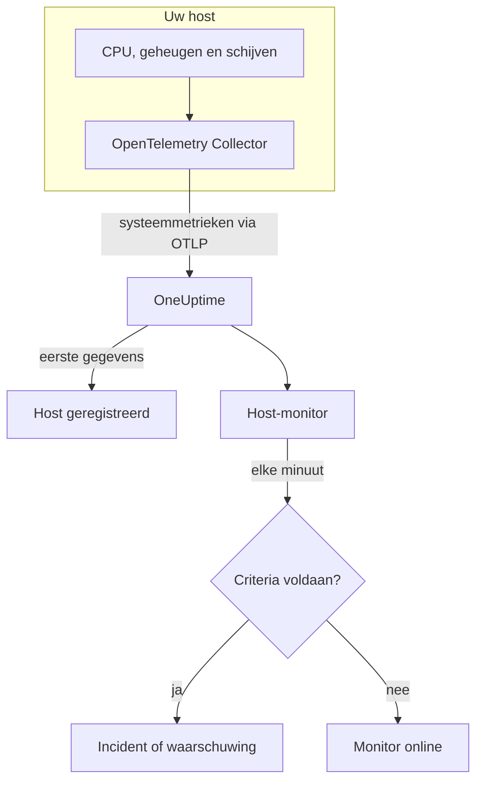

# Host-monitor

Een Host-monitor bewaakt één machine – de CPU, het geheugen, de schijven, de belasting en de processen – en laat u weten wanneer die verzadigd raakt of volloopt. Hij leest de OpenTelemetry-metrieken `system.*` die een OpenTelemetry Collector vanaf de host verstuurt, dezelfde gegevens die het product **Hosts** toont, dus er wordt niets van buitenaf gepeild.

:::cards
- [De monitor maken](#een-host-monitor-maken): Zes stappen in het dashboard.
- [Sjablonen](#kant-en-klare-waarschuwingssjablonen): Vijf kant-en-klare waarschuwingen voor CPU, geheugen, schijf, belasting en processen.
- [Metrieken](#verzamelde-metrieken): De hostmetrieken waarop u kunt waarschuwen, en hun eenheden.
- [Host of Server / VM?](#host-monitor-of-server-vm-monitor): Welke van de twee machinemonitoren u gebruikt.
:::

## Hoe het werkt

Een OpenTelemetry Collector draait op de host met de receiver `hostmetrics`. Elke 30 seconden leest hij de cijfers voor CPU, geheugen, schijf, netwerk, belasting en processen van de host en stuurt ze via OTLP naar OneUptime. De eerste gegevens van een host registreren hem onder **Hosts**.

Een Host-monitor is aan één host gebonden. Elke minuut voert hij zijn query uit over de metrieken van die host en vergelijkt hij het resultaat met zijn criteria.

### Host-monitor of Server- / VM-monitor?

OneUptime heeft twee monitoren voor machines. Ze kunnen op dezelfde host draaien.

| | Host-monitor | Server- / VM-monitor |
| --- | --- | --- |
| **Agent** | Een OpenTelemetry Collector met de receiver `hostmetrics` | De OneUptime-infrastructuuragent |
| **Gegevens** | OpenTelemetry-metrieken `system.*` en `process.*`, dezelfde die de pagina's onder **Hosts** in grafieken tonen | Een statusrapport dat de agent naar de monitor stuurt |
| **Criteria** | Drempels of anomaliedetectie op elke metriekquery of formule | Ingebouwde controles zoals CPU-, geheugen- en schijfgebruik |
| **Instellen** | Installeer de collector; de host registreert zichzelf | Maak de monitor en geef zijn geheime sleutel aan de agent |

Gebruik de Host-monitor als de host al OpenTelemetry-gegevens stuurt, of als u logboeken en rijkere metrieken van dezelfde collector wilt. Zie [Server- / VM-monitor](/docs/monitor/server-monitor) voor de andere.

## Voordat u begint

- **Draai een OpenTelemetry Collector op de host** met de receiver `hostmetrics`. [OpenTelemetry-collector op de host](/docs/telemetry/host-otel-collector) behandelt Linux, macOS en Windows, en **Producten → Infrastructuur → Hosts → Documentatie** geeft een kant-en-klare configuratie.
- **Zet de gebruiksmetrieken aan.** `system.cpu.utilization`, `system.memory.utilization` en `system.filesystem.utilization` zijn optioneel in de receiver, en de sjablonen voor CPU, geheugen en bestandssysteem hebben ze nodig. De configuratie uit het dashboard zet ze aan.
- **Controleer of de host is geregistreerd.** Hij verschijnt onder **Producten → Infrastructuur → Hosts → Alle hosts**, genoemd naar zijn `host.name`, zodra zijn eerste gegevens binnenkomen.

## Een Host-monitor maken

:::steps
### Een nieuwe monitor beginnen

Ga naar **Monitoren** en klik op **Monitor maken**.

### Host kiezen

Klik onder **Monitortype** op **Meer monitortypen** en kies **Host** onder **Infrastructuur**. Vul een **Naam** in – die wordt gebruikt in de titels van incidenten en waarschuwingen – en klik op **Volgende**.

### De host kiezen

Kies onder **Host Monitor Configuration** de machine in **Host**. Elke host die gegevens heeft verstuurd, staat in de lijst.

### Kiezen wat u bewaakt

Kies een van de drie tabbladen:

- **Quick Setup** – klik op een [sjabloon](#kant-en-klare-waarschuwingssjablonen). Het stelt de metriek, de aggregatie, het tijdsbereik en de drempels in, en vervangt de criteria hieronder door die van het sjabloon. Het **Tijdsbereik** kunt u nog wijzigen.
- **Custom Metric** – kies één metriek in **Host Metric** en stel dan **Aggregatie** en **Tijdsbereik** in.
- **Geavanceerd** – bouw zelf query's en formules onder **Selecteer metrieken**, bijvoorbeeld een filter op `state` of een groepering op `mountpoint`.

### De criteria controleren

Open elk criterium onder **Monitorcriteria** en controleer de **Metriek**, **Aggregatie**, **Voorwaarde** en **Threshold**. Een sjabloon vult deze in. Met **Custom Metric** of **Geavanceerd** begint de monitor met de [standaardcriteria](#standaardcriteria), die alleen opmerken dat een metriek naar nul zakt; stel daarom uw eigen drempel in.

### De monitor maken

Klik op **Monitor maken**. OneUptime opent de pagina van de monitor en evalueert hem elke minuut. Incidenten en waarschuwingen die hij opent, staan ook op de pagina's **Incidenten** en **Waarschuwingen** van de host.
:::

> [!TIP]
> Om meerdere sjablonen tegelijk in te stellen, opent u de host via **Producten → Infrastructuur → Hosts** en gaat u naar **Recommendations**. Kies de sjablonen die u wilt en wie wordt opgeroepen, en OneUptime maakt één monitor per sjabloon.

## Monitorinstellingen

| Veld | Tabblad | Wat het doet |
| --- | --- | --- |
| **Host** | Alle | Verplicht. Beperkt elke query tot de `resource.host.name` van de host. |
| **Host Metric** | Custom Metric | Eén metriek uit de [catalogus](#verzamelde-metrieken), gegroepeerd als CPU, geheugen, schijf, netwerk, belasting en processen. |
| **Aggregatie** | Custom Metric | Hoe metingen worden gecombineerd: **Gemiddelde**, **Maximum**, **Minimum**, **Som** of **Aantal**. Begint bij de gebruikelijke aggregatie van de metriek. |
| **Tijdsbereik** | Alle | Het schuivende venster dat de query leest, van **Past 1 Minute** tot **Past 365 Days**. Een nieuwe monitor begint bij **Past 1 Minute**; sjablonen stellen hun eigen in. |
| **Selecteer metrieken** | Geavanceerd | De querybouwer: **Metriek**, **Aggregate by**, **Filter by attributes**, **Group by**, plus **Metriek toevoegen** en **Formule toevoegen** om query's te combineren. |

## Kant-en-klare waarschuwingssjablonen

**Quick Setup** biedt vijf sjablonen. Elk bouwt een complete monitor: een query, een criterium dat afgaat en een dat herstelt. De drempels zijn uitgangspunten die u kunt aanpassen.

Een criterium gaat alleen af als de voorwaarde elke minuut van zijn venster geldt, en herstelt 10% voorbij de drempel, zodat een waarde die rond de grens schommelt niet heen en weer springt.

| Sjabloon | Ernst | Bewaakt | Gaat af als | Herstelt als |
| --- | --- | --- | --- | --- |
| High CPU Utilization | Warning | `system.cpu.utilization` voor de toestanden `user` en `system`, opgeteld en als percentage getoond, laatste 5 minuten | Boven 80% | Op of onder 72% |
| High Memory Utilization | Warning | `system.memory.utilization` voor de toestand `used`, als percentage, laatste 5 minuten | Boven 85% | Op of onder 76,5% |
| High Filesystem Usage | Kritiek | `system.filesystem.utilization`, Max per `mountpoint` en `device`, als percentage, laatste 5 minuten | Boven 90% | Op of onder 81% |
| High Load Average (1m) | Warning | `system.cpu.load_average.1m`, Avg, laatste 5 minuten | Boven 4 | Op of onder 3,6 |
| High Process Count | Warning | `system.processes.count`, Max, laatste 5 minuten | Boven 2000 | Op of onder 1800 |

**Ernst** is het label dat de keuzelijst toont. Het incident en de waarschuwing die een sjabloon maakt, beginnen op het zwaarste incident- en waarschuwingsernstniveau van uw project; wijzig ze in de criteria.

- **CPU** is bezette tijd (`user` plus `system`), hetzelfde cijfer dat het **Overzicht** van de host in grafieken toont. Iowait en steal tellen niet mee.
- **Geheugen** sluit buffers en paginacache uit, zodat een host die grotendeels cache bevat het sjabloon niet laat afgaan.
- **Bestandssysteem** opent één incident per mount. Alleen-lezen pseudobestandssystemen, zoals snap-mounts van het type `squashfs` of `devfs` op macOS, zijn altijd 100% vol; sluit ze uit in de scraper `filesystem` van de collector.
- **Belastingsgemiddelde** is een ruwe lengte van de uitvoerwachtrij, niet gedeeld door het aantal kernen: 4 is verzadiging op een host met 2 kernen en routine op een host met 32; verhoog de drempel daarom op grote hosts.
- **Aantal processen** vergelijkt de grootste afzonderlijke procestoestand (`running`, `sleeping`, …), niet het totaal van de host, en komt dus niet overeen met een proceslijst. De processcraper rapporteert alleen op Linux.

## Verzamelde metrieken

De lijst **Host Metric** biedt deze metrieken. Elk draagt `resource.host.name`, waarmee de monitor zijn query's tot één host beperkt.

> [!IMPORTANT]
> De gebruiksmetrieken zijn een verhouding van 0 tot 1, geen percentage: gebruik `0.8` voor 80% in een drempel op de ruwe metriek. De sjablonen rekenen met een formule om naar een percentage, dus hun drempels zijn 80, 85 en 90.

### CPU

| Metriek | Eenheid | Beschrijving |
| --- | --- | --- |
| `system.cpu.utilization` | verhouding | Aandeel van de CPU-tijd in elke `state` (`user`, `system`, `idle`, …). Filter op `state`: een gemiddelde over alle toestanden haalt nooit een bruikbare drempel. |
| `process.cpu.utilization` | verhouding | CPU-gebruik van elk proces op de host. |

### Geheugen

| Metriek | Eenheid | Beschrijving |
| --- | --- | --- |
| `system.memory.utilization` | verhouding | Aandeel van het fysieke geheugen in elke `state` (`used`, `free`, `cached`, …). Filter op `state = used` voor het geheugen in gebruik. |
| `system.memory.usage` | bytes | Geheugengebruik in bytes. |

### Schijf

| Metriek | Eenheid | Beschrijving |
| --- | --- | --- |
| `system.filesystem.utilization` | verhouding | Aandeel van de capaciteit van elk bestandssysteem dat in gebruik is, per `mountpoint` en `device`. |
| `system.filesystem.usage` | bytes | Gebruik van het bestandssysteem in bytes. |

### Netwerk

| Metriek | Eenheid | Beschrijving |
| --- | --- | --- |
| `system.network.io` | bytes | Ontvangen en verzonden bytes. Een teller over de hele levensduur. |

### Belasting

| Metriek | Eenheid | Beschrijving |
| --- | --- | --- |
| `system.cpu.load_average.1m` | aantal | Belastingsgemiddelde over de laatste minuut. |
| `system.cpu.load_average.5m` | aantal | Belastingsgemiddelde over de laatste 5 minuten. |
| `system.cpu.load_average.15m` | aantal | Belastingsgemiddelde over de laatste 15 minuten. |

### Processen

| Metriek | Eenheid | Beschrijving |
| --- | --- | --- |
| `system.processes.count` | aantal | Processen op de host, één reeks per proces-`status`. |

De querybouwer in **Geavanceerd** toont elke metriek die de host stuurt, niet alleen deze.

## Bewakingscriteria

Een criterium vergelijkt een van de query's of formules van de monitor met een drempel. De criteria van een Host-monitor hebben geen **Filtertype**: elke regel controleert de metriekwaarde, met deze velden.

| Veld | Wat het doet |
| --- | --- |
| **Metriek** | De query of formule die wordt gecontroleerd, op naam van de variabele. |
| **Aggregatie** | Hoe de waarden in het venster één antwoord worden: **Gemiddelde**, **Som**, **Maximum Value**, **Minimum Value**, **All Values** (elke waarde moet overeenkomen) of **Any Value** (één is genoeg). |
| **Voorwaarde** | **Greater Than**, **Less Than**, **Greater Than Or Equal To**, **Less Than Or Equal To** of **Equal To** – of een anomalievoorwaarde: **Anomalously High**, **Anomalously Low** of **Anomalous**. |
| **Threshold** | De waarde waarmee wordt vergeleken. Ernaast staat een lijst met eenheden als de metriek een eenheid heeft. Niet getoond bij anomalievoorwaarden. |
| **Gevoeligheid** | Alleen bij anomalievoorwaarden. **Laag** (4σ), **Gemiddeld** (3σ, de standaard) of **Hoog** (2σ). |
| **Baseline-venster** | Alleen bij anomalievoorwaarden. 14 dagen (de standaard), 28, 60 of 90 dagen geschiedenis. |
| **Als geen gegevens** | Onder **Meer velden**. Wat er gebeurt als het venster geen metingen bevat: **Ignore** (de standaard), **Treat As Zero** of **Trigger**. |

Anomalievoorwaarden vergelijken elke waarde met hetzelfde uur van de week in de baseline. Ze blijven in een "Learning"-status, en geven niets, tot het baseline-venster genoeg geschiedenis bevat.

Elk criterium zegt ook wat er moet gebeuren als het overeenkomt: de monitorstatus wijzigen, een waarschuwing maken of een incident melden. Criteria worden van boven naar beneden gecontroleerd, en het eerste dat overeenkomt, beslist.

### Standaardcriteria

Een monitor die u niet vanuit een sjabloon maakt, begint met twee criteria:

| Volgorde | Criterium | Komt overeen als | Dan |
| --- | --- | --- | --- |
| 1 | Check if _monitor name_ is offline | Een willekeurige waarde van de eerste query `0` is | Markeert de monitor als **Offline** en meldt het incident "_monitor name_ is offline", dat zichzelf oplost als de monitor herstelt. |
| 2 | Check if _monitor name_ is online | Een willekeurige waarde boven `0` ligt | Markeert de monitor als **Operationeel**. |

> [!IMPORTANT]
> Stilte komt met geen van beide criteria overeen: een host die geen gegevens meer stuurt, laat de monitor zoals hij was. Om bericht te krijgen als de host stil wordt, zet u **Als geen gegevens** in een criterium op **Trigger**. Tijd waarin OneUptime zelf niet ontving, geldt nooit als ontbrekende gegevens: een controle waarvan het venster zulke tijd bevat, wacht in plaats daarvan, zoals [Als OneUptime geen gegevens ontvangt](/docs/monitor/when-oneuptime-is-not-receiving) uitlegt.

## Problemen oplossen

:::details De host staat niet in de lijst Host
Hosts registreren zichzelf uit de gegevens van de collector, die een `host.name` en het besturingssysteemtype van de host nodig hebben – beide komen uit de processor `resourcedetection` van de collector. Controleer of de collector draait en of de host onder **Producten → Infrastructuur → Hosts → Alle hosts** staat. [OpenTelemetry-collector op de host](/docs/telemetry/host-otel-collector) behandelt de configuratie.
:::

:::details Een CPU- of geheugendrempel gaat nooit af
De gebruiksmetrieken zijn verhoudingen met een maximum van `1.0`, dus een zelf ingevoerde drempel van `80` wordt nooit overschreden: gebruik `0.8`, of begin vanuit een sjabloon, dat naar een percentage omrekent. Filter ook op `state` – `user` en `system` voor CPU, `used` voor geheugen. Een gemiddelde over alle toestanden blijft rond 1 gedeeld door het aantal toestanden.
:::

:::details Incidenten gaan af voor de verkeerde host
De monitor beperkt elke query met `resource.host.name` gelijk aan de host die u koos. Hosts die dezelfde `host.name` rapporteren, vallen samen tot één reeks; geef daarom elke host een unieke naam.
:::

:::details High Filesystem Usage gaat af voor een mount die altijd vol is
Alleen-lezen pseudobestandssystemen, zoals snap-loopmounts van het type `squashfs` onder `/snap` of `devfs` op macOS, zijn bewust 100% vol en herstellen nooit. Sluit ze uit in de scraper `filesystem` van de collector.
:::

## Volgende stappen

:::cards
- [OpenTelemetry-collector op de host](/docs/telemetry/host-otel-collector): De collector installeren en configureren die deze monitor leest.
- [Server- / VM-monitor](/docs/monitor/server-monitor): De monitor voor machines waarnaar een agent pusht.
- [Metrics-monitor](/docs/monitor/metrics-monitor): Waarschuwen op elke metriek, over hosts en services heen.
- [Incidenten – Overzicht](/docs/incidents/index): Wat er gebeurt nadat een criterium een incident heeft gemeld.
:::
