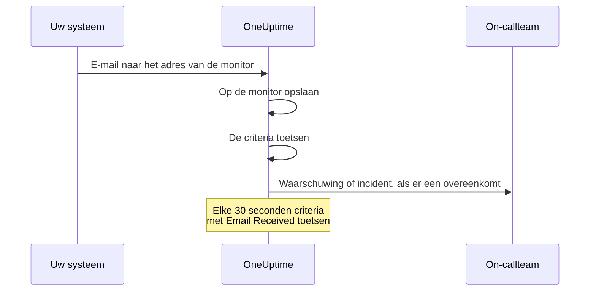

# Inkomende-e-mail-monitor

Een monitor voor inkomende e-mail geeft u een e-mailadres dat bij één monitor hoort. Alles wat e-mail kan versturen — een back-upjob, een verouderd systeem, de waarschuwingen van een cloudprovider — stuurt zijn resultaten daarheen, en OneUptime toetst elke e-mail aan uw criteria om de monitor als uitgevallen te markeren, een incident te openen of een waarschuwing te maken, en om die op te lossen als het sein veilig binnenkomt.

:::cards
- [De monitor maken](#een-monitor-voor-inkomende-e-mail-maken): Krijg een adres en richt uw afzender erop.
- [Het adres verifiëren](#het-adres-bij-de-afzender-verifiëren): Lees de bevestigingsmail van een afzender op de monitor.
- [Criteria schrijven](#beschikbare-filtertypen): Toets onderwerp, afzender of tekst, of waarschuw als er geen e-mail meer komt.
- [De e-mail in waarschuwingen gebruiken](#sjabloonvariabelen): Zet het onderwerp en de tekst in titels en beschrijvingen.
:::

## Zo werkt het

E-mail is een pushmodel: uw systeem verstuurt, en OneUptime luistert. Elke e-mail wordt bij aankomst aan de criteria van de monitor getoetst. Criteria die kijken naar e-mail die had *moeten* aankomen, worden daarnaast volgens een schema getoetst, elke 30 seconden.



1. Als u een monitor voor inkomende e-mail maakt, geeft OneUptime hem een uniek e-mailadres.
2. Elke e-mail die naar dat adres wordt gestuurd, wordt op de monitor opgeslagen en aan zijn criteria getoetst, van boven af; het eerste criterium dat overeenkomt, beslist.
3. Een criterium dat overeenkomt, kan de status van de monitor wijzigen, een waarschuwing maken en een incident verklaren. Een incident met **Incident automatisch oplossen** aan, of een waarschuwing met **Waarschuwing automatisch oplossen** aan, wordt opgelost als later een ander criterium overeenkomt — bijvoorbeeld het criterium dat de monitor als online markeert.

## Een monitor voor inkomende e-mail maken

:::steps
### Een nieuwe monitor beginnen

Ga naar **Monitoren** en klik op **Monitor maken**.

### Incoming Email kiezen

Klik onder **Monitortype** op **Meer monitortypen** en kies **Incoming Email** onder **Inbound Monitoring**, of typ `email` in het zoekvak. Voer een **Naam** in en klik daarna op **Volgende**.

### De criteria nakijken

De stap **Criteria** begint met [de standaardcriteria](#wat-u-meteen-krijgt), die de monitor als offline markeren als een e-mail `error` noemt. Klik op een criterium om het te wijzigen, of klik op **Criteria toevoegen** om er een toe te voegen. Zie [Voorbeeldconfiguraties](#voorbeeldconfiguraties) voor gangbare inrichtingen.

### De monitor maken

Klik op **Monitor maken**. De monitor opent op zijn pagina **Overzicht**, waar de kaart **Incoming Email Address** het adres met een kopieerknop toont totdat de eerste e-mail binnenkomt.

### E-mail naar het adres sturen

Stel uw systeem zo in dat het zijn meldingen naar het adres stuurt. Vraagt de afzender u eerst het adres te bevestigen, zie dan [Het adres bij de afzender verifiëren](#het-adres-bij-de-afzender-verifiëren).
:::

> [!NOTE]
> Het adres bevat de geheime sleutel van de monitor, dus alleen mensen die monitoren mogen bewerken, kunnen het zien. Alle anderen zien dat de installatiegegevens verborgen zijn.

## Formaat van het e-mailadres

Elke monitor voor inkomende e-mail krijgt een uniek adres in dit formaat:

```text
monitor-{secret-key}@{inbound-domain}
```

De geheime sleutel is een UUID, bijvoorbeeld `monitor-3f2b8c1e-5d4a-4f6b-9a7c-2e1d0b9f8a6c@inbound.yourdomain.com`. Nadat de eerste e-mail is binnengekomen, blijft het adres op de pagina **Overzicht** van de monitor staan in de kaart **Inbound email address**, naast het tijdstip waarop de laatste e-mail binnenkwam. De pagina **Documentatie** van de monitor toont het ook.

## Het e-mailadres opnieuw instellen of aanpassen

Ga naar het tabblad **Instellingen** van de monitor. De kaart **Incoming Email Address** toont het huidige adres en biedt twee manieren om het te vervangen:

| Actie | Wat het doet | Wanneer u het gebruikt |
| --- | --- | --- |
| **Reset Address** | Geeft de monitor een nieuw, willekeurig gegenereerd adres `monitor-{secret-key}@{inbound-domain}`. Heeft de monitor een aangepast adres, dan verwijdert het opnieuw instellen dat. U wordt eerst om bevestiging gevraagd. | Het adres is uitgelekt, of u wilt afsluiten wat er ook maar naartoe stuurt. |
| **Customize Address** | Laat u het deel vóór de @ kiezen, bijvoorbeeld `nightly-backups@{inbound-domain}`. Voer het in bij **Address name** — u kunt de naam typen of het hele adres plakken — en klik op **Save Address**. | U wilt een adres dat mensen herkennen. |

Beide acties eindigen met het nieuwe adres en een kopieerknop.

> [!WARNING]
> **Het oude adres werkt meteen niet meer**: e-mail die ernaartoe wordt gestuurd, wordt genegeerd, dus werk elk systeem bij dat e-mail naar deze monitor stuurt.

Regels voor een aangepast adres:

- 3 tot 64 tekens: kleine letters, cijfers, punten (`.`), koppeltekens (`-`) en underscores (`_`), zonder twee punten achter elkaar. Het moet beginnen en eindigen met een letter of een cijfer. Hoofdletters worden voor u in kleine letters omgezet.
- Het domein is altijd het domein van de server voor inkomende e-mail.
- De naam mag niet al door een andere monitor worden gebruikt. Alle projecten op de server delen het domein voor inkomende e-mail, dus de naam moet over al die projecten uniek zijn.
- Namen in de vorm `monitor-{id}` en `workflow-{id}` zijn voorbehouden aan gegenereerde adressen. Namen van postvakken die bij het domein zelf horen, zijn ook voorbehouden: `abuse`, `admin`, `administrator`, `hostmaster`, `mailer-daemon`, `noc`, `postmaster`, `root`, `security` en `webmaster`.

Een aangepast adres is net zo goed een inloggegeven als een gegenereerd adres: wie het kent, kan e-mail sturen die deze monitor toetst. Gegenereerde adressen zijn praktisch niet te raden, maar een korte, voor de hand liggende naam wel. Kies iets dat moeilijk te raden is als dat voor u belangrijk is.

API-gebruikers kunnen hetzelfde doen via de Monitor-API, op een bestaande monitor: zet `incomingEmailCustomLocalPart` op de naam om een aangepast adres te gebruiken, of op `null` om terug te gaan naar het gegenereerde adres. Opnieuw instellen betekent in dezelfde update een nieuwe `incomingEmailSecretKey` schrijven en `incomingEmailCustomLocalPart` op `null` zetten.

## Het adres bij de afzender verifiëren

Sommige diensten sturen geen waarschuwingen naar een nieuw adres totdat iemand bewijst dat hij daar e-mail kan lezen. Ze sturen eerst een verificatie-e-mail, en die komt net als elke andere e-mail op de monitor aan. Zo leest u hem:

:::steps
### Het adres aan de dienst toevoegen

Voeg het adres van de monitor toe aan de dienst en sla op. De dienst stuurt zijn verificatie-e-mail.

### De nieuwste e-mail openen

Open in OneUptime de monitor. Op zijn pagina **Overzicht** toont de kaart **Monitorsamenvatting** de nieuwste e-mail. Controleer of **Van** en **Onderwerp** bij de verificatie-e-mail horen, en klik daarna op **Meer details weergeven**.

### De code of link kopiëren

De code of link staat in **E-mailtekst (tekst)**. **E-mailtekst (HTML)** toont de HTML-bron, dus als u daar een link kopieert, verander dan elke `&amp;` erin in `&`.

### Het verifiëren afronden

Rond het verifiëren af zoals de e-mail u vertelt.
:::

Is er sindsdien een andere e-mail binnengekomen, dan toont de kaart de verificatie-e-mail niet meer. Open **Monitoringlogboeken**, zoek de verificatie-e-mail op zijn onderwerp in de kolom **E-mail**, en klik op **Samenvatting bekijken** in die rij.

> [!IMPORTANT]
> **Uw criteria zien hem ook.** De verificatie-e-mail wordt getoetst zoals elke andere e-mail. Een formulering als "if you received this in error" komt overeen met het standaardcriterium `error` en markeert de monitor als offline. Om dat te voorkomen, zet u tijdens het verifiëren **Deze monitor controleren** uit in de kaart **Bewaking** op de pagina **Instellingen** van de monitor (u wordt om bevestiging gevraagd). Een monitor met bewaking uit slaat de e-mail toch op, en de kaart **Monitorsamenvatting** toont hem nog steeds. Hij toetst alleen niets, dus de e-mail krijgt geen rij in **Monitoringlogboeken**: lees hem voordat er een andere e-mail binnenkomt. Bent u klaar, klik dan op **Bewaking aanzetten** in de banner boven aan de pagina's van de monitor, of zet de schakelaar weer aan.

**Verificatie hoort bij het adres.** Als u [het adres opnieuw instelt of aanpast](#het-e-mailadres-opnieuw-instellen-of-aanpassen), ziet de dienst een nieuwe ontvanger en moet u opnieuw verifiëren.

### Actiegroepen van Azure Monitor

Sinds juli 2026 voert Azure geleidelijk de eis in dat elke nieuwe ontvanger van het type **Email** in een actiegroep wordt geverifieerd met een eenmalige toegangscode. Zolang dat niet is gebeurd, stuurt de actiegroep dat adres geen waarschuwingen en geen testmeldingen.

:::steps
1. Voeg aan de actiegroep een melding van het type **Email** toe met het adres van de monitor, en sla de actiegroep op. Azure stuurt de verificatie-e-mail vanaf een Microsoft-adres zoals `azure-noreply@microsoft.com`.
2. Lees hem op de monitor zoals hierboven beschreven, en volg de instructies erin binnen 30 minuten na het opslaan van de actiegroep. Is de toegangscode verlopen, open dan de actiegroep en kies **Resend**.
3. Open de actiegroep en kies **Test** om een testmelding te sturen. Die komt op de monitor aan als een echte waarschuwing, dus ze laat ook zien of uw criteria overeenkomen met de e-mails van Azure.
:::

Verificatie geldt voor elke actiegroep in dezelfde Azure-tenant, dus elk adres hoeft maar één keer te worden geverifieerd.

### Amazon SNS

Een e-mailabonnement op een SNS-onderwerp ontvangt niets totdat het is bevestigd. Als u het abonnement maakt, stuurt Amazon SNS een bevestigingsmail naar het adres. Lees die op de monitor zoals hierboven beschreven, en open de link **Confirm subscription** erin in uw browser. SNS verwijdert een abonnement dat niet binnen 48 uur is bevestigd; maak in dat geval het abonnement opnieuw.

## Wat u meteen krijgt

Een nieuwe monitor voor inkomende e-mail wordt gemaakt met twee criteria die de tekst van de e-mail lezen:

| Criterium | Filtertype | Filtervoorwaarde | Waarde | Effect |
| -------- | ----------- | ---------------- | ------- | -------------------------------------------- |
| Offline  | Email Body  | Bevat | `error` | Markeert de monitor als offline, opent een incident |
| Online   | Email Body  | Not Contains | `error` | Markeert de monitor als online |

Dit past bij het gangbare geval waarin een job of een tool van derden zijn eigen resultaat per e-mail meldt: een bericht waarvan de tekst `error` noemt, haalt de monitor neer, en het volgende bericht zonder dat woord brengt de monitor weer online en lost het incident op. Bij het vergelijken van de tekst tellen hoofdletters niet, dus `Error` en `ERROR` komen ook overeen.

Verander de waarde in wat uw afzender werkelijk schrijft (`FAILED`, `exit code 1` enzovoort).

> [!NOTE]
> Deze standaardcriteria zijn **geen** dodemansknop: niets hier gaat af als er geen e-mail meer binnenkomt. Criteria die alleen het onderwerp, de afzender, de tekst of de ontvanger lezen, worden getoetst als er een e-mail binnenkomt en op geen ander moment. Wilt u bij stilte gewaarschuwd worden, voeg dan een criterium **Email Received** / **Not Recieved In Minutes** toe — zie [Voorbeeld 3](#voorbeeld-3-heartbeat-monitor-geen-e-mail-waarschuwing).

## Beschikbare filtertypen

U kunt criteria maken op basis van deze e-mailvelden:

| Filtertype | Beschrijving |
| ------------------------- | ----------------------------------------------------------------------------------- |
| **E-mailonderwerp** | De onderwerpregel van de binnenkomende e-mail |
| **Email From Address** | Het e-mailadres van de afzender: het kale adres, in kleine letters, zonder weergavenaam |
| **Email Body** | Het platte-tekstdeel van de e-mail |
| **Email To Address** | Het e-mailadres van de ontvanger |
| **Email Received** | Tijdgebaseerde criteria voor wanneer e-mails binnenkomen |
| **JavaScript Expression** | Een eigen JavaScript-expressie die waar moet opleveren |

Het eigen adres van de monitor wordt gemaskeerd voordat een criterium de e-mail leest, dus in **Email To Address**, **E-mailonderwerp** en **Email Body** staat `[REDACTED]`.

## Filtervoorwaarden

### Tekenreeksfilters (onderwerp, afzender, tekst, ontvanger)

| Filtervoorwaarde | Beschrijving | Voorbeeld |
| ---------------- | ----------------------------------------- | ---------------------------------- |
| **Bevat** | Het veld bevat de opgegeven tekst | Onderwerp bevat "CRITICAL" |
| **Not Contains** | Het veld bevat de opgegeven tekst niet | Onderwerp bevat geen "TEST" |
| **Equal To** | Het veld komt exact overeen met de opgegeven tekst | Afzender is gelijk aan "alerts@service.com" |
| **Not Equal To** | Het veld komt niet overeen met de opgegeven tekst | Onderwerp is niet gelijk aan "OK" |
| **Starts With** | Het veld begint met de opgegeven tekst | Onderwerp begint met "[ALERT]" |
| **Ends With** | Het veld eindigt op de opgegeven tekst | Onderwerp eindigt op "- Production" |
| **Is Empty** | Het veld is leeg | Tekst is leeg |
| **Is Not Empty** | Het veld heeft inhoud | Onderwerp is niet leeg |

Bij al deze vergelijkingen tellen hoofdletters niet. Een filter met een lege waarde komt nooit overeen.

### Tijdgebaseerde filters (Email Received)

Het dashboard spelt deze voorwaarden "Recieved".

| Filtervoorwaarde | Beschrijving | Voorbeeld |
| --------------------------- | ----------------------------------- | -------------------------------- |
| **Recieved In Minutes** | Binnen X minuten is een e-mail ontvangen | E-mail ontvangen binnen 30 minuten |
| **Not Recieved In Minutes** | In X minuten is geen e-mail ontvangen | Geen e-mail ontvangen in 60 minuten |

Een monitor die nog nooit een e-mail heeft ontvangen, telt zijn aanmaaktijd als de laatste e-mail.

### JavaScript Expression

| Filtervoorwaarde | Beschrijving |
| --------------------- | ------------------------------------- |
| **Evaluates To True** | De expressie levert een waarheidsgetrouwe waarde op |

De expressie draait in een sandbox waaraan geen e-mailvelden zijn gebonden, dus ze kan het onderwerp, de afzender, de tekst of de ontvanger van het bericht dat de controle uitlokte, niet lezen. Gebruik de filtertypen **E-mailonderwerp**, **Email From Address**, **Email Body** en **Email To Address** om op de inhoud van de e-mail te toetsen.

## Voorbeeldconfiguraties

Elk voorbeeld is een paar criteria. Een criterium heeft filters, een **Overeenkomstvoorwaarde** (**Alle** of **Elke** van zijn filters), en acties: de status van de monitor wijzigen, een waarschuwing maken, een incident verklaren. Zet **Waarschuwing automatisch oplossen** (of **Incident automatisch oplossen**) aan onder **Meer velden** in de waarschuwing of het incident, zodat het tweede criterium oplost wat het eerste heeft geopend.

### Voorbeeld 1: Een waarschuwing maken bij kritieke e-mails

| Criterium | Filters | Overeenkomstvoorwaarde | Acties |
| --- | --- | --- | --- |
| Kritieke e-mail | **E-mailonderwerp** Bevat `CRITICAL`; **E-mailonderwerp** Bevat `ALERT`; **E-mailonderwerp** Bevat `ERROR` | **Elke** | De status op offline zetten; een waarschuwing maken |
| Herstel-e-mail | **E-mailonderwerp** Bevat `RESOLVED`; **E-mailonderwerp** Bevat `RECOVERED` | **Elke** | De status op online zetten |

Zet het kritieke criterium bovenaan: criteria worden van boven af getoetst, en het eerste dat overeenkomt, beslist.

### Voorbeeld 2: Een specifieke afzender bewaken

| Criterium | Filters | Overeenkomstvoorwaarde | Acties |
| --- | --- | --- | --- |
| Mislukte job | **Email From Address** Equal To `monitoring@legacy-system.com`; **E-mailonderwerp** Bevat `Failed` | **Alle** | De status op offline zetten; een incident verklaren |
| Geslaagde job | **Email From Address** Equal To `monitoring@legacy-system.com`; **E-mailonderwerp** Bevat `Success` | **Alle** | De status op online zetten |

### Voorbeeld 3: Heartbeat-monitor (geen e-mail = waarschuwing)

| Criterium | Filters | Acties |
| --- | --- | --- |
| E-mail is te laat | **Email Received** Not Recieved In Minutes `60` | De status op offline zetten; een waarschuwing maken |
| E-mail is binnengekomen | **Email Received** Recieved In Minutes `60` | De status op online zetten |

Het eerste criterium gaat af als er 60 minuten lang geen e-mail is binnengekomen — handig voor geplande jobs of batchprocessen die een e-mail sturen als ze klaar zijn. Het tweede lost de waarschuwing op zodra er een binnenkomt. Minuten waarin OneUptime zelf geen e-mail ontving, tellen niet mee voor de 60, zoals [Als OneUptime geen gegevens ontvangt](/docs/monitor/when-oneuptime-is-not-receiving) uitlegt.

## Toepassingen

| Toepassing | Wat de monitor doet |
| --- | --- |
| Integratie met verouderde systemen | Maakt van waarschuwingen die oudere systemen alleen per e-mail sturen OneUptime-incidenten, en lost ze op als de herstel-e-mail binnenkomt. |
| Diensten van derden | Ontvangt meldingen van cloudproviders (AWS, GCP, Azure), beveiligingsscanners, back-uptools en waarschuwingen over verlopende certificaten. |
| Geplande jobs | Waarschuwt als een e-mail dat een job klaar is te laat komt, of als een job een mislukking mailt. |
| Waarschuwingen bundelen | Verzamelt e-mailwaarschuwingen van Nagios, Zabbix of andere tools, zodat OneUptime de enige plek is waar u ze beheert. |

## Sjabloonvariabelen

De titels, beschrijvingen en herstelnotities van de waarschuwingen en incidenten die deze monitor maakt, kunnen deze variabelen gebruiken. De waarschuwings- en incidentformulieren van het criterium noemen ze onder **Sjabloonvariabelen**, en [Incident- en waarschuwingstemplates](/docs/monitor/incident-alert-templating) legt de syntaxis uit.

| Variabele | Beschrijving |
| --------------------- | ----------------------------------------------------------------- |
| `{{emailSubject}}`    | Het onderwerp van de ontvangen e-mail |
| `{{emailFrom}}`       | Het e-mailadres van de afzender |
| `{{emailTo}}`         | Naar wie de e-mail is gestuurd, met het eigen adres van deze monitor gemaskeerd |
| `{{emailBody}}`       | De platte tekst van de e-mail |
| `{{emailReceivedAt}}` | Wanneer de e-mail is ontvangen, als ISO 8601-tijdstempel in UTC |

- **Een titel krijgt van elk één regel.** In een titel wordt elke variabele ingekort tot één regel van hoogstens 150 tekens, die eindigt op `...` als hij langer was. Een titel mag niet langer zijn dan 500 tekens, en een waarschuwing of incident met een te lange titel wordt helemaal niet gemaakt, dus een hele e-mail citeren zou de monitor beletten te waarschuwen bij lange e-mails. Beschrijvingen en herstelnotities krijgen de volledige waarde.
- **Het adres van deze monitor wordt gemaskeerd.** Het adres werkt als een wachtwoord, dus het wordt gemaskeerd voordat de e-mail wordt opgeslagen, en `{{emailTo}}` luidt `monitor-[REDACTED]@{inbound-domain}` (of `[REDACTED]@{inbound-domain}` bij een aangepast adres).
- **Een controle op ontbrekende e-mail gebruikt de laatste e-mail.** Opent een criterium **Email Received** een waarschuwing omdat er niet op tijd een e-mail binnenkwam, dan beschrijven de variabelen de laatste e-mail die de monitor heeft ontvangen. Ze zijn leeg als er nog geen is binnengekomen.

## Weergave Monitorsamenvatting

Zodra de monitor een e-mail heeft ontvangen, toont de kaart **Monitorsamenvatting** op zijn pagina **Overzicht** de nieuwste:

- **Laatste e-mail ontvangen op**: Wanneer de meest recente e-mail is ontvangen
- **Van**: De afzender van de laatste e-mail
- **Onderwerp**: De onderwerpregel van de laatste e-mail

Klik op **Meer details weergeven** om de rest te zien:

- **E-mailheaders**: De volledige headers van de laatste e-mail
- **E-mailtekst (tekst)**: De platte tekst
- **E-mailtekst (HTML)**: De HTML-tekst, getoond als HTML-bron in plaats van weergegeven

### Eerdere e-mails

De kaart toont alleen de nieuwste e-mail. Elke e-mail die de monitor toetst, wordt ook naar **Monitoringlogboeken** geschreven: de kolom **E-mail** toont het onderwerp en de afzender, en **Samenvatting bekijken** in de rij toont de hele e-mail op dezelfde manier als de kaart. Een monitor met bewaking uit toetst niets, dus de e-mails die hij ontvangt, krijgen geen rijen. Controleert een van uw criteria **Email Received**, dan schrijft de monitor ook een rij telkens als hij op ontbrekende e-mail controleert. De kolom **E-mail** zegt in die rijen "Scheduled check", en hun **Samenvatting bekijken** toont de nieuwste e-mail op het moment van de controle, of "No email yet" als er nog geen was binnengekomen. Monitoringlogboeken worden standaard één dag bewaard. Op een zelf gehoste server kan een beheerder dat wijzigen met **Logbewaring van monitor (dagen)** in de instellingen van het beheerdashboard.

## Zelf gehoste installatie

Host u OneUptime zelf, dan moet u een provider voor inkomende e-mail configureren. Op dit moment ondersteund:

- **SendGrid Inbound Parse** - Zie [SendGrid inkomende e-mail](/docs/self-hosted/sendgrid-inbound-email) voor installatie-instructies

Zolang dat niet is ingesteld, meldt de adreskaart van de monitor dat inkomende e-mail niet is geconfigureerd.

## Aandachtspunten

- **Beveiliging van het e-mailadres**: Het e-mailadres van de monitor werkt als een wachtwoord: wie het kent, kan e-mail naar de monitor sturen. Deel het niet openbaar, en stel het opnieuw in vanuit het tabblad **Instellingen** van de monitor als het uitlekt.
- **Grootte van e-mail**: OneUptime accepteert een inkomende e-mail tot 50 MB, bijlagen inbegrepen. Bijlagen worden niet opgeslagen — alleen hun namen, typen en groottes.
- **Verwerkingstijd**: E-mails worden asynchroon verwerkt. Tussen het versturen van een e-mail en het maken van de waarschuwing kunnen een paar seconden zitten.
- **Hoofdletterongevoelig**: Bij alle vergelijkingen van tekenreeksen (Bevat, Equal To enzovoort) tellen hoofdletters niet.
- **Platte tekst**: Criteria op de tekst van de e-mail lezen het platte-tekstdeel van de e-mail. Een e-mail die alleen als HTML is verstuurd, heeft voor criteria een lege tekst — die bevat dus geen `error`, en de standaardcriteria markeren de monitor als online.

## Probleemoplossing

### E-mails komen niet aan

1. Controleer of het e-mailadres klopt (let op typefouten).
2. Controleer of de afzender wacht tot u het adres verifieert. Actiegroepen van Azure Monitor en Amazon SNS sturen niets naar een nieuw adres totdat het is geverifieerd. Zie [Het adres bij de afzender verifiëren](#het-adres-bij-de-afzender-verifiëren).
3. Controleer of de e-mail door spamfilters wordt tegengehouden.
4. Controleer of uw provider voor inkomende e-mail juist is geconfigureerd.
5. Kijk in de logboeken van OneUptime naar foutmeldingen.

### Waarschuwingen worden niet gemaakt

1. Controleer of uw criteria overeenkomen met de inhoud van de e-mail. Onthoud dat het eigen adres van de monitor `[REDACTED]` luidt, en dat een e-mail met alleen HTML een lege tekst heeft.
2. Controleer of de bewaking aan staat: de pagina **Instellingen** van de monitor, kaart **Bewaking**.
3. Open **Monitoringlogboeken** en klik op **Samenvatting bekijken** in de rij van de e-mail om te zien wat de criteria lazen.
4. Controleer de volgorde van uw criteria: het eerste dat overeenkomt, beslist.

### Waarschuwingen worden niet opgelost

1. Controleer of uw herstelcriteria overeenkomen met de herstel-e-mail.
2. Controleer of **Waarschuwing automatisch oplossen** (of **Incident automatisch oplossen**) aan staat in het criterium dat de waarschuwing opende.
3. Controleer of de herstel-e-mail naar hetzelfde monitoradres wordt gestuurd.

## Volgende stappen

:::cards
- [Incident- en waarschuwingstemplates](/docs/monitor/incident-alert-templating): Zet het onderwerp en de tekst van de e-mail in waarschuwingen.
- [Inkomende-verzoek-monitor](/docs/monitor/incoming-request-monitor): Ontvang heartbeats en webhooks in plaats daarvan via HTTP.
- [SendGrid inkomende e-mail](/docs/self-hosted/sendgrid-inbound-email): Stel inkomende e-mail in op een zelf gehoste server.
:::
