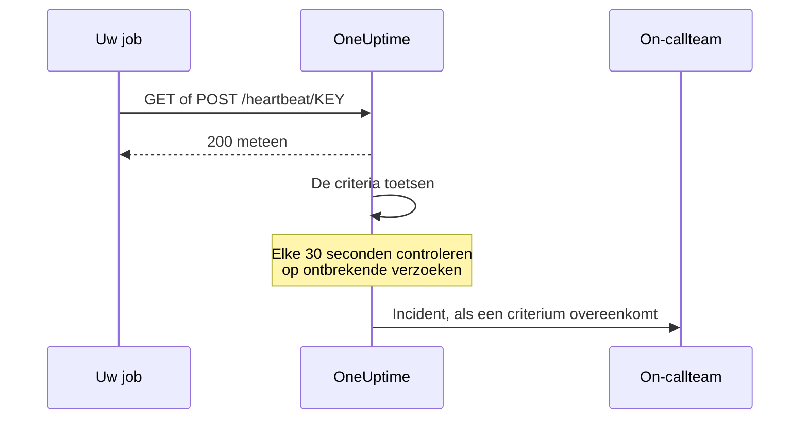

# Inkomende-verzoek-monitor

Een monitor voor inkomende verzoeken geeft u een URL waar andere systemen HTTP-verzoeken naartoe sturen. OneUptime toetst elk verzoek aan uw criteria en kan de status van de monitor wijzigen, incidenten verklaren en uw on-callrooster oproepen.

Hij dekt twee verschillende taken:

- **Heartbeat-bewaking** — een cronjob, een worker of een apparaat roept de URL volgens een schema aan, en OneUptime opent een incident als de aanroepen uitblijven.
- **Waarschuwingen uit een ander systeem ontvangen** — Prometheus Alertmanager, Grafana of alles wat JSON per POST kan versturen, stuurt waarschuwingen naar binnen, en OneUptime maakt van elke waarschuwing een incident met on-call-escalatie en automatisch oplossen bij herstel.

Beide gebruiken hetzelfde monitortype. Wat ze onderscheidt, zijn de criteria die u instelt.

:::cards
- [De monitor maken](#een-monitor-voor-inkomende-verzoeken-maken): Krijg in een paar stappen een heartbeat-URL.
- [Een heartbeat sturen](#een-heartbeat-sturen): Vanuit curl, cron, Node.js, Python of Go.
- [Waarschuwen als aanroepen uitblijven](#als-offline-markeren-als-er-10-minuten-geen-heartbeat-komt-een-dodemansknop): Maak van de monitor een dodemansknop.
- [Waarschuwingen ontvangen](#waarschuwingen-uit-een-ander-systeem-ontvangen): Eén incident per waarschuwing uit Alertmanager of Grafana.
:::

## Zo werkt het

Niets controleert uw systeem van buitenaf: uw systeem roept de URL van de monitor aan, OneUptime antwoordt meteen en toetst het verzoek daarna aan de criteria van de monitor. Een criterium dat kijkt naar verzoeken die *zijn uitgebleven*, wordt bovendien elke 30 seconden op de achtergrond opnieuw getoetst, zodat ook stilte een incident kan openen.



Gebruik hem om:

- Cronjobs en geplande taken te bewaken
- Na te gaan of achtergrondworkers draaien
- Services achter firewalls te bewaken die van buitenaf niet bereikbaar zijn
- Waarschuwingen te ontvangen van Prometheus Alertmanager, Grafana en andere waarschuwingssystemen
- Heartbeat-signalen te volgen van elk systeem dat HTTP spreekt

## Een monitor voor inkomende verzoeken maken

:::steps
### Een nieuwe monitor beginnen

Ga naar **Monitoren** en klik op **Monitor maken**.

### Incoming Request kiezen

Kies onder **Monitortype** de optie **Incoming Request**: dat is een van de gangbare typen bovenaan. Voer een **Naam** in en klik op **Volgende**.

### De criteria nakijken

De stap **Criteria** begint met [de standaardcriteria](#wat-u-meteen-krijgt). Klik voor een heartbeat op **Criteria toevoegen** en geef het nieuwe criterium een filter **Incoming Request** / **Not Recieved In Minutes** dat de status op offline zet en een incident verklaart, met **Incident automatisch oplossen** aan. Sleep het daarna bovenaan de lijst; zie [Voorbeeldcriteria](#voorbeeldcriteria) voor het waarom.

### De monitor maken

Klik op **Monitor maken**. De monitor opent op zijn pagina **Overzicht**, waar de kaart **Send the first heartbeat** de **Heartbeat URL** toont met een kopieerknop en een voorbeeldopdracht `curl`.

### Het eerste verzoek sturen

Stel uw service zo in dat hij verzoeken naar die URL stuurt (zie [Een heartbeat sturen](#een-heartbeat-sturen)). Zodra het eerste verzoek binnenkomt, maakt de kaart plaats voor de geschiedenis van de monitor, en toont een kaart **Heartbeat URL** de URL en wanneer het laatste verzoek binnenkwam.
:::

> [!NOTE]
> De URL bevat de geheime sleutel van de monitor, dus alleen mensen die monitoren mogen bewerken, kunnen hem zien. U vindt hem altijd terug op de pagina **Documentatie** van de monitor, in het onderdeel **Configuratie** van het zijmenu.

## De verzoek-URL

Uw monitor heeft een unieke URL in dit formaat:

```text
https://oneuptime.com/heartbeat/YOUR_SECRET_KEY
```

Vervang `https://oneuptime.com` door de URL van uw OneUptime-instantie als u zelf host.

Stuur **GET**- of **POST**-verzoeken naar deze URL. HEAD wordt geaccepteerd en als GET behandeld; PUT, PATCH en DELETE geven 404 terug. De geheime sleutel in het pad is het enige inloggegeven: er is geen header of token nodig. Querystrings worden genegeerd: stuur wat de criteria moeten lezen in de body of de headers.

> [!WARNING]
> Iedereen die deze URL kent, kan de monitor als gezond markeren, dus behandel hem als een geheim. Lekt hij uit, open dan de pagina **Instellingen** van de monitor en klik op **Geheime sleutel voor inkomende aanvraag opnieuw instellen**, en werk daarna elke afzender bij. Elke header die u stuurt, wordt op de monitor opgeslagen en is zichtbaar voor iedereen die hem mag lezen: stuur geen API-sleutels of tokens in headers naar dit endpoint.

> [!IMPORTANT]
> OneUptime antwoordt meteen `200` met een leeg JSON-object (`{}`) en verwerkt het verzoek via een wachtrij. Dat antwoord wordt geschreven vóór elke controle, dus een `200` is **geen** bevestiging dat het verzoek is aanvaard: een verkeerde geheime sleutel, een verwijderde monitor en een uitgeschakelde monitor geven ook `200` terug. Controleer de tijdlijn van de monitor om te bevestigen dat de verzoeken aankomen.

### Een verzoeklichaam sturen

Wilt u velden in de body aanspreken (`{{requestBody.status}}` in een incidenttitel, een JSON-pad bij het groeperen van incidenten of een criterium met een JavaScript-expressie), stuur dan `Content-Type: application/json`. Daar gaan deze pagina's overal van uit. De body moet een JSON-object of -array zijn: ongeldige JSON, of een losse waarde zoals `"error"`, wordt geweigerd met een `500`.

| Contenttype | Wat criteria en sjablonen zien |
| --- | --- |
| `application/json` | De geparste JSON. |
| `application/x-www-form-urlencoded` | Het geparste formulier. Sleutels tussen vierkante haken worden genest (`alerts[0][status]=firing`), en elke waarde is een tekenreeks. |
| Alles anders, of geen | Een lege body (`{}`), dus elke verwijzing naar `requestBody` levert niets op. |

Bodies tot 50 MB worden geaccepteerd; een grotere wordt geweigerd met een `413`. Comprimeer de body niet met `Content-Encoding: gzip`: dan wordt hij niet als JSON opgeslagen, en worden paden erin niet opgelost.

### Een heartbeat sturen

Elk voorbeeld stuurt één verzoek. Vervang `YOUR_SECRET_KEY` door de sleutel uit de URL van uw monitor.

:::tabs
@tab curl
```bash
# Simple GET request
curl https://oneuptime.com/heartbeat/YOUR_SECRET_KEY

# POST request with a JSON body
curl -X POST https://oneuptime.com/heartbeat/YOUR_SECRET_KEY \
  -H "Content-Type: application/json" \
  -d '{"status": "healthy", "version": "1.2.3"}'
```
@tab Cron
```bash
# Send a heartbeat every 5 minutes
*/5 * * * * curl -fsS https://oneuptime.com/heartbeat/YOUR_SECRET_KEY > /dev/null

# Or ping only when the job succeeds, so a failed run counts as a missed heartbeat
0 2 * * * /usr/local/bin/backup.sh && curl -fsS https://oneuptime.com/heartbeat/YOUR_SECRET_KEY > /dev/null
```
@tab Node.js
```javascript title="heartbeat.mjs"
// Node.js 18 or later: fetch is built in. Run with `node heartbeat.mjs`.
const response = await fetch(
  "https://oneuptime.com/heartbeat/YOUR_SECRET_KEY",
  {
    method: "POST",
    headers: { "Content-Type": "application/json" },
    body: JSON.stringify({ status: "healthy", version: "1.2.3" }),
  },
);

console.log(response.status); // 200
```
@tab Python
```python title="heartbeat.py"
# Python 3, standard library only. Run with `python3 heartbeat.py`.
import json
import urllib.request

request = urllib.request.Request(
    "https://oneuptime.com/heartbeat/YOUR_SECRET_KEY",
    data=json.dumps({"status": "healthy", "version": "1.2.3"}).encode(),
    headers={"Content-Type": "application/json"},
    method="POST",
)

with urllib.request.urlopen(request, timeout=10) as response:
    print(response.status)  # 200
```
@tab Go
```go title="heartbeat.go"
// Run with `go run heartbeat.go`.
package main

import (
	"bytes"
	"fmt"
	"net/http"
)

func main() {
	body := []byte(`{"status": "healthy", "version": "1.2.3"}`)

	resp, err := http.Post(
		"https://oneuptime.com/heartbeat/YOUR_SECRET_KEY",
		"application/json",
		bytes.NewReader(body),
	)
	if err != nil {
		panic(err)
	}
	defer resp.Body.Close()

	fmt.Println(resp.StatusCode) // 200
}
```
@tab PowerShell
```powershell
# Windows PowerShell 5.1 or PowerShell 7
Invoke-RestMethod -Method Post `
  -Uri "https://oneuptime.com/heartbeat/YOUR_SECRET_KEY" `
  -ContentType "application/json" `
  -Body '{"status": "healthy", "version": "1.2.3"}'
```
:::

## Bewakingscriteria

U kunt criteria instellen die bepalen wanneer uw service als online, verminderd of offline geldt. Elk criteriumfilter heeft een **Filtertype** (waar wordt gekeken), een **Filtervoorwaarde** (hoe wordt vergeleken) en een **Waarde**.

### Wat u meteen krijgt

Een nieuwe monitor voor inkomende verzoeken wordt gemaakt met twee criteria die het verzoeklichaam lezen:

| Criterium | Filtertype | Filtervoorwaarde | Waarde | Effect |
| -------- | ------------ | ---------------- | ------- | -------------------------------------------- |
| Offline  | Verzoeklichaam | Bevat | `error` | Markeert de monitor als offline, opent een incident |
| Online   | Verzoeklichaam | Not Contains | `error` | Markeert de monitor als online |

Dit past bij het gangbare geval waarin de afzender zijn eigen gezondheid in de payload meldt: een verzoek waarvan de body `error` noemt, zet de monitor offline, en het volgende verzoek zonder dat woord brengt hem weer online en lost het incident op. Een verzoek helemaal zonder body telt als "bevat geen `error`", dus een kale heartbeat-aanroep houdt de monitor online.

Verander de waarde in wat uw afzender werkelijk stuurt (`"status":"firing"`, `FAILED` enzovoort): de vergelijking is een hoofdlettergevoelige zoekactie naar een deeltekenreeks over de hele body, sleutels inbegrepen, dus ook `{"error":null}` komt overeen met `error`.

> [!NOTE]
> Deze standaardcriteria zijn **geen** dodemansknop: niets hier gaat af als verzoeken uitblijven. Wilt u bij stilte gewaarschuwd worden, voeg dan een criterium **Incoming Request** / **Not Recieved In Minutes** toe zoals hieronder beschreven.

### Beschikbare filtertypen

| Filtertype | Controleert | Opmerkingen |
| --------------------- | ------------------------------------------------------ | -------------------------------------------------------------------------------------------- |
| Incoming Request | Of er binnen een tijdvenster een verzoek is ontvangen | De enige controle die kan afgaan als er niets binnenkomt |
| Verzoeklichaam | De body van het verzoek | Zoeken naar een deeltekenreeks. Object-bodies worden als compacte JSON vergeleken |
| Request Header | De namen van de verzoekheaders | Exacte vergelijking met een hele headernaam, zonder op hoofdletters te letten |
| Request Header Value | De waarden van de verzoekheaders | Exacte vergelijking met een hele headerwaarde, zonder op hoofdletters te letten |
| JavaScript Expression | Elke expressie over `requestBody` en `requestHeaders` | De flexibelste optie: zie [JavaScript-expressies](/docs/monitor/javascript-expression) |

### Filtervoorwaarden

Elk filtertype heeft zijn eigen voorwaarden:

| Filtertype | Voorwaarden |
| --- | --- |
| **Incoming Request** | **Recieved In Minutes**: binnen het opgegeven aantal minuten is een verzoek ontvangen. **Not Recieved In Minutes**: binnen het opgegeven aantal minuten is geen verzoek ontvangen. (Het dashboard spelt ze zo.) |
| **Verzoeklichaam**, **Request Header**, **Request Header Value** | **Bevat** en **Not Contains** |
| **JavaScript Expression** | **Evaluates To True** |

> [!NOTE]
> Headernamen en -waarden worden in kleine letters vergeleken, met de hele naam of waarde, niet als deeltekenreeks: `application/json` komt niet overeen met `application/json; charset=utf-8`. Alleen **Verzoeklichaam** zoekt naar een deeltekenreeks. Headers die uw proxy of de load balancer van OneUptime toevoegt (`x-forwarded-for`, `x-real-ip`), worden ook opgeslagen.

Object-bodies worden vergeleken als compacte JSON zonder spaties, dus een filter **Verzoeklichaam** / **Bevat** moet `"status":"firing"` luiden: wie `"status": "firing"` uit een opgemaakte payload kopieert, krijgt nooit een treffer.

### Voorbeeldcriteria

#### Als offline markeren als er 10 minuten geen heartbeat komt (een dodemansknop)

| Veld | Waarde |
| --- | --- |
| **Filtertype** | Incoming Request |
| **Filtervoorwaarde** | Not Recieved In Minutes |
| **Waarde** | `10` |

#### Als verminderd markeren op basis van de inhoud van het verzoeklichaam

| Veld | Waarde |
| --- | --- |
| **Filtertype** | Verzoeklichaam |
| **Filtervoorwaarde** | Bevat |
| **Waarde** | `"status":"degraded"` |

> [!IMPORTANT]
> Zet de dodemansknop **boven** de standaardcriteria. Criteria worden van boven af getoetst, en het eerste dat overeenkomt, beslist. De controle op de achtergrond leest het laatste verzoek opnieuw, dus het standaard online-criterium ("Request Body Not Contains `error`") blijft ermee overeenkomen, en een criterium eronder komt nooit aan de beurt. **Criteria toevoegen** voegt een criterium onderaan toe: sleep het omhoog.

> [!WARNING]
> Een monitor wordt alleen op de achtergrond opnieuw getoetst als ten minste één van zijn criteria **Incoming Request** controleert. Een monitor waarvan de criteria alleen het verzoeklichaam, Request Header of een JavaScript-expressie controleren, wordt getoetst als er een verzoek binnenkomt en op geen ander moment, dus hij kan nooit vanzelf offline gaan. Wilt u een alarm bij een ontbrekende heartbeat, dan hebt u een criterium **Incoming Request** nodig.

De controle op de achtergrond telt hele minuten en gaat af zodra er *meer* dan de waarde verstreken is: "Not Recieved In Minutes: 10" gaat ongeveer 11 minuten na het laatste verzoek af (de controle draait elke 30 seconden). Een monitor die nog nooit een verzoek heeft ontvangen, wordt behandeld alsof zijn aanmaaktijd het laatste verzoek was, dus hetzelfde criterium op een gloednieuwe monitor gaat ongeveer 11 minuten na het aanmaken af, ook als de afzender nooit is aangesloten. Alleen minuten waarin OneUptime ontving, tellen mee: minuten waarin OneUptime zelf herstart, wordt bijgewerkt of een achterstand inhaalt, tellen niet, zoals [Als OneUptime geen gegevens ontvangt](/docs/monitor/when-oneuptime-is-not-receiving) uitlegt.

## Waarschuwingen uit een ander systeem ontvangen

Alertmanager, Grafana en vergelijkbare tools sturen per POST een JSON-document dat één of meer waarschuwingen beschrijft. Standaard opent een criterium **één** incident, dus een payload met vijf waarschuwingen zou één incident opleveren. Het groeperen van incidenten verandert dat: het haalt een waarde uit de payload en opent een **apart incident per afwijkende waarde**, die allemaal tegelijk open kunnen staan.

```mermaid title="Incidenten groeperen: één incident per waarschuwing in de payload"
flowchart TB
    payload["Webhook-payload"] --> keys["Eén sleutel per waarschuwing"]
    keys --> state{"Waarschuwing opgelost?"}
    state -->|Nee| open["Het incident openen of open houden"]
    state -->|Ja| resolve["Het incident oplossen"]
```

### Incidenten groeperen inschakelen

:::steps
1. Open het criterium en klap **Instellingen** uit.
2. Zet **Group incidents and alerts by a payload field** aan.
3. Vul **Open a separate incident for each…** in. Wilt u dat elk incident zichzelf oplost, vul dan ook het veld en de waarde onder **Auto-resolve each incident when…** in (zie hieronder). Sla daarna de monitor op.
:::

| Veld | Voorbeeld | Wat het doet |
| ---------------------------------- | ---------------------------------------- | ---------------------------------------------------------------------- |
| Open a separate incident for each… | `requestBody.alerts[*].labels.alertname` | Het pad waarvan de verschillende waarden de incidenten uit elkaar halen |
| Field that signals recovery | `requestBody.alerts[*].status` | Het pad dat wordt gecontroleerd om te besluiten dat een waarschuwing hersteld is |
| Value that means recovered | `resolved` | De exacte waarde die het herstel markeert |
| Max incidents per request | `100` (standaard) | Veiligheidsgrens, zodat een veld met veel waarden geen onbegrensd aantal incidenten kan openen |

### Syntaxis van paden

Paden moeten beginnen met het letterlijke voorvoegsel `requestBody.`. Een pad zonder dit voorvoegsel, zoals `alerts[*].labels.alertname`, komt nergens mee overeen, zonder melding. De omhulling `{{ }}` is optioneel: `requestBody.status` en `{{requestBody.status}}` gedragen zich hetzelfde.

- `[*]` waaiert uit over een array: één incident per **afwijkende** waarde. Twee elementen met dezelfde waarde vallen samen tot één incident, en de status daarvan (actief/opgelost) komt van het **first** overeenkomende element. **Alleen de eerste `[*]` in een pad is een jokerteken**; `requestBody.groups[*].alerts[*].name` komt nergens mee overeen.
- `[0]` en `[last]` selecteren één element, en mogen na een `[*]` komen.
- Object- en arraywaarden, lege tekenreeksen en null-waarden worden overgeslagen. `0` en `false` zijn geldige sleutels.
- De body moet een JSON-object zijn; een payload waarvan het hoogste niveau een array is, wordt niet gegroepeerd.

### Oplossen gebeurt op basis van gebeurtenissen

Een webhook beschrijft alleen wat in die payload staat, dus OneUptime lost een incident nooit op omdat de sleutel ervan niet meer opduikt. Een incident wordt alleen opgelost als een payload uitdrukkelijk zegt dat die sleutel hersteld is. Twee dingen moeten allebei waar zijn:

1. **Field that signals recovery** en **Value that means recovered** zijn ingevuld en komen overeen met de payload. De vergelijking is exact en hoofdlettergevoelig: `Resolved` komt niet overeen met `resolved`.
2. Bij het incident van het criterium staat **Incident automatisch oplossen** aan, onder **Meer velden** in het incidentformulier. Zonder die optie worden overeenkomende herstelgebeurtenissen genegeerd en blijven de incidenten open. (Hetzelfde geldt voor waarschuwingen en **Waarschuwing automatisch oplossen**.) Bij het standaard offline-criterium staat het al aan; bij een incident dat u zelf aan een criterium toevoegt, staat het eerst uit.

**Max incidents per request** begrenst het uitlezen, niet alleen het aanmaken. Sleutels voorbij de grens zijn ook onzichtbaar voor het herstel, dus in een payload met meer verschillende sleutels dan de grens sluit een waarschuwing die voorbij die grens `resolved` meldt, haar incident niet.

> [!NOTE]
> Krijgt één monitor sneller verzoeken binnen dan OneUptime ze toetst, dan toetst OneUptime het nieuwste en slaat het de tussenliggende over, dus een vlaag webhooks kan een actieve of een opgeloste waarschuwing ongetoetst laten. Op een zelfgehoste server zorgt `INCOMING_REQUEST_INGEST_COALESCE_ENABLED=false` in de omgeving van de OneUptime-app ervoor dat elk verzoek afzonderlijk wordt getoetst.

> [!WARNING]
> Bevat **Field that signals recovery** een `[*]` maar **Open a separate incident for each…** niet, dan wordt er nooit iets opgelost. Gebruik `[*]` in beide, of in geen van beide. Een herstelpad zonder `[*]` wordt getoetst aan de hele payload, dus een `status: resolved` op het niveau van de payload lost elke sleutel in die payload op, ook waarschuwingen waarvan de eigen status nog actief is.

### De incidenten een naam geven

De groeperingssleutel is beschikbaar voor incident- en waarschuwingssjablonen als een variabele die naar het **laatste segment van het pad** is genoemd:

| Pad | Variabele |
| ---------------------------------------- | ----------------- |
| `requestBody.alerts[*].labels.alertname` | `{{alertname}}`   |
| `requestBody.alerts[*].fingerprint`      | `{{fingerprint}}` |
| `requestBody.commonLabels.severity`      | `{{severity}}`    |

De volledige payload is ernaast beschikbaar, dus zowel een incidenttitel `{{alertname}}` als een beschrijving die naar `{{requestBody.commonAnnotations.summary}}` verwijst, werken. Zie [Incident- en waarschuwingstemplates](/docs/monitor/incident-alert-templating).

> [!WARNING]
> De variabelenaam hoort bij de identiteit waarmee OneUptime een herstelgebeurtenis aan een open incident koppelt. Verandert u het groeperingspad in een pad met een ander laatste segment, dan raken alle incidenten die onder het oude pad openstaan verweesd: ze kunnen niet meer automatisch worden opgelost en moeten met de hand worden gesloten.

`[*]` werkt **alleen** in de twee velden voor groeperingspaden. Elders wordt het niet opgelost, en een niet-opgeloste placeholder wordt **letterlijk** afgedrukt in plaats van leeggemaakt: een titel `{{requestBody.alerts[*].labels.alertname}}` verschijnt met de accolades erin. Een titel `{{requestBody.alerts[0].annotations.summary}}` wordt wel opgelost, maar leest altijd de eerste waarschuwing in de payload, niet die waarvoor dit incident is geopend. Geef de voorkeur aan de groeperingsvariabele plus de gedeelde velden `commonAnnotations` van de payload.

### Uitgewerkt voorbeeld

Een volledige Alertmanager-configuratie vindt u onder [Prometheus Alertmanager](/docs/integrations/prometheus-alertmanager). Voor Grafana, zie [Grafana](/docs/integrations/grafana).

## Aanbevolen werkwijzen

1. **Stel het tijdvenster passend in**: draait uw cronjob elke 5 minuten, zet de drempel van "Not Recieved In Minutes" dan op 10–15 minuten om af en toe een vertraging op te vangen, en zet dat criterium bovenaan.
2. **Stuur zinvolle gegevens mee**: stuur statusinformatie in het verzoeklichaam, zodat u fijnmazige criteria kunt instellen.
3. **Gebruik POST met `Content-Type: application/json`**: alles wat in de body leest, hangt daarvan af.
4. **Meng de twee taken niet op één monitor**: een monitor die gebeurtenisgestuurde waarschuwingen ontvangt, heeft geen vast ritme, dus een criterium "Not Recieved In Minutes" daarop zou steeds omslaan. Gebruik een aparte monitor voor de dodemansknop.
5. **Bewaak de bewaker**: zorg dat de service die de verzoeken stuurt, fouten goed afhandelt, zodat mislukte verzoeken niet onopgemerkt blijven.

## Probleemoplossing

:::details Mijn afzender krijgt een 200, maar op de monitor verschijnt niets
De `200` wordt verstuurd voordat het verzoek wordt gecontroleerd, dus hij bewijst niet dat het verzoek is aanvaard. Controleer of de geheime sleutel in de URL overeenkomt met de **Heartbeat URL** van de monitor, en of de monitor niet is uitgeschakeld. Kijk daarna in de tijdlijn van de monitor of er verzoeken aankomen.
:::

:::details De monitor gaat nooit offline als de heartbeats uitblijven
Alleen een criterium **Incoming Request** (**Not Recieved In Minutes**) kan stilte opmerken. Voeg er een toe als dat er niet is, en sleep het boven de standaardcriteria: het standaard online-criterium komt bij elke controle op de achtergrond overeen met het laatste verzoek, en het eerste criterium dat overeenkomt, beslist.
:::

:::details Een filter Verzoeklichaam komt nooit overeen
Stuur `Content-Type: application/json`, en schrijf de waarde als compacte JSON: `"status":"firing"`, zonder spatie na de dubbele punt. Zonder JSON- of formuliercontenttype wordt de body niet geparst.
:::

:::details Een filter Request Header komt nooit overeen
Headernamen en -waarden worden in hun geheel vergeleken. Geef de volledige waarde, zoals `application/json; charset=utf-8`, in plaats van een deel ervan.
:::

:::details De afzender krijgt een 500
Het verzoek zegt `Content-Type: application/json`, maar de body is geen JSON-object of -array. Stuur geldige JSON, of een ander contenttype.
:::

## Volgende stappen

:::cards
- [Prometheus Alertmanager](/docs/integrations/prometheus-alertmanager): Een complete inrichting voor inkomende waarschuwingen.
- [Grafana](/docs/integrations/grafana): Hetzelfde, voor Grafana-waarschuwingen.
- [Incident- en waarschuwingstemplates](/docs/monitor/incident-alert-templating): Elke variabele die in titels en beschrijvingen beschikbaar is.
- [JavaScript-expressies](/docs/monitor/javascript-expression): Syntaxis van expressies en regels voor aanhalingstekens.
:::
