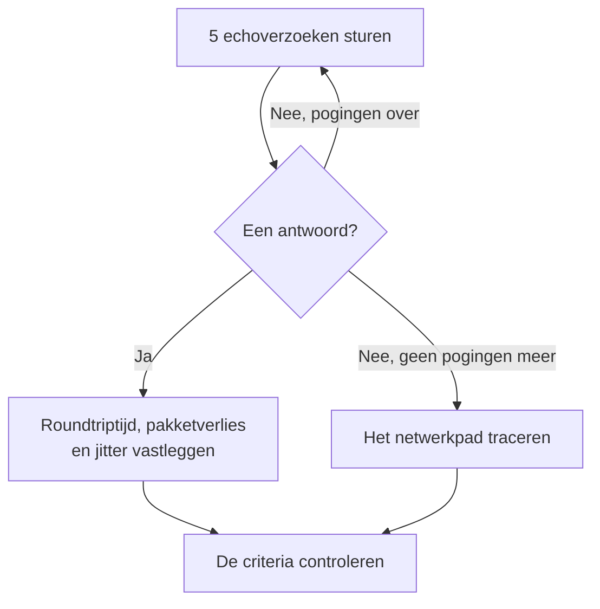

# IP-monitor

Een IP-monitor controleert of een IPv4- of IPv6-adres op ping antwoordt (ICMP-echoverzoeken), en meet de roundtriptijd, het pakketverlies en de jitter. Gebruik hem voor infrastructuur die u kent aan het adres, zoals een gateway, het virtuele IP van een load balancer of een server met een vast adres.

:::cards
- [De monitor maken](#een-ip-monitor-maken): Zes stappen in het dashboard.
- [Configuratieopties](#configuratieopties): Het adres, de time-out en nieuwe pogingen.
- [Bewakingscriteria](#bewakingscriteria): Bereikbaarheid, latentie, pakketverlies en jitter.
- [Problemen oplossen](#problemen-oplossen): Wanneer het adres bereikbaar is maar de monitor offline meldt.
:::

## Hoe het werkt

Een IP-monitor voert dezelfde controle uit als een [pingmonitor](/docs/monitor/ping-monitor). Bij elke controle stuurt een sonde vijf echoverzoeken naar het adres. Komt er minstens één antwoord terug, dan is het adres online, en legt de sonde de gemiddelde roundtriptijd vast als reactietijd, samen met het pakketverlies, de jitter en het snelste en traagste antwoord. Komt er geen antwoord terug, dan probeert de sonde het opnieuw, tot het aantal nieuwe pogingen dat u toestaat. Daarna haalt OneUptime het resultaat door de criteria van de monitor.

Wanneer een controle mislukt, traceert de sonde ook de route naar het adres, en voegt wat ze vond aan het resultaat toe als **Network Path at Time of Failure**, zodat u ziet waar de route brak.

Welke u gebruikt:

| Monitor | Neemt | Gebruik hem wanneer |
| --- | --- | --- |
| **IP** | Alleen een IP-adres | Het adres zelf is wat u bewaakt, en het verandert niet. |
| [Ping](/docs/monitor/ping-monitor) | Een hostnaam of een IP-adres | U kent de host bij naam; de naam wordt bij elke controle opgezocht, zodat de monitor DNS-wijzigingen volgt. |

> [!NOTE]
> Sommige hostingproviders blokkeren ICMP op de machines waarop een sonde draait. Een sonde die helemaal geen pings kan versturen, controleert in plaats daarvan TCP-poort `80` op het adres, zodat de monitor toch zegt of het bereikbaar is. Pakketverlies en jitter worden dan niet gemeten.

Een sonde die haar eigen netwerkverbinding kwijt is, meldt geen resultaat, en kan uw adres dus niet als offline markeren.

## Voordat u begint

- **Een rol die monitoren mag maken**: Project Owner, Project Admin, Project Member, Monitor Admin of Monitor Member, of een aangepaste rol met de machtiging Create Monitor.
- **Een sonde die het adres kan bereiken**, met ICMP toegestaan onderweg. De standaardsondes van uw project worden voor elke nieuwe monitor gekozen. Staat er een firewall voor, sta dan ICMP-echoverzoeken toe van de [IP-adressen van de sondes van OneUptime Cloud](/docs/configuration/ip-addresses). Een privéadres heeft een [aangepaste sonde](/docs/probe/custom-probe) in dat netwerk nodig, en een IPv6-adres een sonde met IPv6-connectiviteit.

## Een IP-monitor maken

:::steps
### Een nieuwe monitor beginnen

Ga naar **Monitoren** en klik op **Monitor maken**. Klik onder **Monitortype** op **Meer monitortypen** en kies **IP** onder **Basic Monitoring**.

### Hem een naam geven

Vul een **Naam** in, zoals `Office gateway`, en klik dan op **Volgende**.

### Het adres invullen

Vul onder **IP-adres** het IPv4- of IPv6-adres in dat gecontroleerd moet worden, zoals `192.168.1.1` of `2001:db8::1`. Een hostnaam wordt niet geaccepteerd: het veld toont een fout. Om een host bij naam te pingen, gebruikt u een [pingmonitor](/docs/monitor/ping-monitor).

### Hem testen

Klik op **Monitor testen**, kies een sonde onder **Selecteer sonde** en klik op **Test uitvoeren**. **Testresultaat van monitor** toont de roundtriptijden en het pakketverlies dat de sonde zag.

### De criteria nakijken

**Monitorcriteria** begint met de [standaardcriteria](#standaardcriteria): offline wanneer het adres niet antwoordt, online wanneer het wel antwoordt. Wijzig ze indien nodig en klik dan op **Volgende**.

### Sondes kiezen en maken

Houd of wijzig de **Sondes** en het **Bewakingsinterval** (het begint bij **Elke 5 minuten**) en klik dan op **Monitor maken**. De pagina van de monitor opent.
:::

## Configuratieopties

| Veld | Standaard | Wat u invult |
| --- | --- | --- |
| **IP-adres** | Geen | Een IPv4-adres, zoals `192.168.1.1`, of een IPv6-adres, zoals `2001:db8::1`. Haken rond een IPv6-adres worden verwijderd. |
| **Aanvraagtime-out (seconden)** (onder **Meer velden**) | `60` | Hoe lang er bij elke poging op een antwoord wordt gewacht. Het maximum is 60 seconden. |
| **Nieuwe pogingen bij mislukking** (onder **Meer velden**) | Standaard van de sonde, meestal `3` | Hoe vaak een mislukte poging opnieuw wordt geprobeerd. Het maximum is 3. |

**Nieuwe pogingen bij mislukking** telt de nieuwe pogingen _na_ de eerste poging, dus `0` voert de controle één keer uit en `2` tot drie keer. Leeg gelaten gebruikt het de standaard van de sonde: 3, tenzij `PROBE_MONITOR_RETRY_LIMIT` van de sonde iets anders zegt. Elke fout wordt opnieuw geprobeerd, time-outs inbegrepen, met een pauze van één seconde tussen pogingen. Ook een geslaagde controle waarvan de antwoorden langer dan 10 seconden duurden, wordt opnieuw gecontroleerd.

## Bewakingscriteria

Criteria bepalen wanneer het adres als online, verminderd of offline telt, en of dat een incident meldt of een waarschuwing maakt. Elk criterium controleert een of meer filters:

| Filter | Voorwaarden | Wat het controleert |
| --- | --- | --- |
| **Is Online** | **Waar**, **Onwaar** | Of minstens één echoverzoek een antwoord kreeg. |
| **Reactietijd (in ms)** | **Greater Than**, **Less Than**, **Greater Than Or Equal To**, **Less Than Or Equal To** | De gemiddelde roundtriptijd van de antwoorden. |
| **Packet Loss (in %)** | **Greater Than**, **Less Than**, **Greater Than Or Equal To**, **Less Than Or Equal To** | Het deel van de vijf echoverzoeken dat geen antwoord kreeg. |
| **Jitter (in ms)** | **Greater Than**, **Less Than**, **Greater Than Or Equal To**, **Less Than Or Equal To** | De standaardafwijking van de roundtriptijden over de pakketten van één controle. |
| **Is Request Timeout** | **Waar**, **Onwaar** | Of de ping bij elke poging een time-out bereikte. |

Bij twee of meer filters bepaalt **Overeenkomstvoorwaarde** of **Alle** moeten overeenkomen of dat **Elke** afzonderlijke filter volstaat. De **Acties** van een criterium bepalen wat het doet: de monitorstatus wijzigen, een waarschuwing maken, een incident melden, of meerdere daarvan.

### Standaardcriteria

Een nieuwe IP-monitor begint met twee criteria:

- **Offline** — het adres beantwoordt geen van de echoverzoeken, of is na alle nieuwe pogingen helemaal niet bereikbaar. De monitor wordt als **Offline** gemarkeerd en er wordt een incident met de naam "_monitor name_ is offline" gemaakt. Het incident lost zichzelf op wanneer het adres weer antwoordt.
- **Bereikbaar** — het adres antwoordt. De monitor wordt als **Operationeel** gemarkeerd.

Criteria worden van boven naar beneden gecontroleerd, en het eerste dat overeenkomt bepaalt wat er gebeurt. Komt er geen overeen, dan toont de monitor zijn standaardstatus: **Operationeel**, tenzij u onder **Meer velden** onder de criteria een andere kiest.

### Over een periode evalueren

**Evalueer deze criteria over een bepaalde periode** is een selectievakje onder een filter, aangeboden voor **Is Online**, **Reactietijd (in ms)**, **Packet Loss (in %)** en **Jitter (in ms)**. Zet het aan om een venster van eerdere controles te beoordelen in plaats van alleen de laatste: kies een aggregatie onder **Evalueren** en een venster, van 2 tot 60 minuten, onder **Voor de laatste (in minuten)**.

| Aggregatie | Komt overeen wanneer |
| --- | --- |
| **Gemiddelde**, **Som**, **Maximum Value**, **Minimum Value** | Dat getal, over het venster, aan de voorwaarde voldoet. Alleen numerieke filters. |
| **All Values** | Elke controle in het venster aan de voorwaarde voldoet. |
| **Any Value** | Minstens één controle in het venster aan de voorwaarde voldoet. |

**All Values** komt pas overeen wanneer het venster echt met gegevens gevuld is. Een monitor die net is gemaakt, of een waarvan de controles niet meer werden vastgelegd, heeft niet genoeg geschiedenis om iets over de laatste N minuten te zeggen, dus het criterium wacht in plaats van overeen te komen op de ene meting die het heeft. **Any Value** is de instelling voor "laat het me weten zodra één controle de grens overschrijdt" en slaat nog steeds meteen aan.

**Als geen gegevens** bepaalt wat er gebeurt zolang het venster het criterium niet kan onderbouwen:

| Optie | Wat er gebeurt | Gebruik het voor |
| --- | --- | --- |
| **Ignore** (standaard) | Het criterium komt niet overeen. | Gewone drempelwaarschuwingen. |
| **Trigger** | De ontbrekende gegevens tellen als het probleem. | Controles waarbij stilte zelf een storing is. |
| **Treat As Zero** | Het venster wordt vergeleken als één nul. | Tellers waarbij geen gebeurtenissen echt nul betekent. |

### Voorbeeldcriteria

| Doel | Filter | Voorwaarde | Waarde |
| --- | --- | --- | --- |
| Offline wanneer het adres onbereikbaar is | **Is Online** | **Onwaar** | — |
| Waarschuwen bij hoge latentie | **Reactietijd (in ms)** | **Greater Than** | `100` |
| Het adres als verminderd markeren op een verbinding met verlies | **Packet Loss (in %)** | **Greater Than** | `20` |
| Waarschuwen bij een instabiele verbinding | **Jitter (in ms)** | **Greater Than** | `30` |

## Problemen oplossen

:::details Het adres is bereikbaar, maar de monitor meldt offline
Het adres, of een firewall ervoor, beantwoordt geen ICMP-echoverzoeken van de sonde. Sta ICMP-echoverzoeken van de sondes toe, of bewaak in plaats daarvan een dienst op dat adres met een [poortmonitor](/docs/monitor/port-monitor). **Network Path at Time of Failure**, bij de mislukte controle, toont hoe ver de route kwam.
:::

:::details Een IPv6-adres mislukt altijd
De sonde die de controle uitvoerde heeft geen IPv6-connectiviteit; de foutmelding zegt dat. Draai de monitor op een sonde met IPv6: zie [Aangepaste probes](/docs/probe/custom-probe).
:::

:::details Pakketverlies en jitter zijn leeg
De sonde die de controle uitvoerde kan geen pings versturen, dus ze controleerde in plaats daarvan TCP-poort `80`, die geen van beide meet. Draai de monitor op een sonde die ICMP mag versturen.
:::

## Volgende stappen

:::cards
- [Ping-monitor](/docs/monitor/ping-monitor): Een host bij naam pingen en DNS-wijzigingen volgen.
- [Poort-monitor](/docs/monitor/port-monitor): Een dienst op het adres controleren, niet alleen het adres.
- [Aangepaste probes](/docs/probe/custom-probe): Privé- en IPv6-adressen vanuit uw eigen netwerk controleren.
- [Incidenten](/docs/incidents/index): Wat er gebeurt nadat de monitor er een meldt.
:::
