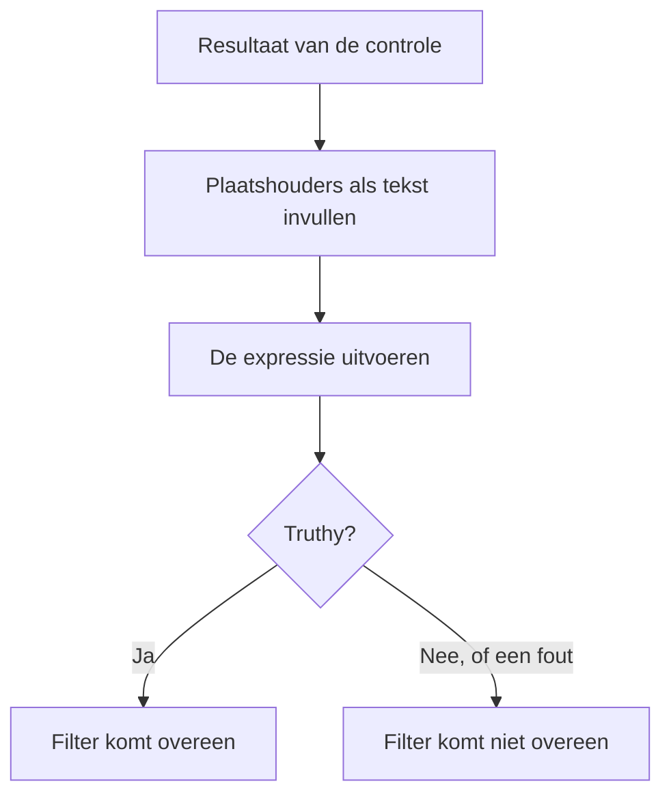

# JavaScript-expressies

Een criteriumfilter **JavaScript Expression** bepaalt met één regel JavaScript in plaats van een vaste vergelijking of aan het criterium van een monitor is voldaan. Gebruik het wanneer de ingebouwde filters de voorwaarde niet kunnen uitdrukken — een veld diep in een JSON-antwoord, twee waarden die met elkaar worden vergeleken, of meerdere controles gecombineerd met `&&` en `||`.

:::cards
- [Hoe het werkt](#hoe-het-werkt): Plaatshouders worden ingevuld, daarna draait de expressie.
- [Variabelen](#variabelen-per-monitortype): Wat elk monitortype u geeft.
- [Voorbeelden](#voorbeelden): Expressies voor API's, inkomende verzoeken en databases.
- [Regels voor aanhalingstekens](#regels-voor-aanhalingstekens): De fout die bijna iedereen maakt.
:::

## Hoe het werkt

Voordat de expressie draait, wordt elke plaatshouder `{{variable}}` erin vervangen door de waarde uit de laatste controle van de monitor — als platte tekst. Het resultaat wordt dan als JavaScript uitgevoerd. Levert het een waarheidsgetrouwe (truthy) waarde op, dan komt het filter overeen; al het andere, ook een fout, betekent dat het niet overeenkomt.



Omdat plaatshouders als tekst worden vervangen, wordt `{{responseBody.item}}` de ruwe waarde. Een tekenreeks moet tussen aanhalingstekens staan om een JavaScript-tekenreeks te zijn; een getal of een boolean niet — zie [Regels voor aanhalingstekens](#regels-voor-aanhalingstekens). Expressies draaien op de OneUptime-server, in een geïsoleerde sandbox.

## Een filter JavaScript Expression toevoegen

:::steps
### De criteria openen

Open bij de monitor **Configuratie → Criteria** en klik op **Bewakingscriteria bewerken**, of gebruik de stap **Criteria** van **Monitor maken**. Werk in het criterium dat u wilt wijzigen, of klik op **Criteria toevoegen** voor een nieuw criterium.

### Een filter toevoegen

Klik onder **Filters** op **Filter toevoegen** en zet het **Filtertype** op **JavaScript Expression**. De **Filtervoorwaarde** is **Evaluates To True**.

### De expressie schrijven

Voer de expressie in bij **Waarde**, met de [variabelen van het monitortype](#variabelen-per-monitortype). De link onder het filter, **Read documentation for using JavaScript expressions here.**, opent deze pagina.

### Opslaan

Sla de monitor op. Het filter wordt bij de volgende controle van de monitor geëvalueerd.
:::

## Variabelen per monitortype

JavaScript-expressies worden aangeboden voor monitoren van het type Website, API, Incoming Request, Incoming Email, SQL Query en Database Health.

### Website- en API-monitoren

| Variabele | Beschrijving | Type |
| --- | --- | --- |
| `responseBody` | De body van het antwoord. Is de body JSON, dan wordt hij geparseerd; anders, zoals bij HTML of XML, is het een tekenreeks. | `string` of `JSON` |
| `responseHeaders` | De headers van het antwoord, met namen in kleine letters. | `Dictionary<string>` |
| `responseStatusCode` | De statuscode van het antwoord. | `number` |
| `responseTimeInMs` | De responstijd in milliseconden. | `number` |
| `isOnline` | Of de monitor het antwoord als online telt. | `boolean` |

### Monitoren voor inkomende verzoeken

| Variabele | Beschrijving | Type |
| --- | --- | --- |
| `requestBody` | De body van het verzoek. | `string` of `JSON` |
| `requestHeaders` | De headers van het verzoek, met namen in kleine letters. | `Dictionary<string>` |

### SQL-querymonitoren

| Variabele | Beschrijving | Type |
| --- | --- | --- |
| `rowCount` | Het aantal rijen dat de query teruggaf. | `number` |
| `scalarValue` | De eerste kolom van de eerste rij. | willekeurig |
| `firstRow` | De eerste rij, als kolom/waarde-paren. | `JSON` |
| `executionTimeInMs` | Hoe lang de query duurde, in milliseconden. | `number` |
| `queryError` | De fout van de query, als die er was. | `string` |
| `isOnline` | Of de database bereikbaar was en de query slaagde. | `boolean` |

### Databasegezondheidsmonitoren

`isOnline`, `engineVersion`, `connectionError`, `collectedGroups`, `unavailableGroups` en `metrics`. Zie [Variabelen voor JavaScript-expressies](/docs/monitor/database-health-monitor#variabelen-voor-javascript-expressies) op de pagina over databasegezondheidsmonitoren.

### Monitoren voor inkomende e-mail

Het filter wordt aangeboden, maar er zijn geen e-mailvelden aan gekoppeld: een expressie kan het onderwerp, de afzender, de body of de ontvanger niet lezen. Gebruik in plaats daarvan de e-mailfiltertypen — zie [Inkomende-e-mail-monitor](/docs/monitor/incoming-email-monitor#beschikbare-criteriumvelden).

## Voorbeelden

Elke regel hieronder is één volledige expressie. Voor een JSON-body van een antwoord zoals deze:

```json
{
  "item": "hello",
  "count": 3,
  "items": [{ "name": "hello" }]
}
```

| Expressie | Komt overeen wanneer |
| --- | --- |
| `"{{responseBody.item}}" === "hello"` | Het veld `item` gelijk is aan `hello`. |
| `{{responseBody.count}} > 2` | Het veld `count` groter is dan 2. |
| `"{{responseBody.items[0].name}}" === "hello"` | Het eerste element van `items` de naam `hello` heeft. |
| `{{responseStatusCode}} === 200 && {{responseTimeInMs}} < 500` | De status 200 is en het antwoord minder dan een halve seconde duurde. |
| `/hel+o/.test("{{responseBody.item}}")` | Het veld `item` overeenkomt met een reguliere expressie. |
| `"{{responseHeaders.content-type}}".startsWith("application/json")` | Het antwoord JSON is. Headernamen zijn in kleine letters. |

Combineer voorwaarden met `&&` en `||`, en groepeer ze met haakjes:

```javascript
({{responseStatusCode}} === 200 || {{responseStatusCode}} === 204) && {{responseTimeInMs}} < 1000
```

Voor een monitor voor inkomende verzoeken die `{"status": "degraded", "region": "eu"}` ontvangt als `Content-Type: application/json`:

```javascript
"{{requestBody.status}}" === "degraded" && "{{requestBody.region}}" === "eu"
```

Voor een SQL-querymonitor waarvan de query een aantal teruggeeft, waarschuwen bij een hoog aantal of een trage query:

```javascript
{{scalarValue}} > 50 || {{executionTimeInMs}} > 2000
```

Lees voor een databasegezondheidsmonitor één metriek door het hele object `metrics` te indexeren — de namen van de reeksen bevatten punten, dus ze kunnen niet tussen de accolades:

```javascript
{{metrics}}['oneuptime.monitor.database.connections.used.percent'] > 90
```

## Regels voor aanhalingstekens

`{{var}}` wordt vervangen door de waarde, als tekst. Zet een tekenreeks die u vergelijkt tussen aanhalingstekens, zoals in `"{{responseBody.item}}" === "hello"`; laat een getal dat u vergelijkt zonder, zoals in `{{responseStatusCode}} === 200`.

| Type waarde | Zo schrijft u het | Voorbeeld |
| --- | --- | --- |
| Tekenreeks | Tussen aanhalingstekens | `"{{responseBody.status}}" === "ok"` |
| Getal | Zonder aanhalingstekens | `{{responseTimeInMs}} < 500` |
| Boolean | Zonder aanhalingstekens | `{{isOnline}} === true` |
| Object of array | Zonder aanhalingstekens, en dan indexeren | `{{responseHeaders}}['content-type']` |

Drie dingen om op te letten:

- **Een plaatshouder die alleen tussen aanhalingstekens staat, is altijd waar.** `"{{responseBody.healthy}}"` is de niet-lege tekenreeks `"false"` wanneer het veld `false` is. Vergelijk hem: `"{{responseBody.healthy}}" === "true"`, of laat hem zonder aanhalingstekens: `{{responseBody.healthy}} === true`.
- **Waarden worden niet ge-escaped.** Een waarde met een dubbel aanhalingsteken of een regeleinde beëindigt de tekenreeks te vroeg, en de expressie mislukt. Gebruik om naar tekst in een HTML-pagina te zoeken in plaats daarvan het filter **Antwoordlichaam**.
- **Een ontbrekend pad blijft zoals het is geschreven.** Heeft de controle zo'n veld niet, dan blijft `{{responseBody.item}}` ongewijzigd in de expressie staan, wat meestal een syntaxisfout is — dus het filter komt niet overeen.

## Beperkingen

Een expressie heeft 5 seconden om te draaien. Een expressie die langer duurt, of een fout gooit, komt niet overeen, en de fout wordt in het serverlogboek van OneUptime geschreven.

## Problemen oplossen

:::details De expressie komt nooit overeen
Controleer eerst de aanhalingstekens: een tekenreeks-plaatshouder zonder aanhalingstekens wordt een los woord, wat een syntaxisfout is, en een fout komt nooit overeen. Controleer daarna of het pad in het resultaat van de controle bestaat — een plaatshouder voor een pad dat er niet is, wordt niet ingevuld.
:::

:::details De expressie komt altijd overeen
Een plaatshouder die alleen tussen aanhalingstekens staat, is een niet-lege tekenreeks, en die is altijd truthy. Vergelijk hem met een waarde.
:::

## Volgende stappen

:::cards
- [Incident- en waarschuwingstemplates](/docs/monitor/incident-alert-templating): Dezelfde plaatshouders gebruiken in titels en beschrijvingen van incidenten.
- [API-monitor](/docs/monitor/api-monitor): Een HTTP-eindpunt en het antwoord ervan controleren.
- [Inkomende-verzoek-monitor](/docs/monitor/incoming-request-monitor): Verzoeken beoordelen die andere systemen naar u sturen.
:::
