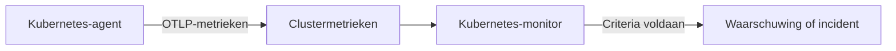

# Kubernetes-monitor

Een Kubernetes-monitor waarschuwt op de metrieken die de OneUptime-Kubernetes-agent vanuit een cluster verstuurt: nodes, pods, containers, workloads, autoscalers en het control plane. Begin met een kant-en-klaar waarschuwingssjabloon, kies één metriek of schrijf uw eigen query, en stel dan de drempel in die een waarschuwing of een incident opent.

:::cards
- [De agent installeren](/docs/monitor/kubernetes-agent): Eén Helm-opdracht brengt het cluster in OneUptime.
- [De monitor maken](#een-kubernetes-monitor-maken): Het cluster kiezen, dan een sjabloon, een metriek of een query.
- [Waarschuwingssjablonen](#kant-en-klare-waarschuwingssjablonen): Zeventien kant-en-klare waarschuwingen, van CrashLoopBackOff tot etcd.
- [Criteria](#bewakingscriteria): Statische drempels en anomaliedetectie.
:::

## Hoe het werkt

De agent stuurt de metrieken van het cluster via OTLP naar OneUptime, elk voorzien van de naam van het cluster (`k8s.cluster.name`, de `clusterName` van de chart). De eerste gegevens onder een nieuwe naam registreren het cluster onder **Kubernetes**, en vanaf dan kan het cluster in een Kubernetes-monitor worden gekozen. Elke minuut bevraagt de monitor die metrieken over zijn **Tijdsbereik**, aggregeert ze en vergelijkt het resultaat met zijn criteria.

## Voordat u begint

- De OneUptime-Kubernetes-agent draait in het cluster. Zie [Kubernetes-agent (Helm-installatie)](/docs/monitor/kubernetes-agent); het cluster verschijnt een paar minuten na de installatie onder **Kubernetes**.
- Voor de control-plane-sjablonen (**etcd No Leader**, **API Server Request Saturation**, **Scheduler Backlog**): het uitlezen van het control plane door de agent, `controlPlane.enabled`. Beheerde clusters (EKS, GKE, AKS) stellen deze endpoints niet beschikbaar, dus daar krijgen die monitors nooit gegevens.

## Een Kubernetes-monitor maken

:::steps
### Een nieuwe monitor beginnen

Ga naar **Monitoren** en klik op **Monitor maken**. Kies onder **Meer monitortypen** het type **Kubernetes** – of typ `k8s` in het zoekvak.

### Het cluster kiezen

Selecteer het in **Kubernetes-cluster**. De lijst bevat elk cluster waaruit de agent heeft gerapporteerd.

### Kiezen wat u bewaakt

Gebruik een van de drie tabbladen:

| Tabblad | Wat u kiest |
| --- | --- |
| **Quick Setup** | Een [kant-en-klaar waarschuwingssjabloon](#kant-en-klare-waarschuwingssjablonen). Het vult de metriek, het bereik, het tijdsbereik en de criteria in; het **Tijdsbereik** kunt u nog wijzigen. |
| **Custom Metric** | Eén metriek uit de [metriekcatalogus](#metriekcatalogus), dan het **Resourcebereik**, de filters, de **Aggregatie** (Gemiddelde, Maximum, Minimum, Som of Aantal) en het **Tijdsbereik**. |
| **Geavanceerd** | Het **Resourcebereik**, de filters en het **Tijdsbereik**, plus uw eigen metriekquery's en formules onder **Selecteer metrieken**, met een live grafiek van het resultaat. |

### De criteria instellen

Stel in wanneer de monitor van status verandert en wanneer hij een waarschuwing of een incident opent – zie [Bewakingscriteria](#bewakingscriteria). Een sjabloon heeft ze al ingevuld: controleer de drempels, de ernstniveaus en het bereikbaarheidsbeleid.

### De monitor opslaan

Maak het formulier af en sla op. De monitor verschijnt onder **Monitoren**, en zijn status volgt uw criteria vanaf de eerste evaluatie.
:::

## Configuratieopties

### Resourcebereik en filters

**Resourcebereik** bepaalt op welk niveau de metriek wordt geëvalueerd, en welke filters het formulier toont. Elk filter is optioneel.

| Bereik | Bewaakt | Filters |
| --- | --- | --- |
| Cluster | Het hele cluster | — |
| Naamruimte | Resources in een naamruimte | **Naamruimte** |
| Werklast | Een deployment, statefulset, daemonset, job of cronjob | **Naamruimte**, **Workloadnaam** |
| Node | Een node van het cluster | **Nodenaam** |
| Pod | Een pod | **Naamruimte**, **Pod-naam** |

### Tijdsbereik

**Tijdsbereik** is het venster dat de metriekquery bij elke evaluatie van de monitor beslaat, van **Past 1 Minute** tot **Past 365 Days**. Korte vensters (1 tot 15 minuten) zijn geschikt voor waarschuwingen; langere vlakken ruisende metrieken af.

### Metriekquery's en formules

Op het tabblad **Geavanceerd** noemt elke query een metriek, hoe de waarden ervan worden geaggregeerd en optionele attribuutfilters. Een **formule** combineert query's met rekenkunde – de sjablonen voor nodebezetting delen bijvoorbeeld het gebruik door de toewijsbare capaciteit.

## Metriekcatalogus

Het tabblad **Custom Metric** biedt deze metrieken aan, gegroepeerd per resourcetype:

| Categorie | Metrieken |
| --- | --- |
| Pod | Pod CPU Usage, Pod Memory Usage, Pod Phase (Code), Pod Filesystem Usage, Pod Memory Limit Utilization, Pod CPU Limit Utilization, Pod Network I/O (Cumulative, Both Directions) |
| Node | Node CPU Usage, Node Allocatable CPU, Node Memory Usage, Node Filesystem Usage, Node Allocatable Memory, Node Ready Condition, Node Filesystem Available |
| Container | Container Restarts, Container CPU Limit, Container CPU Request, Container Memory Limit, Container Memory Request, Container Ready |
| Werklast | Deployment Available Replicas, Deployment Desired Replicas, DaemonSet Misscheduled Nodes, DaemonSet Ready Nodes, StatefulSet Ready Replicas, Job Failed Pods, Job Successful Pods |
| HPA | HPA Current Replicas, HPA Desired Replicas, HPA Max Replicas, HPA Min Replicas |
| Controlevlak | etcd Has Leader, API Server In-Flight Requests, Scheduler Pending Pods |

> [!NOTE]
> **Pod CPU Usage** en **Node CPU Usage** zijn in kernen, niet in procenten: `0.18` is 0,18 van een kern. **Pod Phase (Code)** is een code (1 Pending, 2 Running, 3 Succeeded, 4 Failed, 5 Unknown) – aggregeer hem met Maximum of Minimum, nooit met Som. Control-plane-metrieken komen alleen binnen als het uitlezen van het control plane door de agent aan staat.

## Bewakingscriteria

### Wat wordt geëvalueerd

Deze monitors evalueren altijd de **Metric Value** – de waarde van de geconfigureerde metriekquery of formule. Het criteriaformulier heeft geen keuze voor het filtertype; het toont **Metriek**, **Aggregatie**, **Voorwaarde** en **Threshold**.

### Aggregatietypen

| Aggregatie | Beschrijving |
| --- | --- |
| Gemiddelde | Gemiddelde waarde over het tijdvenster |
| Som | Som van alle waarden |
| Maximum Value | Hoogste waarde in het tijdvenster |
| Minimum Value | Laagste waarde in het tijdvenster |
| All Values | Alle waarden moeten aan het criterium voldoen |
| Any Value | Ten minste één waarde moet overeenkomen |

### Voorwaarden

Statische drempels worden vergeleken met de **Threshold** die u invult: **Greater Than**, **Less Than**, **Greater Than Or Equal To**, **Less Than Or Equal To** en **Equal To**.

Anomaliedetectie ten opzichte van een baseline heeft geen drempel nodig. Kies een van deze voorwaarden, en het formulier toont in plaats daarvan **Gevoeligheid** en **Baseline-venster**:

| Voorwaarde | Komt overeen als de waarde |
| --- | --- |
| **Anomalously High** | Boven het verwachte bereik uitstijgt |
| **Anomalously Low** | Onder het verwachte bereik zakt |
| **Anomalous** | Het verwachte bereik in een van beide richtingen verlaat |

Elke meting wordt vergeleken met een baseline voor hetzelfde uur van de week, opgebouwd uit het **Baseline-venster** (standaard 14 dagen; 28, 60 of 90 dagen). **Gevoeligheid** bepaalt hoe breed het verwachte bereik is: **Laag (4σ — alleen flagrante afwijkingen)**, **Gemiddeld (3σ — aanbevolen)**, de standaard, of **Hoog (2σ — luidruchtiger, zeer stabiele services)**. Anomalievoorwaarden blijven in een "Learning"-status en geven geen waarschuwingen tot er minstens het gekozen baseline-venster aan metriekgeschiedenis is.

**Als geen gegevens**, onder **Meer velden**, bepaalt wat er gebeurt als de query niets teruggeeft in het venster: **Ignore** (de standaard) komt niet overeen, **Trigger** behandelt de stilte als het probleem, en **Treat As Zero** vergelijkt een nul. Tijd waarin OneUptime zelf niet ontving, geldt nooit als ontbrekende gegevens: een controle waarvan het venster zulke tijd bevat, wacht in plaats daarvan, zoals [Als OneUptime geen gegevens ontvangt](/docs/monitor/when-oneuptime-is-not-receiving) uitlegt.

## Kant-en-klare waarschuwingssjablonen

Het tabblad **Quick Setup** toont deze sjablonen, gegroepeerd per categorie. Elk vult twee criteria in: één die de monitor offline markeert en een incident en een waarschuwing opent zolang de voorwaarde geldt, en één die hem weer online zet als ze niet meer geldt.

| Sjabloon | Categorie | Gaat af als | Ernst |
| --- | --- | --- | --- |
| CrashLoopBackOff Detection | Werklast | Een container meer dan 5 keer is herstart sinds zijn pod is gemaakt | Kritiek |
| Pod Stuck in Pending | Plannen | Een pod in elke meting van een venster van 15 minuten in de fase Pending staat | Warning |
| Node Not Ready | Node | Een node NotReady meldt | Kritiek |
| High Node CPU Utilization | Node | Het gemiddelde CPU-gebruik van een node boven 90% van zijn toewijsbare CPU ligt | Warning |
| High Node Memory Utilization | Node | Het gemiddelde geheugengebruik van een node boven 85% van zijn toewijsbare geheugen ligt | Warning |
| Deployment Replica Mismatch | Werklast | Een deployment 15 minuten lang minder beschikbare replica's heeft dan gewenst | Warning |
| Job Failures | Werklast | Een job mislukte pods heeft | Warning |
| etcd No Leader | Controlevlak | etcd geen gekozen leider heeft | Kritiek |
| API Server Request Saturation | Controlevlak | De API-server het hele venster 200 of meer lopende verzoeken vasthoudt | Kritiek |
| Scheduler Backlog | Plannen | De wachtrij met pods in afwachting van de scheduler 5 minuten lang niet leeg is | Warning |
| High Node Disk Usage | Opslag | Het bestandssysteem van een node meer dan 90% vol is | Warning |
| DaemonSet Misscheduled Nodes | Werklast | Een DaemonSet pods draait op nodes die niet meer passen bij zijn nodeselector, affiniteit of toleraties | Warning |
| High Node CPU Request Commitment | Node | De opgetelde CPU-requests van de containers van een node meer dan 90% van zijn toewijsbare CPU bedragen | Warning |
| High Node Memory Request Commitment | Node | De opgetelde geheugen-requests van de containers van een node meer dan 90% van zijn toewijsbare geheugen bedragen | Warning |
| HPA Saturated at Max Replicas | Werklast | Een HPA op 90% of meer van zijn `maxReplicas` draait | Kritiek |
| Pod Memory Saturating Container Limit | Werklast | Een pod meer dan 90% van de geheugenlimiet van zijn containers gebruikt | Kritiek |
| Pod CPU Saturating Container Limit | Werklast | Een pod meer dan 90% van de CPU-limiet van zijn containers gebruikt | Warning |

Sjablonen op metrieken per object evalueren elke node, pod, deployment, job, DaemonSet of HPA afzonderlijk, zodat een cluster met meerdere ongezonde pods een incident per pod krijgt in plaats van één voor het hele cluster.

> [!NOTE]
> **CrashLoopBackOff Detection** leest het aantal herstarts van de container over de hele levensduur van zijn huidige pod, geen tempo. Een container die in een crashlus zat en daarna herstelde, houdt de waarschuwing open tot zijn pod wordt vervangen.

### Oorzaken vangen, niet alleen symptomen

De sjablonen op nodeniveau (High Node CPU Utilization, High Node Memory Utilization, Node Not Ready, Pod Stuck in Pending) gaan af aan het *einde* van een keten van uitputting van resources, als het cluster al verminderd werkt. Drie sjablonen gaan af aan het *begin* ervan, waar meestal de oplossing ligt:

- **Pod Memory Saturating Container Limit** en **Pod CPU Saturating Container Limit** vangen een workload die tegen zijn eigen limieten aan zit. Een geheugenlimiet overschrijden betekent een onmiddellijke OOMKill; een CPU-limiet overschrijden laat de kernel de pod afknijpen, zodat hij trager wordt zonder ooit een fout te geven. Beide zijn de gebruikelijke oorzaak achter CrashLoopBackOff en onverklaarde latentie.
- **HPA Saturated at Max Replicas** vangt een autoscaler zonder speelruimte. Een workload met te lage limieten per pod wordt afgeknepen of beëindigd, wat precies de metriek opblaast waarop de HPA schaalt – dus de autoscaler blijft replica's toevoegen die allemaal even krap zitten, tot hij zijn plafond bereikt. De limieten verhogen is de oplossing; `maxReplicas` verhogen maakt het erger.

Zet ze samen aan in elke naamruimte met een automatisch geschaalde workload: de combinatie onderscheidt "heeft echt meer capaciteit nodig" van "per pod te krap bemeten".

> [!NOTE]
> De twee pod-limietsjablonen delen het gebruik van de pod door de **som** van de limieten van zijn containers, zodat pods met sidecars correct worden gemeten. Het podgeheugen dat de kubelet meldt, bevat terug te winnen paginacache, dus een workload die veel met bestanden werkt, kan hoog op het geheugensjabloon staan zonder ooit een OOMKill te krijgen: lees het als "nadert de limiet", niet als "staat op het punt te worden beëindigd".

## Problemen oplossen

:::details Het cluster staat niet in de lijst Kubernetes-cluster
Clusters registreren zichzelf uit de gegevens van de agent, onder de `clusterName` waarmee de agent is geïnstalleerd. Controleer of de pods van de agent draaien en of het cluster onder **Producten → Infrastructuur → Kubernetes → Alle clusters** staat. [Kubernetes-agent (Helm-installatie)](/docs/monitor/kubernetes-agent) behandelt de installatie en wat u controleert als er geen gegevens binnenkomen.
:::

:::details Een control-plane-sjabloon gaat nooit af
**etcd No Leader**, **API Server Request Saturation** en **Scheduler Backlog** lezen metrieken die alleen het uitlezen van het control plane door de agent verzamelt. Zet `controlPlane.enabled` aan in de Helm-waarden van de agent; standaard staat het uit. Beheerde clusters (EKS, GKE, AKS) stellen deze endpoints niet beschikbaar, dus daar krijgen deze monitors nooit gegevens.
:::

:::details Een CPU-drempel gaat nooit af
**Pod CPU Usage** en **Node CPU Usage** zijn in kernen, niet in procenten, dus een drempel van `80` betekent 80 kernen. Stel de drempel in kernen in, of begin met **High Node CPU Utilization** of **Pod CPU Saturating Container Limit**, die een percentage vergelijken.
:::

:::details CrashLoopBackOff Detection blijft open nadat de pod is hersteld
Het sjabloon leest het aantal herstarts van de container over de hele levensduur van zijn huidige pod, dus het aantal zakt niet meer terug zodra het boven 5 is gekomen. De waarschuwing wordt opgelost als de pod wordt vervangen, bijvoorbeeld door een nieuwe deploy, een eviction of het leegmaken van een node.
:::

## Volgende stappen

:::cards
- [Kubernetes-agent (Helm-installatie)](/docs/monitor/kubernetes-agent): De agent met Helm installeren, bijwerken en afstemmen.
- [Kubernetes-agent](/docs/telemetry/kubernetes-agent): Naamruimtefilters, control-plane-metrieken, filters op logernst en de AI-agent.
- [Metrics-monitor](/docs/monitor/metrics-monitor): Waarschuwen op elke metriek, ook de aangepaste en eBPF-metrieken van de agent.
- [Incident- en waarschuwingstemplates](/docs/monitor/incident-alert-templating): De overtredende pod of node in incidenttitels opnemen.
:::
