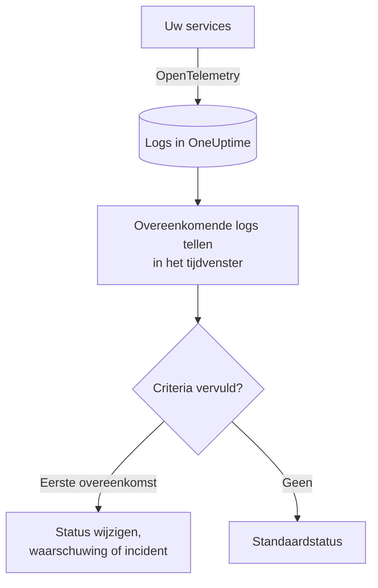
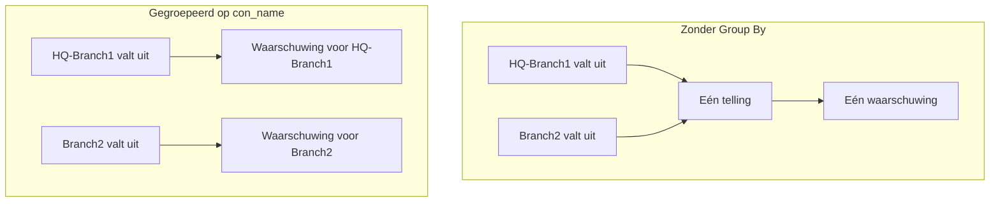

# Logs-monitor

Een logs-monitor telt binnen een tijdvenster de logs die uw services naar OneUptime sturen en die aan uw filters voldoen (tekst, ernst, service, attributen). Wanneer het aantal aan uw criteria voldoet, wijzigt hij de status van de monitor, maakt hij een waarschuwing aan of meldt hij een incident. Gebruik hem om een piek in fouten op te merken, een specifiek foutbericht, of een service die geen logs meer schrijft.

:::cards
- [De monitor maken](#een-logs-monitor-maken): Kies welke logs u telt en wanneer u wordt gewaarschuwd.
- [Hoe hij wordt geëvalueerd](#hoe-hij-wordt-geëvalueerd): Het tijdvenster, de telling en de cyclus van één minuut.
- [Criteria](#criteria): Drempels, anomaliedetectie en de standaardwaarden.
- [Waarschuwingen per groep](#waarschuwingen-per-groep-group-by): Eén waarschuwing per tunnel, gebruiker of interface.
:::

## Hoe het werkt



Elke minuut telt OneUptime de logs die aan de filters van de monitor voldoen en binnen het tijdvenster zijn binnengekomen. Dat aantal vergelijkt het van boven naar beneden met de criteria van de monitor, en het eerste criterium dat overeenkomt, bepaalt wat er gebeurt. Komt er geen overeen, dan gaat de monitor terug naar zijn standaardstatus.

## Voordat u begint

- Uw services sturen logs naar OneUptime via OpenTelemetry (of een andere logbron die OneUptime opneemt). Zie [OpenTelemetry](/docs/telemetry/open-telemetry).
- Om te filteren of te groeperen op een waarde in de logregel, zoals de naam van een tunnel of een gebruiker, maakt u er eerst een attribuut van met een [logboekpipeline](/docs/telemetry/log-pipelines).

## Een logs-monitor maken

:::steps
### Een nieuwe monitor beginnen

Ga naar **Monitoren** en klik op **Monitor maken**.

### Logs kiezen

Klik onder **Monitortype** op **Meer monitortypen** en kies **Logboeken** onder **Telemetrie**, of typ `logs` in het zoekvak. Vul een **Naam** in en klik dan op **Volgende**.

### De te tellen logs kiezen

Stel in **Logmonitorconfiguratie** de velden **Bewaak logboeken die deze tekst bevatten**, **Bewaak logboeken gedurende (time)** en **Logernst** in. Een filter dat u leeg laat, komt met elke log overeen. **Logboekvoorbeeld** onder de filters toont de logs waarmee ze nu overeenkomen.

### Verder verfijnen (optioneel)

Open **Meer velden** om te filteren op telemetrieservice, infrastructuurentiteit of attribuut. Wilt u één waarschuwing per tunnel, gebruiker of interface in plaats van één voor de hele monitor, voeg het attribuut dan toe onder **Group by Attributes** (zie [Waarschuwingen per groep](#waarschuwingen-per-groep-group-by)).

### De criteria instellen

De kaart **Monitorcriteria** begint met twee criteria: offline, met een incident, wanneer er geen logs overeenkomen; online wanneer er minstens één overeenkomt. Pas ze aan op datgene waarvoor u gewaarschuwd wilt worden (zie [Criteria](#criteria)).

### De monitor maken

Klik op **Monitor maken**. De monitor opent op zijn pagina **Overzicht**, en zijn eerste evaluatie volgt binnen een minuut.
:::

## Wat hij opvraagt

| Veld | Waarmee het overeenkomt | Standaard |
| --- | --- | --- |
| **Bewaak logboeken die deze tekst bevatten** | Logs waarvan de body deze tekst bevat, zonder onderscheid tussen hoofd- en kleine letters. | Leeg: elke log |
| **Bewaak logboeken gedurende (time)** | Logs van de laatste 5 seconden tot de laatste 24 uur. | **Laatste 1 minuut** |
| **Logernst** | Logs met een van de gekozen ernstniveaus. | Leeg: elk ernstniveau |
| **Group by Attributes** | Geen filter: telt elke combinatie van waarden van deze attributen apart. | Leeg: één telling |
| **Filteren op telemetrieservice** (onder **Meer velden**) | Logs van een van de gekozen services. | Leeg: elke service |
| **Filter by Infrastructure Entity** (onder **Meer velden**) | Logs van een van de gekozen hosts, pods, containers en andere entiteiten. | Leeg: elke entiteit |
| **Filteren op attributen** (onder **Meer velden**) | Logs waarvan de attributen aan elke voorwaarde voldoen. Elke voorwaarde heeft een eigen operator, zoals "is gelijk aan" of "bevat". | Leeg: geen voorwaarde |

Alle filters die u instelt, moeten overeenkomen voordat een log wordt geteld.

### Ernst van logs

Elke log wordt opgeslagen met een van zeven ernstniveaus. Bij logs van OpenTelemetry komt die uit het ernstnummer van de log, dus kies op ernst en niet op de tekst die uw logger afdrukte:

| Ernst | Ernstnummers van OpenTelemetry |
| --- | --- |
| **Trace** | 1–4 |
| **Debug** | 5–8 |
| **Information** | 9–12 |
| **Warning** | 13–16 |
| **Fout** | 17–20 |
| **Fatal** | 21–24 |
| **Niet gespecificeerd** | Al het andere |

## Hoe hij wordt geëvalueerd

- **Elke minuut.** Een logs-monitor wordt niet door sondes gecontroleerd, dus hij heeft geen interval om in te stellen en geen pagina **Sondes en interval**.
- **Eén getal per evaluatie.** De monitor telt de logs die aan elk filter voldoen en binnen **Bewaak logboeken gedurende (time)** vóór de evaluatie zijn binnengekomen. Met **Laatste 5 minuten** kijkt elke evaluatie vijf minuten terug, dus de vensters van opeenvolgende evaluaties overlappen.
- **Geen logs is een aantal van 0.** Een service die geen logs meer schrijft, levert 0 op, en daar zoekt het standaardcriterium voor offline naar.
- **De onderbreking van OneUptime zelf is geen stilte.** Zolang het tijdvenster tijd bevat waarin OneUptime zelf geen gegevens ontving (het startte opnieuw, werd geüpgraded of werkte een achterstand weg), wacht de controle: de status verandert niet, en er wordt geen incident of waarschuwing geopend of opgelost. Zie [Als OneUptime geen gegevens ontvangt](/docs/monitor/when-oneuptime-is-not-receiving).
- **Criteria van boven naar beneden.** Het eerste criterium dat overeenkomt, beslist, dus zet het ernstigste bovenaan. Een gegroepeerde monitor werkt anders: hij controleert elk criterium voor elke groep (zie [De evaluatie van criteria verschilt](#de-evaluatie-van-criteria-verschilt)).

Elke statuswijziging wordt, met de reden ervan, vastgelegd op de **Statustijdlijn** van de monitor.

## Criteria

De criteria van een logs-monitor hebben één **Filtertype**: **Log Count**, het aantal logs dat in het venster overeenkwam. Kies een **Filtervoorwaarde** en, bij een drempelvoorwaarde, een **Waarde**.

| Filtervoorwaarde | Komt overeen wanneer het aantal logs… |
| --- | --- |
| **Greater Than** | boven de waarde ligt |
| **Greater Than Or Equal To** | gelijk is aan de waarde of hoger |
| **Less Than** | onder de waarde ligt |
| **Less Than Or Equal To** | gelijk is aan de waarde of lager |
| **Equal To** | precies de waarde is |
| **Anomalously High** | boven het verwachte bereik voor dit uur van de week ligt |
| **Anomalously Low** | onder dat bereik ligt |
| **Anomalous** | buiten dat bereik ligt, in welke richting ook |

De anomaliecondities hebben geen **Waarde**. Kies een **Gevoeligheid** (Low, Medium, de standaard, of High) en een **Baseline-venster** van 14 (de standaard), 28, 60 of 90 dagen. OneUptime zet het aantal om in een tempo per minuut en vergelijkt dat met hetzelfde uur van de week over dat venster. De baseline omvat alleen de services en ernstniveaus van de monitor: de tekst- en attribuutfilters horen er niet bij. Zolang dat uur van de week te weinig geschiedenis heeft, is het criterium nog aan het leren en gaat het niet af.

Een nieuwe logs-monitor begint met deze criteria:

| Criterium | Filter | Effect |
| --- | --- | --- |
| Check if … is offline | **Log Count** **Equal To** `0` | Zet de monitor offline en meldt een incident, dat automatisch wordt opgelost |
| Check if … is online | **Log Count** **Greater Than** `0` | Zet de monitor online |

> [!TIP]
> Om gewaarschuwd te worden voor fouten in plaats van voor stilte, zet u **Logernst** op **Fout** en wijzigt u het offline-criterium in **Log Count** **Greater Than** het aantal fouten dat u in het venster accepteert.

## Uitgewerkt voorbeeld: een piek in fouten

U wilt een incident wanneer de checkout-service in vijf minuten meer dan 50 fouten logt:

- **Logernst**: **Fout**
- **Bewaak logboeken gedurende (time)**: **Laatste 5 minuten**
- **Filteren op telemetrieservice**: `checkout`
- Criterium 1: **Log Count** **Greater Than** `50`: de monitor offline zetten en een incident melden
- Criterium 2: **Log Count** **Less Than Or Equal To** `50`: de monitor online zetten

Vier opeenvolgende evaluaties:

| Tijd | Foutlogs in de laatste 5 minuten | Criterium dat overeenkomt | Wat er gebeurt |
| --- | --- | --- | --- |
| 10:00 | 12 | 2 | De monitor is online. |
| 10:01 | 64 | 1 | De monitor gaat offline en er wordt een incident gemeld. |
| 10:02 | 81 | 1 | Blijft offline. Het incident is al open, dus er wordt geen tweede gemeld. |
| 10:06 | 9 | 2 | De monitor is weer online, en het incident lost zichzelf op omdat **Incident automatisch oplossen** aan staat. |

Omdat de vensters overlappen, houdt één uitbarsting van fouten het aantal tot vijf minuten na afloop hoog. Gebruik een korter venster voor een monitor die sneller moet herstellen.

## Waarschuwingen per groep (Group By)

**Group by Attributes** splitst de telling van een logs-monitor op in één telling per afzonderlijke combinatie van attribuutwaarden (één per IPsec-tunnel, per VPN-gebruiker, per firewall-interface) en evalueert de criteria voor elke groep apart. Het is de tegenhanger voor logs van de [Group By](/docs/monitor/metrics-monitor#waarschuwingen-per-reeks-group-by) van een metrics-monitor.

### Eén waarschuwing per groep

Zonder Group By is een monitor die op beëindigde IPsec-tunnels let één enkele telling voor de hele monitor, en geeft hij **één waarschuwing voor de hele monitor**. Zolang die waarschuwing open is, levert het uitvallen van een tweede tunnel niets nieuws op: de monitor waarschuwt al.

Met Group By op de tunnelnaam opent de beëindiging van tunnel `HQ-Branch1` een eigen waarschuwing, en opent de beëindiging van tunnel `Branch2` tien minuten later een **tweede, afzonderlijke waarschuwing** ernaast.



### Onafhankelijk oplossen

De waarschuwing of het incident van elke groep wordt los van de andere opgelost. Zodra een groep niet meer aan de criteria voldoet (`HQ-Branch1` logt binnen het tijdvenster geen beëindigingen meer), wordt de waarschuwing ervan opgelost, terwijl die van `Branch2` open blijft tot ook `Branch2` stopt. Het herstel van de ene groep sluit nooit de waarschuwing van een andere.

Een logs-monitor ziet gebeurtenissen, geen toestanden: de waarschuwing van een groep wordt opgelost zodra die groep een volledig tijdvenster lang niets heeft gelogd dat aan de criteria voldoet, of de tunnel nu weer werkt of niet.

### Voorbeeld: één waarschuwing per Sophos-IPsec-tunnel

Hierbij wordt ervan uitgegaan dat de syslog-regels van de firewall in attributen worden gesplitst met een [Key=Value-parser](/docs/telemetry/log-pipelines#keyvalue-parser), zonder doelprefix, zodat de tunnelnaam het attribuut `con_name` is:

```text
log_component="IPSec" con_name="HQ-Branch1" status="Terminated" message="IPSec Connection HQ-Branch1 between 10.171.4.117 and 10.171.4.118 for Child HQ-Branch1 terminated."
```

:::steps
1. Maak een monitor van het type **Logboeken**.
2. Zet **Bewaak logboeken die deze tekst bevatten** op `terminated` en **Bewaak logboeken gedurende (time)** op **Laatste 5 minuten**.
3. Voeg onder **Meer velden** het attribuutfilter `log_component` = `IPSec` toe.
4. Voeg onder **Group by Attributes** `con_name` toe.
5. Voeg een criterium toe met het filter **Log Count** **Greater Than** `0` dat een waarschuwing of een incident aanmaakt met de titel `IPsec tunnel {{con_name}} terminated`.
:::

Elke tunnel die een beëindiging logt, krijgt nu een eigen waarschuwing (`IPsec tunnel HQ-Branch1 terminated`, `IPsec tunnel Branch2 terminated`), en elke waarschuwing wordt los van de andere opgelost.

### Groepswaarden in titels en beschrijvingen

De waarde van elk Group By-attribuut is een [templatevariabele](/docs/monitor/incident-alert-templating) in de titel, de beschrijving en de herstelnotities van de waarschuwing of het incident, net als de labels van een metriekreeks: groeperen op `con_name` geeft u `{{con_name}}`. Een sleutel met punten wordt als pad gelezen, dus `sophos.con_name` wordt `{{sophos.con_name}}`. Wanneer de titel de groep nog niet noemt, wordt de groep eraan toegevoegd (`IPsec tunnel terminated - Con Name: HQ-Branch1`), en `{{seriesResourceSuffix}}` en `{{seriesResourceSummary}}` werken zoals bij metrics-monitoren.

### Hoe groepen worden geteld

- Tot 10 attributen. Elke afzonderlijke combinatie van hun waarden is een groep.
- Een log zonder een Group By-attribuut wordt voor dat attribuut geteld met een **lege waarde**, dus logs zonder het attribuut vormen een eigen groep, waarvan de waarschuwing er geen waarde voor noemt. Komen alle waarschuwingen binnen zonder groepswaarde, controleer dan de sleutel van het attribuut: een logboekpipeline met een doelprefix slaat `con_name` op als `sophos.con_name`.
- Groepswaarden van meer dan 256 tekens worden ingekort tot 256.
- Per controle worden hoogstens **100 groepen** geëvalueerd: de 100 met de meeste logs. Komen er meer groepen overeen, dan worden de overige bij die controle overgeslagen en wordt er een waarschuwing gelogd; maak de filters van de monitor nauwer om ze te dekken.

### De evaluatie van criteria verschilt

- **Elk criterium wordt geëvalueerd**, net als bij een gegroepeerde metrics-monitor, dus verschillende groepen kunnen tegelijk aan verschillende criteria voldoen. Een groep die aan twee criteria voldoet, krijgt nog steeds één waarschuwing, van het eerste; zet de criteria dus op volgorde van ernstigst naar minst ernstig.
- **Een groep bestaat alleen als hij in het tijdvenster iets heeft gelogd.** Criteria als **Equal To 0** en **Less Than** gaan daarom alleen af voor groepen die minstens één keer hebben gelogd; om gewaarschuwd te worden wanneer logs helemaal niet meer binnenkomen, gebruikt u een monitor zonder Group By.
- **Anomaliedetectie** (**Anomalously High**, **Anomalously Low**, **Anomalous**) wordt niet per groep geëvalueerd (de baseline omvat de hele monitor), dus die filters komen bij een gegroepeerde monitor nooit overeen.
- De status van de monitor volgt het eerste criterium waaraan een groep voldoet. Voldoet geen enkele groep aan een criterium, dan gaat de monitor terug naar zijn standaardstatus.

## Problemen oplossen

:::details De monitor is offline, maar mijn service schrijft wel logs
Het aantal was 0, dus de filters komen met geen enkele log van de service overeen. Open de pagina **Criteria** van de monitor (onder **Configuratie**) en klik op **Edit Monitoring Criteria**: **Logboekvoorbeeld** toont wat de filters nu selecteren. De gebruikelijke oorzaken zijn een ernst gekozen op de tekst die de logger afdrukt in plaats van op het ernstnummer (zie [Ernst van logs](#ernst-van-logs)), een service- of attribuutfilter dat niet overeenkomt, en een tijdvenster dat korter is dan de tijd tussen de logs van de service.
:::

:::details Er was een piek, maar er kwam geen waarschuwing
De criteria worden van boven naar beneden gecontroleerd en de eerste overeenkomst beslist. Een breed criterium boven het criterium dat u verwachtte, zoals **Log Count** **Greater Than** `0`, komt eerst overeen en houdt de rest tegen. Zet het ernstigste criterium bovenaan.
:::

:::details Een anomaliecriterium gaat nooit af
Het is nog aan het leren: het uur van de week waarmee het vergelijkt, heeft nog niet genoeg geschiedenis. Bij een monitor met **Group by Attributes** komen anomaliecondities nooit overeen; gebruik daar een drempel.
:::

:::details Groepswaarschuwingen komen binnen zonder groepswaarde
Logs zonder het Group By-attribuut worden geteld met een lege waarde. Controleer de exacte naam van de sleutel in de logverkenner: een logboekpipeline met een doelprefix slaat `con_name` op als `sophos.con_name`.
:::

## Volgende stappen

:::cards
- [Logboekpipelines](/docs/telemetry/log-pipelines): Splits logregels in attributen om op te filteren en te groeperen.
- [Incident- en waarschuwingstemplates](/docs/monitor/incident-alert-templating): Zet groepswaarden en aantallen in titels en beschrijvingen.
- [Metrics-monitor](/docs/monitor/metrics-monitor): Word gewaarschuwd op een metriek, per host of per container.
- [Traces-monitor](/docs/monitor/traces-monitor): Word op dezelfde manier gewaarschuwd voor mislukte spans.
:::
