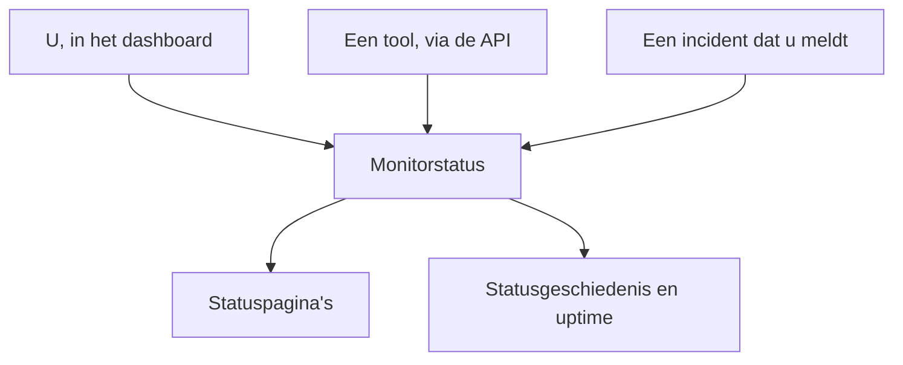

# Handmatige monitor

Een handmatige monitor heeft geen automatische controles: zijn status is wat u instelt, in het dashboard of via de API. Gebruik hem om iets weer te geven dat OneUptime zelf niet kan controleren — een afhankelijkheid van een derde partij, een fysiek systeem, een bedrijfsproces — op uw statuspagina's en in uw incidenten.

:::cards
- [Er een maken](#een-handmatige-monitor-maken): Eén stap in het dashboard.
- [Zijn status wijzigen](#de-status-bijwerken): In het dashboard, of vanuit uw eigen tools via de API.
- [Incidenten en waarschuwingen](#incidenten-en-waarschuwingen): Een incident melden en tegelijk de status instellen.
:::

## Wanneer gebruikt u een handmatige monitor

| Toepassing | Beschrijving |
| --- | --- |
| Diensten van derden | De status volgen van externe diensten waarvan u afhankelijk bent maar die u niet rechtstreeks kunt bewaken. |
| Fysieke infrastructuur | Hardware of fysieke systemen zonder netwerkbewaking weergeven. |
| Bedrijfsprocessen | Niet-technische processen volgen die de status van de dienst beïnvloeden. |
| Status via de API | Uw eigen tools de status laten instellen via de OneUptime-API. |
| Plaatshouders op statuspagina's | Componenten op uw statuspagina tonen die buiten OneUptime worden beheerd. |

Een aanbieder die een statuspagina publiceert, heeft er geen nodig: een [monitor voor een externe statuspagina](/docs/monitor/external-status-page-monitor) volgt die pagina voor u.

## Hoe het werkt

Een handmatige monitor heeft geen bewakingsinterval, sondes of criteria. Zijn status blijft zoals u hem instelt, totdat u, een tool via de API of een incident dat u meldt hem wijzigt — en de nieuwe status verschijnt overal waar de monitor verschijnt.



Elke wijziging is een item op de **Statustijdlijn** van de monitor, zodat zijn uptime en statusgeschiedenis worden bewaard zoals bij elke andere monitor. Een handmatige monitor is geen actieve monitor, dus op OneUptime Cloud voegt hij niets toe aan uw factuur.

## Een handmatige monitor maken

:::steps
### Een nieuwe monitor beginnen

Ga naar **Monitoren** en klik op **Monitor maken**.

### Manual kiezen

Klik onder **Monitortype** op **Meer monitortypen** en kies **Manual** onder **Overig**.

### Een naam geven en maken

Voer een **Naam** in — en desgewenst een **Beschrijving** onder **Meer velden** — en klik op **Monitor maken**. Een handmatige monitor heeft verder niets nodig, dus hij wordt vanuit deze eerste stap gemaakt.
:::

## De status bijwerken

### In het dashboard

:::steps
1. Open de monitor en klik in het zijmenu op **Statustijdlijn**.
2. Klik op **Monitor Status Gebeurtenis aanmaken**.
3. Kies de **Monitorstatus**. **Begint op** is nu; stel een eerder tijdstip in als de wijziging eerder plaatsvond.
4. Klik op **Monitor Status Gebeurtenis aanmaken**. De nieuwe status verschijnt meteen bij de monitor, en op elke statuspagina die hem toont.
:::

### Via de API

Stuur de nieuwe status als een statusgebeurtenis van de monitor, met een [API-sleutel](/docs/api-reference/api-reference) van uw project in de header `ApiKey`:

```bash
curl -X POST https://oneuptime.com/api/monitor-status-timeline \
  -H "ApiKey: $ONEUPTIME_API_KEY" \
  -H "Content-Type: application/json" \
  -d '{"data": {"monitorId": "<monitor id>", "monitorStatusId": "<monitor status id>"}}'
```

- `monitorId` is de ID van de monitor: klik op de regel **ID** op zijn pagina om die te kopiëren.
- `monitorStatusId` is de status die u instelt: kies onder **Monitoren → Instellingen → Monitorstatus** de optie **ID weergeven** in de rij van die status.
- `startsAt` is optioneel. Laat u het weg, dan begint de wijziging nu.
- Stuur het verzoek bij een zelf gehoste installatie naar uw eigen host in plaats van naar `oneuptime.com`.

Het versturen van de status die de monitor al heeft, wordt geweigerd met `Monitor Status cannot be same as previous status.` en legt niets vast, dus een tool die bij elke run rapporteert, kan dat antwoord negeren.

## Incidenten en waarschuwingen

Een handmatige monitor wordt overal waar monitoren worden gekozen, gekozen zoals elke andere:

- Meld een incident en kies de monitor onder **Monitoren**. Met **Monitorstatus wijzigen naar** stelt het melden ook de status van de monitor in, en het oplossen zet de monitor terug op operationeel, tenzij er nog een ander incident op openstaat. Zie [Een incident melden](/docs/incidents/declaring-incidents#stap-2-getroffen-middelen).
- Maak er een waarschuwing over aan, voor een probleem dat uw team moet aanpakken zonder uw klanten in te lichten.
- Voeg hem toe aan een statuspagina, om klanten een afhankelijkheid te tonen die u met de hand bijhoudt.

## Volgende stappen

:::cards
- [Een monitor maken](/docs/monitor/create-monitor): De monitortypen die dingen voor u controleren.
- [Externe-statuspagina-monitor](/docs/monitor/external-status-page-monitor): In plaats daarvan automatisch de statuspagina van een aanbieder volgen.
- [Statuspagina's – Overzicht](/docs/status-pages/index): De status van de monitor aan uw klanten tonen.
:::
