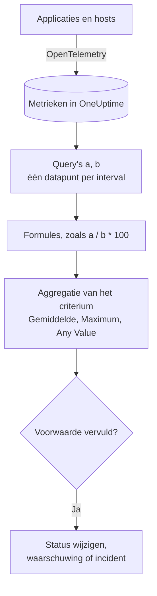

# Metrics-monitor

Een metrics-monitor vraagt de metrieken op die uw applicaties en infrastructuur naar OneUptime sturen, combineert ze met formules wanneer u een verhouding of een totaal nodig hebt, en vergelijkt het resultaat over een voortschrijdend tijdsbereik met uw criteria. Gebruik hem voor aantallen verzoeken, foutverhoudingen, wachtrijdieptes, CPU, geheugen en schijf (elke numerieke reeks), met één waarschuwing per host of per container wanneer u hem groepeert.

:::cards
- [De monitor maken](#een-metrics-monitor-maken): Query's, formules, een tijdsbereik en criteria.
- [Hoe hij wordt geëvalueerd](#hoe-hij-wordt-geëvalueerd): Datapunten, formules en de aggregatie van de criteria.
- [Uitgewerkt voorbeeld](#uitgewerkt-voorbeeld-een-groeiende-wachtrij): Dezelfde gegevens onder elke aggregatie.
- [Waarschuwingen per reeks](#waarschuwingen-per-reeks-group-by): Eén waarschuwing per host, container of koppelpunt.
:::

## Hoe het werkt

Elke minuut voert OneUptime elke metriekquery van de monitor uit over het tijdsbereik ervan. Een query levert één datapunt per tijdsinterval op, en formules combineren de query's interval voor interval. Elk criterium brengt vervolgens de datapunten van de query of formule die het controleert terug tot één uitkomst (hun gemiddelde, hun maximum of een test van elk punt) en vergelijkt die met zijn drempel.

## Voordat u begint

- Uw applicaties of infrastructuur sturen metrieken naar OneUptime via OpenTelemetry. Zie [OpenTelemetry](/docs/telemetry/open-telemetry).
- Ken de naam van de metriek en de attributen waarop u wilt filteren of groeperen. De lijsten **Metriek** en **Group by** bieden alleen namen en attributen die OneUptime al heeft ontvangen.

## Een metrics-monitor maken

:::steps
### Een nieuwe monitor beginnen

Ga naar **Monitoren** en klik op **Monitor maken**.

### Metrics kiezen

Klik onder **Monitortype** op **Meer monitortypen** en kies **Metrieken** onder **Telemetrie**, of typ `metrics` in het zoekvak. Vul een **Naam** in en klik dan op **Volgende**.

### Het tijdsbereik kiezen

Kies in **Metriekmonitorconfiguratie** een **Tijdsbereik**: hoe ver elke evaluatie terugkijkt. Het begint op **Past 1 Minute**.

### De metriekquery's toevoegen

Kies onder **Selecteer metrieken** een **Metriek** en hoe u die aggregeert met **Aggregate by**. Open **Filters & grouping** om op attributen te filteren of om te groeperen met **Group by**. Klik op **Metriek toevoegen** voor nog een query, of op **Formule toevoegen** om ze te combineren. De grafiek onder de query's toont een voorbeeld van het tijdsbereik, zodat u de waarden ziet die de criteria gaan controleren.

### De criteria instellen

In **Monitorcriteria** kiest elk criterium de te controleren **Metriek** (een query of een formule), zijn **Aggregatie**, een **Voorwaarde** en een **Threshold**. Zie [Criteria](#criteria) voor de criteria waarmee een nieuwe monitor begint.

### De monitor maken

Klik op **Monitor maken**. De monitor opent op zijn pagina **Overzicht**, en zijn eerste evaluatie volgt binnen een minuut.
:::

## Wat hij opvraagt

### Metriekquery's

| Veld | Wat het doet | Standaard |
| --- | --- | --- |
| **Metriek** | De metriek die wordt opgevraagd. | Verplicht |
| **Aggregate by** | Hoe de waarden in elk tijdsinterval tot één datapunt worden gecombineerd: Gem., Som, Min, Max, Aantal, of een percentiel (P50, P75, P90, P95 of P99). | Gem. |
| **Filter by attributes** (onder **Filters & grouping**) | Alleen reeksen waarvan de attributen aan deze voorwaarden voldoen. | Geen filter |
| **Group by** (onder **Filters & grouping**) | Eén reeks per unieke waarde van deze attributen (zie [Waarschuwingen per reeks](#waarschuwingen-per-reeks-group-by)). | Eén reeks |

Elke query en formule krijgt een variabele (`a`, `b`, `c` enzovoort), in de volgorde waarin u ze toevoegt.

### Formules

Een formule combineert queryvariabelen met `+`, `-`, `*`, `/`, `%`, `^` en haakjes, interval voor interval. U kunt de variabelen met of zonder een `$` ervoor schrijven:

- `a / b * 100`: het aandeel van `b` dat `a` is, als percentage
- `a + b`: twee metrieken bij elkaar opgeteld
- `a - b`: het verschil ertussen

### Voortschrijdend tijdvenster

**Tijdsbereik** bepaalt hoe ver elke evaluatie terugkijkt: **Past 1 Minute**, **Past 5 Minutes**, **Past 10 Minutes**, **Past 15 Minutes**, **Past 30 Minutes**, **Past 1 Hour**, **Past 2 Hours**, **Past 3 Hours**, **Past 6 Hours**, **Past 12 Hours**, **Past 1 Day**, **Past 2 Days**, **Past 3 Days**, **Past 7 Days**, **Past 14 Days**, **Past 30 Days**, **Past 60 Days**, **Past 90 Days**, **Past 180 Days** of **Past 365 Days**.

Hoe langer het bereik, hoe breder elk tijdsinterval, dus één datapunt staat voor meer tijd:

| Tijdsbereik | Eén datapunt per |
| --- | --- |
| Past 1 Minute tot Past 3 Hours | minuut |
| Past 6 Hours, Past 12 Hours | 5 minuten |
| Past 1 Day | 15 minuten |
| Past 2 Days, Past 3 Days | 30 minuten |
| Past 7 Days | uur |
| Past 14 Days, Past 30 Days | dag |
| Past 60 Days tot Past 180 Days | week |
| Past 365 Days | maand |

## Hoe hij wordt geëvalueerd

- **Elke minuut.** Een metrics-monitor wordt niet door sondes gecontroleerd, dus hij heeft geen interval om in te stellen en geen pagina **Sondes en interval**.
- **Eerst de query's, dan de formules.** Elke query levert één datapunt per tijdsinterval van het tijdsbereik op, volgens zijn **Aggregate by**. Formules worden voor elk interval berekend uit de datapunten van de query's.
- **Dan de aggregatie van het criterium.** Elk criterium brengt de datapunten van zijn **Metriek** terug tot wat het met de drempel vergelijkt:

| Aggregatie | De voorwaarde wordt getoetst aan… |
| --- | --- |
| Gemiddelde | het gemiddelde van de datapunten |
| Som | de som van de datapunten |
| Maximum Value | het hoogste datapunt |
| Minimum Value | het laagste datapunt |
| All Values | elk datapunt: ze moeten allemaal aan de voorwaarde voldoen |
| Any Value | elk datapunt: het is genoeg als er één aan de voorwaarde voldoet |

- **Criteria van boven naar beneden.** Bij een monitor zonder Group By beslist het eerste criterium dat overeenkomt, dus zet het ernstigste bovenaan. Een gegroepeerde monitor controleert elk criterium voor elke reeks (zie [De evaluatie van criteria verschilt](#de-evaluatie-van-criteria-verschilt)).
- **Geen gegevens is niet nul.** Wanneer de query in het tijdsbereik geen datapunten oplevert, doet een criterium wat zijn instelling **Als geen gegevens** zegt, onder **Meer velden**: **Ignore** (de standaard: het criterium komt niet overeen), **Treat As Zero** of **Trigger**.
- **De onderbreking van OneUptime zelf is geen stilte.** Zolang het tijdsbereik tijd bevat waarin OneUptime zelf geen gegevens ontving (het startte opnieuw, werd geüpgraded of werkte een achterstand weg), wacht de controle: de status verandert niet, en er wordt geen incident of waarschuwing geopend of opgelost, wat **Als geen gegevens** ook zegt. Zie [Als OneUptime geen gegevens ontvangt](/docs/monitor/when-oneuptime-is-not-receiving).

## Criteria

Deze monitoren evalueren altijd de **Metric Value**: de geaggregeerde waarde van de ingestelde metriekquery of formule. Het criteriaformulier heeft geen keuzelijst voor het filtertype; het toont **Metriek**, **Aggregatie**, **Voorwaarde** en **Threshold**. Heeft de metriek een eenheid, kies dan de eenheid van de drempel ernaast.

| Voorwaarde | Komt overeen wanneer de waarde… |
| --- | --- |
| **Greater Than** | boven de drempel ligt |
| **Greater Than Or Equal To** | gelijk is aan de drempel of hoger |
| **Less Than** | onder de drempel ligt |
| **Less Than Or Equal To** | gelijk is aan de drempel of lager |
| **Equal To** | precies de drempel is |
| **Anomalously High** | boven het verwachte bereik voor dit uur van de week ligt |
| **Anomalously Low** | onder dat bereik ligt |
| **Anomalous** | buiten dat bereik ligt, in welke richting ook |

De anomaliecondities hebben geen drempel. Het formulier toont in plaats daarvan **Gevoeligheid** (Low, Medium, de standaard, of High) en **Baseline-venster** (14 dagen, de standaard, 28, 60 of 90), en vergelijkt elk datapunt met de baseline voor hetzelfde uur van de week die uit dat venster is opgebouwd. Zolang dat uur van de week te weinig geschiedenis heeft, is het criterium nog aan het leren en levert het geen waarschuwingen op.

Een nieuwe metrics-monitor begint met twee criteria op zijn eerste query, allebei met de aggregatie **Any Value**:

| Criterium | Voorwaarde | Effect |
| --- | --- | --- |
| Check if … is offline | **Equal To** `0` | Zet de monitor offline en meldt een incident, dat automatisch wordt opgelost |
| Check if … is online | **Greater Than** `0` | Zet de monitor online |

> [!NOTE]
> Het offline-criterium gaat af op een gerapporteerde waarde van 0, niet op stilte. Om gewaarschuwd te worden wanneer een metriek niet meer binnenkomt, zet u de **Als geen gegevens** ervan op **Trigger**.

## Uitgewerkt voorbeeld: een groeiende wachtrij

U wilt een incident wanneer de checkout-wachtrij diep blijft. Query `a` is de gauge `checkout.queue.depth`, met **Aggregate by** Max, en het **Tijdsbereik** is **Past 5 Minutes**. Eén evaluatie ziet deze vijf datapunten van één minuut:

| Minuut | 10:01 | 10:02 | 10:03 | 10:04 | 10:05 |
| --- | --- | --- | --- | --- | --- |
| `a` | 640 | 980 | 1.500 | 1.620 | 1.100 |

Een criterium met **Metriek** `a`, **Voorwaarde** **Greater Than** en **Threshold** `1000` geeft voor elke **Aggregatie** een ander antwoord:

| Aggregatie | Vergeleken met 1.000 | Overeenkomst? |
| --- | --- | --- |
| Gemiddelde | 1.168 | Ja |
| Som | 5.840 | Ja |
| Maximum Value | 1.620 | Ja |
| Minimum Value | 640 | Nee |
| All Values | 640, 980, 1.500, 1.620, 1.100 | Nee: twee punten liggen niet boven 1.000 |
| Any Value | 640, 980, 1.500, 1.620, 1.100 | Ja: 1.500 wel |

**Gemiddelde** waarschuwt bij een aanhoudende achterstand en negeert één diepe minuut; **All Values** wacht tot elke minuut in het bereik diep is; **Any Value** waarschuwt bij de eerste diepe minuut.

## Waarschuwingen per reeks (Group By)

**Group by** op een metriekquery splitst die query op in één reeks per unieke attribuutwaarde (één per host, één per container, één per koppelpunt), en een monitor met Group By evalueert elke reeks afzonderlijk. Die ene instelling is het verschil tussen "de vloot is ongezond" en "`prod-db-01` is ongezond".

### Eén waarschuwing per groep

Met Group By op `host.name` geeft een monitor voor schijfgebruik die vijftig hosts bewaakt **één waarschuwing (of incident) per host die de drempel overschrijdt**. Host A die volloopt, opent een eigen waarschuwing; host B die tien minuten later volloopt, opent er een tweede, afzonderlijke waarschuwing naast.

Zonder Group By is dezelfde monitor één scalair: de query voegt alle hosts samen tot één getal en de monitor geeft **één waarschuwing voor de hele monitor**. Zolang die waarschuwing open is, levert een tweede host die de drempel overschrijdt niets op (de monitor waarschuwt al, dus er is niets nieuws om te melden) en hoort de engineer van dienst nooit van host B. **Group By instellen is de manier om waarschuwingen per host te krijgen.** Wilt u per host, per container of per koppelpunt gewaarschuwd worden, stel het dan in.

### Onafhankelijk oplossen

Elke waarschuwing per groep volgt haar eigen groep. Wanneer host A weer onder de drempel zakt, wordt diens waarschuwing vanzelf opgelost, en de waarschuwing van host B blijft open tot host B herstelt. Het herstel van de ene groep sluit nooit de waarschuwing van een andere.

### De evaluatie van criteria verschilt

- **Gegroepeerde monitoren evalueren elk criterium.** Ernstniveaus kunnen daardoor tegelijk bij verschillende groepen afgaan: met "Critical: groter dan 95" boven "Warning: groter dan 80" opent een host op 96% een kritieke waarschuwing terwijl een host op 85% bij dezelfde controle een gewone waarschuwing opent. Een host die beide niveaus overschrijdt, krijgt nog steeds precies één waarschuwing, van het eerste criterium dat overeenkomt, dus **zet de criteria op volgorde van ernstigst naar minst ernstig**.
- **Niet-gegroepeerde monitoren stoppen bij het eerste criterium dat overeenkomt.** Alleen dat ene criterium gaat af, nog een reden om het waarschuwingscriterium boven het gezonde te zetten: een breed gezond criterium bovenaan komt bij bijna elke controle overeen en zorgt dat het waarschuwingscriterium eronder nooit wordt geëvalueerd.

| Host | Schijf gebruikt | Critical (> 95) | Warning (> 80) | Gegeven waarschuwing |
| --- | --- | --- | --- | --- |
| `prod-db-01` | 96% | Ja | Ja | Critical |
| `prod-db-02` | 85% | Nee | Ja | Warning |
| `prod-db-03` | 40% | Nee | Nee | Geen |

### Een attribuut kiezen om op te groeperen

Groepeer op een attribuut dat echt iets afzonderlijks aanduidt waarvoor u iemand zou oproepen: het host-attribuut voor een hostmetriek van de hele vloot, het container- of pod-attribuut voor een containermetriek, het koppelpunt- of apparaat-attribuut voor een metriek van een bestandssysteem of van schijf-I/O, het interface-attribuut voor een netwerkmetriek. De keuzelijst **Group by** wordt gevuld met de attributen die uw collector echt stuurt, dus kies uit de lijst in plaats van een sleutel met de hand te typen.

Groepeer geen metriek die al één scalair voor het hele systeem is (een leidersvlag voor het hele cluster, een achterstand van de scheduler, of de CPU van één host in een monitor voor één host). Zulke metrieken groeperen levert precies één reeks op en verandert niets behalve de titels van de waarschuwingen.

De waarden van het groeperingsattribuut zijn ook beschikbaar als [templatevariabelen](/docs/monitor/incident-alert-templating) in de titel, de beschrijving en de herstelnotities van de waarschuwing of het incident: groeperen op `host.name` laat de titel `Disk almost full on {{host.name}}` luiden.

## Problemen oplossen

:::details De grafiek toont een overschrijding, maar de monitor waarschuwde niet
Controleer eerst de **Aggregatie** van het criterium: **All Values** komt alleen overeen wanneer elk datapunt in het tijdsbereik de drempel overschrijdt, en **Gemiddelde** vlakt een korte piek af. Controleer daarna of de **Metriek** van het criterium de query of formule is die u bedoelt (`a` is niet de formule `c`), en of de drempel in de eenheid staat die u denkt.
:::

:::details De metriek kwam niet meer binnen en er gebeurde niets
Een tijdsbereik zonder datapunten is geen waarde van 0. Met **Als geen gegevens** op de standaardwaarde, **Ignore**, komt het criterium niet overeen. Zet het op **Trigger** onder **Meer velden** van het criterium om gewaarschuwd te worden bij stilte.
:::

:::details Ik krijg één waarschuwing voor de hele vloot
De query heeft geen **Group by**, dus alle hosts worden samengevoegd tot één getal. Groepeer de query op het host-, container- of koppelpunt-attribuut (zie [Waarschuwingen per reeks](#waarschuwingen-per-reeks-group-by)).
:::

:::details Een anomaliecriterium gaat nooit af
Het is nog aan het leren: het uur van de week waarmee het vergelijkt, heeft binnen het **Baseline-venster** nog niet genoeg geschiedenis.
:::

## Volgende stappen

:::cards
- [Incident- en waarschuwingstemplates](/docs/monitor/incident-alert-templating): Zet de host en de waarde in de titels van waarschuwingen.
- [Logs-monitor](/docs/monitor/logs-monitor): Word gewaarschuwd op het volume en de inhoud van logs, per groep.
- [Host-monitor](/docs/monitor/host-monitor): Kant-en-klare controles van CPU, geheugen en schijf voor uw hosts.
- [OpenTelemetry](/docs/telemetry/open-telemetry): Stuur metrieken naar OneUptime.
:::
