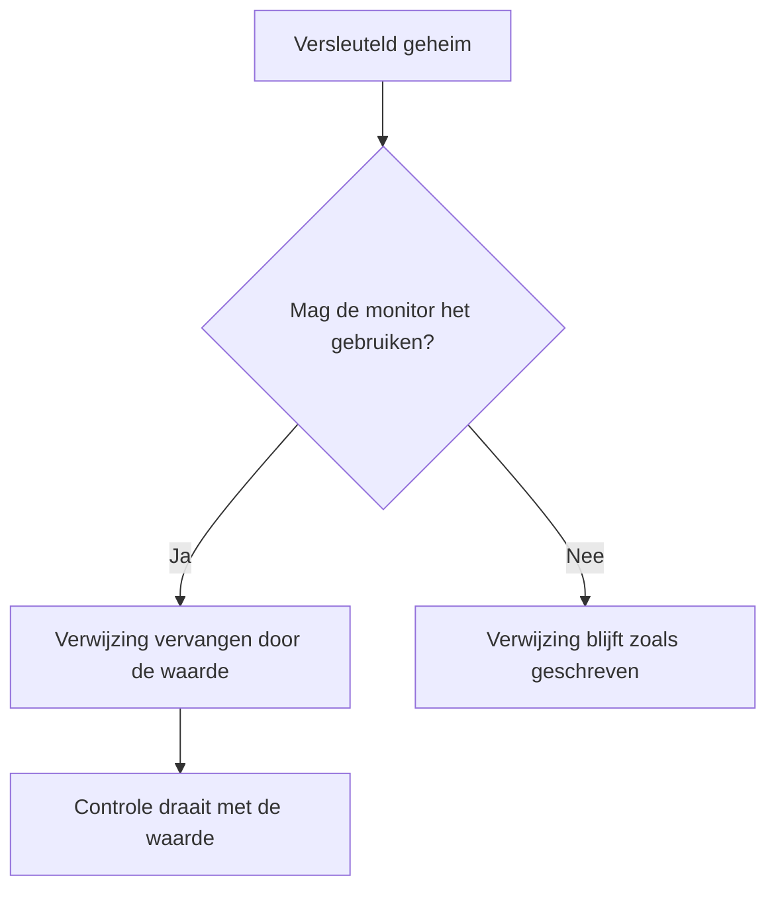

# Monitor-geheimen

Monitorgeheimen houden de wachtwoorden, API-sleutels en tokens die uw monitoren nodig hebben buiten de monitor zelf. U slaat een waarde één keer versleuteld op, kiest welke monitoren haar mogen gebruiken, en verwijst ernaar met `{{monitorSecrets.NAME}}` waar de monitor haar nodig heeft.

:::cards
- [Een geheim toevoegen](#een-geheim-toevoegen): Een waarde opslaan en kiezen wie haar mag gebruiken.
- [De toegang kiezen](#kiezen-welke-monitoren-een-geheim-mogen-gebruiken): Alle monitoren, specifieke monitoren of monitoren met labels.
- [Een geheim gebruiken](#een-geheim-gebruiken): Waar `{{monitorSecrets.NAME}}` werkt.
:::

## Hoe geheimen een monitor bereiken

Een geheim wordt versleuteld opgeslagen en na het opslaan nooit meer getoond. Voordat OneUptime een monitor aan een sonde overdraagt, vervangt het elke verwijzing die de monitor mag gebruiken door de ontsleutelde waarde; een verwijzing die de monitor niet mag gebruiken, blijft staan zoals ze is geschreven.

De sonde die de controle uitvoert, ontvangt de waarde, dus een monitor die een geheim gebruikt, moet draaien op sondes die u vertrouwt: die van OneUptime, of een [aangepaste sonde](/docs/probe/custom-probe) die u zelf beheert.

## Voordat u begint

- **Het Growth-abonnement of hoger**, op OneUptime Cloud. Zelf gehoste installaties hebben geen abonnementen.
- **Een rol die geheimen mag beheren**: Project Owner, Project Admin, of een aangepaste rol met de machtiging Create Monitor Secret.

## Werken met geheimen

### Een geheim toevoegen

:::steps
1. Ga naar **Monitoren → Instellingen → Geheimen** en klik op **Monitor Geheim aanmaken**.
2. Voer een **Naam** en de **Geheime waarde** in. De naam is waarnaar u verwijst, bijvoorbeeld `ApiKey`. Hij mag alleen letters, cijfers, koppeltekens (`-`) en underscores (`_`) bevatten, en geen twee geheimen in een project mogen dezelfde hebben.
3. Kies bij de stap **Toegang** welke monitoren het mogen gebruiken (zie de volgende sectie) en klik op **Monitor Geheim aanmaken**.
:::

> [!IMPORTANT]
> Geheimen worden versleuteld en veilig opgeslagen. De waarde van het geheim wordt na het opslaan nooit meer getoond — niet in de tabel, niet in het bewerkingsformulier en niet via de API. Raakt u de waarde kwijt, dan moet u haar ophalen waar ze vandaan kwam en opnieuw instellen. Gebruik om een geheim te roteren de knop **Geheime waarde bijwerken** in de rij ervan; u hoeft het niet te verwijderen en opnieuw te maken.

### Kiezen welke monitoren een geheim mogen gebruiken

Elk geheim heeft een van drie toegangsopties:

| Optie | Welke monitoren het geheim mogen gebruiken | Gebruik het voor |
| --- | --- | --- |
| **Alle monitoren** | Elke monitor in het project, ook monitoren die u later maakt. | Een inloggegeven dat veel monitoren delen. |
| **Specifieke monitoren** | Alleen de monitoren die u kiest. Dit is de standaard, en geheimen die vóór deze opties zijn gemaakt, werken zo. | Een inloggegeven voor één of enkele monitoren. |
| **Monitoren met labels** | Monitoren die minstens een van de labels hebben die u kiest. Een van die labels aan een monitor toevoegen geeft hem toegang, en het label verwijderen neemt de toegang af bij de volgende run van de monitor. | Een inloggegeven voor een groep monitoren die in de loop van de tijd verandert. |

U kunt de optie op elk moment wijzigen met **Bewerken** in de rij van het geheim. Alleen de lijst van de gekozen optie wordt bewaard: overschakelen naar **Alle monitoren** maakt de monitor- en labellijst van het geheim leeg, en wisselen tussen **Specifieke monitoren** en **Monitoren met labels** maakt de lijst leeg waarvan u weggaat.

Een geheim is nooit beschikbaar voor monitoren in een ander project.

> [!WARNING]
> Iedereen die een monitor mag bewerken die een geheim kan gebruiken, kan dat geheim overal naartoe sturen waarmee de monitor verbinding maakt. Met **Alle monitoren** is dat iedereen die in het project monitoren mag maken of bewerken. Met **Monitoren met labels** hoort daar ook iedereen bij die een van die labels aan een monitor mag toevoegen.

Via de API is de toegangsoptie het veld `monitorAccess`: `All Monitors`, `Specific Monitors` of `Monitors With Labels`. De velden `monitors` en `labels` bevatten de lijsten. Een geheim dat zonder `monitorAccess` wordt gemaakt, krijgt `Specific Monitors`.

### Een geheim gebruiken

Om een geheim te gebruiken, schrijft u `{{monitorSecrets.SECRET_NAME}}` in een veld dat geheimen accepteert. Een request-header `Authorization: Bearer {{monitorSecrets.ApiKey}}` stuurt bijvoorbeeld de waarde van het geheim `ApiKey`.

Deze monitortypen en velden accepteren geheimen:

| Monitortype | Velden |
| --- | --- |
| API | De URL, de request-headers en -body, en het clientcertificaat, de privésleutel en de wachtwoordzin (mTLS) |
| Website | De URL, en het clientcertificaat, de privésleutel en de wachtwoordzin (mTLS) |
| Ping, IP, Poort, NTP, SSL Certificate | De host of URL die wordt gecontroleerd |
| DNS | De domeinnaam en de DNS-server |
| DNSSEC, Domein | De domeinnaam |
| SQL Query | De host, de databasenaam, de gebruikersnaam, het wachtwoord en de query |
| Database Health | De host, de databasenaam, de gebruikersnaam en het wachtwoord |
| External Status Page | De URL van de statuspagina |
| Synthetic Monitor, Custom JavaScript Code | Het script |
| Network Device | De SNMP-communitystring, en de authenticatie- en privacysleutels van SNMPv3 |

Geheimen worden ingevuld voordat het script van een monitor van het type Synthetic Monitor of Custom JavaScript Code draait, dus een verwijzing zoals `{{monitorSecrets.ApiKey}}` in het script is tijdens het uitvoeren de ontsleutelde waarde.

Verwijst een monitor naar een geheim dat hij niet mag gebruiken, dan blijft de verwijzing staan zoals ze is en wordt ze niet door de waarde vervangen.

Wanneer u een monitor test voordat u hem opslaat, worden alleen geheimen ingevuld die beschikbaar zijn voor **Alle monitoren**, omdat een nieuwe monitor op geen enkele lijst staat en nog geen labels heeft. Nadat u de monitor hebt opgeslagen, gebruiken tests elk geheim dat de monitor mag gebruiken.

## Problemen oplossen

:::details De monitor stuurt `{{monitorSecrets.NAME}}` letterlijk
De monitor mag het geheim niet gebruiken, of de naam klopt niet. Controleer de toegangsoptie van het geheim met **Bewerken** in de rij ervan, en of de naam in de verwijzing precies de naam van het geheim is.
:::

:::details Bij het testen van een nieuwe monitor wordt het geheim niet ingevuld
Voordat een monitor is opgeslagen, worden alleen geheimen ingevuld die beschikbaar zijn voor **Alle monitoren**. Sla de monitor op en test hem opnieuw.
:::

:::details Een veld negeert het geheim
Alleen de velden in de tabel hierboven accepteren geheimen. In elk ander veld wordt `{{monitorSecrets.NAME}}` verstuurd zoals het is geschreven.
:::

## Volgende stappen

:::cards
- [API-monitor](/docs/monitor/api-monitor): Een geheim in een request-header versturen.
- [Synthetische monitor](/docs/monitor/synthetic-monitor): Een geheim in een browserscript gebruiken.
- [SQL-query-monitor](/docs/monitor/sql-monitor): Een databasewachtwoord versleuteld houden.
:::
