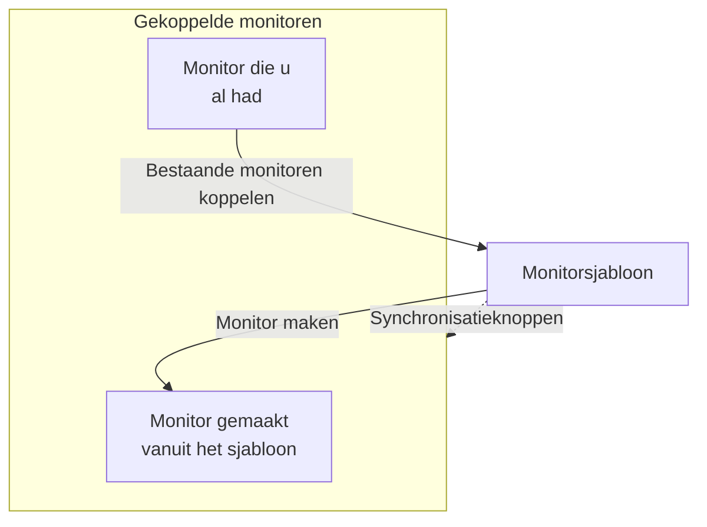

# Monitorsjablonen

Een monitorsjabloon is een opgeslagen monitorconfiguratie (een type, criteria, een interval, labels en standaardwaarden voor aangepaste velden) waaruit u met één klik monitoren maakt. Monitoren die eruit zijn gemaakt, of eraan zijn gekoppeld, blijven verbonden: wijzig het sjabloon en synchroniseer de wijziging daarna naar allemaal. Gebruik sjablonen wanneer veel monitoren zich hetzelfde moeten gedragen, zoals dezelfde gezondheidscontrole op elke service, of dezelfde API-controles in productie en staging.

:::cards
- [Een sjabloon maken](#een-sjabloon-maken): Vier stappen, net als Monitor maken.
- [Monitoren eruit maken](#monitoren-maken-vanuit-een-sjabloon): Eén klik, of koppel monitoren die u al hebt.
- [Wijzigingen synchroniseren](#wijzigingen-synchroniseren-naar-gekoppelde-monitoren): Wat elke synchronisatieknop kopieert.
- [Waarden per monitor behouden](#waarden-per-monitor-behouden): Een bestemming of headers tegen een synchronisatie beschermen.
:::

## Hoe sjablonen werken

Een sjabloon bewaakt zelf niets. Monitoren worden eruit gemaakt, of eraan gekoppeld, en de pagina van het sjabloon toont ze als **Gekoppelde monitoren**. Wanneer u het sjabloon wijzigt, verandert er niets aan die monitoren totdat u synchroniseert: elke synchronisatieknop kopieert één deel van het sjabloon naar elke gekoppelde monitor, en velden die u beschermt houden de eigen waarde van elke monitor.



## Voordat u begint

- **Een rol die sjablonen mag maken**: Project Owner, Project Admin, Project Member, Monitor Admin of Monitor Member, of een aangepaste rol met de machtiging Create Monitor Template. Een sjabloon wijzigen vraagt dezelfde rollen, of de machtiging Edit Monitor Template.
- **Machtiging om de gekoppelde monitoren bij te werken.** Een synchronisatie schrijft namens u naar elke gekoppelde monitor en slaat de monitoren over die uw machtigingen niet dekken.

## Een sjabloon maken

:::steps
### Sjablonen openen

Ga naar **Monitoren → Instellingen → Sjablonen** en klik op **Monitor Sjabloon aanmaken**.

### Het sjabloon een naam geven

Vul onder **Sjablooninformatie** een **Sjabloonnaam** in, zoals `Production API Health`, en een **Sjabloonbeschrijving**, en klik dan op **Volgende**.

### De standaardwaarden van de monitor instellen

Kies onder **Standaardinstellingen voor monitor** het **Monitortype**, met dezelfde kiezer als bij Monitor maken. Vul eventueel een **Standaard monitornaam** in; blijft die leeg, dan wordt elke monitor genoemd naar de resource die hij bewaakt. **Standaard monitorbeschrijving** en **Labels** wachten onder **Meer velden**. Klik op **Volgende**.

### De criteria en het interval instellen

Vul onder **Criteria** in wat er gecontroleerd wordt en de criteria, zoals bij [Monitor maken](/docs/monitor/create-monitor#criteria). Met de kaart **Template sync settings** bovenaan beschermt u velden tegen synchronisaties (zie [Waarden per monitor behouden](#waarden-per-monitor-behouden)). Voor een monitortype dat sondes controleren, vraagt de laatste stap, **Interval**, om het **Bewakingsinterval**. Klik op de laatste stap op **Monitor Sjabloon aanmaken**.
:::

Het sjabloon wordt aan de lijst toegevoegd. Open het om de pagina te zien, met een kaart voor elk deel: **Sjablooninformatie**, **Standaardinstellingen voor monitor**, **Bewakingscriteria**, **Bewakingsinterval** (met **Minimale sonde-overeenstemming**), **Labels**, **Custom Field Defaults** (wanneer het project aangepaste monitorvelden heeft) en **Gekoppelde monitoren**. U wijzigt elk deel op zijn eigen kaart, bijvoorbeeld met **Criteria bewerken** of **Interval bewerken**.

## Monitoren maken vanuit een sjabloon

- **Nieuwe monitor.** Klik in de lijst op **Monitor maken** in de rij van het sjabloon, of op **Monitor aanmaken vanaf sjabloon** op de pagina ervan. **Monitor maken** opent met het type en de instellingen van het sjabloon ingevuld; wijzig wat nodig is en maak hem. De nieuwe monitor is aan het sjabloon gekoppeld.
- **Monitoren die u al hebt.** Klik onder **Gekoppelde monitoren** op **Bestaande monitoren koppelen** en kies ze. Ze houden hun instellingen totdat u synchroniseert.

Waarden die onder **Custom Field Defaults** zijn ingesteld, worden naar elke monitor geschreven die vanuit het sjabloon wordt gemaakt, ook naar monitoren die regels voor automatisch importeren en waarschuwingsbeleid ermee maken.

## Wijzigingen synchroniseren naar gekoppelde monitoren

Een sjabloon bewerken wijzigt alleen het sjabloon. Om een wijziging naar de gekoppelde monitoren te kopiëren, gebruikt u de synchronisatieknop op de kaart die u hebt gewijzigd. Elke knop noemt hoeveel monitoren hij bereikt, zoals **Sync Criteria to 3 Linked Monitors**, en is grijs zolang er niets is gekoppeld. Een synchronisatie kan niet ongedaan worden gemaakt.

| Knop | Kopieert naar elke gekoppelde monitor | Laat ongemoeid |
| --- | --- | --- |
| **Criteria synchroniseren naar gekoppelde monitoren** | De criteria en de stapinstellingen, zoals bestemmingen en aanvraagopties, behalve beschermde velden | Het bewakingsinterval, de minimale sonde-overeenstemming, de naam, de beschrijving, de labels en de waarden van aangepaste velden |
| **Synchronisatie-interval naar gekoppelde monitoren** | Het bewakingsinterval en de minimale sonde-overeenstemming | De criteria, de naam, de beschrijving, de labels en de waarden van aangepaste velden |
| **Labels synchroniseren naar gekoppelde monitoren** | De labels, en verder niets | Al het andere |
| **Sync Custom Fields to Linked Monitors** | De aangepaste velden waarvoor het sjabloon een standaardwaarde heeft, in plaats van wat elke monitor had | Aangepaste velden die het sjabloon leeg laat, en al het andere |

Om één monitor te synchroniseren, klikt u op **Synchroniseren vanuit sjabloon** in de rij ervan onder **Gekoppelde monitoren**. Dat kopieert de criteria en stapinstellingen (behalve beschermde velden), het bewakingsinterval, de minimale sonde-overeenstemming en de labels, en laat de naam, de beschrijving en de waarden van aangepaste velden van de monitor ongemoeid. **Ontkoppelen van sjabloon** koppelt een monitor los; hij houdt zijn instellingen.

Na een synchronisatie meldt een samenvatting hoeveel monitoren zijn bijgewerkt. **Gedeeltelijk gesynchroniseerd** betekent dat sommige gekoppelde monitoren nog de vorige configuratie hebben, meestal omdat uw machtigingen ze niet dekken.

## Waarden per monitor behouden

Een criteriasynchronisatie kopieert ook stapinstellingen zoals bestemmingen, aanvraagheaders en time-outs, tenzij u die velden beschermt. Bescherm een veld om elke gekoppelde monitor zijn eigen waarde ervoor te laten houden.

:::steps
### Het sjabloon openen

Ga naar **Monitoren → Instellingen → Sjablonen** en open het sjabloon.

### De criteria bewerken

Klik op de kaart **Bewakingscriteria** op **Criteria bewerken**.

### De velden beschermen

Vink onder **Template sync settings** **Do not sync this field** aan naast elk veld dat u op de gekoppelde monitoren wilt behouden.

### Opslaan

Sla uw wijzigingen op. De kaart **Bewakingscriteria**, en de bevestiging van elke synchronisatie, tonen de beschermde velden.

### Synchroniseren

Gebruik **Criteria synchroniseren naar gekoppelde monitoren**, of **Synchroniseren vanuit sjabloon** op één gekoppelde monitor.
:::

Bescherm bijvoorbeeld **Monitor destination** en **Request headers** op een API-sjabloon. Productie- en stagingmonitoren houden hun eigen URL's en headers, terwijl beide de bijgewerkte criteria van het sjabloon en de andere onbeschermde instellingen krijgen.

Welke opties er zijn, hangt af van het monitortype. Daaronder vallen bestemmingen en poorten, HTTP-aanvraagopties, databaseverbindingen, DNS-instellingen, infrastructuurselectors en telemetriequery's. Samenhangende inloggegevens, zoals een clientcertificaat en de privésleutel ervan, worden samen behouden.

### Hoe uitzonderingen werken

- Aangevinkte velden houden de huidige waarde van elke bestaande monitor, ook een lege of niet-ingestelde waarde. Aanvraagheaders en andere verzamelingen blijven volledig behouden.
- Niet-aangevinkte velden blijven vanuit het sjabloon synchroniseren. Vink een beschermd veld uit en sla op om bij de volgende synchronisatie de sjabloonwaarde te kopiëren.
- Uitzonderingen gelden voor bulk- en losse synchronisaties. Ze worden op het sjabloon opgeslagen, niet per synchronisatie apart gekozen.
- Nieuwe monitoren beginnen nog steeds met de veldwaarden van het sjabloon. Uitzonderingen hebben alleen invloed op het synchroniseren van bestaande monitoren.
- Criteria worden altijd gesynchroniseerd. Een synchronisatie van alleen criteria laat het bewakingsinterval, de labels en andere instellingen op monitorniveau ongemoeid.
- Bestaande sjablonen hebben geen velduitzonderingen totdat u ze instelt. Netwerkapparaatmonitoren behouden hun eigen apparaatkoppeling nog steeds automatisch.

Bij sjablonen met meerdere stappen worden beschermde waarden gekoppeld via de stap-ID's. Zelfstandig gemaakte monitoren met één stap kunnen ook een sjabloon met één stap ontvangen. Als een beschermde stap niet kan worden gekoppeld, wordt de synchronisatie geweigerd voordat er een monitor wordt bijgewerkt, zodat een nieuwe of verplaatste stap niet per ongeluk de bestemming of inloggegevens van een andere stap kopieert.

> [!IMPORTANT]
> Verwijder, voordat u het monitortype van een opgeslagen sjabloon wijzigt (met **Standaardinstellingen voor monitor bewerken**), onder **Criteria bewerken** de uitzonderingen die niet voor het nieuwe type gelden. Alle uitzonderingen van een sjabloon moeten voor het monitortype ervan bestaan.

## Configuratie via de API

Elke sjabloonstap accepteert een array `doNotSyncFields` in zijn object `MonitorStep.value`. Voor een API-monitor beschermt u de bestemming en de hele verzameling headers met:

```json title="monitorSteps (excerpt)"
{
  "_type": "MonitorSteps",
  "value": {
    "monitorStepsInstanceArray": [
      {
        "_type": "MonitorStep",
        "value": {
          "id": "<step id>",
          "doNotSyncFields": ["monitorDestination", "requestHeaders"]
        }
      }
    ]
  }
}
```

Laat de array weg of zet hem op `[]` om elke ondersteunde stapinstelling te synchroniseren. Niet-ondersteunde veldnamen en velden die niet voor het monitortype van het sjabloon gelden, worden geweigerd. De array van het sjabloon stuurt de synchronisatie; zulke metadata op een gekoppelde monitor overschrijven hem niet.

:::details Veldnamen voor doNotSyncFields, per monitortype
| Monitortype | Veldnamen |
| --- | --- |
| Website, API, Ping, IP, Poort, SSL Certificate, NTP | `monitorDestination`, `requestTimeoutInMs`, `retryCount` |
| Alleen API | `requestHeaders`, `requestType`, `requestBody` |
| Website en API | `doNotFollowRedirects`, `allowSelfSignedCertificates`, `tlsClientAuthentication` (het clientcertificaat, de sleutel en de wachtwoordzin samen) |
| Poort, NTP | `monitorDestinationPort` |
| Synthetic Monitor, Custom JavaScript Code | `customCode` |
| Synthetic Monitor | `browserTypes`, `screenSizeTypes`, `retryCountOnError` |
| DNS | `dnsMonitor.queryName`, `dnsMonitor.recordType`, `dnsMonitor.resolver` (de DNS-server en de poort samen), `dnsMonitor.timeout`, `dnsMonitor.retries` |
| Domein | `domainMonitor.domainName`, `domainMonitor.lookupMethod`, `domainMonitor.timeout`, `domainMonitor.retries` |
| DNSSEC | `dnssecMonitor.domainName`, `dnssecMonitor.resolvers`, `dnssecMonitor.checkNameserverConsistency`, `dnssecMonitor.signatureExpiryWarningDays`, `dnssecMonitor.timeout`, `dnssecMonitor.retries` |
| SQL Query | `sqlMonitor.connection`, `sqlMonitor.connectionTimeoutInMs`, `sqlMonitor.statementTimeoutInMs`, `sqlMonitor.query`, `sqlMonitor.maxRows` |
| Database Health | `databaseMonitor.connection`, `databaseMonitor.connectionTimeoutInMs`, `databaseMonitor.statementTimeoutInMs`, `databaseMonitor.enabledMetricGroups` |
| External Status Page | `externalStatusPageMonitor.statusPageUrl`, `externalStatusPageMonitor.provider`, `externalStatusPageMonitor.components`, `externalStatusPageMonitor.timeout`, `externalStatusPageMonitor.retries` |
| Logboeken, Security Events, Traces, AI / LLM, Metrieken, Uitzonderingen | `logMonitor`, `securityEventsMonitor`, `traceMonitor`, `llmMonitor`, `metricMonitor`, `exceptionMonitor` (de hele configuratie van de monitor) |

Infrastructuurmonitoren (Kubernetes, Docker, Host, Podman, Proxmox, Docker Swarm, Ceph, Opslagarray, IoT Device) bieden hun resourceselector, filters, metriekquery's en het tijdvenster van de query. Hun namen staan onder **Template sync settings** op een sjabloon van dat type.
:::

## Problemen oplossen

:::details Een synchronisatie meldt "Gedeeltelijk gesynchroniseerd"
Sommige gekoppelde monitoren zijn niet bijgewerkt, meestal omdat uw machtigingen ze niet dekken. Vraag iemand die elke gekoppelde monitor mag bijwerken om de synchronisatie opnieuw uit te voeren.
:::

:::details Een synchronisatie mislukt met "a template step cannot be matched to an existing monitor step"
Een beschermd veld kon niet aan een stap van een van de monitoren worden gekoppeld, dus de synchronisatie stopte voordat er een werd gewijzigd. Geef de stappen van het sjabloon dezelfde ID's als de stappen van de monitoren, of gebruik een sjabloon met één stap bij monitoren met één stap.
:::

:::details De synchronisatieknoppen zijn grijs
Er is nog geen monitor aan het sjabloon gekoppeld. Maak er een monitor uit, of klik onder **Gekoppelde monitoren** op **Bestaande monitoren koppelen**.
:::

:::details Opslaan mislukt met "Unsupported do not sync field"
Een naam in `doNotSyncFields` is geen veld van het monitortype van het sjabloon. Vergelijk hem met de veldnamen hierboven.
:::

## Volgende stappen

:::cards
- [Een monitor maken](/docs/monitor/create-monitor): Het formulier dat een sjabloon invult.
- [API-monitor](/docs/monitor/api-monitor): De instellingen die een API-sjabloon meeneemt.
- [Monitor-geheimen](/docs/monitor/monitor-secrets): Inloggegevens tussen monitoren delen zonder ze te kopiëren.
- [Terraform-monitorstappen](/docs/terraform/monitor-steps): Monitoren en hun stappen als code beheren.
:::
