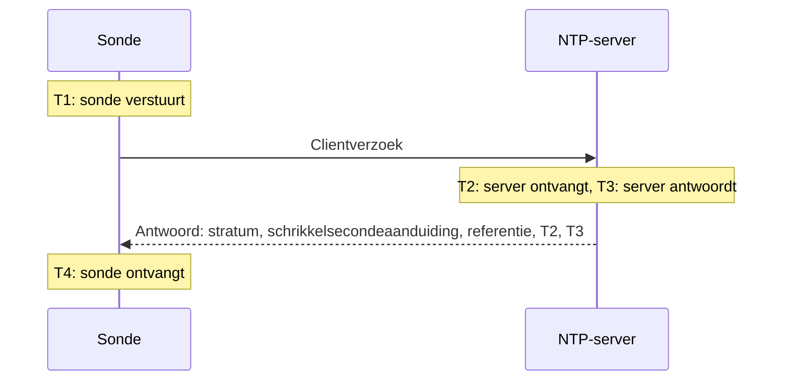

# NTP-monitor

Een NTP-monitor controleert of een tijdserver antwoordt op UDP-poort 123 en betrouwbare tijd levert: dat hij gesynchroniseerd is, op een redelijk stratum zit en dat zijn klok overeenkomt met die van de sonde. Gebruik hem voor de tijdservers die je zelf beheert, zoals een GPS-klok in het datacenter of de interne servers waarmee je machines synchroniseren, en voor de publieke servers waarvan je afhankelijk bent.

:::cards
- [De monitor maken](#een-ntp-monitor-maken): Zes stappen in het dashboard.
- [Wat de controle uitleest](#wat-de-controle-uitleest): Stratum, klokafwijking, schrikkelsecondeaanduiding en de rest van het antwoord.
- [Monitoringcriteria](#monitoringcriteria): Bereikbaarheid, synchronisatie, stratum en afwijking.
- [Probleemoplossing](#probleemoplossing): Als de server draait, maar de monitor iets anders zegt.
:::

## Hoe het werkt

Bij elke controle stuurt een sonde één SNTP-clientverzoek (NTP versie 4, clientmodus) vanaf een willekeurige lokale poort naar de UDP-poort van de server en wacht op het antwoord. Alleen een echt antwoord op dat verzoek telt: de sonde zet 64 willekeurige bits in de verzendtijdstempel van het verzoek en negeert elk pakket dat ze niet terugstuurt, korter is dan een NTP-pakket of niet in servermodus staat. Een oud antwoord op een eerdere controle, of een vervalst antwoord, kan een uitgevallen server nooit levend laten lijken.

Uit de vier tijdstempels berekent de sonde de **klokafwijking**, ((T2 − T1) + (T3 − T4)) / 2: hoe ver de klok van de server van die van de sonde af ligt. Een positieve afwijking betekent dat de server voorloopt. De formule gaat ervan uit dat het verzoek en het antwoord even lang onderweg zijn, dus een pad dat in één richting veel trager is, kan de afwijking tot de helft van de rondreistijd vertekenen.

> [!NOTE]
> De afwijking wordt gemeten ten opzichte van de eigen klok van de sonde. De sondes van OneUptime Cloud houden hun klokken gesynchroniseerd. Houd op een [aangepaste sonde](/docs/probe/custom-probe) ook de klok van de host gesynchroniseerd, met chrony of systemd-timesyncd, anders kan een afwijkingswaarschuwing over de sonde gaan in plaats van over de server.

Een server die antwoordt, wordt niet opnieuw gevraagd, ook niet als hij antwoordt zonder betrouwbare tijd. Stilte, een geweigerde poort en een mislukte DNS-lookup worden opnieuw geprobeerd met een nieuw verzoek. Als de server helemaal niet antwoordt, traceert de sonde ook de route ernaartoe en voegt wat hij vond toe als **Network Path at Time of Failure**. Een sonde die zijn eigen netwerkverbinding kwijt is, meldt geen resultaat, dus die kan je server niet als offline markeren.

## Voordat je begint

- **Een rol die monitors kan maken**: Project Owner, Project Admin, Project Member, Monitor Admin of Monitor Member, of een aangepaste rol met de machtiging Create Monitor.
- **Een sonde die UDP-poort 123 op de server kan bereiken.** Elke sonde kan een publieke tijdserver controleren. Gebruik voor een server in een privénetwerk een [aangepaste sonde](/docs/probe/custom-probe) binnen dat netwerk. Een firewall voor de server moet UDP doorlaten, niet alleen TCP, vanaf de [IP-adressen van de sondes van OneUptime Cloud](/docs/configuration/ip-addresses) of vanaf je aangepaste sonde.

## Een NTP-monitor maken

:::steps
### Een nieuwe monitor starten

Ga naar **Monitoren** en klik op **Monitor maken**. Typ onder **Monitortype** `ntp` in het zoekvak en kies **NTP**. Hij staat ook onder **Meer monitortypen**, in de groep Netwerk.

### Een naam geven

Voer een **Naam** in, zoals `GPS-tijdserver`, en klik op **Volgende**.

### De server invoeren

Voer bij **NTP-server** de hostnaam of het IP-adres van de server in, zoals `time.example.com` of `192.168.1.10`. Het verzoek gaat naar poort 123. Open **Meer velden** en vul **Poort** in om een andere poort te gebruiken.

### Testen

Klik op **Monitor testen**, kies een sonde onder **Selecteer sonde** en klik op **Test uitvoeren**. **Testresultaat van monitor** laat zien of de server antwoordde, of hij gesynchroniseerd is, wat zijn stratum is en hoe ver zijn klok afwijkt.

### De criteria nakijken

**Monitorcriteria** begint met de [standaardcriteria](#standaardcriteria): offline als de server geen betrouwbare tijd levert, online als hij dat wel doet. Pas ze aan als dat nodig is en klik op **Volgende**.

### Sondes kiezen en maken

Houd of wijzig de **Sondes** en het **Bewakingsinterval** (dat begint op **Elke 5 minuten**) en klik op **Monitor maken**. De pagina van de monitor gaat open.
:::

## Configuratieopties

| Veld | Standaard | Wat je invoert |
| --- | --- | --- |
| **NTP-server** | Geen | De server, zoals `time.example.com`, `192.168.1.10` of `2001:db8::123`. Voer alleen de host in, zonder `udp://`. Een poort achter de host, zoals `time.example.com:1123`, wordt gebruikt in plaats van **Poort**. |
| **Poort** (onder **Meer velden**) | `123` | De UDP-poort waarop de server NTP beantwoordt, van `1` tot `65535`. Laat het leeg voor `123`. |
| **Aanvraagtime-out (seconden)** (onder **Meer velden**) | `5` | Hoe lang één poging op het antwoord wacht, de DNS-lookup inbegrepen. Het maximum is 60 seconden. |
| **Nieuwe pogingen bij mislukking** (onder **Meer velden**) | Standaard van de sonde, meestal `3` | Hoe vaak een poging zonder antwoord opnieuw wordt geprobeerd. Het maximum is 3. |

**Nieuwe pogingen bij mislukking** telt de nieuwe pogingen _na_ de eerste poging, dus `0` voert de controle één keer uit en `2` tot drie keer, met een pauze van één seconde tussen de pogingen. Leeg gelaten gebruikt het de standaard van de sonde: 3, tenzij `PROBE_MONITOR_RETRY_LIMIT` van de sonde iets anders zegt.

## Wat de controle uitleest

De pagina van de monitor toont de laatste controle van elke sonde:

| Veld | Wat het betekent |
| --- | --- |
| **Gesynchroniseerd** | Of de server antwoordde op stratum 1 tot 15, zonder het alarm in zijn schrikkelsecondeaanduiding en met echte tijdstempels in zijn antwoord. |
| **Klokafwijking** | Hoe ver de klok van de server van die van de sonde af ligt, en in welke richting. Een gezonde server zit binnen een paar milliseconden. |
| **Stratum** | Hoeveel stappen de server van een referentieklok af zit: 1 voor een server met een eigen GPS- of atoombron, 2 voor een server die synchroniseert met een stratum 1-server, enzovoort. 16 betekent niet gesynchroniseerd. |
| **Referentie** | Waarmee de server synchroniseert: een bronnaam zoals `GPS`, `PPS` of `NIST` op stratum 1, het adres van de bovenliggende server vanaf stratum 2. |
| **Schrikkelsecondeaanduiding** | 0 als er geen schrikkelseconde aankomt, 1 of 2 als er aan het eind van de dag een wordt toegevoegd of weggehaald, 3 als de server meldt dat zijn klok niet gesynchroniseerd is. |
| **Rootspreiding** | De eigen schatting van de server hoe ver zijn tijd van de echte tijd kan afliggen. Die groeit zolang de server zijn bron niet bereikt. ntpd vertrouwt een server niet meer zodra de helft van zijn rootvertraging plus deze waarde boven 1,5 seconde komt. |
| **Rootvertraging** | De rondreis van de server naar zijn referentieklok. |
| **Reactietijd** | Van het versturen van het verzoek door de sonde tot het ontvangen van het antwoord, zonder de DNS-lookup. |
| **Servertijd** | De klok van de server toen hij het antwoord verstuurde. |

Een server die weigert de tijd te geven, stuurt in plaats daarvan een **kiss-o'-death**: een antwoord op stratum 0 met een code van vier letters. De meest voorkomende codes zijn `RATE` (de server beperkt de frequentie van de sonde), `DENY` en `RSTR` (zijn toegangsregels weigeren de sonde) en `INIT` (hij is nog niet gesynchroniseerd). De controle toont de code en telt de server als antwoordend, maar niet gesynchroniseerd.

## Monitoringcriteria

Criteria bepalen wanneer de server als online, verminderd of offline telt, en of dat een incident verklaart of een waarschuwing maakt. Elk criterium controleert een of meer filters:

| Filter | Voorwaarden | Wat het controleert |
| --- | --- | --- |
| **NTP Is Online** | **Waar**, **Onwaar** | Of de server het verzoek van de sonde met een NTP-antwoord beantwoordde. Een kiss-o'-death is een antwoord. |
| **NTP Is Synchronized** | **Waar**, **Onwaar** | Of de server die antwoordde gesynchroniseerde tijd levert. Als de server niet antwoordt, wordt dit filter niet gecontroleerd; gebruik daarvoor **NTP Is Online**. |
| **NTP Stratum** | **Greater Than**, **Greater Than Or Equal To**, **Less Than**, **Less Than Or Equal To**, **Equal To**, **Not Equal To** | Het stratum van de server. De 0 van een kiss-o'-death telt als 16, niet gesynchroniseerd. |
| **NTP Clock Offset (in ms)** | **Greater Than**, **Less Than**, **Greater Than Or Equal To**, **Less Than Or Equal To** | Hoe ver de klok van de server van die van de sonde af ligt, in beide richtingen. |
| **NTP Response Time (in ms)** | **Greater Than**, **Less Than**, **Greater Than Or Equal To**, **Less Than Or Equal To** | Van het verzoek tot het antwoord. |
| **NTP Root Dispersion (in ms)** | **Greater Than**, **Less Than**, **Greater Than Or Equal To**, **Less Than Or Equal To** | De eigen schatting van de server van zijn maximale fout. |

Bij twee of meer filters bepaalt **Overeenkomstvoorwaarde** of ze **Alle** moeten overeenkomen of dat **Elke** afzonderlijke volstaat. De **Acties** van een criterium bepalen wat het doet: de monitorstatus wijzigen, een waarschuwing maken, een incident verklaren, of een combinatie daarvan.

### Standaardcriteria

Een nieuwe NTP-monitor begint met twee criteria:

- **Offline** — de server antwoordt niet, is niet gesynchroniseerd, of zijn klok ligt `1000` ms of meer van die van de sonde af. De monitor wordt als **Offline** gemarkeerd en er wordt een incident gemaakt met de naam "_monitornaam_ is not serving good time". Het lost zichzelf op zodra de server weer betrouwbare tijd levert.
- **Online** — de server antwoordt, is gesynchroniseerd en zijn klok ligt binnen `1000` ms van die van de sonde. De monitor wordt als **Operationeel** gemarkeerd.

Criteria worden van boven naar beneden gecontroleerd, en het eerste dat overeenkomt, bepaalt wat er gebeurt. Een server die met de verkeerde tijd antwoordt, wordt bewust als uitgevallen behandeld: elke client die hem volgt, zou die tijd ook overnemen.

### Over een periode evalueren

**Evalueer deze criteria over een bepaalde periode** is een selectievakje onder elk NTP-filter. Zet het aan om een venster van eerdere controles te beoordelen in plaats van de laatste: kies een aggregatie onder **Evalueren** en een venster, van 2 tot 60 minuten, onder **Voor de laatste (in minuten)**. Alleen controles die de server beantwoordde, hebben een stratum, een afwijking en een rootspreiding, dus een venster van stilte heeft geen gegevens voor die filters, en **Als geen gegevens** bepaalt wat er gebeurt.

### Voorbeeldcriteria

| Doel | Filter | Voorwaarde | Waarde |
| --- | --- | --- | --- |
| Waarschuwen als een GPS-server terugvalt op een netwerkbron | **NTP Stratum** | **Greater Than** | `1` |
| Waarschuwen als de klok wegloopt | **NTP Clock Offset (in ms)** | **Greater Than** | `100` |
| Waarschuwen als de foutmarge van de server groeit | **NTP Root Dispersion (in ms)** | **Greater Than** | `500` |
| Waarschuwen als antwoorden traag worden | **NTP Response Time (in ms)** | **Greater Than** | `1000` |

## Probleemoplossing

:::details De server draait, maar de monitor zegt dat hij niet antwoordde
Het verzoek of het antwoord ging onderweg verloren. Een firewall die TCP toestaat maar UDP niet, een ntpd-regel `restrict` of chrony-regel `allow` die het adres van de sonde uitsluit, of een server die alleen op een interne interface luistert, zien er allemaal zo uit. **Network Path at Time of Failure** laat zien hoe ver de route kwam. Laat de sonde door, of controleer de server vanaf een [aangepaste sonde](/docs/probe/custom-probe) binnen het netwerk.
:::

:::details De monitor zegt dat de server het verzoek weigerde
De host antwoordde dat er niets luistert op die UDP-poort (ICMP port unreachable): de NTP-dienst is gestopt of luistert op een andere poort. Start de dienst, of zet **Poort** op de poort die hij gebruikt.
:::

:::details De server antwoordt met een kiss-o'-death
`RATE` betekent dat de server de frequentie van de sonde beperkt. De sonde vraagt één keer per controle, dus een langer **Bewakingsinterval**, of een uitzondering voor de adressen van de sonde in de limiet van de server, verhelpt dit. `DENY` en `RSTR` betekenen dat de toegangsregels van de server de sonde weigeren. `INIT` en `STEP` betekenen dat de server nog niet gesynchroniseerd is, wat de eerste minuten na het opstarten normaal is.
:::

:::details Elke NTP-monitor op één sonde toont een vergelijkbare afwijking
De klok van de sonde wijkt af, niet die van de servers. Controleer of de host van de sonde zijn klok gesynchroniseerd houdt, of voer de monitors uit op een andere sonde.
:::

:::details De afwijking springt tussen controles
De sonde staat ver van de server, of het pad is in de ene richting trager dan in de andere. Gebruik een sonde dichter bij de server, of beoordeel de afwijking over een paar minuten met **Evalueer deze criteria over een bepaalde periode** en **Gemiddelde**.
:::

## Volgende stappen

:::cards
- [Ping-monitor](/docs/monitor/ping-monitor): Controleren of de host zelf bereikbaar is.
- [Poort-monitor](/docs/monitor/port-monitor): De TCP-diensten op dezelfde host controleren.
- [Aangepaste probes](/docs/probe/custom-probe): Tijdservers in je eigen netwerk controleren.
- [Incident- en waarschuwingstemplates](/docs/monitor/incident-alert-templating): Het stratum en de afwijking in de titel van een incident zetten.
:::
