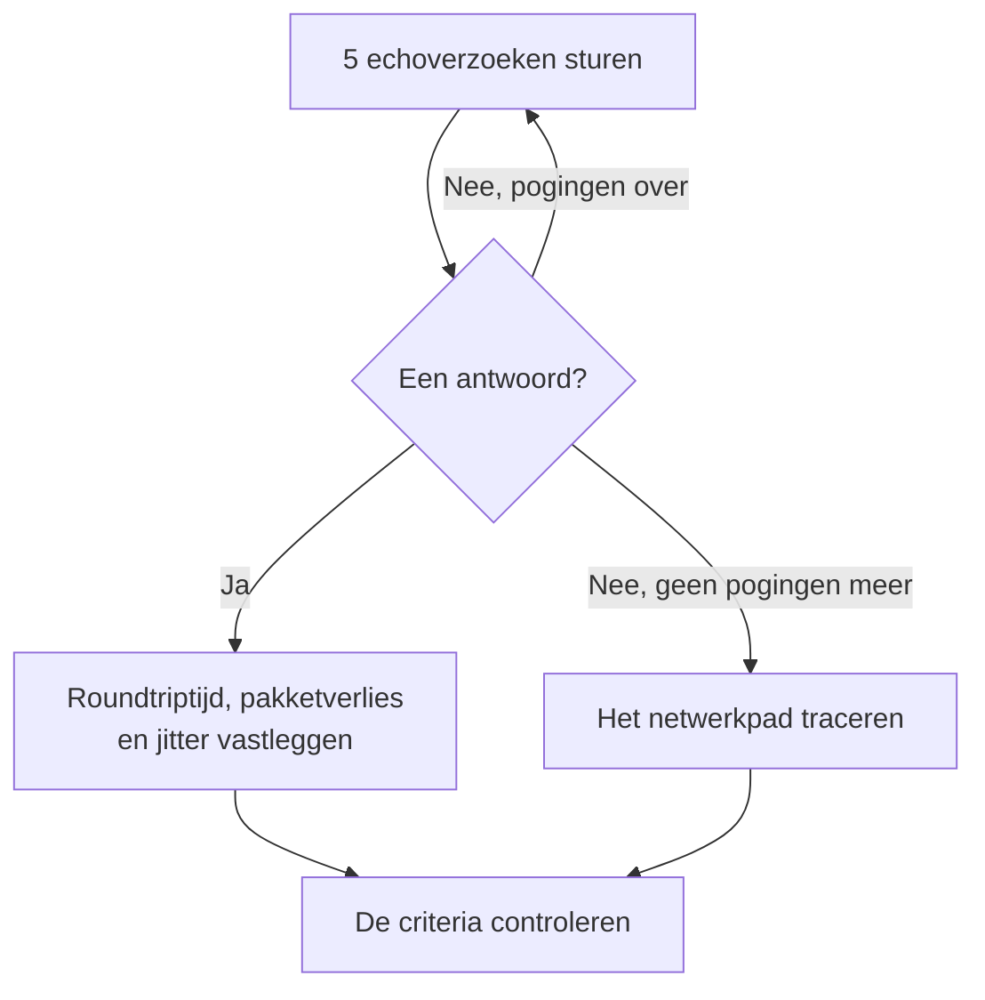

# Ping-monitor

Een pingmonitor controleert of een host op ping antwoordt (ICMP-echoverzoeken), en meet de roundtriptijd, het pakketverlies en de jitter. Gebruik hem voor servers, routers, firewalls en andere apparaten die u via een hostnaam of IP-adres bereikt.

:::cards
- [De monitor maken](#een-pingmonitor-maken): Zes stappen in het dashboard.
- [Configuratieopties](#configuratieopties): De host, de time-out en nieuwe pogingen.
- [Bewakingscriteria](#bewakingscriteria): Bereikbaarheid, latentie, pakketverlies en jitter.
- [Problemen oplossen](#problemen-oplossen): Wanneer de host draait maar de monitor offline meldt.
:::

## Hoe het werkt

Bij elke controle stuurt een sonde vijf echoverzoeken naar de host. Komt er minstens één antwoord terug, dan is de host online, en legt de sonde de gemiddelde roundtriptijd vast als reactietijd, samen met het pakketverlies, de jitter en het snelste en traagste antwoord. Komt er geen antwoord terug, dan probeert de sonde het opnieuw, tot het aantal nieuwe pogingen dat u toestaat. Daarna haalt OneUptime het resultaat door de criteria van de monitor.

Wanneer een controle mislukt, traceert de sonde ook de route naar de host en zoekt zijn naam op, en voegt wat ze vond aan het resultaat toe als **Network Path at Time of Failure**, zodat u ziet waar de route brak.

> [!NOTE]
> Sommige hostingproviders blokkeren ICMP op de machines waarop een sonde draait. Een sonde die helemaal geen pings kan versturen, controleert in plaats daarvan TCP-poort `80` op de host, zodat de monitor toch zegt of de host bereikbaar is. Pakketverlies en jitter worden dan niet gemeten.

Een sonde die haar eigen netwerkverbinding kwijt is, meldt geen resultaat, en kan uw host dus niet als offline markeren.

## Voordat u begint

- **Een rol die monitoren mag maken**: Project Owner, Project Admin, Project Member, Monitor Admin of Monitor Member, of een aangepaste rol met de machtiging Create Monitor.
- **Een sonde die de host kan bereiken**, met ICMP toegestaan onderweg. De standaardsondes van uw project worden voor elke nieuwe monitor gekozen. Staat er een firewall voor de host, sta dan ICMP-echoverzoeken toe van de [IP-adressen van de sondes van OneUptime Cloud](/docs/configuration/ip-addresses). Een host in een privénetwerk heeft een [aangepaste sonde](/docs/probe/custom-probe) in dat netwerk nodig.

## Een pingmonitor maken

:::steps
### Een nieuwe monitor beginnen

Ga naar **Monitoren** en klik op **Monitor maken**. Kies onder **Monitortype** het type **Ping**.

### Hem een naam geven

Vul een **Naam** in, zoals `Core router`, en klik dan op **Volgende**.

### De host invullen

Vul onder **Hostnaam of IP-adres** de hostnaam of het IPv4- of IPv6-adres in dat gepingd moet worden, zoals `example.com` of `192.168.1.1`. Vul alleen de host in, zonder `http://` en zonder poort.

### Hem testen

Klik op **Monitor testen**, kies een sonde onder **Selecteer sonde** en klik op **Test uitvoeren**. **Testresultaat van monitor** toont de roundtriptijden en het pakketverlies dat de sonde zag.

### De criteria nakijken

**Monitorcriteria** begint met de [standaardcriteria](#standaardcriteria): offline wanneer de host niet antwoordt, online wanneer hij wel antwoordt. Wijzig ze indien nodig en klik dan op **Volgende**.

### Sondes kiezen en maken

Houd of wijzig de **Sondes** en het **Bewakingsinterval** (het begint bij **Elke 5 minuten**) en klik dan op **Monitor maken**. De pagina van de monitor opent.
:::

## Configuratieopties

| Veld | Standaard | Wat u invult |
| --- | --- | --- |
| **Hostnaam of IP-adres** | Geen | De host die gepingd wordt, zoals `example.com`, `192.168.1.1` of `2001:db8::1`. Een hostnaam wordt bij elke controle opgezocht, zodat de monitor DNS-wijzigingen volgt. |
| **Aanvraagtime-out (seconden)** (onder **Meer velden**) | `60` | Hoe lang er bij elke poging op een antwoord wordt gewacht. Het maximum is 60 seconden. |
| **Nieuwe pogingen bij mislukking** (onder **Meer velden**) | Standaard van de sonde, meestal `3` | Hoe vaak een mislukte poging opnieuw wordt geprobeerd. Het maximum is 3. |

**Nieuwe pogingen bij mislukking** telt de nieuwe pogingen _na_ de eerste poging, dus `0` voert de controle één keer uit en `2` tot drie keer. Leeg gelaten gebruikt het de standaard van de sonde: 3, tenzij `PROBE_MONITOR_RETRY_LIMIT` van de sonde iets anders zegt. Elke fout wordt opnieuw geprobeerd, time-outs inbegrepen, met een pauze van één seconde tussen pogingen. Ook een geslaagde controle waarvan de antwoorden langer dan 10 seconden duurden, wordt opnieuw gecontroleerd.

Om een vast IP-adres te bewaken en nooit een hostnaam, kunt u in plaats daarvan een [IP-monitor](/docs/monitor/ip-monitor) gebruiken. Die voert dezelfde controle uit.

## Bewakingscriteria

Criteria bepalen wanneer de host als online, verminderd of offline telt, en of dat een incident meldt of een waarschuwing maakt. Elk criterium controleert een of meer filters:

| Filter | Voorwaarden | Wat het controleert |
| --- | --- | --- |
| **Is Online** | **Waar**, **Onwaar** | Of minstens één echoverzoek een antwoord kreeg. |
| **Reactietijd (in ms)** | **Greater Than**, **Less Than**, **Greater Than Or Equal To**, **Less Than Or Equal To** | De gemiddelde roundtriptijd van de antwoorden. |
| **Packet Loss (in %)** | **Greater Than**, **Less Than**, **Greater Than Or Equal To**, **Less Than Or Equal To** | Het deel van de vijf echoverzoeken dat geen antwoord kreeg. |
| **Jitter (in ms)** | **Greater Than**, **Less Than**, **Greater Than Or Equal To**, **Less Than Or Equal To** | De standaardafwijking van de roundtriptijden over de pakketten van één controle. |
| **Is Request Timeout** | **Waar**, **Onwaar** | Of de ping bij elke poging een time-out bereikte. |

Bij twee of meer filters bepaalt **Overeenkomstvoorwaarde** of **Alle** moeten overeenkomen of dat **Elke** afzonderlijke filter volstaat. De **Acties** van een criterium bepalen wat het doet: de monitorstatus wijzigen, een waarschuwing maken, een incident melden, of meerdere daarvan.

### Standaardcriteria

Een nieuwe pingmonitor begint met twee criteria:

- **Offline** — de host beantwoordt geen van de echoverzoeken, of is na alle nieuwe pogingen helemaal niet bereikbaar. De monitor wordt als **Offline** gemarkeerd en er wordt een incident met de naam "_monitor name_ is offline" gemaakt. Het incident lost zichzelf op wanneer de host weer antwoordt.
- **Bereikbaar** — de host antwoordt. De monitor wordt als **Operationeel** gemarkeerd.

Criteria worden van boven naar beneden gecontroleerd, en het eerste dat overeenkomt bepaalt wat er gebeurt. Komt er geen overeen, dan toont de monitor zijn standaardstatus: **Operationeel**, tenzij u onder **Meer velden** onder de criteria een andere kiest.

### Over een periode evalueren

**Evalueer deze criteria over een bepaalde periode** is een selectievakje onder een filter, aangeboden voor **Is Online**, **Reactietijd (in ms)**, **Packet Loss (in %)** en **Jitter (in ms)**. Zet het aan om een venster van eerdere controles te beoordelen in plaats van alleen de laatste: kies een aggregatie onder **Evalueren** en een venster, van 2 tot 60 minuten, onder **Voor de laatste (in minuten)**.

| Aggregatie | Komt overeen wanneer |
| --- | --- |
| **Gemiddelde**, **Som**, **Maximum Value**, **Minimum Value** | Dat getal, over het venster, aan de voorwaarde voldoet. Alleen numerieke filters. |
| **All Values** | Elke controle in het venster aan de voorwaarde voldoet. |
| **Any Value** | Minstens één controle in het venster aan de voorwaarde voldoet. |

**All Values** komt pas overeen wanneer het venster echt met gegevens gevuld is. Een monitor die net is gemaakt, of een waarvan de controles niet meer werden vastgelegd, heeft niet genoeg geschiedenis om iets over de laatste N minuten te zeggen, dus het criterium wacht in plaats van overeen te komen op de ene meting die het heeft. **Any Value** is de instelling voor "laat het me weten zodra één controle de grens overschrijdt" en slaat nog steeds meteen aan.

**Als geen gegevens** bepaalt wat er gebeurt zolang het venster het criterium niet kan onderbouwen:

| Optie | Wat er gebeurt | Gebruik het voor |
| --- | --- | --- |
| **Ignore** (standaard) | Het criterium komt niet overeen. | Gewone drempelwaarschuwingen. |
| **Trigger** | De ontbrekende gegevens tellen als het probleem. | Controles waarbij stilte zelf een storing is. |
| **Treat As Zero** | Het venster wordt vergeleken als één nul. | Tellers waarbij geen gebeurtenissen echt nul betekent. |

### Voorbeeldcriteria

| Doel | Filter | Voorwaarde | Waarde |
| --- | --- | --- | --- |
| Offline wanneer de host onbereikbaar is | **Is Online** | **Onwaar** | — |
| Waarschuwen bij hoge latentie | **Reactietijd (in ms)** | **Greater Than** | `200` |
| De host als verminderd markeren op een verbinding met verlies | **Packet Loss (in %)** | **Greater Than** | `20` |
| Waarschuwen bij een instabiele verbinding | **Jitter (in ms)** | **Greater Than** | `30` |

Om alleen te waarschuwen wanneer de latentie hoog blijft, zet u **Evalueer deze criteria over een bepaalde periode** aan voor het reactietijdfilter en kiest u **All Values** over **5** minuten.

## Problemen oplossen

:::details De host draait, maar de monitor meldt offline
De host, of een firewall ervoor, beantwoordt geen ICMP-echoverzoeken van de sonde. Veel servers en cloudnetwerken laten ping standaard vallen. Sta ICMP-echoverzoeken van de sondes toe, of bewaak in plaats daarvan een dienst op de host met een [poortmonitor](/docs/monitor/port-monitor). **Network Path at Time of Failure**, bij de mislukte controle, toont hoe ver de route kwam.
:::

:::details De controle mislukt met "This probe could not resolve" voor de host
De DNS-server van de sonde kent de hostnaam niet. Controleer de naam, of vul in plaats daarvan het IP-adres in. Een naam die alleen binnen uw netwerk wordt opgezocht, heeft daar een [aangepaste sonde](/docs/probe/custom-probe) nodig.
:::

:::details Pakketverlies en jitter zijn leeg
De sonde die de controle uitvoerde kan geen pings versturen, dus ze controleerde in plaats daarvan TCP-poort `80`, die geen van beide meet. Draai de monitor op een sonde die ICMP mag versturen.
:::

## Volgende stappen

:::cards
- [IP-monitor](/docs/monitor/ip-monitor): Een vast IPv4- of IPv6-adres bewaken.
- [Poort-monitor](/docs/monitor/port-monitor): Een dienst op de host controleren, niet alleen de host.
- [Aangepaste probes](/docs/probe/custom-probe): Hosts in uw eigen netwerk pingen.
- [Incidenten](/docs/incidents/index): Wat er gebeurt nadat de monitor er een meldt.
:::
