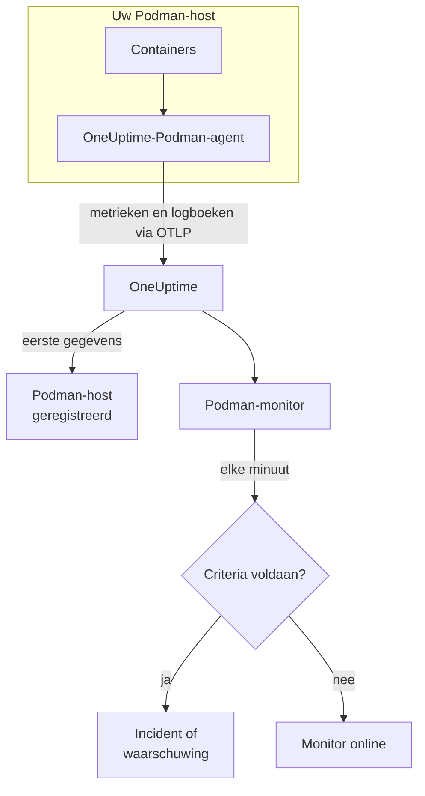

# Podman-monitor

Een Podman-monitor bewaakt de containers op één Podman-host en laat u weten wanneer een container heet loopt, door zijn geheugen raakt of steeds opnieuw start. Hij leest de metrieken die de OneUptime-Podman-agent vanaf de host verstuurt, dus er wordt niets van buitenaf gepeild: installeer de agent en maak de monitor dan vanuit een sjabloon of uw eigen query.

:::cards
- [De monitor maken](#een-podman-monitor-maken): Zes stappen in het dashboard.
- [Sjablonen](#kant-en-klare-waarschuwingssjablonen): Vijf kant-en-klare waarschuwingen, één incident per container.
- [Metrieken](#verzamelde-metrieken): Wat de agent verzamelt, en wat elke metriek betekent.
- [Logboeken](#verzamelde-logboeken): Containerlogboeken, en het logstuurprogramma dat ze nodig hebben.
:::

## Hoe het werkt

De OneUptime-Podman-agent draait als container op de host. Elke 30 seconden leest hij containerstatistieken via de Docker-compatibele API-socket van Podman, volgt hij de logbestanden van de containers en stuurt hij beide via OTLP naar OneUptime. De eerste gegevens van een host registreren hem in OneUptime.

Een Podman-monitor is aan één host gebonden. Elke minuut voert hij zijn query uit over de containermetrieken van die host en vergelijkt hij het resultaat met zijn criteria.



## Voordat u begint

- **Installeer de Podman-agent** op de host. De [handleiding voor de Podman-agent](/docs/telemetry/podman-host) behandelt installeren, bijwerken en controleren. De agent heeft de API-socket van Podman op `/run/podman/podman.sock` nodig.
- **Controleer of de host is geregistreerd.** Hij verschijnt onder **Producten → Infrastructuur → Podman → Alle hosts**, genoemd naar de `PODMAN_HOST_NAME` van de agent, zodra zijn eerste gegevens binnenkomen.
- **Voor containerlogboeken** draait u de containers met het logstuurprogramma `k8s-file`. Zie [Vereist logstuurprogramma](#vereist-logstuurprogramma).

## Een Podman-monitor maken

:::steps
### Een nieuwe monitor beginnen

Ga naar **Monitoren** en klik op **Monitor maken**.

### Podman Container kiezen

Klik onder **Monitortype** op **Meer monitortypen** en kies **Podman Container** onder **Infrastructuur**, of typ `podman` in het zoekvak. Vul een **Naam** in – die wordt gebruikt in de titels van incidenten en waarschuwingen – en klik op **Volgende**.

### De host kiezen

Kies onder **Podman Monitor Configuration** de host in **Podman Host**. Elke host die gegevens heeft verstuurd, staat in de lijst.

### Kiezen wat u bewaakt

Kies een van de drie tabbladen:

- **Quick Setup** – klik op een [sjabloon](#kant-en-klare-waarschuwingssjablonen). Het stelt de metriek, de aggregatie, het tijdsbereik en de drempels in, en vervangt de criteria hieronder door die van het sjabloon. Het **Tijdsbereik** kunt u nog wijzigen.
- **Custom Metric** – kies één metriek in **Podman Metric** en stel dan **Aggregatie** en **Tijdsbereik** in. **Containernaam** en **Container-image** beperken hem tot bepaalde containers.
- **Geavanceerd** – bouw zelf query's en formules onder **Selecteer metrieken**. Gebruik **Group by** `resource.container.name` om elke container afzonderlijk te beoordelen.

### De criteria controleren

Open elk criterium onder **Monitorcriteria** en controleer de **Metriek**, **Aggregatie**, **Voorwaarde** en **Threshold**. Een sjabloon vult deze in. Met **Custom Metric** of **Geavanceerd** begint de monitor met de [standaardcriteria](#standaardcriteria), die alleen opmerken dat een metriek naar nul zakt; stel daarom uw eigen drempel in.

### De monitor maken

Klik op **Monitor maken**. OneUptime opent de pagina van de monitor en evalueert hem elke minuut. Incidenten en waarschuwingen die hij opent, staan ook op de pagina's **Incidenten** en **Waarschuwingen** van de host.
:::

> [!TIP]
> Om meerdere sjablonen tegelijk in te stellen, opent u de host via **Producten → Infrastructuur → Podman** en gaat u naar **Recommendations**. Kies de sjablonen die u wilt en wie wordt opgeroepen, en OneUptime maakt één monitor per sjabloon.

## Monitorinstellingen

| Veld | Tabblad | Wat het doet |
| --- | --- | --- |
| **Podman Host** | Alle | Verplicht. Beperkt elke query tot de `resource.host.name` van de host. OneUptime voegt ook `resource.container.runtime = podman` aan elke query toe. |
| **Podman Metric** | Custom Metric | Eén metriek uit de catalogus van de agent, gegroepeerd als CPU, geheugen, netwerk, blok-I/O en container. |
| **Containernaam** | Custom Metric, Geavanceerd | Optioneel. Exacte overeenkomst met `resource.container.name`, bijvoorbeeld `my-container`. |
| **Container-image** | Custom Metric, Geavanceerd | Optioneel. Exacte overeenkomst met `resource.container.image.name`, bijvoorbeeld `nginx:latest`. |
| **Aggregatie** | Custom Metric | Hoe metingen worden gecombineerd: **Gemiddelde**, **Maximum**, **Minimum**, **Som** of **Aantal**. Begint bij de gebruikelijke aggregatie van de metriek. |
| **Tijdsbereik** | Alle | Het schuivende venster dat de query leest, van **Past 1 Minute** tot **Past 365 Days**. Een nieuwe monitor begint bij **Past 1 Minute**; sjablonen stellen hun eigen in. |
| **Selecteer metrieken** | Geavanceerd | De querybouwer: **Metriek**, **Aggregate by**, **Filter by attributes**, **Group by**, plus **Metriek toevoegen** en **Formule toevoegen** om query's te combineren. |

## Kant-en-klare waarschuwingssjablonen

**Quick Setup** biedt vijf sjablonen. Elk bouwt een complete monitor: een query gegroepeerd op `resource.container.name`, een criterium dat afgaat en een dat herstelt. Elke container wordt afzonderlijk beoordeeld en krijgt een eigen incident en een eigen waarschuwing. De drempels zijn uitgangspunten die u kunt aanpassen.

Een criterium gaat alleen af als de voorwaarde elke minuut van zijn venster geldt, en herstelt 10% voorbij de drempel, zodat een waarde die rond de grens schommelt niet heen en weer springt.

| Sjabloon | Ernst | Bewaakt | Gaat af als | Herstelt als |
| --- | --- | --- | --- | --- |
| High Container CPU Usage | Warning | `container.cpu.utilization`, Avg per container, laatste 5 minuten | Boven 80 (% van één kern) | Op of onder 72 |
| High Container Memory Usage | Warning | `container.memory.percent`, Avg per container, laatste 5 minuten | Boven 85% | Op of onder 76,5% |
| High Container Restart Count | Kritiek | `container.restarts`, Max per container, laatste 5 minuten | Meer dan 5 herstarts in totaal | 4,5 of minder |
| High Container Process Count | Warning | `container.pids.count`, Max per container, laatste 5 minuten | Boven 500 | Op of onder 450 |
| Container Restarted (Low Uptime) | Kritiek | `container.uptime`, Min per container, laatste 1 minuut | Onder 120 seconden | Op of boven 132 seconden |

**Ernst** is het label dat de keuzelijst toont. Het incident en de waarschuwing die een sjabloon maakt, beginnen op het zwaarste incident- en waarschuwingsernstniveau van uw project; wijzig ze in de criteria.

De twee percentagesjablonen gebruiken **Gemiddelde**: hun metrieken zijn al percentages per container, dus het gemiddelde van een minuut is de aanhoudende waarde. Het aantal herstarts en het aantal processen gebruiken **Maximum**, waarbij één meting over de drempel het signaal is.

> [!NOTE]
> `container.cpu.utilization` is het getal dat `podman stats` toont: 100% is één volledige CPU-kern, niet de hele CPU-toewijzing van de container. Een container die meerdere kernen krijgt, zit gezond ruim boven 100; verhoog daarvoor de drempel.

> [!NOTE]
> `container.restarts` is een lopend totaal dat Podman bijhoudt, geen aantal herstarts in het venster. **High Container Restart Count** blijft daarom open totdat de container opnieuw wordt gemaakt, wat de telling terugzet.

> [!CAUTION]
> `container.uptime` bestaat alleen voor draaiende containers. Een container die stopt en gestopt blijft, stuurt geen gegevens, dus **Container Restarted (Low Uptime)** vangt herstarts en nieuwe uitrols, geen blijvende uitschakeling. Een container die bedoeld is om minder dan twee minuten te draaien, blijft zijn hele leven in de waarschuwingsstatus.

Er is geen sjabloon voor CPU-afknijping. De afknijpmetrieken die de agent verzamelt, groeien alleen, en een waarschuwing "überhaupt afgeknepen" zou één keer afgaan en nooit herstellen. Beide worden nog wel verzameld, zodat u er grafieken van kunt maken.

## Verzamelde metrieken

De agent gebruikt de OpenTelemetry-receiver `docker_stats`, gericht op de Docker-compatibele socket van Podman, `/run/podman/podman.sock`, elke 30 seconden. De metrieken van elke container dragen zijn identiteit als resourceattributen: `resource.container.name`, `resource.container.image.name`, `resource.container.id`, `resource.container.runtime` (`podman`) en `resource.host.name`.

### CPU

| Metriek | Beschrijving |
| --- | --- |
| `container.cpu.utilization` | CPU-gebruik van de container, waarbij 100% één volledige CPU-kern is. |
| `container.cpu.usage.total` | Gebruikte CPU-tijd sinds de container startte, in nanoseconden. Een teller over de hele levensduur. |
| `container.cpu.throttling_data.throttled_time` | Nanoseconden dat de container door zijn CPU-limiet is afgeknepen. Een teller over de hele levensduur. |
| `container.cpu.throttling_data.throttled_periods` | Perioden van afknijpen sinds de container startte. Een teller over de hele levensduur. |

### Geheugen

| Metriek | Beschrijving |
| --- | --- |
| `container.memory.usage.total` | Geheugen in gebruik, in bytes. |
| `container.memory.usage.limit` | Geheugenlimiet, in bytes. |
| `container.memory.percent` | Geheugengebruik als percentage van de limiet van de container, of van het hostgeheugen als de container geen limiet heeft. |

### Netwerk

| Metriek | Beschrijving |
| --- | --- |
| `container.network.io.usage.rx_bytes` | Ontvangen bytes. Een teller over de hele levensduur. |
| `container.network.io.usage.tx_bytes` | Verzonden bytes. Een teller over de hele levensduur. |

### Blok-I/O

| Metriek | Beschrijving |
| --- | --- |
| `container.blockio.io_service_bytes_recursive.read` | Van blokapparaten gelezen bytes. |
| `container.blockio.io_service_bytes_recursive.write` | Naar blokapparaten geschreven bytes. |

### Container

| Metriek | Beschrijving |
| --- | --- |
| `container.uptime` | Seconden sinds de container startte. Alleen draaiende containers rapporteren hem. |
| `container.restarts` | Hoe vaak de container is herstart. Een lopend totaal. |
| `container.pids.count` | Taken in de container. De pids-controller van de cgroup telt threads net zo goed als processen. |

De lijst **Podman Metric** biedt ook `container.cpu.usage.percpu`, `container.memory.rss`, `container.memory.cache` en de netwerkpakkettellers. De meegeleverde agentconfiguratie zet deze niet aan; controleer daarom de pagina **Metrieken** van de host voordat u erop bouwt. `container.cpu.throttling_data.throttled_periods` staat niet in de lijst; vraag hem op via **Geavanceerd**.

## Bewakingscriteria

Een criterium vergelijkt een van de query's of formules van de monitor met een drempel. De criteria van een Podman-monitor hebben geen **Filtertype**: elke regel controleert de metriekwaarde, met deze velden.

| Veld | Wat het doet |
| --- | --- |
| **Metriek** | De query of formule die wordt gecontroleerd, op naam van de variabele. |
| **Aggregatie** | Hoe de waarden in het venster één antwoord worden: **Gemiddelde**, **Som**, **Maximum Value**, **Minimum Value**, **All Values** (elke waarde moet overeenkomen) of **Any Value** (één is genoeg). |
| **Voorwaarde** | **Greater Than**, **Less Than**, **Greater Than Or Equal To**, **Less Than Or Equal To** of **Equal To** – of een anomalievoorwaarde: **Anomalously High**, **Anomalously Low** of **Anomalous**. |
| **Threshold** | De waarde waarmee wordt vergeleken. Ernaast staat een lijst met eenheden als de metriek een eenheid heeft. Niet getoond bij anomalievoorwaarden. |
| **Gevoeligheid** | Alleen bij anomalievoorwaarden. **Laag** (4σ), **Gemiddeld** (3σ, de standaard) of **Hoog** (2σ). |
| **Baseline-venster** | Alleen bij anomalievoorwaarden. 14 dagen (de standaard), 28, 60 of 90 dagen geschiedenis. |
| **Als geen gegevens** | Onder **Meer velden**. Wat er gebeurt als het venster geen metingen bevat: **Ignore** (de standaard), **Treat As Zero** of **Trigger**. |

Anomalievoorwaarden vergelijken elke waarde met hetzelfde uur van de week in de baseline. Ze blijven in een "Learning"-status, en geven niets, tot het baseline-venster genoeg geschiedenis bevat.

Elk criterium zegt ook wat er moet gebeuren als het overeenkomt: de monitorstatus wijzigen, een waarschuwing maken of een incident melden. Criteria worden van boven naar beneden gecontroleerd, en het eerste dat overeenkomt, beslist.

### Standaardcriteria

Een monitor die u niet vanuit een sjabloon maakt, begint met twee criteria:

| Volgorde | Criterium | Komt overeen als | Dan |
| --- | --- | --- | --- |
| 1 | Check if _monitor name_ is offline | Een willekeurige waarde van de eerste query `0` is | Markeert de monitor als **Offline** en meldt het incident "_monitor name_ is offline", dat zichzelf oplost als de monitor herstelt. |
| 2 | Check if _monitor name_ is online | Een willekeurige waarde boven `0` ligt | Markeert de monitor als **Operationeel**. |

> [!IMPORTANT]
> Stilte komt met geen van beide criteria overeen: een host die geen gegevens meer stuurt, laat de monitor zoals hij was. Om bericht te krijgen als er geen gegevens meer komen, zet u **Als geen gegevens** in een criterium op **Trigger**. Tijd waarin OneUptime zelf niet ontving, geldt nooit als ontbrekende gegevens: een controle waarvan het venster zulke tijd bevat, wacht in plaats daarvan, zoals [Als OneUptime geen gegevens ontvangt](/docs/monitor/when-oneuptime-is-not-receiving) uitlegt.

## Verzamelde logboeken

De agent volgt ook het bestand `ctr.log` van elke container en stuurt elke regel als OpenTelemetry-logrecord met:

| Veld | Waarde |
| --- | --- |
| `resource.host.name` | De host, uit `PODMAN_HOST_NAME`. |
| `resource.container.id` | De volledige container-ID. |
| `resource.container.runtime` | Altijd `podman`. |
| `attributes["log.iostream"]` | `stdout` of `stderr`. |
| `severityText` / `severityNumber` | Gelezen uit een niveausleutelwoord waar in de regel een niveau staat (`[ERROR]`, `app.INFO:`, `{"level":"warn"}`, `level=error`). Een regel zonder niveau valt terug op zijn stream: `stderr` is `ERROR`, `stdout` is `INFO`. |
| `body` | De regel die de container schreef. Regels die met witruimte of een sluitend haakje beginnen, zoals regels van een stacktrace, worden aan de vorige regel toegevoegd. |
| `time` | Het tijdstempel van Podman voor de regel. |

Logboeken verschijnen op de pagina **Logboeken** van de host en op de pagina van elke container.

### Vereist logstuurprogramma

De agent leest de bestanden die het logstuurprogramma `k8s-file` van Podman schrijft, in `/var/lib/containers/storage/overlay-containers/*/userdata/ctr.log`. Rootful Podman gebruikt standaard `journald`, dat in plaats daarvan naar het systemd-journaal schrijft, dus er is geen bestand om te lezen:

| Stuurprogramma | Wat de agent ziet |
| --- | --- |
| `k8s-file` (of `json-file`, dat Podman op dezelfde manier behandelt) | Elke regel. |
| `journald` | Niets: de logboeken staan in het systemd-journaal. |
| `none` | Niets: de logboeken worden weggegooid. |

Metrieken zijn niet afhankelijk van het logstuurprogramma: een host waarvan de containers `journald` gebruiken, rapporteert nog steeds metrieken, alleen zijn pagina **Logboeken** blijft leeg.

Controleer het stuurprogramma van een container, en de standaard van Podman:

```bash
podman inspect <container> --format '{{.HostConfig.LogConfig.Type}}'
podman info --format '{{.Host.LogDriver}}'
```

Schakel over op `k8s-file`. Podman legt het logstuurprogramma van een container vast bij het maken van de container; maak daarom elke container na de wijziging opnieuw – een herstart behoudt het oude stuurprogramma.

:::tabs
@tab podman run
Start de container met het stuurprogramma:

```bash
podman run --log-driver k8s-file ... <image>
```

Om een bestaande container om te zetten, verwijdert u hem en start u hem opnieuw:

```bash
podman rm -f <container>
podman run --log-driver k8s-file ... <image>
```
@tab Podman Compose
Stel het stuurprogramma per service in:

```yaml title="docker-compose.yml"
services:
  my-app:
    image: my-app:latest
    logging:
      driver: "k8s-file"
      options:
        max-size: "100m"
```

Maak daarna de service opnieuw:

```bash
podman compose up -d --force-recreate <service>
```
@tab containers.conf
Maak `k8s-file` de standaard voor elke container die daarna wordt gemaakt, in `/etc/containers/containers.conf` (rootful) of `~/.config/containers/containers.conf` (rootless):

```toml title="containers.conf"
[containers]
log_driver = "k8s-file"
```

Verwijder daarna elke container en maak hem opnieuw.
:::

## Problemen oplossen

:::details De host staat niet in de lijst Podman Host
Hosts registreren zichzelf uit de gegevens van de agent. Controleer of de agentcontainer draait, of de API-socket van Podman is ingeschakeld en of de host onder **Producten → Infrastructuur → Podman → Alle hosts** staat. De [handleiding voor de Podman-agent](/docs/telemetry/podman-host) bevat de controles die u op de host uitvoert.
:::

:::details Metrieken komen binnen maar de pagina Logboeken is leeg
De containers gebruiken vrijwel zeker `journald`. Zet de containers waarvan u de logboeken wilt om naar `k8s-file` (zie [Vereist logstuurprogramma](#vereist-logstuurprogramma)) en maak ze opnieuw.
:::

:::details De agent logt "no files match the configured criteria"
De agent zoekt naar `/var/lib/containers/storage/overlay-containers/*/userdata/ctr.log` en vond niets. Ofwel gebruikt geen enkele container op de host `k8s-file`, ofwel ontbreekt de koppeling van `/var/lib/containers/storage` van de agent of is die leeg, ofwel draaien de agent en de containers in verschillende modi – rootless containers bewaren hun opslag op een plek die het rootful pad niet dekt, en andersom.
:::

:::details Gegevens komen binnen onder de verkeerde hostnaam
OneUptime herkent een host aan `resource.host.name`, die de agent uit `PODMAN_HOST_NAME` haalt. Als u `PODMAN_HOST_NAME` na de eerste gegevens wijzigt, ontstaat er een tweede host in plaats van dat de eerste wordt hernoemd, en een monitor blijft gebonden aan de naam waarmee hij is gemaakt.
:::

:::details Een CPU-waarschuwing gaat nooit af
Groepeer de query op `resource.container.name`, zoals het sjabloon **High Container CPU Usage** doet, zodat elke container afzonderlijk wordt beoordeeld. Een gemiddelde over alle containers op een drukke host wordt omlaag getrokken door de inactieve. Bedenk dat 100% één volledige kern betekent, dus een container die meerdere kernen mag gebruiken, heeft een hogere drempel nodig.
:::

:::details De waarschuwing voor het aantal herstarts herstelt nooit
`container.restarts` is een lopend totaal, dus het zakt niet vanzelf onder de drempel. Los de oorzaak op en maak de container daarna opnieuw om de telling terug te zetten, of verhoog de drempel.
:::

## Volgende stappen

:::cards
- [Podman-agent](/docs/telemetry/podman-host): De agent installeren, bijwerken en problemen oplossen die deze monitor leest.
- [Docker-monitor](/docs/monitor/docker-monitor): Dezelfde monitor voor Docker-hosts.
- [Incidenten – Overzicht](/docs/incidents/index): Wat er gebeurt nadat een criterium een incident heeft gemeld.
- [Bereikbaarheidsschema's](/docs/on-call/schedules): Bepalen wie wordt opgeroepen als een container stukgaat.
:::
