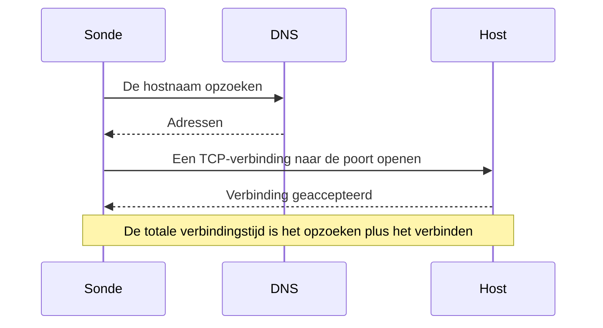

# Poort-monitor

Een poortmonitor controleert of een host TCP-verbindingen op een poort accepteert, en meet hoe lang het verbinden duurt. Gebruik hem voor diensten die geen HTTP spreken, of waarvan u de HTTP niet wilt controleren: databases, mailservers, SSH, message brokers en dergelijke.

:::cards
- [De monitor maken](#een-poortmonitor-maken): Zes stappen in het dashboard.
- [Verbindingstijden](#verbindingstijden): Wat de DNS-, TCP- en totale tijden meten.
- [Bewakingscriteria](#bewakingscriteria): Bereikbaarheid en verbindingstijden.
- [Problemen oplossen](#problemen-oplossen): Wanneer de dienst draait maar de monitor offline meldt.
:::

## Hoe het werkt

Bij elke controle zoekt een sonde de hostnaam op, als u er een opgaf, en opent een TCP-verbinding naar de poort. De poort is online zodra de verbinding wordt geaccepteerd; de sonde sluit haar dan zonder iets te versturen. Een verbinding die wordt geweigerd of een time-out bereikt, wordt opnieuw geprobeerd, tot het aantal nieuwe pogingen dat u toestaat. Daarna haalt OneUptime het resultaat door de criteria van de monitor.

De sonde opent alleen TCP-verbindingen: een dienst die alleen op UDP luistert, zoals een SNMP-agent, kan niet met een poortmonitor worden gecontroleerd.

Wanneer een controle mislukt, traceert de sonde ook de route naar de host en zoekt zijn naam op, en voegt wat ze vond aan het resultaat toe als **Network Path at Time of Failure**, zodat u ziet waar de route brak. Een sonde die haar eigen netwerkverbinding kwijt is, meldt geen resultaat, en kan uw dienst dus niet als offline markeren.

## Voordat u begint

- **Een rol die monitoren mag maken**: Project Owner, Project Admin, Project Member, Monitor Admin of Monitor Member, of een aangepaste rol met de machtiging Create Monitor.
- **Een sonde die de poort kan bereiken.** De standaardsondes van uw project worden voor elke nieuwe monitor gekozen. Staat er een firewall voor de dienst, sta dan de [IP-adressen van de sondes van OneUptime Cloud](/docs/configuration/ip-addresses) toe om met de poort te verbinden. Een dienst in een privénetwerk, zoals een database, heeft een [aangepaste sonde](/docs/probe/custom-probe) in dat netwerk nodig.

## Een poortmonitor maken

:::steps
### Een nieuwe monitor beginnen

Ga naar **Monitoren** en klik op **Monitor maken**. Kies onder **Monitortype** het type **Poort**.

### Hem een naam geven

Vul een **Naam** in, zoals `Orders database`, en klik dan op **Volgende**.

### De host en de poort invullen

Vul onder **Hostnaam of IP-adres** de host in waarop de poort zit, zoals `db.example.com` of `10.0.0.12`. Vul onder **Poort** het poortnummer in, zoals `5432`.

### Hem testen

Klik op **Monitor testen**, kies een sonde onder **Selecteer sonde** en klik op **Test uitvoeren**. **Testresultaat van monitor** toont of de verbinding openging, en hoe lang elk deel duurde.

### De criteria nakijken

**Monitorcriteria** begint met de [standaardcriteria](#standaardcriteria): offline wanneer de poort geen verbinding accepteert, online wanneer hij er een accepteert. Wijzig ze indien nodig en klik dan op **Volgende**.

### Sondes kiezen en maken

Houd of wijzig de **Sondes** en het **Bewakingsinterval** (het begint bij **Elke 5 minuten**) en klik dan op **Monitor maken**. De pagina van de monitor opent.
:::

## Configuratieopties

| Veld | Standaard | Wat u invult |
| --- | --- | --- |
| **Hostnaam of IP-adres** | Geen | De host, zoals `example.com`, `192.168.1.1` of `2001:db8::1`. Vul alleen de host in, zonder `http://`. |
| **Poort** | Geen | De TCP-poort waarmee verbonden wordt, van `1` tot `65535`. |
| **Aanvraagtime-out (seconden)** (onder **Meer velden**) | `60` | Hoe lang één poging mag duren, het DNS-opzoeken en de TCP-verbinding samen. Het maximum is 60 seconden. |
| **Nieuwe pogingen bij mislukking** (onder **Meer velden**) | Standaard van de sonde, meestal `3` | Hoe vaak een mislukte poging opnieuw wordt geprobeerd. Het maximum is 3. |

**Nieuwe pogingen bij mislukking** telt de nieuwe pogingen _na_ de eerste poging, dus `0` voert de controle één keer uit en `2` tot drie keer. Leeg gelaten gebruikt het de standaard van de sonde: 3, tenzij `PROBE_MONITOR_RETRY_LIMIT` van de sonde iets anders zegt. Elke fout wordt opnieuw geprobeerd, time-outs inbegrepen, met een pauze van één seconde tussen pogingen. Ook een geslaagde verbinding die langer dan 10 seconden duurde, wordt opnieuw gecontroleerd.

Veelgebruikte poorten:

| Poort | Dienst |
| --- | --- |
| `22` | SSH |
| `25` | SMTP |
| `80` | HTTP |
| `443` | HTTPS |
| `3306` | MySQL |
| `5432` | PostgreSQL |
| `6379` | Redis |
| `27017` | MongoDB |

> [!NOTE]
> Veel hostingproviders blokkeren uitgaande SMTP. Op een sonde die geen pings kan versturen, en zo merkt een sonde dat ze bij zo'n provider draait, telt een controle van poort `25` die een time-out bereikt als online. Om poort `25` van een mailserver betrouwbaar te controleren, draait u de monitor op een [aangepaste sonde](/docs/probe/custom-probe) die ermee mag verbinden.

## Verbindingstijden

Voor een hostnaam meet de sonde de controle in twee fasen:

| Fase | Van | Tot |
| --- | --- | --- |
| **DNS-opzoeking** | Het begin van de controle | De eerste TCP-verbindingspoging |
| **TCP-verbinding** | De eerste TCP-verbindingspoging | Het accepteren van de verbinding, inclusief de tijd die nodig is om tussen IPv6- en IPv4-adressen te wisselen |

**Total Connection Time (DNS + TCP)** loopt van het begin van de controle tot de verbinding wordt geaccepteerd. Het is ook de reactietijd van de poortmonitor, zodat bestaande criteria, waarschuwingen en grafieken die de reactietijd gebruiken blijven werken.

Wanneer het doel een IP-adres is, is er geen DNS-opzoeking, dus die fase valt weg. Controleresultaten van vóór de fasetijden tonen alleen de totale verbindingstijd.

## Bewakingscriteria

Criteria bepalen wanneer de poort als online, verminderd of offline telt, en of dat een incident meldt of een waarschuwing maakt. Elk criterium controleert een of meer filters:

| Filter | Voorwaarden | Wat het controleert |
| --- | --- | --- |
| **Is Online** | **Waar**, **Onwaar** | Of de poort een verbinding accepteerde. |
| **Total Connection Time (DNS + TCP) (in ms)** | **Greater Than**, **Less Than**, **Greater Than Or Equal To**, **Less Than Or Equal To** | De volledige verbindingstijd, inclusief het DNS-opzoeken voor een hostnaam. |
| **Port DNS Lookup Time (in ms)** | **Greater Than**, **Less Than**, **Greater Than Or Equal To**, **Less Than Or Equal To** | Het DNS-opzoeken vóór de eerste TCP-poging. Het heeft geen waarde wanneer het doel een IP-adres is. |
| **Port TCP Connect Time (in ms)** | **Greater Than**, **Less Than**, **Greater Than Or Equal To**, **Less Than Or Equal To** | Van de eerste TCP-poging tot de verbinding wordt geaccepteerd, inclusief het wisselen tussen IPv6 en IPv4. |
| **Is Request Timeout** | **Waar**, **Onwaar** | Of het DNS-opzoeken of de TCP-verbinding bij elke poging de time-out overschreed. |

Een criterium op de DNS-opzoektijd heeft niets te evalueren wanneer het doel een IP-adres is. Gebruik voor criteria die met hostnamen en IP-adressen gelijk moeten werken de totale tijd of de TCP-verbindingstijd.

Bij twee of meer filters bepaalt **Overeenkomstvoorwaarde** of **Alle** moeten overeenkomen of dat **Elke** afzonderlijke filter volstaat. De **Acties** van een criterium bepalen wat het doet: de monitorstatus wijzigen, een waarschuwing maken, een incident melden, of meerdere daarvan.

### Standaardcriteria

Een nieuwe poortmonitor begint met twee criteria:

- **Offline** — de poort accepteert na alle nieuwe pogingen geen verbinding. De monitor wordt als **Offline** gemarkeerd en er wordt een incident met de naam "_monitor name_ is offline" gemaakt. Het incident lost zichzelf op wanneer de poort weer verbindingen accepteert.
- **Bereikbaar** — de poort accepteert een verbinding. De monitor wordt als **Operationeel** gemarkeerd.

Criteria worden van boven naar beneden gecontroleerd, en het eerste dat overeenkomt bepaalt wat er gebeurt. Komt er geen overeen, dan toont de monitor zijn standaardstatus: **Operationeel**, tenzij u onder **Meer velden** onder de criteria een andere kiest.

### Over een periode evalueren

**Evalueer deze criteria over een bepaalde periode** is een selectievakje onder een filter, aangeboden voor **Is Online**, **Total Connection Time (DNS + TCP) (in ms)**, **Port DNS Lookup Time (in ms)** en **Port TCP Connect Time (in ms)**. Zet het aan om een venster van eerdere controles te beoordelen in plaats van alleen de laatste: kies een aggregatie onder **Evalueren** en een venster, van 2 tot 60 minuten, onder **Voor de laatste (in minuten)**.

| Aggregatie | Komt overeen wanneer |
| --- | --- |
| **Gemiddelde**, **Som**, **Maximum Value**, **Minimum Value** | Dat getal, over het venster, aan de voorwaarde voldoet. Alleen numerieke filters. |
| **All Values** | Elke controle in het venster aan de voorwaarde voldoet. |
| **Any Value** | Minstens één controle in het venster aan de voorwaarde voldoet. |

**All Values** komt pas overeen wanneer het venster echt met gegevens gevuld is. Een monitor die net is gemaakt, of een waarvan de controles niet meer werden vastgelegd, heeft niet genoeg geschiedenis om iets over de laatste N minuten te zeggen, dus het criterium wacht in plaats van overeen te komen op de ene meting die het heeft. **Any Value** is de instelling voor "laat het me weten zodra één controle de grens overschrijdt" en slaat nog steeds meteen aan.

**Als geen gegevens** bepaalt wat er gebeurt zolang het venster het criterium niet kan onderbouwen:

| Optie | Wat er gebeurt | Gebruik het voor |
| --- | --- | --- |
| **Ignore** (standaard) | Het criterium komt niet overeen. | Gewone drempelwaarschuwingen. |
| **Trigger** | De ontbrekende gegevens tellen als het probleem. | Controles waarbij stilte zelf een storing is. |
| **Treat As Zero** | Het venster wordt vergeleken als één nul. | Tellers waarbij geen gebeurtenissen echt nul betekent. |

### Voorbeeldcriteria

| Doel | Filter | Voorwaarde | Waarde |
| --- | --- | --- | --- |
| Offline wanneer de poort dicht is | **Is Online** | **Onwaar** | — |
| Waarschuwen wanneer verbinden traag gaat | **Total Connection Time (DNS + TCP) (in ms)** | **Greater Than** | `500` |
| De dienst als verminderd markeren wanneer hij traag verbindt | **Total Connection Time (DNS + TCP) (in ms)** | **Greater Than** | `200` |
| Waarschuwen wanneer DNS traag is | **Port DNS Lookup Time (in ms)** | **Greater Than** | `100` |
| Waarschuwen wanneer de TCP-handshake traag is | **Port TCP Connect Time (in ms)** | **Greater Than** | `250` |

## Problemen oplossen

:::details De dienst draait, maar de monitor meldt offline
De sonde kon geen verbinding openen: een firewall laat haar vallen, de dienst luistert alleen op een privé-interface, of de poort klopt niet. De hoofdoorzaak van het incident, en **Monitoringlogboeken** bij de monitor, tonen de fout, en **Network Path at Time of Failure** toont hoe ver de route kwam. Laat de sondes door de firewall, of gebruik een [aangepaste sonde](/docs/probe/custom-probe) binnen het netwerk.
:::

:::details De DNS-opzoektijd is altijd leeg
Het doel is een IP-adres, dus er valt niets op te zoeken. Gebruik in plaats daarvan **Total Connection Time (DNS + TCP) (in ms)** of **Port TCP Connect Time (in ms)**.
:::

:::details Ik moet een UDP-dienst controleren
Poortmonitoren openen alleen TCP-verbindingen. Gebruik voor een DNS-server een [DNS-monitor](/docs/monitor/dns-monitor), en voor een tijdserver op UDP-poort 123 een [NTP-monitor](/docs/monitor/ntp-monitor). Beide sturen echte query's.
:::

## Volgende stappen

:::cards
- [Ping-monitor](/docs/monitor/ping-monitor): Controleren of de host zelf bereikbaar is.
- [SSL-certificaat-monitor](/docs/monitor/ssl-certificate-monitor): Het certificaat op een TLS-poort controleren.
- [Databasegezondheid-monitor](/docs/monitor/database-health-monitor): Verder kijken dan een open poort en de gezondheid van een database bewaken.
- [Aangepaste probes](/docs/probe/custom-probe): Poorten in uw eigen netwerk controleren.
:::
