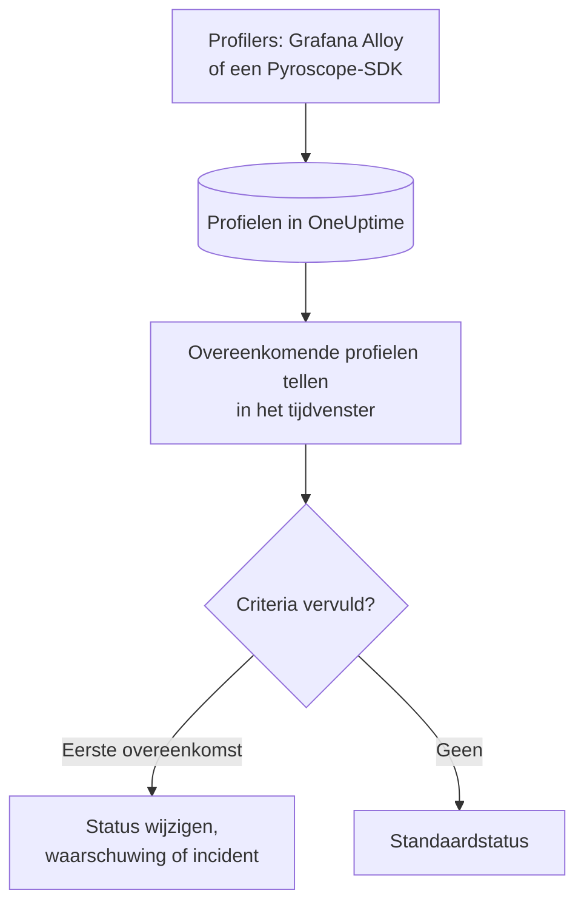

# Profielen-monitor

Een profielen-monitor telt binnen een tijdvenster de continue profielen die uw services naar OneUptime sturen en die aan uw filters voldoen (profieltype, service, attributen). Wanneer het aantal aan uw criteria voldoet, wijzigt hij de status van de monitor, maakt hij een waarschuwing aan of meldt hij een incident. Hij dient vooral om te merken wanneer profileringsgegevens van een service niet meer binnenkomen.

> [!IMPORTANT]
> **Monitor maken** in het dashboard biedt Profiles niet aan: er is nog geen formulier voor de filters ervan. Maak een profielen-monitor via de [API](/docs/api-reference/api-reference) of [Terraform](/docs/terraform/monitor-steps), zoals hieronder beschreven. Zodra hij bestaat, kunt u de criteria ervan bekijken en bewerken op de pagina **Criteria** van de monitor in het dashboard; de filters zijn alleen via de API of Terraform te wijzigen.

:::cards
- [De monitor maken](#een-profielen-monitor-maken): De configuratie die u via de API of Terraform stuurt.
- [Wat hij opvraagt](#wat-hij-opvraagt): Profieltypen, services, attributen en het venster.
- [Criteria](#criteria): De voorwaarden die u kunt gebruiken.
- [Uitgewerkt voorbeeld](#uitgewerkt-voorbeeld-profielen-komen-niet-meer-binnen): Weten wanneer een service geen profielen meer stuurt.
:::

## Hoe het werkt



Elke minuut telt OneUptime de profielen die aan de filters van de monitor voldoen en binnen het tijdvenster zijn begonnen. Dat aantal vergelijkt het van boven naar beneden met de criteria van de monitor, en het eerste criterium dat overeenkomt, bepaalt wat er gebeurt. Komt er geen overeen, dan gaat de monitor terug naar zijn standaardstatus.

## Voordat u begint

- Uw services sturen continue profileringsgegevens naar OneUptime, via Grafana Alloy (eBPF) of een Pyroscope-SDK. Zie [Continue profilering](/docs/telemetry/profiles).
- U hebt een API-sleutel die monitoren mag maken, of de Terraform-provider van OneUptime is ingesteld.
- U kent het ID van elke telemetrieservice die u wilt bewaken, en de profieltypen die ze stuurt, zoals `cpu`, `wall`, `alloc_objects`, `alloc_space` of `goroutine`.

## Een profielen-monitor maken

:::steps
### Kiezen wat u telt

Schrijf de `profileMonitor`-configuratie van de stap. Deze telt de CPU-profielen van één service over de laatste vijf minuten:

```json
{
  "profileMonitor": {
    "telemetryServiceIds": [],
    "profileTypes": ["cpu"],
    "profileType": "",
    "attributes": {},
    "lastXSecondsOfProfiles": 300
  }
}
```

Zet het ID van de service in `telemetryServiceIds`, of laat de lijst leeg om profielen van elke service te tellen. [Wat hij opvraagt](#wat-hij-opvraagt) beschrijft elk veld.

### De monitor maken

Maak via de [API](/docs/api-reference/api-reference) of [Terraform](/docs/terraform/monitor-steps) een monitor met het monitortype `Profiles` en een stap die deze configuratie en minstens één criterium bevat. Geef de configuratie in Terraform door als het attribuut `profile_monitor` van de stap, geschreven met `jsonencode()`.

### Hem controleren in het dashboard

Open de monitor vanuit **Monitoren**. Zijn eerste evaluatie volgt binnen een minuut, en zijn status verandert zodra een criterium overeenkomt.
:::

## Wat hij opvraagt

| Veld | Waarmee het overeenkomt | Standaard |
| --- | --- | --- |
| `profileTypes` | Profielen van een van deze typen, exact vergeleken, zoals `cpu`. | Leeg: elk type |
| `profileType` | Profielen waarvan het type deze tekst bevat, zonder onderscheid tussen hoofd- en kleine letters. Wanneer dit is ingesteld, wordt `profileTypes` genegeerd. | Leeg |
| `telemetryServiceIds` | Profielen van een van deze telemetrieservices. | Leeg: elke service |
| `entityKeys` | Profielen van een van deze hosts, pods, containers en andere infrastructuurentiteiten. | Leeg: elke entiteit |
| `attributes` | Profielen waarvan de attributen deze waarden hebben. | Leeg: geen voorwaarde |
| `lastXSecondsOfProfiles` | Profielen die binnen dit aantal seconden vóór de evaluatie zijn begonnen. | Geen: stel dit altijd in, anders wordt elk opgeslagen profiel geteld en zakt het aantal nooit naar 0 |

Alle filters die u instelt, moeten overeenkomen voordat een profiel wordt geteld.

## Hoe hij wordt geëvalueerd

- **Elke minuut.** Een profielen-monitor wordt niet door sondes gecontroleerd, dus hij heeft geen interval om in te stellen en geen pagina **Sondes en interval**.
- **Eén getal per evaluatie.** De monitor telt de profielen die aan elk filter voldoen en binnen `lastXSecondsOfProfiles` zijn begonnen. Een profiler uploadt met een vaste tussenpoos, dus geef het venster ruimte voor meerdere uploads.
- **Geen profielen is een aantal van 0.** Een service waarvan de profiler niet meer uploadt, levert 0 op.
- **De onderbreking van OneUptime zelf is geen stilte.** Zolang het tijdvenster tijd bevat waarin OneUptime zelf geen gegevens ontving (het startte opnieuw, werd geüpgraded of werkte een achterstand weg), wacht de controle: de status verandert niet, en er wordt geen incident of waarschuwing geopend of opgelost. Zie [Als OneUptime geen gegevens ontvangt](/docs/monitor/when-oneuptime-is-not-receiving).
- **Criteria van boven naar beneden.** Het eerste criterium dat overeenkomt, beslist, dus zet het ernstigste bovenaan.

Elke statuswijziging wordt, met de reden ervan, vastgelegd op de **Statustijdlijn** van de monitor.

## Criteria

De criteria van een profielen-monitor hebben één filter, **Profile Count**: het aantal profielen dat in het venster overeenkwam. Vergelijk het met een waarde:

| Filtervoorwaarde | Komt overeen wanneer het aantal profielen… |
| --- | --- |
| **Greater Than** | boven de waarde ligt |
| **Greater Than Or Equal To** | gelijk is aan de waarde of hoger |
| **Less Than** | onder de waarde ligt |
| **Less Than Or Equal To** | gelijk is aan de waarde of lager |
| **Equal To** | precies de waarde is |
| **Not Equal To** | alles behalve de waarde is |

Aantallen profielen hebben geen anomaliecondities: er is geen baseline om ze mee te vergelijken.

## Uitgewerkt voorbeeld: profielen komen niet meer binnen

De checkout-service draait een Pyroscope-SDK die CPU-profielen uploadt. U wilt een incident wanneer die vijf minuten lang uitblijven:

- `profileTypes`: `["cpu"]`, `telemetryServiceIds`: de checkout-service, `lastXSecondsOfProfiles`: `300`
- Criterium 1: **Profile Count** **Equal To** `0`: de monitor offline zetten en een incident melden
- Criterium 2: **Profile Count** **Greater Than** `0`: de monitor online zetten

Zolang de SDK uploadt, telt elke evaluatie enkele profielen en houdt criterium 2 de monitor online. Wanneer de service zonder de SDK wordt uitgerold, zakt het aantal vijf minuten na de laatste upload naar 0, komt criterium 1 overeen en wordt het incident gemeld. De eerste upload na de oplossing brengt het aantal weer boven 0, en het incident lost zichzelf op als **Incident automatisch oplossen** ervoor aan staat.

## Problemen oplossen

:::details De monitor telt 0, maar er verschijnen wel profielen in OneUptime
Vergelijk de filters met de profielen die u ziet: `profileTypes` moet precies met het type overeenkomen, en `telemetryServiceIds` moet de juiste service-ID's bevatten. Een korte `lastXSecondsOfProfiles` kan ook tussen twee uploads vallen.
:::

:::details Profiles ontbreekt bij Monitor maken
Dat is de bedoeling: het dashboard heeft nog geen formulier voor de filters van een profielen-monitor. Maak hem via de API of Terraform, zoals beschreven in [Een profielen-monitor maken](#een-profielen-monitor-maken).
:::

## Volgende stappen

:::cards
- [Continue profilering](/docs/telemetry/profiles): Stuur profielen vanuit Grafana Alloy of een Pyroscope-SDK.
- [Monitorstappen](/docs/terraform/monitor-steps): Geef de configuratie van de stap door vanuit Terraform.
- [Traces-monitor](/docs/monitor/traces-monitor): Word gewaarschuwd voor mislukte spans.
- [Metrics-monitor](/docs/monitor/metrics-monitor): Word gewaarschuwd op CPU, geheugen en andere metrieken.
:::
