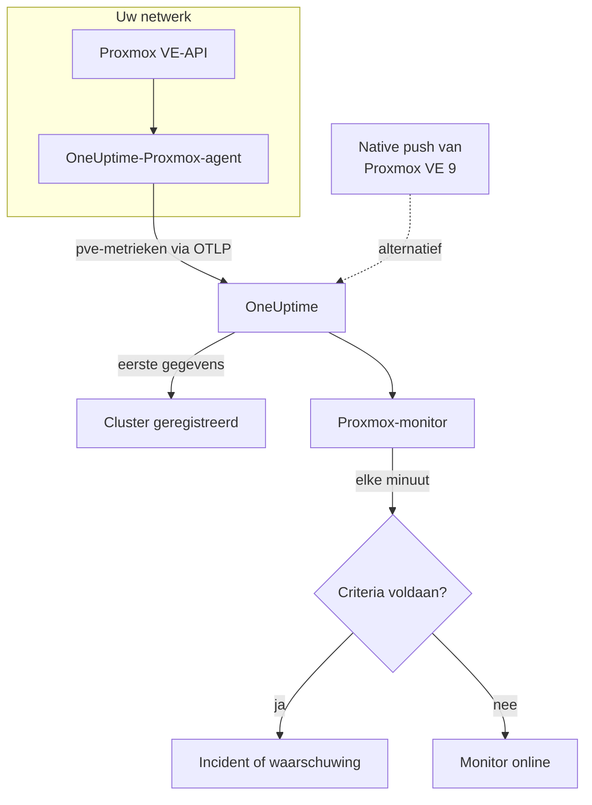

# Proxmox-monitor

Een Proxmox-monitor bewaakt één Proxmox VE-cluster – de nodes, VM's en LXC-containers, de opslag, de HA-status, de dekking door back-uptaken en de opslagreplicatie – en laat u weten wanneer een node offline gaat, een gast stopt of de opslag volloopt. Hij leest de metrieken `pve_*` die de OneUptime-Proxmox-agent verzamelt, dus er wordt niets van buitenaf gepeild.

:::cards
- [De monitor maken](#een-proxmox-monitor-maken): Zes stappen in het dashboard.
- [Sjablonen](#kant-en-klare-waarschuwingssjablonen): Elf kant-en-klare waarschuwingen, één incident per node, gast of volume.
- [Resource-identiteit](#resource-identiteit): Hoe u één node, gast of opslagvolume target.
- [Metrieken](#verzamelde-metrieken): Elke reeks `pve_*` waarop de monitor kan waarschuwen.
:::

## Hoe het werkt

De OneUptime-Proxmox-agent draait op een machine die de Proxmox VE-API kan bereiken. Elke 30 seconden leest hij prometheus-pve-exporter uit met de cluster- en nodecollectors, labelt hij elke reeks met de resource die ze beschrijft, en stuurt hij de metrieken via OTLP naar OneUptime, voorzien van de naam van het cluster, `proxmox.cluster.name`. De eerste gegevens registreren het cluster. Proxmox VE 9 en later kan metrieken in plaats daarvan zelf pushen, zonder iets te installeren; zie [de native push](#de-native-push-van-proxmox-ve).

Een Proxmox-monitor is aan één cluster gebonden. Elke minuut voert hij zijn query uit over de metrieken van dat cluster en vergelijkt hij het resultaat met zijn criteria.

## Voordat u begint

- **Installeer de Proxmox-agent** op een plek waar hij de Proxmox VE-API bereikt, met een alleen-lezen API-token. De [handleiding voor de Proxmox-agent](/docs/telemetry/proxmox) behandelt het token, de installatie en de native push.
- **Controleer of het cluster is geregistreerd.** Het verschijnt ongeveer een minuut na de eerste uitlezing onder **Producten → Infrastructuur → Proxmox → Alle clusters**, genoemd naar de `PROXMOX_CLUSTER_NAME` van de agent.

## Een Proxmox-monitor maken

:::steps
### Een nieuwe monitor beginnen

Ga naar **Monitoren** en klik op **Monitor maken**.

### Proxmox kiezen

Klik onder **Monitortype** op **Meer monitortypen** en kies **Proxmox** onder **Infrastructuur**, of typ `proxmox` in het zoekvak. Vul een **Naam** in – die wordt gebruikt in de titels van incidenten en waarschuwingen – en klik op **Volgende**.

### Het cluster kiezen

Kies onder **Proxmox Monitor Configuration** het cluster in **Proxmox Cluster**. Elk cluster dat gegevens heeft verstuurd, staat in de lijst.

### Kiezen wat u bewaakt

Kies een van de drie tabbladen:

- **Quick Setup** – klik op een [sjabloon](#kant-en-klare-waarschuwingssjablonen). Het stelt de metrieken, filters, de aggregatie, het tijdsbereik en de drempels in, en vervangt de criteria hieronder door die van het sjabloon. Het **Tijdsbereik** kunt u nog wijzigen.
- **Custom Metric** – kies één metriek in **Proxmox Metric** en stel dan **Aggregatie** en **Tijdsbereik** in. De [filters](#monitorinstellingen) beperken hem tot een soort resource of tot één resource.
- **Geavanceerd** – bouw zelf query's en formules onder **Selecteer metrieken**, bijvoorbeeld een geheugenpercentage uit `pve_memory_usage_bytes / pve_memory_size_bytes`. Gebruik **Group by** `id` om elke resource afzonderlijk te beoordelen.

### De criteria controleren

Open elk criterium onder **Monitorcriteria** en controleer de **Metriek**, **Aggregatie**, **Voorwaarde** en **Threshold**. Een sjabloon vult deze in. Met **Custom Metric** of **Geavanceerd** begint de monitor met de [standaardcriteria](#standaardcriteria), die alleen opmerken dat een metriek naar nul zakt; stel daarom uw eigen drempel in.

### De monitor maken

Klik op **Monitor maken**. OneUptime opent de pagina van de monitor en evalueert hem elke minuut. Incidenten en waarschuwingen die hij opent, staan ook op de pagina's **Incidenten** en **Waarschuwingen** van het cluster.
:::

> [!TIP]
> Om meerdere sjablonen tegelijk in te stellen, opent u het cluster via **Producten → Infrastructuur → Proxmox** en gaat u naar **Recommendations**. Kies de sjablonen die u wilt en wie wordt opgeroepen, en OneUptime maakt één monitor per sjabloon.

## Monitorinstellingen

| Veld | Tabblad | Wat het doet |
| --- | --- | --- |
| **Proxmox Cluster** | Alle | Verplicht. Beperkt elke query tot `resource.proxmox.cluster.name`. |
| **Resourcebereik** | Custom Metric, Geavanceerd | Optioneel. **Node**, **Guest (VM / container)**, **Opslag** of **Cluster** – een exacte overeenkomst met `pve.scope`. |
| **PVE ID** | Custom Metric, Geavanceerd | Optioneel. Exacte overeenkomst met `pve.id`: een nodenaam (`pve1`), een VMID (`100`) of `<node>/<storage>` (`pve1/local`). Combineer het met een bereik om één resource te targeten. |
| **Nodenaam** | Custom Metric, Geavanceerd | Optioneel. Alleen de eigen reeksen van een node (`pve.scope = node` en `pve.id`). Het kan niet de gasten of de opslag op die node selecteren. |
| **Guest ID** | Custom Metric, Geavanceerd | Optioneel. Exacte overeenkomst met het ruwe label `id`, zoals `qemu/100` of `lxc/101`. Als het is ingesteld, worden de andere filters genegeerd. |
| **Proxmox Metric** | Custom Metric | Eén metriek uit de [catalogus](#verzamelde-metrieken). |
| **Aggregatie** | Custom Metric | Hoe metingen worden gecombineerd: **Gemiddelde**, **Maximum**, **Minimum**, **Som** of **Aantal**. Begint bij de gebruikelijke aggregatie van de metriek. |
| **Tijdsbereik** | Alle | Het schuivende venster dat de query leest, van **Past 1 Minute** tot **Past 365 Days**. Een nieuwe monitor begint bij **Past 1 Minute**; sjablonen stellen hun eigen in. |
| **Selecteer metrieken** | Geavanceerd | De querybouwer: **Metriek**, **Aggregate by**, **Filter by attributes**, **Group by**, plus **Metriek toevoegen** en **Formule toevoegen** om query's te combineren. |

## Resource-identiteit

Elke reeks draagt een datapuntlabel `id` dat de Proxmox-resource noemt waartoe ze behoort:

| Waarde van `id` | Resource |
| --- | --- |
| `node/<name>` | Een clusternode, bijvoorbeeld `node/pve1`. |
| `qemu/<vmid>` | Een virtuele QEMU-machine, bijvoorbeeld `qemu/100`. |
| `lxc/<vmid>` | Een LXC-container, bijvoorbeeld `lxc/101`. |
| `storage/<node>/<storage>` | Een opslagvolume op een node, bijvoorbeeld `storage/pve1/local`. |

Twee uitzonderingen: replicatiereeksen (`pve_replication_*`) dragen de id van de replicatie-**taak** in `id` (bijvoorbeeld `100-0`), en de clusterbrede `pve_not_backed_up_total` heeft helemaal geen `id`.

Filters vergelijken op gelijkheid, niet op een voorvoegsel, dus de agent splitst `id` ook in drie attributen waarop u kunt filteren. De sjablonen steunen erop:

| Attribuut | Waarden | Voor `qemu/100` |
| --- | --- | --- |
| `pve.scope` | `node`, `guest`, `storage`, `cluster` (`qemu` en `lxc` zijn beide `guest`) | `guest` |
| `pve.type` | `node`, `qemu`, `lxc`, `storage` | `qemu` |
| `pve.id` | Alles na de eerste `/` van `id` (`pve1`, `100`, `pve1/local`) | `100` |

Filter op `pve.scope` of `pve.type` voor één soort resource, op `pve.id` of `id` voor één resource, en groepeer op `id` om elke resource afzonderlijk te beoordelen.

## Kant-en-klare waarschuwingssjablonen

**Quick Setup** biedt 11 sjablonen. Elk bouwt een complete monitor – query's, attribuutfilters, een groepering, een criterium dat afgaat en een dat herstelt. De meeste groeperen op `id`, zodat elke node, gast, elk volume of elke taak een eigen incident en een eigen waarschuwing krijgt. De drempels zijn uitgangspunten die u kunt aanpassen.

Sjablonen lezen de laatste 5 minuten, tenzij de tabel iets anders zegt. Een criterium gaat alleen af als de voorwaarde elke minuut van zijn venster geldt, en een drempelcriterium herstelt 10% voorbij zijn drempel, zodat een waarde die rond de grens schommelt niet heen en weer springt.

| Sjabloon | Ernst | Bewaakt | Gaat af als | Herstelt als |
| --- | --- | --- | --- | --- |
| Node Offline | Kritiek | `pve_up` voor `pve.scope = node`, Min per `id` | Onder 1 | Op 1 |
| Guest Down | Warning | `pve_up` en `pve_onboot_status` voor `pve.scope = guest`, Min per `id` | `pve_up` ligt onder 1 terwijl `pve_onboot_status` 1 is | `pve_up` staat weer op 1, of starten bij het opstarten is uitgezet |
| Cluster Quorum at Risk | Kritiek | `pve_up` ÷ `pve_node_info` × 100 voor `pve.scope = node` (beide Som): het aandeel nodes dat online is | 50% of minder | Boven 55% |
| High Node CPU Usage | Warning | `pve_cpu_usage_ratio` voor `pve.scope = node`, Avg per `id` | Boven 0,9 (90% van de kernen van de node) | Op of onder 0,81 |
| High Node Memory Usage | Warning | `pve_memory_usage_bytes` ÷ `pve_memory_size_bytes` × 100 voor `pve.scope = node`, per `id` | Boven 85% | Op of onder 76,5% |
| High Guest CPU Usage | Warning | `pve_cpu_usage_ratio` voor `pve.scope = guest`, Avg per `id`, laatste 15 minuten | Boven 0,95 (95% van zijn vCPU's) gedurende alle 15 minuten | Op of onder 0,855 |
| Storage Near Full | Warning | `pve_disk_usage_bytes` ÷ `pve_disk_size_bytes` × 100 voor `pve.scope = storage`, per `id` | Boven 85% | Op of onder 76,5% |
| Container Root Disk Near Full | Warning | Dezelfde schijfverhouding voor `pve.type = lxc`, per `id` | Boven 90% | Op of onder 81% |
| HA Resource in Error State | Kritiek | `pve_ha_state` voor `state = error`, Max per `id` | Boven 0 | Op 0 |
| Guest Not Backed Up | Warning | `pve_not_backed_up_total`, Max (één clusterbrede reeks) | Boven 0 | Op 0 |
| Replication Failing | Kritiek | `pve_replication_failed_syncs`, Max per `id` (de taak-id) | Boven 0 | Op 0 |

**Ernst** is het label dat de keuzelijst toont. Het incident en de waarschuwing die een sjabloon maakt, beginnen op het zwaarste incident- en waarschuwingsernstniveau van uw project; wijzig ze in de criteria.

- **De sjablonen voor uitval gebruiken Minimum**, zodat één uitlezing waarin de resource uit lag ze laat afgaan, in plaats van verborgen te worden door uitlezingen waarin hij draaide.
- **Guest Down** kijkt alleen naar gasten die bij het opstarten van de node moeten starten, dus een gast die u bewust hebt gestopt, roept nooit iemand op.
- **Cluster Quorum at Risk** is een benadering: pve-exporter heeft geen corosync-metriek, dus het sjabloon telt de nodes die online zijn.
- **High Guest CPU Usage** ligt hoger en reageert trager dan het nodesjabloon: een gast hoort zijn vCPU's te gebruiken, dus alleen een gast die nooit terugzakt, roept iemand op.
- **Verhoudingsformules** nemen aan beide kanten de **Som**. Beide komen uit dezelfde uitlezing, dus het resultaat is een echt percentage.
- **Container Root Disk Near Full** laat QEMU-VM's buiten beschouwing: hun schijfgebruik staat zonder de QEMU-gastagent op 0.
- **Guest Not Backed Up** dekt alleen het lidmaatschap van back-uptaken. pve-exporter zegt niet of back-ups zijn uitgevoerd of geslaagd; groepeer `pve_not_backed_up_info` op `id` om de gasten op te sommen.
- **Verouderde replicatie** (nu min de laatste synchronisatie) kan geen waarschuwing geven, omdat criteria niet met de klok kunnen rekenen. De pagina **Overzicht** van het cluster toont het; waarschuw in plaats daarvan met **Replication Failing**.

### De native push van Proxmox VE

Proxmox VE 9 en later kan metrieken pushen via zijn ingebouwde OpenTelemetry-metriekserver, zonder iets te installeren – zie de [handleiding voor de Proxmox-agent](/docs/telemetry/proxmox). OneUptime zet de push om in dezelfde reeksen `pve_*`, dus de catalogus en de sjablonen voor CPU, geheugen en opslag werken ermee.

**Node Offline** en **Cluster Quorum at Risk** werken ook: elke node pusht alleen zijn eigen status, dus een node die niet meer rapporteert, wordt door de nodes die nog leven als uitgevallen gemeld (`pve_up` = 0) – zie [Als een node niet meer rapporteert](/docs/telemetry/proxmox#when-a-node-stops-reporting). **Guest Down**, **HA Resource in Error State**, **Guest Not Backed Up** en **Replication Failing** hebben gegevens nodig die alleen de agent verzamelt.

## Verzamelde metrieken

De agent leest prometheus-pve-exporter elke 30 seconden uit met zowel de cluster- als de nodecollectors, wat ook de collectors `backup-info` en `replication` van de exporter dekt (beide standaard aan).

### Beschikbaarheid

| Metriek | Eenheid | Beschrijving |
| --- | --- | --- |
| `pve_up` | — | 1 als de node of gast actief is of draait, anders 0. |
| `pve_uptime_seconds` | seconden | Uptime van de node of gast. |
| `pve_version_info` | aantal | De Proxmox VE-release, in zijn labels. Altijd 1. |

### Node

| Metriek | Eenheid | Beschrijving |
| --- | --- | --- |
| `pve_node_info` | aantal | Nodemetadata, altijd 1. Tel ze op om de nodes te tellen die rapporteren. |
| `pve_cpu_usage_ratio` | verhouding | Gebruikte CPU als verhouding van 0–1 van de beschikbare CPU. |
| `pve_cpu_usage_limit` | kernen | Beschikbare CPU, in kernen. Voor een gast zijn vCPU's. |
| `pve_memory_usage_bytes` | bytes | Geheugen in gebruik. |
| `pve_memory_size_bytes` | bytes | Totaal geheugen. |

De CPU- en geheugenreeksen worden ook voor elke gast gerapporteerd, op id's `qemu/*` en `lxc/*`.

### Gast

| Metriek | Eenheid | Beschrijving |
| --- | --- | --- |
| `pve_guest_info` | aantal | Gastmetadata (naam, node, type `qemu` of `lxc`) in labels. Altijd 1. |
| `pve_network_receive_bytes` | bytes | Door de gast ontvangen bytes. Een teller over de hele levensduur. |
| `pve_network_transmit_bytes` | bytes | Door de gast verzonden bytes. Een teller over de hele levensduur. |
| `pve_disk_read_bytes` | bytes | Door de gast van schijf gelezen bytes. Een teller over de hele levensduur. |
| `pve_disk_write_bytes` | bytes | Door de gast naar schijf geschreven bytes. Een teller over de hele levensduur. |
| `pve_onboot_status` | aantal | 1 als de gast start wanneer de node opstart. Een gestopte gast waarvoor dit is ingesteld, is meestal ongeplande uitval. |

### Opslag

| Metriek | Eenheid | Beschrijving |
| --- | --- | --- |
| `pve_disk_usage_bytes` | bytes | Gebruikte bytes op de schijf of opslag. Voor een QEMU-gast staat dit op 0, tenzij de QEMU-gastagent is geïnstalleerd. |
| `pve_disk_size_bytes` | bytes | Totale grootte van de schijf of opslag. |
| `pve_storage_info` | aantal | Opslagmetadata, altijd 1. Tel ze op om de opslagvolumes te tellen. |

### HA

| Metriek | Eenheid | Beschrijving |
| --- | --- | --- |
| `pve_ha_state` | — | Eén reeks per HA-status (`started`, `stopped`, `error`, …) voor elke HA-resource, 1 op de huidige status. Filter op het label `state` om op een status te waarschuwen. |

### Back-up

Uit de collector `backup-info` van de exporter, op clusterniveau. Ze rapporteren alleen de dekking door back-up-**taken**:

| Metriek | Eenheid | Beschrijving |
| --- | --- | --- |
| `pve_not_backed_up_total` | aantal | Gasten in geen enkele back-uptaak. Eén clusterbrede reeks zonder `id`. |
| `pve_not_backed_up_info` | aantal | Eén reeks per niet-gedekte gast, altijd 1, gelabeld met de `id` van de gast. Ze verdwijnt zodra de gast aan een back-uptaak wordt toegevoegd. |

### Replicatie

Uit de collector `replication` van de exporter, op nodeniveau. De reeksen bestaan alleen als het cluster replicatietaken heeft, en dragen de taak-id in `id`:

| Metriek | Eenheid | Beschrijving |
| --- | --- | --- |
| `pve_replication_failed_syncs` | aantal | Mislukte synchronisatiepogingen op rij. Boven 0 betekent dat de replica veroudert. |
| `pve_replication_duration_seconds` | seconden | Hoe lang de laatste synchronisatie duurde. |
| `pve_replication_last_sync_timestamp_seconds` | seconden | Unix-tijd van de laatste **geslaagde** synchronisatie. |
| `pve_replication_last_try_timestamp_seconds` | seconden | Unix-tijd van de laatste **poging**. Nieuwer dan de laatste synchronisatie betekent dat de laatste poging is mislukt. |
| `pve_replication_next_sync_timestamp_seconds` | seconden | Unix-tijd van de volgende geplande synchronisatie. |
| `pve_replication_info` | aantal | Taakmetadata – type, bron, doel, gast – in labels. Altijd 1. |

## Bewakingscriteria

Een criterium vergelijkt een van de query's of formules van de monitor met een drempel. De criteria van een Proxmox-monitor hebben geen **Filtertype**: elke regel controleert de metriekwaarde, met deze velden.

| Veld | Wat het doet |
| --- | --- |
| **Metriek** | De query of formule die wordt gecontroleerd, op naam van de variabele. |
| **Aggregatie** | Hoe de waarden in het venster één antwoord worden: **Gemiddelde**, **Som**, **Maximum Value**, **Minimum Value**, **All Values** (elke waarde moet overeenkomen) of **Any Value** (één is genoeg). |
| **Voorwaarde** | **Greater Than**, **Less Than**, **Greater Than Or Equal To**, **Less Than Or Equal To** of **Equal To** – of een anomalievoorwaarde: **Anomalously High**, **Anomalously Low** of **Anomalous**. |
| **Threshold** | De waarde waarmee wordt vergeleken. Ernaast staat een lijst met eenheden als de metriek een eenheid heeft. Niet getoond bij anomalievoorwaarden. |
| **Gevoeligheid** | Alleen bij anomalievoorwaarden. **Laag** (4σ), **Gemiddeld** (3σ, de standaard) of **Hoog** (2σ). |
| **Baseline-venster** | Alleen bij anomalievoorwaarden. 14 dagen (de standaard), 28, 60 of 90 dagen geschiedenis. |
| **Als geen gegevens** | Onder **Meer velden**. Wat er gebeurt als het venster geen metingen bevat: **Ignore** (de standaard), **Treat As Zero** of **Trigger**. |

Anomalievoorwaarden vergelijken elke waarde met hetzelfde uur van de week in de baseline. Ze blijven in een "Learning"-status, en geven niets, tot het baseline-venster genoeg geschiedenis bevat.

Elk criterium zegt ook wat er moet gebeuren als het overeenkomt: de monitorstatus wijzigen, een waarschuwing maken of een incident melden. Criteria worden van boven naar beneden gecontroleerd, en het eerste dat overeenkomt, beslist.

### Standaardcriteria

Een monitor die u niet vanuit een sjabloon maakt, begint met twee criteria:

| Volgorde | Criterium | Komt overeen als | Dan |
| --- | --- | --- | --- |
| 1 | Check if _monitor name_ is offline | Een willekeurige waarde van de eerste query `0` is | Markeert de monitor als **Offline** en meldt het incident "_monitor name_ is offline", dat zichzelf oplost als de monitor herstelt. |
| 2 | Check if _monitor name_ is online | Een willekeurige waarde boven `0` ligt | Markeert de monitor als **Operationeel**. |

> [!IMPORTANT]
> Stilte komt met geen van beide criteria overeen: een cluster dat geen gegevens meer stuurt, laat de monitor zoals hij was. Om bericht te krijgen als er geen gegevens meer komen, zet u **Als geen gegevens** in een criterium op **Trigger**. Tijd waarin OneUptime zelf niet ontving, geldt nooit als ontbrekende gegevens: een controle waarvan het venster zulke tijd bevat, wacht in plaats daarvan, zoals [Als OneUptime geen gegevens ontvangt](/docs/monitor/when-oneuptime-is-not-receiving) uitlegt.

## Problemen oplossen

:::details Het cluster staat niet in de lijst Proxmox Cluster
Clusters registreren zichzelf uit de gegevens van de agent. Controleer of de agent draait en gegevens verstuurt (zie de [handleiding voor de Proxmox-agent](/docs/telemetry/proxmox)), en of `PROXMOX_CLUSTER_NAME` is ingesteld.
:::

:::details Gastmetrieken ontbreken
Gastreeksen komen uit de clustercollector van de exporter, die de meegeleverde configuratie aanzet met de uitleesparameter `cluster=1`. Als u de configuratie van de collector hebt gewijzigd, zet die dan terug.
:::

:::details High Node CPU Usage gaat nooit af
Het sjabloon middelt `pve_cpu_usage_ratio` per `id`, zodat elke node afzonderlijk wordt gecontroleerd. Als u uw eigen query hebt gebouwd, groepeer die dan op `id`: een gemiddelde over alle nodes wordt omlaag getrokken door de inactieve.
:::

:::details Node Offline blijft afgaan voor een node die u uit het cluster hebt verwijderd
Bij de native push van Proxmox VE ziet een node die uit het cluster is gehaald er hetzelfde uit als een node die is uitgevallen: hij rapporteert niet meer, dus de nodes die nog leven blijven hem als uitgevallen melden. Open de pagina van de node en klik op **Remove Node** – de node verdwijnt en zijn waarschuwing wordt opgelost. Anders blijft hij tot 7 dagen Offline. De agent heeft dit probleem niet: hij vraagt het aan het cluster, dat de node niet meer vermeldt.
:::

:::details Back-up- of replicatiemetrieken ontbreken
`pve_not_backed_up_*` komt uit de collector `backup-info` van de exporter en `pve_replication_*` uit zijn collector `replication`. Beide staan standaard aan en worden gedekt door de uitleesparameters `cluster=1` en `node=1` van de meegeleverde configuratie. Als u uw eigen exporter draait, controleer dan of u ze niet hebt uitgezet. `pve_replication_*` bestaat alleen als het cluster opslagreplicatietaken heeft.
:::

:::details Tellers zoals pve_network_receive_bytes groeien alleen maar
Netwerk- en schijf-I/O-reeksen zijn tellers over de hele levensduur, en criteria vergelijken ruwe waarden: er is geen rate-operator, en **Convert to per-second rate** in de querybouwer verandert alleen de grafiek. Toon ze als rate in een grafiek, of waarschuw op hun groei met een formule, zoals een **Maximum**-query min een **Minimum**-query van dezelfde teller.
:::

## Volgende stappen

:::cards
- [Proxmox-agent](/docs/telemetry/proxmox): De agent installeren, of de native push instellen.
- [Ceph-monitor](/docs/monitor/ceph-monitor): De Ceph-opslag achter een Proxmox-cluster bewaken.
- [VMware-monitor](/docs/monitor/vmware-monitor): Hetzelfde soort monitor voor vSphere.
- [Incidenten – Overzicht](/docs/incidents/index): Wat er gebeurt nadat een criterium een incident heeft gemeld.
:::
