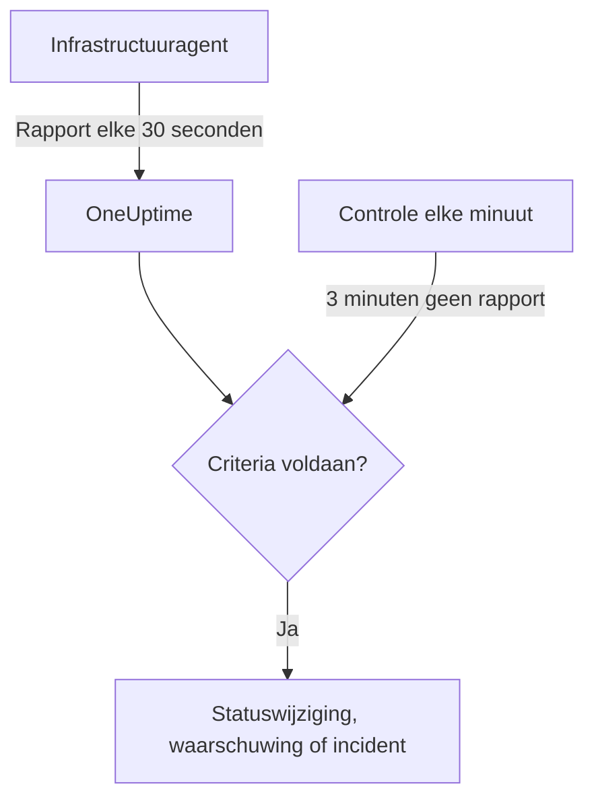

# Server- / VM-monitor

Een Server- / VM-monitor bewaakt één machine via de OneUptime-infrastructuuragent (`oneuptime-infrastructure-agent`), een kleine service die elke 30 seconden CPU, geheugen, schijven, belasting, netwerk en draaiende processen aan OneUptime rapporteert. Deze pagina laat zien hoe u de agent aan een Server- / VM-monitor koppelt, wat de agent rapporteert en hoe u de criteria schrijft die bepalen wanneer de server online of offline is.

> [!IMPORTANT]
> **Monitor maken** biedt **Server / VM** niet meer aan. Server- / VM-monitors die u al hebt, blijven werken, en alles op deze pagina geldt voor ze. Om een nieuwe server te bewaken, maakt u in plaats daarvan een [host-monitor](/docs/monitor/host-monitor): die waarschuwt op de hostmetrieken die de [OpenTelemetry-collector op de host](/docs/telemetry/host-otel-collector) verstuurt.

:::cards
- [De agent koppelen](#de-agent-koppelen): Installeren, de geheime sleutel van de monitor meegeven en starten.
- [Wat de agent rapporteert](#wat-de-agent-rapporteert): CPU, geheugen, schijven, belasting, netwerk en processen.
- [Bewakingscriteria](#bewakingscriteria): Bepalen wanneer de server als online of offline telt.
- [Problemen oplossen](#problemen-oplossen): De agent rapporteert niet, of de monitor gaat nooit offline.
:::

## Hoe het werkt

De agent draait als systeemservice. Elke 30 seconden verzamelt hij een rapport en stuurt het naar uw OneUptime-URL, ondertekend met de geheime sleutel van de monitor. OneUptime slaat de waarden op als metrieken van de monitor en toetst het rapport aan de criteria van de monitor.

Stilte wordt apart gecontroleerd. Elke minuut evalueert OneUptime opnieuw de **Is Online**-criteria van elke Server- / VM-monitor die 3 minuten of langer niets heeft gerapporteerd, en een server die langer stil is dan zijn criteria toestaan (standaard 3 minuten), telt als offline. Een monitor zonder **Is Online**-criterium wordt nooit offline gemarkeerd alleen omdat de agent stil is gevallen. Voor die stilte telt alleen tijd waarin OneUptime ontving: tijd waarin OneUptime zelf herstartte, werd bijgewerkt of een achterstand inhaalde, telt niet mee, zoals [Als OneUptime geen gegevens ontvangt](/docs/monitor/when-oneuptime-is-not-receiving) uitlegt.



## Voordat u begint

- Een Server- / VM-monitor in uw project.
- Toestemming om monitors te bewerken. De geheime sleutel, en de installatieopdrachten die hem bevatten, worden alleen getoond aan wie monitors mag bewerken.
- Root-rechten (Linux, macOS) of beheerdersrechten (Windows) op de server. De agent installeert zichzelf als systeemservice.
- Uitgaand HTTPS van de server naar uw OneUptime-URL, rechtstreeks of via een HTTP-proxy.

## De agent koppelen

De opdrachten hieronder gebruiken `https://oneuptime.com` en `YOUR_SECRET_KEY`. In de installatieopdrachten van de monitor zelf staan uw OneUptime-URL en de geheime sleutel van de monitor al ingevuld; kopieer ze dus waar mogelijk uit de monitor.

:::steps
### De installatieopdrachten van de monitor openen

Ga naar **Monitoren**, open de Server- / VM-monitor en kies **Documentatie**. De kaarten **Set up your Server Monitor (Linux/Mac)** en **Set up your Server Monitor (Windows)** bevatten de opdrachten voor deze monitor. Tot de agent voor het eerst rapporteert, toont ook het **Overzicht** van de monitor ze.

### De agent installeren

:::tabs
@tab Linux
```bash
curl -sSL https://oneuptime.com/docs/static/scripts/infrastructure-agent/install.sh | sudo bash
```
@tab macOS
```bash
curl -sSL https://oneuptime.com/docs/static/scripts/infrastructure-agent/install.sh | sudo bash
```
@tab Windows
1. Download de agent uit de [nieuwste GitHub-release](https://github.com/OneUptime/oneuptime/releases/latest): `oneuptime-infrastructure-agent_windows_amd64.zip` voor x64, of `oneuptime-infrastructure-agent_windows_arm64.zip` voor ARM64.
2. Pak het zip-bestand uit. Het bevat `oneuptime-infrastructure-agent.exe`.
3. Open de **Opdrachtprompt** als administrator in de map waarin u het hebt uitgepakt.
:::

Het installatiescript downloadt de nieuwste release voor uw besturingssysteem en processor (x86-64 of ARM64) en zet het binaire bestand `oneuptime-infrastructure-agent` in `$HOME/bin`. Bij een zelfgehoste installatie wordt het script vanaf uw eigen OneUptime-URL geleverd.

### Hem aan de monitor koppelen

:::tabs
@tab Linux
```bash
sudo oneuptime-infrastructure-agent configure --secret-key=YOUR_SECRET_KEY --oneuptime-url=https://oneuptime.com
```
@tab macOS
```bash
sudo oneuptime-infrastructure-agent configure --secret-key=YOUR_SECRET_KEY --oneuptime-url=https://oneuptime.com
```
@tab Windows
```shell
oneuptime-infrastructure-agent configure --secret-key=YOUR_SECRET_KEY --oneuptime-url=https://oneuptime.com
```
:::

`configure` slaat de geheime sleutel en de URL op in het configuratiebestand van de agent en installeert de agent als systeemservice. Beide vlaggen zijn verplicht. Vervang bij een zelfgehoste installatie `https://oneuptime.com` door uw eigen URL.

Als de server het internet via een proxy bereikt, voegt u `--proxy-url` toe:

```bash
sudo oneuptime-infrastructure-agent configure --proxy-url=http://proxy.example.com:8080 --secret-key=YOUR_SECRET_KEY --oneuptime-url=https://oneuptime.com
```

### De agent starten

:::tabs
@tab Linux
```bash
sudo oneuptime-infrastructure-agent start
```
@tab macOS
```bash
sudo oneuptime-infrastructure-agent start
```
@tab Windows
```shell
oneuptime-infrastructure-agent start
```
:::

Bij het starten controleert de agent de geheime sleutel bij OneUptime en stuurt hij direct zijn eerste rapport.

### Controleren of hij rapporteert

Voer `sudo oneuptime-infrastructure-agent status` uit (zonder `sudo` op Windows): het toont `Service is running`. In OneUptime toont het **Overzicht** van de monitor de installatieopdrachten niet meer zodra het eerste rapport binnenkomt, en het tabblad **Metrieken** begint de server in grafieken te tonen.
:::

## Naslag van de agent

### Opdrachten

| Opdracht | Wat hij doet |
| --- | --- |
| `configure --secret-key=<key> --oneuptime-url=<url>` | Slaat de instellingen op en installeert de agent als systeemservice. Voeg `--proxy-url=<url>` toe om rapporten via een proxy te versturen. |
| `start` | Start de service. Hij weigert te starten tot `configure` is uitgevoerd. |
| `stop` | Stopt de service. |
| `restart` | Herstart de service. |
| `status` | Toont of de service draait of gestopt is. |
| `logs` | Toont de laatste 100 regels van het logboek van de agent. `-n <lines>` toont een ander aantal regels, en `-f` volgt nieuwe regels. |
| `uninstall` | Verwijdert de service en wist het configuratiebestand van de agent. |
| `help` | Somt de opdrachten op. |

Voer ze op Linux en macOS uit met `sudo`, en op Windows in een **Opdrachtprompt** met beheerdersrechten. Om de geheime sleutel, de URL of de proxy van een geconfigureerde agent te wijzigen, voert u `stop` en `uninstall` uit en daarna opnieuw `configure` en `start`.

### Bestanden

| Bestand | Linux en macOS | Windows |
| --- | --- | --- |
| Configuratie | `/etc/oneuptime-infrastructure-agent/config.json` | `%PROGRAMDATA%\oneuptime-infrastructure-agent\config.json` |
| Logboek | `/var/log/oneuptime-infrastructure-agent/oneuptime-infrastructure-agent.log` | `%PROGRAMDATA%\oneuptime-infrastructure-agent\oneuptime-infrastructure-agent.log` |

Als de agent niet in deze mappen kan schrijven, gebruikt hij in plaats daarvan `~/.oneuptime-infrastructure-agent/`. De omgevingsvariabelen `ONEUPTIME_AGENT_CONFIG_PATH` en `ONEUPTIME_AGENT_LOG_PATH` stellen elk van beide paden expliciet in.

## Wat de agent rapporteert

Elk rapport bevat de hostnaam van de server en:

| Gebied | Wat wordt gerapporteerd |
| --- | --- |
| CPU | Gebruik in %, aantal kernen, gebruik per kern, en de tijd in user, system, idle, I/O-wachttijd, steal, nice, IRQ en soft-IRQ |
| Geheugen | Totaal, gebruikt, vrij en beschikbaar geheugen, buffers en cache, gebruik in %, en swap totaal, gebruikt, vrij en gebruik in % |
| Schijven | Voor elke gekoppelde schijf: koppelpad, apparaat, bestandssysteem, totale, gebruikte en vrije ruimte, gebruik in %, gelezen en geschreven bytes en bewerkingen, en I/O-tijd |
| Belasting | Gemiddelde belasting over 1, 5 en 15 minuten |
| Netwerk | Voor elke interface: verzonden en ontvangen bytes en pakketten, fouten en weggevallen pakketten in en uit; plus gevestigde en luisterende verbindingen |
| Host | Besturingssysteem, platform en versie, kernelversie en architectuur, uptime, opstarttijd, virtualisatie en aantal processen |
| Processen | Elk draaiend proces: naam, PID, opdracht, CPU in %, geheugen, status, threads, gebruiker en starttijd |

Waarden die het besturingssysteem niet levert, worden weggelaten. Het tabblad **Metrieken** van de monitor toont grafieken van beschikbaarheid, CPU, geheugen, schijfgebruik en -I/O, gemiddelde belasting, swap, netwerkverkeer en -fouten, verbindingen, uptime en het aantal processen.

## Bewakingscriteria

Criteria bepalen wanneer de monitor online, verminderd of offline is, en wanneer hij een waarschuwing of een incident opent. Elk filter in een criterium heeft een **Filtertype**, een **Filtervoorwaarde** en bij de meeste typen een waarde.

| Filtertype | Wat het controleert | Filtervoorwaarden |
| --- | --- | --- |
| Is Online | Of de agent onlangs heeft gerapporteerd (standaard in de laatste 3 minuten) | Waar, Onwaar |
| CPU Usage (in %) | Totaal CPU-gebruik | Greater Than, Less Than, Greater Than Or Equal To, Less Than Or Equal To |
| Memory Usage (in %) | Geheugen in gebruik | Zelfde als CPU |
| Disk Usage (in %) | Gebruik van de schijf die in **Schijfpad** staat | Zelfde als CPU |
| Swap Usage (in %) | Swap in gebruik | Zelfde als CPU |
| CPU IO Wait (in %) | Aandeel van de CPU-tijd dat op I/O wacht | Zelfde als CPU |
| Load Average (1 minute) | Gemiddelde belasting over de laatste minuut | Zelfde als CPU |
| Load Average (5 minute) | Gemiddelde belasting over de laatste 5 minuten | Zelfde als CPU |
| Load Average (15 minute) | Gemiddelde belasting over de laatste 15 minuten | Zelfde als CPU |
| Server Process Name | Of er een proces met deze naam draait (hoofdletterongevoelig) | Is Executing, Is Not Executing |
| Server Process Command | Of er een proces met precies deze opdrachtregel draait (hoofdletterongevoelig) | Is Executing, Is Not Executing |
| Server Process PID | Of er een proces met deze PID draait | Is Executing, Is Not Executing |

**Schijfpad** accepteert een koppelpunt of een apparaat, zoals `/`, `/mnt/data`, `C:\` of `/dev/sda1`; leeg gelaten is het `/`. Vul `*` in om elke schijf te controleren die de agent rapporteert: elke schijf die de drempel overschrijdt, krijgt een eigen waarschuwing, zodat een tweede schijf die volloopt niet verborgen blijft achter de openstaande waarschuwing van de eerste.

### Over een periode evalueren

**Evalueer deze criteria over een bepaalde periode** is een apart selectievakje in het criteriaformulier, geen filtervoorwaarde. Het is beschikbaar voor **Is Online** en voor elk numeriek filtertype. Zet het aan om een aggregaat te vergelijken – gekozen onder **Evalueren** (Gemiddelde, Som, Maximum Value, Minimum Value, All Values, Any Value) over het venster dat **Voor de laatste (in minuten)** instelt – in plaats van de waarde van de laatste controle. Bij een **Is Online**-filter is het venster hoe lang de agent stil mag zijn voordat de server als offline telt.

**All Values** komt pas overeen als het venster echt met gegevens is gevuld. Een monitor die net is gemaakt, of een monitor waarvan de controles niet meer werden vastgelegd, heeft te weinig geschiedenis om iets over de laatste N minuten te zeggen; het criterium wacht dan in plaats van overeen te komen op de ene meting die het heeft. **Any Value** is de instelling voor "laat het me weten zodra één controle de grens overschrijdt" en gaat nog steeds meteen af.

**Als geen gegevens** bepaalt wat er gebeurt zolang het venster het criterium niet kan onderbouwen:

| Als geen gegevens | Gedrag | Gebruik het voor |
| --- | --- | --- |
| **Ignore** (standaard) | Het criterium komt niet overeen. | Gewone drempelwaarschuwingen. |
| **Trigger** | De ontbrekende gegevens worden als het probleem behandeld. | Heartbeat-achtige controles, waarbij stilte zelf een storing is. |
| **Treat As Zero** | Het venster wordt vergeleken als één enkele nul. | Tellers, waarbij "geen gebeurtenissen" echt nul betekent. |

> [!TIP]
> CPU en belasting pieken voortdurend kort. Evalueer ze over een paar minuten met **Gemiddelde** of **All Values** in plaats van op één enkel rapport te waarschuwen.

### Voorbeeldcriteria

| Doel | Filtertype | Filtervoorwaarde | Waarde |
| --- | --- | --- | --- |
| De server offline markeren als de agent stopt met rapporteren | Is Online | Onwaar | — |
| Waarschuwen als het CPU-gebruik boven 90% komt | CPU Usage (in %) | Greater Than | `90` |
| Waarschuwen als de rootschijf meer dan 85% vol is | Disk Usage (in %), **Schijfpad** `/` | Greater Than | `85` |
| Waarschuwen voor elke schijf die meer dan 85% vol is, één waarschuwing per schijf | Disk Usage (in %), **Schijfpad** `*` | Greater Than | `85` |
| Waarschuwen als het geheugengebruik boven 80% komt | Memory Usage (in %) | Greater Than | `80` |
| Waarschuwen als nginx niet meer draait | Server Process Name | Is Not Executing | `nginx` |

## Problemen oplossen

:::details De agent rapporteert niet
- Controleer of de service draait: `sudo oneuptime-infrastructure-agent status`.
- Lees het logboek: `sudo oneuptime-infrastructure-agent logs -n 50`. Een regel `Metrics successfully pushed to OneUptime server` betekent dat rapporten doorkomen.
- De agent controleert de geheime sleutel bij het starten en stopt als OneUptime hem weigert, met de logregel `Secret key is invalid`. Vergelijk de sleutel met die op de pagina **Instellingen** van de monitor, onder **Geheime sleutel voor servermonitor opnieuw instellen**.
- Zorg dat de server uw OneUptime-URL via HTTPS kan bereiken en dat geen firewall uitgaande verbindingen blokkeert.
:::

:::details `sudo` meldt dat de opdracht niet gevonden is
Het installatiescript zet het binaire bestand in de `$HOME/bin` van de gebruiker onder wie het draaide, en toont de map die het gebruikte. Start de agent met zijn volledige pad, bijvoorbeeld `sudo /root/bin/oneuptime-infrastructure-agent configure ...`. Om hem in plaats daarvan in een map op het systeempad te installeren, geeft u `-b` aan het script mee:

```bash
curl -sSL https://oneuptime.com/docs/static/scripts/infrastructure-agent/install.sh | sudo bash -s -- -b /usr/local/bin
```
:::

:::details `start` meldt dat de serviceconfiguratie niet gevonden is
`configure` is niet uitgevoerd, of `uninstall` heeft de configuratie verwijderd. Voer `configure` uit met de geheime sleutel en de URL, en daarna `start`.
:::

:::details De monitor gaat nooit offline als de server uitvalt
Alleen een **Is Online**-criterium markeert een stille server als offline. Voeg er een toe met de **Filtervoorwaarde** op **Onwaar**, en stel de monitorstatus in die het toepast.
:::

:::details Rapporten komen niet door de proxy
- Controleer de proxy-URL en de poort die u aan `--proxy-url` hebt meegegeven.
- Zorg dat de proxy verbindingen naar uw OneUptime-URL toestaat.
- Om de proxy te wijzigen, voert u `stop` en `uninstall` uit, daarna `configure` met de nieuwe `--proxy-url`, en `start`.
:::

## Volgende stappen

:::cards
- [Host-monitor](/docs/monitor/host-monitor): De monitor voor nieuwe servers, gebouwd op OpenTelemetry-hostmetrieken.
- [OpenTelemetry-collector op de host](/docs/telemetry/host-otel-collector): Hostmetrieken en -logboeken versturen vanaf Linux, macOS en Windows.
- [Incident- en waarschuwingstemplates](/docs/monitor/incident-alert-templating): CPU-, geheugen-, schijf- en procesgegevens in incidenttitels opnemen.
:::
