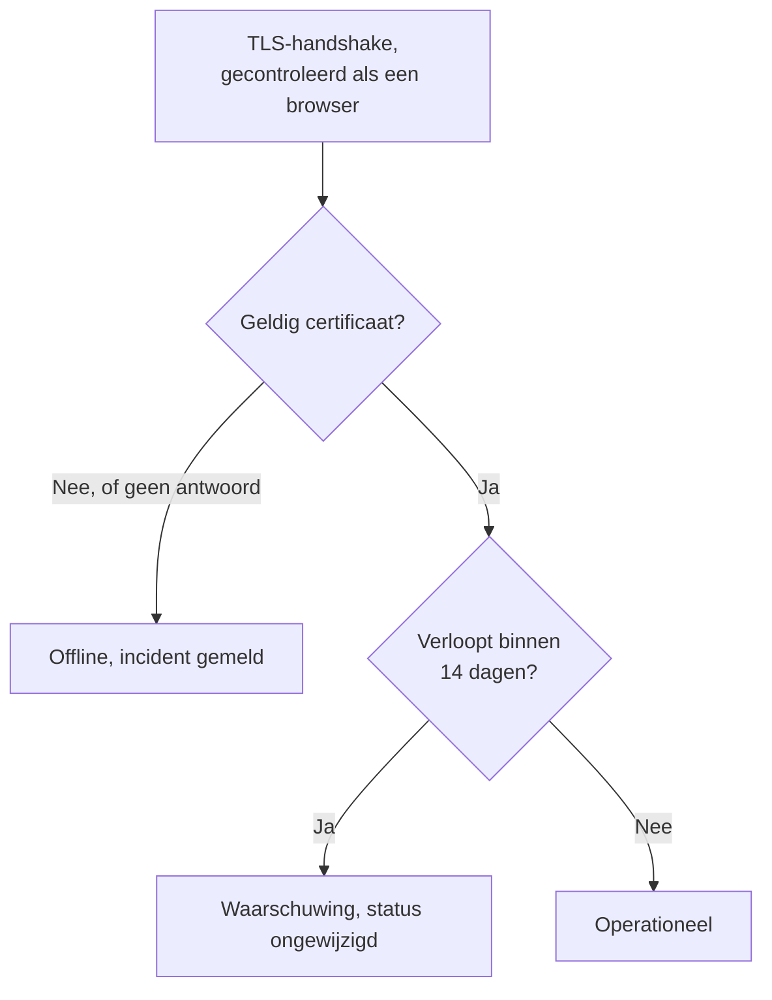

# SSL-certificaat-monitor

Een SSL-certificaatmonitor controleert de TLS-certificaten die uw sites en services tonen, zoals een browser dat doet, en waarschuwt u voordat ze verlopen. Hij zet de monitor ook offline wanneer een certificaat niet meer geldig is: verlopen, zelfondertekend, uitgegeven voor een andere hostnaam, of door een instantie die browsers niet vertrouwen.

:::cards
- [De monitor maken](#een-ssl-certificaatmonitor-maken): Zes stappen in het dashboard.
- [Standaardcriteria](#standaardcriteria): Een waarschuwing 14 dagen voor het verlopen, zonder instellen.
- [Bewakingscriteria](#bewakingscriteria): Geldigheid, verlopen en zelfondertekende certificaten.
- [Problemen oplossen](#problemen-oplossen): Zelfondertekende en interne certificaten.
:::

## Hoe het werkt

Bij elke controle opent een sonde een TLS-verbinding met de host en poort in de URL, poort `443` tenzij de URL een andere noemt, en controleert het certificaat zoals een browser dat zou doen: een vertrouwde uitgever, een hostnaam die overeenkomt en data die vandaag omvatten. Als het certificaat de controle niet doorstaat, leest de sonde het toch, zodat de vervaldatum, de uitgever en de vingerafdrukken hoe dan ook worden vastgelegd. Een verbinding die mislukt, een time-out krijgt of een ongeldig certificaat toont, wordt opnieuw geprobeerd, tot het aantal nieuwe pogingen dat u toestaat. Daarna beoordeelt OneUptime het resultaat met de criteria van de monitor.

Een sonde die haar eigen netwerkverbinding kwijt is, meldt geen resultaat en kan uw certificaat dus niet als ongeldig markeren.

## Voordat u begint

- **Een rol die monitoren mag maken**: Project Owner, Project Admin, Project Member, Monitor Admin of Monitor Member, of een aangepaste rol met de machtiging Create Monitor.
- **Een sonde die de host en de poort kan bereiken.** De standaardsondes van uw project worden voor elke nieuwe monitor gekozen. Een service in een privénetwerk heeft een [aangepaste sonde](/docs/probe/custom-probe) in dat netwerk nodig.

## Een SSL-certificaatmonitor maken

:::steps
### Een nieuwe monitor beginnen

Ga naar **Monitoren** en klik op **Monitor maken**. Kies onder **Monitortype** het type **SSL Certificate**.

### Hem een naam geven

Voer een **Naam** in, zoals `example.com certificate`, en klik op **Volgende**.

### De URL invoeren

Voer bij **Website-URL** de site in waarvan het certificaat moet worden gecontroleerd, zoals `https://example.com`. Neem voor een service op een andere poort die poort op: `https://example.com:8443`.

### Hem testen

Klik op **Monitor testen**, kies een sonde onder **Selecteer sonde** en klik op **Test uitvoeren**. **Testresultaat van monitor** toont het certificaat dat de sonde kreeg, met de uitgever en de vervaldatum.

### De criteria nakijken

**Monitorcriteria** begint met de [standaardcriteria](#standaardcriteria): offline wanneer het certificaat niet geldig is, een waarschuwing wanneer het binnen 14 dagen verloopt. Wijzig ze als dat nodig is en klik op **Volgende**.

### Sondes kiezen en maken

Behoud of wijzig de **Sondes** en het **Bewakingsinterval** (het begint bij **Elke 5 minuten**; voor SSL-certificaatmonitoren worden 5 minuten of langer aangeboden) en klik op **Monitor maken**. De pagina van de monitor wordt geopend.
:::

## Configuratieopties

| Veld | Standaard | Wat u invult |
| --- | --- | --- |
| **Website-URL** | Geen | De site waarvan het certificaat wordt gecontroleerd, zoals `https://example.com` of `https://example.com:8443`. Alleen de host en de poort worden gebruikt; het pad wordt genegeerd. |
| **Aanvraagtime-out (seconden)** (onder **Meer velden**) | `60` | Hoe lang bij elke poging op de TLS-handshake wordt gewacht. Het maximum is 60 seconden. |
| **Nieuwe pogingen bij mislukking** (onder **Meer velden**) | Standaard van de sonde, meestal `3` | Hoe vaak een mislukte poging opnieuw wordt geprobeerd. Het maximum is 3. |

**Nieuwe pogingen bij mislukking** telt de nieuwe pogingen _na_ de eerste, dus `0` voert de controle één keer uit en `2` tot drie keer. Leeg gelaten gebruikt het de standaard van de sonde: 3, tenzij `PROBE_MONITOR_RETRY_LIMIT` van de sonde iets anders zegt. Mislukte verbindingen, mislukte certificaatvalidaties en time-outs worden allemaal opnieuw geprobeerd, met een pauze van een seconde tussen de pogingen.

## Bewakingscriteria

Criteria bepalen wanneer het certificaat telt als in orde, verminderd of kapot, en of dat een incident meldt of een waarschuwing aanmaakt. Elk criterium controleert een of meer filters:

| Filter | Voorwaarden | Wat het controleert |
| --- | --- | --- |
| **Is Valid Certificate** | **Waar**, **Onwaar** | Het certificaat doorstaat de controles van een browser: een vertrouwde uitgever, een hostnaam die overeenkomt en data die vandaag omvatten. **Onwaar** wanneer het eindpunt niet antwoordde. |
| **Is Not A Valid Certificate** | **Waar**, **Onwaar** | Het tegenovergestelde van **Is Valid Certificate**: **Waar** wanneer het certificaat die controles niet doorstaat of niet kon worden gecontroleerd. |
| **Is Expired Certificate** | **Waar**, **Onwaar** | De vervaldatum van het certificaat is verstreken. |
| **Is Self Signed Certificate** | **Waar**, **Onwaar** | Het certificaat, of een certificaat in de keten, is zelfondertekend. |
| **Expires In Days** | **Greater Than**, **Less Than**, **Greater Than Or Equal To**, **Less Than Or Equal To** | Dagen totdat het certificaat verloopt. |
| **Expires In Hours** | **Greater Than**, **Less Than**, **Greater Than Or Equal To**, **Less Than Or Equal To** | Uren totdat het certificaat verloopt. |

**Expires In Days** telt hele dagen: een certificaat dat over 14 dagen en 20 uur verloopt, heeft nog 14 dagen. **Expires In Hours** telt hele uren op dezelfde manier.

Met twee of meer filters bepaalt **Overeenkomstvoorwaarde** of **Alle** filters moeten overeenkomen of dat **Elke** filter volstaat. De **Acties** van een criterium bepalen wat het doet: de monitorstatus wijzigen, een waarschuwing aanmaken, een incident melden, of meerdere daarvan.

### Standaardcriteria

Een nieuwe SSL-certificaatmonitor begint met drie criteria, zodat hij u zonder instellen waarschuwt voordat een certificaat verloopt:

1. **Certificaat is niet geldig** — het certificaat is verlopen, zelfondertekend, uitgegeven voor een andere hostnaam of door een niet-vertrouwde instantie, of kon niet worden gecontroleerd omdat het eindpunt niet antwoordde. De monitor wordt als **Offline** gemarkeerd en er wordt een incident met de naam "_monitor name_ certificate is not valid" gemaakt. De hoofdoorzaak ervan zegt welk van deze gevallen het was. Het incident lost zichzelf op zodra het certificaat weer geldig is.
2. **Certificaat verloopt binnenkort** — het certificaat is geldig, maar verloopt binnen 14 dagen. Er wordt een **waarschuwing** met de naam "_monitor name_ certificate expires soon" aangemaakt.
3. **Certificaat is geldig** — de monitor wordt als **Operationeel** gemarkeerd.

De waarschuwing "verloopt binnenkort" is een waarschuwing, geen incident: ze verschijnt niet op uw statuspagina's, ze roept niemand op tenzij u er een bereikbaarheidsbeleid aan toevoegt, en ze wijzigt de status van de monitor niet. Ze gebruikt de tweede waarschuwingsernst van uw project, **Low** in een nieuw project. Zodra het vernieuwde certificaat wordt opgepikt, staat de monitor weer op "Certificaat is geldig" en lost de waarschuwing zichzelf op.

Criteria worden van boven naar beneden gecontroleerd, en het eerste dat overeenkomt bepaalt wat er gebeurt. Daarom staat "verloopt binnenkort" boven "is geldig": een certificaat dat bijna verloopt is nog geldig, en zou dus met beide overeenkomen.

Om eerder gewaarschuwd te worden, wijzigt u de waarde van het filter **Expires In Days** in het criterium "verloopt binnenkort", bijvoorbeeld in `30`. Om in plaats daarvan iemand op te roepen, opent u de **Acties** van dat criterium: zet **Wanneer filters overeenkomen, verklaar een incident.** aan, of houd de waarschuwing en voeg er onder **Bereikbaarheidsbeleid** een bereikbaarheidsbeleid aan toe.

:::details De waarschuwing toevoegen aan een monitor die van vóór de waarschuwing is
Monitoren die zijn gemaakt voordat OneUptime deze waarschuwing toevoegde, hebben geen criterium "verloopt binnenkort". Zo voegt u het toe:

1. Open bij de monitor **Configuratie → Criteria** en klik op **Bewakingscriteria bewerken**.
2. Klik op **Criteria toevoegen**. Zet het filter op **Is Valid Certificate** / **Waar**, klik op **Filter toevoegen** en zet het tweede op **Expires In Days** / **Less Than Or Equal To** / `14`. Laat **Overeenkomstvoorwaarde** op **Alle** staan (het verschijnt onder de filters zodra er twee zijn).
3. Zet onder **Acties** **Wanneer filters overeenkomen, maak een waarschuwing aan.** aan en laat **Wanneer filters overeenkomen, wijzig de monitorstatus.** uit, zodat het een waarschuwing aanmaakt en de monitorstatus niet wijzigt.
4. Sleep het nieuwe criterium boven het criterium dat de monitor als online markeert, en sla op.
:::

### Voorbeeldcriteria

| Doel | Filter | Voorwaarde | Waarde |
| --- | --- | --- | --- |
| Een maand van tevoren waarschuwen | **Expires In Days** | **Less Than Or Equal To** | `30` |
| Iemand op de laatste dag oproepen | **Expires In Hours** | **Less Than** | `24` |
| Pas offline wanneer het certificaat verlopen is | **Is Expired Certificate** | **Waar** | — |
| Een zelfondertekend certificaat markeren | **Is Self Signed Certificate** | **Waar** | — |

Een criterium over het verlopen moet boven het criterium staan dat het certificaat als geldig markeert: een certificaat dat bijna verloopt is nog geldig, en het eerste criterium dat overeenkomt wint.

## Aanbevolen werkwijzen

1. **Geef uzelf tijd om te vernieuwen** — De standaardwaarschuwing komt 14 dagen voor het verlopen, wat past bij certificaten die zichzelf vernieuwen. Duurt vernieuwen bij u langer (een gekocht certificaat, of een wijzigingsproces), verhoog het dan naar 30 dagen.
2. **Bewaak elk eindpunt** — Hebt u meerdere domeinen of subdomeinen, maak dan voor elk een monitor. Elk kan zijn eigen certificaat hebben.
3. **Denk aan andere poorten** — Services die TLS op een andere poort dan `443` aanbieden, zoals `8443`, hebben ook certificaten. Zet de poort in de URL.
4. **Controleer na het vernieuwen** — Controleer na het vernieuwen van een certificaat het volgende resultaat van de monitor: de getoonde vervaldatum moet de nieuwe zijn.

## Problemen oplossen

:::details Het certificaat is in orde in mijn browser, maar de monitor zegt dat het niet geldig is
De hoofdoorzaak van het incident zegt waarom. Een veelvoorkomende reden is een server die zijn certificaat zonder de tussencertificaten verstuurt: browsers vullen het gat vaak zelf, de sonde niet. Configureer de server zo dat hij de volledige keten verstuurt. Een andere is een URL waarvan de hostnaam niet op het certificaat staat.
:::

:::details Ik bewaak een interne service met een zelfondertekend certificaat
Een zelfondertekend certificaat is nooit geldig, dus de standaardcriteria houden de monitor offline. **Is Self Signed Certificate**, **Is Expired Certificate** en **Expires In Days** werken er nog wel voor, dus bouw de criteria daarop. Onder **Configuratie → Criteria**:

1. Klik in het criterium "niet geldig" op **Filter toevoegen**, zet het nieuwe filter op **Is Self Signed Certificate** / **Onwaar** en zet **Overeenkomstvoorwaarde** op **Alle**. Het criterium zet de monitor nog steeds offline wanneer het eindpunt niet antwoordt, of het certificaat op een andere manier fout is.
2. Voeg een criterium toe met **Is Expired Certificate** / **Waar** dat de monitor als **Offline** markeert en een incident meldt, en sleep het naar boven.
3. Vervang in het criterium "verloopt binnenkort" **Is Valid Certificate** / **Waar** door **Is Expired Certificate** / **Onwaar**, zodat de waarschuwing ook het zelfondertekende certificaat dekt.

Zolang het certificaat actueel is, komt geen enkel criterium overeen en toont de monitor zijn standaardstatus, **Operationeel**.
:::

:::details De monitor is offline met "could not be checked because the endpoint is not reachable"
De sonde kon geen TLS-verbinding met de host en poort openen. Controleer de poort in de URL, en of een firewall de sondes doorlaat. Een host in een privénetwerk heeft een [aangepaste sonde](/docs/probe/custom-probe) nodig.
:::

## Volgende stappen

:::cards
- [Website-monitor](/docs/monitor/website-monitor): Controleren of de site zelf antwoordt.
- [Domein-monitor](/docs/monitor/domain-monitor): Gewaarschuwd worden voordat de registratie van het domein verloopt.
- [Escalatieregels](/docs/on-call/escalation-rules): Bepalen wie door de waarschuwingen en incidenten wordt opgeroepen.
- [Incidenten – Overzicht](/docs/incidents/index): Wat er gebeurt nadat de monitor er een heeft gemeld.
:::
