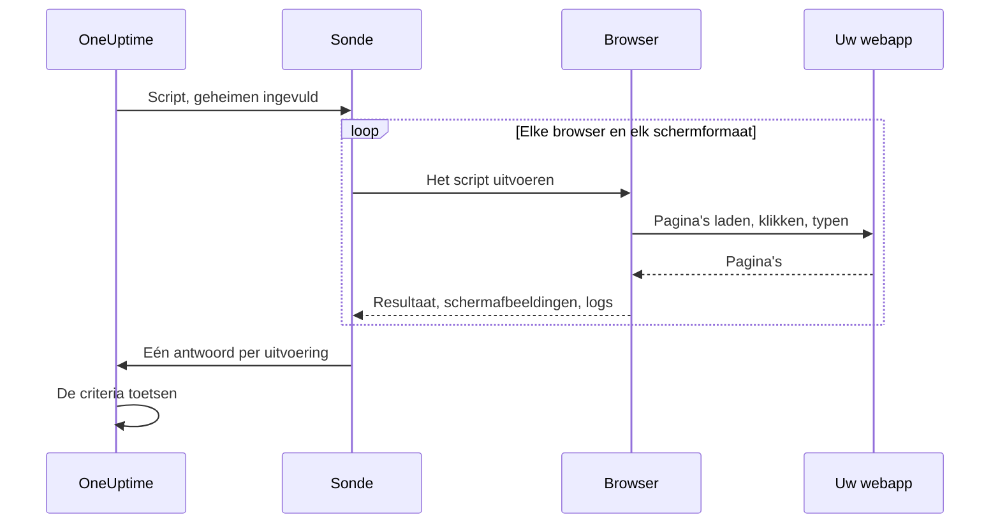

# Synthetische monitor

Een synthetische monitor bestuurt uw webapp volgens een schema in een echte browser, met een Playwright-script dat u zelf schrijft: hij opent pagina's, vult formulieren in, klikt door een gebruikerstraject heen en mislukt als het traject mislukt. Gebruik hem om storingen op te merken die een beschikbaarheidscontrole niet ziet: een aanmelding die niet meer werkt, een betaalknop die niets doet, een dashboard dat nooit klaar is met laden.

:::cards
- [De monitor maken](#een-synthetische-monitor-maken): Schrijf een script en kies browsers en schermformaten.
- [Het script schrijven](#het-script-schrijven): Een uitvoerbaar aanmeldtraject als startpunt.
- [Schermafbeeldingen](#schermafbeeldingen): Zie hoe de pagina eruitzag toen een uitvoering mislukte.
- [Wat het script kan gebruiken](#modules-die-in-het-script-beschikbaar-zijn): Playwright, HTTP, crypto en metrieken.
:::

## Zo werkt het

Bij elke controle voert een sonde uw script één keer uit voor elke browser en elk schermformaat dat u hebt gekozen, na elkaar. Elke uitvoering start een verse browser zonder cookies of opslag van eerdere uitvoeringen; het script bestuurt zijn pagina, maakt schermafbeeldingen en geeft een resultaat terug of gooit een fout. De sonde meldt elke uitvoering, en OneUptime toetst daar uw criteria aan.



| Schermtype | Viewport |
| --- | --- |
| Mobile | 360 × 640 |
| Tablet | 1024 × 768 |
| Desktop | 1920 × 1080 |

De browsers zijn Chromium en Firefox.

## Voordat u begint

- Een **sonde** die uw webapp bereikt. Gebruik voor een app binnen uw netwerk een [aangepaste sonde](/docs/probe/custom-probe). Het Docker-image van de sonde bevat Chromium en Firefox; een sonde die buiten Docker draait, moet ze geïnstalleerd hebben.
- Elk wachtwoord of token dat het traject nodig heeft, opgeslagen als [monitorgeheim](/docs/monitor/monitor-secrets).

## Een synthetische monitor maken

:::steps
### Een nieuwe monitor beginnen

Ga naar **Monitoren** en klik op **Monitor maken**. Klik onder **Monitortype** op **Meer monitortypen** en kies **Synthetic Monitor** onder **Synthetic Monitoring**, of typ `playwright` in het zoekvak. Voer een **Naam** in en klik op **Volgende**.

### Het script toevoegen

Schrijf uw script in de editor **Playwright Code**. Begin met het [voorbeeld hieronder](#het-script-schrijven).

### Browsers en schermformaten kiezen

Vink de browsers aan onder **Browsertype** en de formaten onder **Schermtype**. Het script draait één keer voor elke combinatie, dus twee browsers en drie formaten geven zes uitvoeringen per controle. Onder **Meer velden** probeert **Aantal nieuwe pogingen bij fout** een mislukte uitvoering tot 5 keer opnieuw.

### Het testen

Klik op **Monitor testen** om het script één keer vanaf een sonde uit te voeren, en controleer van elke uitvoering het resultaat, de logs en de schermafbeeldingen.

### De criteria nakijken

De monitor begint met twee criteria: hij is offline, en verklaart een incident, als een uitvoering mislukt, en online als er geen mislukt. Pas ze aan of voeg uw eigen toe (zie [Criteria](#criteria)) en klik op **Volgende**.

### Sondes kiezen en maken

Selecteer de **Sondes** en een **Bewakingsinterval** (synthetische monitoren krijgen intervallen van 5 minuten of langer aangeboden) en klik op **Monitor maken**.
:::

## Het script schrijven

Het script is de body van een `async`-functie. `page` is een Playwright-compatibele pagina die al open is; bestuur hem, geef met `return` een resultaat terug en laat de uitvoering mislukken met `throw` (of door een Playwright-aanroep in een time-out te laten lopen). Dit voorbeeld meldt zich aan en controleert dat het dashboard laadt:

```javascript title="Synthetic monitor script"
await page.goto("https://app.example.com/login");
screenshots["login-page"] = await page.screenshot();

await page.fill("#email", "monitoring@example.com");
await page.fill("#password", "{{monitorSecrets.AppPassword}}");
await page.click("button[type=submit]");

// Fails the run if the dashboard does not appear within 10 seconds.
await page.waitForSelector(".dashboard", { timeout: 10000 });
screenshots["dashboard"] = await page.screenshot();

console.log(`Signed in on ${browserType}, ${screenSizeType}`);

return {
  data: { title: await page.title() },
};
```

| Om | Doe dit | Wat OneUptime vastlegt |
| --- | --- | --- |
| Een resultaat te melden | `return { data: ... }` | Het **Resultaat** van de uitvoering. Alleen `data` blijft bewaard. |
| De uitvoering te laten mislukken | `throw new Error("...")`, of een wachtactie in een time-out laten lopen | De **Scriptfout** van de uitvoering. |
| Bewijs te bewaren | `screenshots["name"] = await page.screenshot()` | Een schermafbeelding, die ook bewaard blijft als de uitvoering mislukt. |
| Een spoor achter te laten | `console.log(...)` | De logberichten van de uitvoering. |

Om de uitvoeringen te bekijken, opent u het **Overzicht** van de monitor: de kaart **Monitorsamenvatting** heeft één blok per browser en schermformaat, en **Meer details weergeven** toont de schermafbeeldingen van elke uitvoering.

### Gebruik van Playwright

We gebruiken Playwright om interacties van gebruikers te simuleren. De waarde `page` is een veilige, Playwright-compatibele façade voor de pagina die voor deze uitvoering is gemaakt. De gangbare methoden van `Page`, `Locator`, `Frame`, `ElementHandle`, `JSHandle`, `Request`, `Response`, het toetsenbord, de muis en de browsercontext zijn beschikbaar. Daaronder vallen navigatie, locators, klikken, formulierinvoer, evaluatie in de pagina, pop-ups, extra pagina's, het inspecteren van antwoorden en schermafbeeldingen. De browsercontext van de uitvoering bereikt u via `page.context()`, bijvoorbeeld om een nieuwe pagina te openen of een pop-up af te handelen.

Synthetische scripts draaien niet in het Node.js-proces van de sonde. Waarden passeren de grens van de runtime als gekopieerde gegevens of als ondoorzichtige, aan de uitvoering gebonden mogelijkheden, dus sommige Playwright-API's werken anders of helemaal niet:

| Niet beschikbaar | Gebruik in plaats daarvan |
| --- | --- |
| Methoden om een browser te starten of ermee te verbinden, CDP-sessies, routering van verzoeken, blootgestelde bindings, privévelden van Playwright en elke optie die een pad in het bestandssysteem van de host leest of schrijft. `page.context().browser()` is daarom niet beschikbaar. | De pagina en de browsercontext die u krijgt. |
| Event-listeners (`page.on(...)`, `page.once(...)`): ze aanroepen mislukt met een duidelijke fout. | `page.waitForEvent(...)` voor dialogen en pop-ups, of wachten op antwoorden en verzoeken met matchers op tekenreeks of reguliere expressie. |
| Functiepredicaten voor wachtmethoden op gebeurtenissen, verzoeken, antwoorden en URL's. | Matchers op tekenreeks of reguliere expressie, locators, of expliciet pollen. |
| De synchrone frametoegang (`page.frames()`, `page.mainFrame()`, `page.frame(...)`). | `page.frameLocator(...)` voor iframes. |
| `page.request.*` | De globale `axios` voor HTTP-verzoeken. |
| Schermafbeeldingen van de hele pagina en PDF-uitvoer. | Viewport-schermafbeeldingen, die het hieronder beschreven gedrag voor bewijs bij fouten behouden. |

`page.waitForNavigation(...)`, `page.setDefaultTimeout(...)` en `page.setDefaultNavigationTimeout(...)` worden ondersteund. `page.waitForEvent(...)` wacht op `dialog`, `domcontentloaded`, `load`, `popup`, `request`, `requestfailed`, `requestfinished` en `response`. Evaluatiefuncties die aan methoden zoals `page.evaluate()` worden meegegeven, draaien in de bewaakte browserpagina, nooit in het proces van de sonde. Elke uitvoering kan tot acht pagina's gebruiken.

Browserrechten zijn beperkt tot geolocatie en meldingen. Klembord, camera, microfoon, MIDI, lokale lettertypen en andere apparaatrechten van de host zijn niet beschikbaar voor monitorscripts.

### Wat het script teruggeeft

Gegevens die het script teruggeeft, worden naar JSON geserialiseerd voordat ze worden opgeslagen: in gewone objecten en arrays worden `NaN` en `Infinity` `null`, eigenschappen met `undefined` en functies vallen weg, en `Date`-objecten worden ISO-tekenreeksen, net zoals `JSON.stringify` het doet. Klasse-instanties en andere niet-gewone objecten vallen helemaal weg. Een `BigInt` wordt een tekenreeks. Een resultaat dat circulair is, dieper dan 30 niveaus genest of groter dan 5 MB, laat de uitvoering in plaats daarvan mislukken.

### Waarschuwen op de teruggegeven gegevens

Wat het script als `data` teruggeeft, is de **Result Value** van de monitor, die een criterium kan vergelijken. Is `data` een object of een array, vul dan **Veldpad (optioneel)** in op het Result Value-filter om één veld ervan te vergelijken, bijvoorbeeld `status`, `timings.loadTime` of `errors[0].message`. Het filter wordt getoetst aan de gegevens van elke browser en elk schermformaat waarop de monitor draait, en komt overeen als een ervan overeenkomt. Zie [Waarschuwen op de teruggegeven gegevens](/docs/monitor/custom-code-monitor#waarschuwen-op-de-teruggegeven-gegevens) voor hoe paden en voorwaarden werken.

## Schermafbeeldingen

In de scriptcontext is een vooraf gedeclareerd object `screenshots` beschikbaar. Ken er op elk moment in het script schermafbeeldingen aan toe: deze schermafbeeldingen worden **ook vastgelegd als het script een fout gooit** (inclusief mislukte asserties, time-outs en onverwachte fouten), zodat u precies ziet hoe de pagina eruitzag toen de uitvoering mislukte. Vastgelegde schermafbeeldingen verschijnen in het OneUptime-dashboard bij die specifieke uitvoering van de monitor.

```javascript
// Capture screenshots via the `screenshots` side-channel — they are preserved on both success and failure.

await page.goto("https://app.example.com/login");
screenshots["login-page"] = await page.screenshot();

await page.fill("#email", "user@example.com");
await page.fill("#password", "wrong");
await page.click("button[type=submit]");

// If the next assertion throws, the `login-page` screenshot above is still captured.
await page.waitForSelector(".dashboard", { timeout: 5000 });

screenshots["dashboard"] = await page.screenshot();

return {
  data: "Login succeeded",
};
```

Een uitvoering bewaart tot 20 schermafbeeldingen, elk tot 10 MB en samen 50 MB. Een schermafbeelding kan ook verschijnen in het incident of de waarschuwing die een mislukte uitvoering opent (op de pagina ervan en in de e-mails erover) door haar in de incident- of waarschuwingsbeschrijving van de monitor te plaatsen. Zie [Een schermafbeelding tonen](/docs/monitor/incident-alert-templating#synthetische-monitors).

:::details Schermafbeeldingen teruggeven (verouderd)
Voor achterwaartse compatibiliteit kunt u schermafbeeldingen ook als deel van de retourwaarde uit het script teruggeven. Zo teruggegeven schermafbeeldingen worden **alleen** vastgelegd als het script normaal eindigt: ze gaan verloren als het script een fout gooit. Geef de voorkeur aan het zijkanaalpatroon hierboven als u bewijs van mislukkingen wilt.

```javascript
// Legacy pattern — screenshots only captured on successful return.
const screenshots = {};
screenshots["screenshot-name"] = await page.screenshot();

return {
  data: "Hello World",
  screenshots: screenshots,
};
```
:::

## Monitorgeheimen gebruiken

Verwijs overal in het script naar een geheim met `{{monitorSecrets.NAME}}`. OneUptime vervangt de verwijzing door de waarde van het geheim, als platte tekst, voordat het script de sonde bereikt. Zet een geheim dus tussen aanhalingstekens om het als tekenreeks te gebruiken, en laat de aanhalingstekens weg om het als getal of boolean te gebruiken:

```javascript
// Used as a string: wrap it in quotes.
const password = "{{monitorSecrets.AppPassword}}";

// Used as a number or a boolean: leave it bare.
const retryLimit = {{monitorSecrets.RetryLimit}};
const verbose = {{monitorSecrets.Verbose}};
```

Hoe u een geheim aanmaakt en kiest welke monitoren het mogen gebruiken, leest u in [Monitor-geheimen](/docs/monitor/monitor-secrets).

## Aangepaste metrieken

Met de functie `oneuptime.captureMetric()` legt u vanuit uw script aangepaste metrieken vast. Deze metrieken worden in OneUptime opgeslagen en kunnen met de metriekverkenner in dashboards in grafieken worden gezet.

```javascript
oneuptime.captureMetric(name, value, attributes);
```

| Parameter | Type | Beschrijving |
| --- | --- | --- |
| `name` | string, verplicht | De naam van de metriek (bijv. `"dashboard.load.time"`). Die wordt automatisch opgeslagen met het voorvoegsel `custom.monitor.`. |
| `value` | number, verplicht | De numerieke waarde van de metriek. |
| `attributes` | object, optioneel | Sleutel-waardeparen voor extra context. |

### Voorbeeld

```javascript
await page.goto("https://app.example.com");

const startTime = Date.now();
await page.waitForSelector("#dashboard-loaded");
const loadTime = Date.now() - startTime;

// Capture page load time, tagged with this run's browser and screen size
oneuptime.captureMetric("dashboard.load.time", loadTime, {
  page: "dashboard",
  browser: browserType,
  screen: screenSizeType,
});

screenshots["dashboard"] = await page.screenshot();

return {
  data: { loadTime },
};
```

Eenmaal vastgelegd, verschijnen deze metrieken in de metriekverkenner onder namen zoals `custom.monitor.dashboard.load.time`, en op de pagina **Metrieken** van de monitor onder **Aangepaste metrieken**. OneUptime voegt de monitor en de sonde aan elk datapunt toe; om op browser of schermformaat te filteren, geeft u die als attributen mee, zoals het voorbeeld doet.

Een uitvoering kan hoogstens 100 metrieken vastleggen, alleen met numerieke waarden, en OneUptime bewaart er hoogstens 100 per controle, over al haar uitvoeringen samen. Net als bij een Custom Code-monitor zijn sommige attribuutnamen [gereserveerd](/docs/monitor/custom-code-monitor#gereserveerde-attribuutsleutels) en worden ze verworpen als een script ze zet.

## Criteria

| Filtertype | Wat het controleert |
| --- | --- |
| **Fout** | De fout die een uitvoering gooide, als die er is. |
| **Result Value** | De `data` die een uitvoering teruggaf. |
| **Uitvoeringstijd (in ms)** | Hoe lang een uitvoering duurde. |
| **Browsertype** | De browser die een uitvoering gebruikte: **Equal To** of **Not Equal To**. |
| **Screen Size** | Het schermformaat dat een uitvoering gebruikte: **Equal To** of **Not Equal To**. |

Elk filter wordt aan elke uitvoering getoetst en komt overeen zodra één uitvoering overeenkomt. Filters worden los van elkaar getoetst, niet per uitvoering: **Fout** Is Not Empty samen met **Browsertype** Equal To `Firefox` komt overeen als er een uitvoering mislukte en een van de uitvoeringen Firefox gebruikte, niet alleen als de Firefox-uitvoering mislukte. Wilt u één browser apart volgen, geef die dan een eigen monitor.

In incident- en waarschuwingssjablonen staat elke uitvoering in `{{syntheticResponses}}`: zie [Incident- en waarschuwingstemplates](/docs/monitor/incident-alert-templating#synthetische-monitors).

## Modules die in het script beschikbaar zijn

| Naam | Wat het is |
| --- | --- |
| `page` | Een veilige, Playwright-compatibele façade om met de browser te werken. Via `page.context()` bereikt u de browsercontext van de uitvoering om pagina's te maken of pop-ups af te handelen, maar starten of verbinden van een browser, CDP, routering, bindings, privévelden en opties met hostpaden zijn niet beschikbaar. |
| `screenshots` | Een vooraf gedeclareerd object waaraan u schermafbeeldingen toekent (bijv. `screenshots['login-page'] = await page.screenshot()`). Schermafbeeldingen die hier zijn toegekend, worden vastgelegd, ook als het script later een fout gooit. |
| `browserType` | De browser van deze uitvoering: `Chromium` of `Firefox`. |
| `screenSizeType` | Het schermformaat van deze uitvoering: `Mobile`, `Tablet` of `Desktop`. |
| `axios` | Een HTTP-client op basis van promises met aanroepbare axios plus `request`, `get`, `head`, `options`, `post`, `put`, `patch`, `delete` en `create`. Een verzoeklichaam mag tot 1 MB groot zijn en een antwoord tot 5 MB; hij volgt tot 5 omleidingen en loopt na hoogstens 30 seconden in een time-out. Eigen transports, adapters, sockets, agents en proxy-overschrijvingen zijn niet beschikbaar. |
| `crypto` | Een browser-worker-implementatie van SHA-256-hashes, HMAC-SHA-256, `randomBytes`, `randomInt` en `randomUUID`. |
| `console` | `console.log`, `info`, `warn` en `error`. De berichten worden bij elke uitvoering bewaard. |
| `oneuptime.captureMetric` | Legt een aangepaste metriek vast. Zie [Aangepaste metrieken](#aangepaste-metrieken). |
| `http` | Een gebufferde compatibiliteitsfaçade, alleen aan clientzijde, met `request`, `get` en `Agent`. |
| `https` | De HTTPS-tegenhanger van de façade `http` aan clientzijde. |
| `Buffer`, `setTimeout`, `setInterval` | En hun `clear`-functies. |

Het script draait in een browser-worker, niet in Node.js, en kan geen eigen netwerkverbindingen openen: `fetch`, `XMLHttpRequest` en `WebSocket` zijn geblokkeerd. Gebruik `axios` voor HTTP-verzoeken.

## Limieten

| Limiet | Standaard | Sonde-instelling |
| --- | --- | --- |
| Time-out van het script | 60 seconden. Workers in een time-out en alle nakomelingen van de browser worden beëindigd. | `PROBE_SYNTHETIC_MONITOR_SCRIPT_TIMEOUT_IN_MS` |
| Geheugen voor de hele procesboom van een uitvoering | 1,5 GiB | `PROBE_SYNTHETIC_MONITOR_MAX_PROCESS_TREE_RSS_BYTES` |
| Beschrijfbare browseropslag | 256 MiB | `PROBE_SYNTHETIC_MONITOR_MAX_DISK_BYTES` |
| Gelijktijdige uitvoeringen op één sonde | 4 | `PROBE_SYNTHETIC_MONITOR_MAX_CONCURRENCY` |
| Pagina's per uitvoering | 8 | — |

Wordt de geheugen- of opslaglimiet overschreden, dan wordt die uitvoering beëindigd en het tijdelijke profiel ervan verwijderd. De sonde-instellingen gelden voor zelfgehoste sondes; de Helm-chart zet dezelfde waarden per sonde (bijvoorbeeld `syntheticMonitorScriptTimeoutInMs`).

De browsers zitten in het Docker-image van de sonde, dus een zelfgehoste sonde krijgt nieuwere browsers als u het image bijwerkt.

## Probleemoplossing

:::details Een uitvoering mislukt, maar ik zie niet waarom
Ken vóór elke riskante stap een schermafbeelding toe aan het object `screenshots`. Ze blijven bewaard als de uitvoering mislukt, en tonen hoe de pagina er op dat moment uitzag.
:::

:::details `page.on(...)` gooit een fout
Event-listeners kunnen de isolatiegrens niet passeren. Gebruik `page.waitForEvent(...)` voor dialogen en pop-ups, of wacht op een antwoord of verzoek met een matcher op tekenreeks of reguliere expressie.
:::

:::details De uitvoering loopt in een time-out
Wacht op specifieke elementen met `page.waitForSelector(...)` en een `timeout` die korter is dan de limiet van het script zelf, zodat de uitvoering mislukt op de stap die traag is, met een duidelijke fout.
:::

:::details Een zelfgehoste sonde zegt dat het uitvoerbare bestand van de browser niet gevonden is
De sonde draait buiten haar Docker-image, zonder Chromium of Firefox geïnstalleerd. Draai het image van de sonde, of installeer de browsers op die machine.
:::

## Volgende stappen

:::cards
- [Aangepaste-code-monitor](/docs/monitor/custom-code-monitor): API's controleren met een script, zonder browser.
- [Een schermafbeelding tonen](/docs/monitor/incident-alert-templating#synthetische-monitors): De schermafbeelding van de mislukte uitvoering in het incident zetten.
- [Monitor-geheimen](/docs/monitor/monitor-secrets): Inloggegevens buiten uw script houden.
:::
