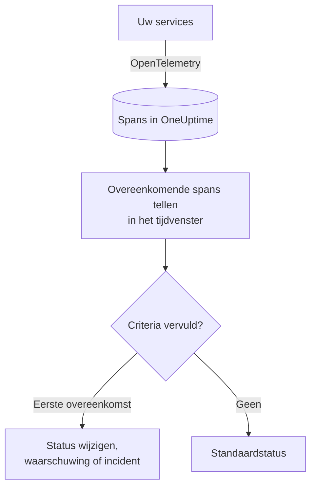

# Traces-monitor

Een traces-monitor telt binnen een tijdvenster de spans die uw services naar OneUptime sturen en die aan uw filters voldoen (span-naam, status, service, attributen). Wanneer het aantal aan uw criteria voldoet, wijzigt hij de status van de monitor, maakt hij een waarschuwing aan of meldt hij een incident. Gebruik hem om gewaarschuwd te worden voor mislukte verzoeken naar een endpoint, een piek in fout-spans, of een service die geen traces meer stuurt.

:::cards
- [De monitor maken](#een-traces-monitor-maken): Kies welke spans u telt en wanneer u wordt gewaarschuwd.
- [Span-statuscodes](#span-statuscodes): Wat OK, ERROR en UNSET betekenen, en waarop u filtert.
- [Hoe hij wordt geëvalueerd](#hoe-hij-wordt-geëvalueerd): Het tijdvenster, de telling en de cyclus van één minuut.
- [Criteria](#criteria): Drempels, anomaliedetectie en de standaardwaarden.
:::

## Hoe het werkt

Elke minuut telt OneUptime de spans die aan de filters van de monitor voldoen en binnen het tijdvenster zijn begonnen. Dat aantal vergelijkt het van boven naar beneden met de criteria van de monitor, en het eerste criterium dat overeenkomt, bepaalt wat er gebeurt. Komt er geen overeen, dan gaat de monitor terug naar zijn standaardstatus.

## Voordat u begint

- Uw services sturen traces naar OneUptime via OpenTelemetry. Zie [OpenTelemetry](/docs/telemetry/open-telemetry).
- Zoek in de traceverkenner de exacte naam op van de span die u wilt bewaken: span-namen worden door uw instrumentatie bepaald, bijvoorbeeld `POST /api/checkout` of `GET`.

## Een traces-monitor maken

:::steps
### Een nieuwe monitor beginnen

Ga naar **Monitoren** en klik op **Monitor maken**.

### Traces kiezen

Klik onder **Monitortype** op **Meer monitortypen** en kies **Traces** onder **Telemetrie**, of typ `traces` in het zoekvak. Vul een **Naam** in en klik dan op **Volgende**.

### De te tellen spans kiezen

Stel in **Trace-monitorconfiguratie** de velden **Span-naam**, **Bewaak traces gedurende (time)** en **Filteren op span-status** in. Een filter dat u leeg laat, komt met elke span overeen. **Spans-voorbeeld** onder de filters toont de spans waarmee ze nu overeenkomen.

### Verder verfijnen (optioneel)

Open **Meer velden** om te filteren op telemetrieservice, infrastructuurentiteit of attribuut.

### De criteria instellen

De kaart **Monitorcriteria** begint met twee criteria: offline, met een incident, wanneer er geen spans overeenkomen; online wanneer er minstens één overeenkomt. Pas ze aan op datgene waarvoor u gewaarschuwd wilt worden (zie [Criteria](#criteria)).

### De monitor maken

Klik op **Monitor maken**. De monitor opent op zijn pagina **Overzicht**, en zijn eerste evaluatie volgt binnen een minuut.
:::

> [!TIP]
> Om te horen wanneer een AI-functie slecht antwoordt (mislukte, geweigerde, afgebroken, lege, gemarkeerde of trage antwoorden), kiest u in plaats daarvan **AI / LLM** onder **Telemetrie**. Die monitor leest de AI-aanroepen in uw traces voor u, zonder span-filters die u moet schrijven. Zie [AI- / LLM-observability](/docs/telemetry/ai-llm-observability#een-melding-krijgen-wanneer-de-ai-slecht-antwoordt).

## Wat hij opvraagt

| Veld | Waarmee het overeenkomt | Standaard |
| --- | --- | --- |
| **Span-naam** | Spans waarvan de naam deze tekst bevat, zonder onderscheid tussen hoofd- en kleine letters. | Leeg: elke span |
| **Bewaak traces gedurende (time)** | Spans die zijn begonnen in de laatste 5 seconden tot de laatste 24 uur. | **Laatste 1 minuut** |
| **Filteren op span-status** | Spans met een van de gekozen statussen: **Niet ingesteld**, **Ok** of **Fout**. | Leeg: elke status |
| **Filteren op telemetrieservice** (onder **Meer velden**) | Spans van een van de gekozen services. | Leeg: elke service |
| **Filter by Infrastructure Entity** (onder **Meer velden**) | Spans van een van de gekozen hosts, pods, containers en andere entiteiten. | Leeg: elke entiteit |
| **Filteren op attributen** (onder **Meer velden**) | Spans waarvan de attributen aan elke voorwaarde voldoen. Elke voorwaarde heeft een eigen operator, zoals "is gelijk aan" of "bevat". | Leeg: geen voorwaarde |

Alle filters die u instelt, moeten overeenkomen voordat een span wordt geteld.

### Span-statuscodes

- **OK** — De bewerking is expliciet als geslaagd gemarkeerd, door applicatiecode of een trace-pipeline
- **ERROR** — De bewerking heeft een fout ondervonden
- **UNSET** — Er is geen foutstatus ingesteld. Dit is de standaardstatus van OpenTelemetry

UNSET betekent niet dat er gegevens ontbreken. OpenTelemetry-instrumentatie stelt ERROR in wanneer een bewerking mislukt en laat geslaagde spans op UNSET staan, dus bij een gezonde dienst zijn de meeste spans UNSET. OneUptime toont ze in het groen als "Unset (no error)". Het vastleggen van een uitzondering verandert de status van een span niet, dus een UNSET-span kan toch uitzonderingen bevatten; die worden bij de span vermeld. Filter op ERROR om meldingen te ontvangen bij fouten. Selecteer zowel OK als UNSET om alle spans te tellen die niet zijn mislukt.

Als u wilt dat geslaagde verzoeken als OK worden weergegeven, voeg dan onder **Traces > Instellingen > Pipelines** een trace-pipeline toe met de filtervoorwaarde **Status = Niet ingesteld** en een **Status-hertoewijzer** die waarden van `http.response.status_code`, zoals `200`, toewijst aan Ok.

## Hoe hij wordt geëvalueerd

- **Elke minuut.** Een traces-monitor wordt niet door sondes gecontroleerd, dus hij heeft geen interval om in te stellen en geen pagina **Sondes en interval**.
- **Eén getal per evaluatie.** De monitor telt de spans die aan elk filter voldoen en binnen **Bewaak traces gedurende (time)** vóór de evaluatie zijn begonnen. Met **Laatste 5 minuten** kijkt elke evaluatie vijf minuten terug, dus de vensters van opeenvolgende evaluaties overlappen.
- **Geen spans is een aantal van 0.** Een service die geen traces meer stuurt, levert 0 op, en daar zoekt het standaardcriterium voor offline naar.
- **De onderbreking van OneUptime zelf is geen stilte.** Zolang het tijdvenster tijd bevat waarin OneUptime zelf geen gegevens ontving (het startte opnieuw, werd geüpgraded of werkte een achterstand weg), wacht de controle: de status verandert niet, en er wordt geen incident of waarschuwing geopend of opgelost. Zie [Als OneUptime geen gegevens ontvangt](/docs/monitor/when-oneuptime-is-not-receiving).
- **Criteria van boven naar beneden.** Het eerste criterium dat overeenkomt, beslist, dus zet het ernstigste bovenaan.

Elke statuswijziging wordt, met de reden ervan, vastgelegd op de **Statustijdlijn** van de monitor.

## Criteria

De criteria van een traces-monitor hebben één **Filtertype**: **Span Count**, het aantal spans dat in het venster overeenkwam. Kies een **Filtervoorwaarde** en, bij een drempelvoorwaarde, een **Waarde**.

| Filtervoorwaarde | Komt overeen wanneer het aantal spans… |
| --- | --- |
| **Greater Than** | boven de waarde ligt |
| **Greater Than Or Equal To** | gelijk is aan de waarde of hoger |
| **Less Than** | onder de waarde ligt |
| **Less Than Or Equal To** | gelijk is aan de waarde of lager |
| **Equal To** | precies de waarde is |
| **Anomalously High** | boven het verwachte bereik voor dit uur van de week ligt |
| **Anomalously Low** | onder dat bereik ligt |
| **Anomalous** | buiten dat bereik ligt, in welke richting ook |

De anomaliecondities hebben geen **Waarde**. Kies een **Gevoeligheid** (Low, Medium, de standaard, of High) en een **Baseline-venster** van 14 (de standaard), 28, 60 of 90 dagen. OneUptime zet het aantal om in een tempo per minuut en vergelijkt dat met hetzelfde uur van de week over dat venster. De baseline omvat alleen de services en span-statussen van de monitor: de filters op span-naam en attributen horen er niet bij. Zolang dat uur van de week te weinig geschiedenis heeft, is het criterium nog aan het leren en gaat het niet af.

Een nieuwe traces-monitor begint met deze criteria:

| Criterium | Filter | Effect |
| --- | --- | --- |
| Check if … is offline | **Span Count** **Equal To** `0` | Zet de monitor offline en meldt een incident, dat automatisch wordt opgelost |
| Check if … is online | **Span Count** **Greater Than** `0` | Zet de monitor online |

## Uitgewerkt voorbeeld: mislukte checkout-verzoeken

In vijf minuten legt de checkout-service 1.200 spans vast met de naam `POST /api/checkout`: 1.150 UNSET, 20 OK en 30 ERROR. Dezelfde monitor telt heel verschillende aantallen, afhankelijk van **Filteren op span-status**:

| Filteren op span-status | Span Count | Wat het meet |
| --- | --- | --- |
| **Fout** | 30 | Verzoeken die mislukten |
| **Ok** | 20 | Alleen de verzoeken die uw code als geslaagd markeerde |
| **Niet ingesteld** en **Ok** | 1.170 | Elk verzoek dat niet mislukte |
| Leeg | 1.200 | Elk verzoek |

Om opgeroepen te worden wanneer in vijf minuten meer dan 10 checkout-verzoeken mislukken:

- **Span-naam**: `POST /api/checkout`
- **Bewaak traces gedurende (time)**: **Laatste 5 minuten**
- **Filteren op span-status**: **Fout**
- Criterium 1: **Span Count** **Greater Than** `10`: de monitor offline zetten en een incident melden
- Criterium 2: **Span Count** **Less Than Or Equal To** `10`: de monitor online zetten

Met 30 mislukte verzoeken komt criterium 1 overeen en wordt het incident gemeld. Zodra er vijf minuten voorbij zijn met 10 of minder mislukkingen, komt criterium 2 overeen, is de monitor weer online en lost het incident zichzelf op.

## Problemen oplossen

:::details De monitor telt geen spans voor mijn endpoint
**Span-naam** wordt vergeleken met de naam van de span, en instrumentatie noemt server-spans vaak naar de route (`POST /api/checkout`) of alleen naar de methode (`GET`). Zoek de exacte naam op in de traceverkenner. Open daarna de pagina **Criteria** van de monitor (onder **Configuratie**) en klik op **Edit Monitoring Criteria**: **Spans-voorbeeld** toont waarmee de filters nu overeenkomen.
:::

:::details Geslaagde verzoeken worden niet geteld wanneer ik op Ok filter
De meeste instrumentatie laat geslaagde spans op UNSET staan, niet op OK (zie [Span-statuscodes](#span-statuscodes)). Selecteer zowel **Niet ingesteld** als **Ok**, of voeg de trace-pipeline toe die daar wordt beschreven.
:::

:::details Een span heeft een uitzondering, maar wordt niet als fout geteld
Het vastleggen van een uitzondering verandert de status van een span niet. Filter op **Fout**, of gebruik een [uitzonderingen-monitor](/docs/monitor/exceptions-monitor) om gewaarschuwd te worden voor de uitzonderingen zelf.
:::

:::details Een anomaliecriterium gaat nooit af
Het is nog aan het leren: het uur van de week waarmee het vergelijkt, heeft binnen het **Baseline-venster** nog niet genoeg geschiedenis.
:::

## Volgende stappen

:::cards
- [Uitzonderingen-monitor](/docs/monitor/exceptions-monitor): Word gewaarschuwd voor de uitzonderingen die uw services vastleggen.
- [Logs-monitor](/docs/monitor/logs-monitor): Word gewaarschuwd op het volume en de inhoud van logs.
- [Zoeksyntaxis](/docs/telemetry/search-syntax): Vind span-namen en -statussen in de traceverkenner.
- [Incident- en waarschuwingstemplates](/docs/monitor/incident-alert-templating): Schrijf bruikbare titels en beschrijvingen voor waarschuwingen.
:::
