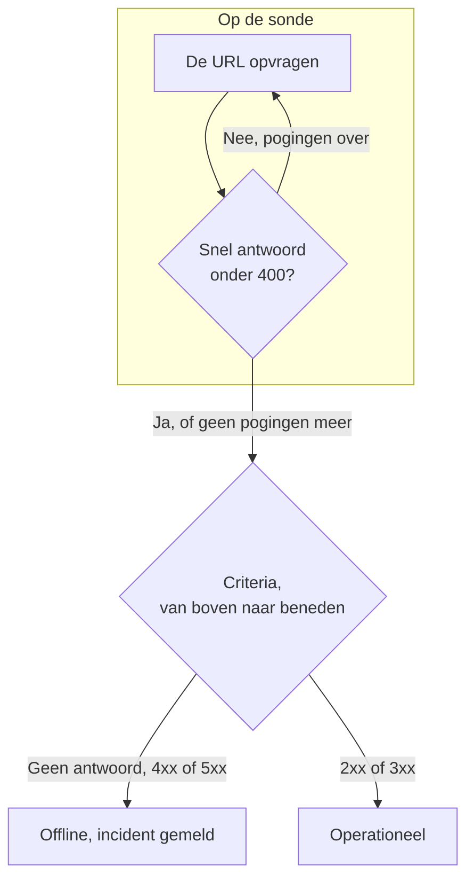

# Website-monitor

Een websitemonitor controleert of een webpagina antwoordt. Bij elke controle vraagt een sonde de URL van de pagina op, en de monitor gaat offline en meldt een incident wanneer de pagina niet antwoordt of met een fout antwoordt. Om een endpoint aan te roepen met een methode, headers of een body, gebruikt u in plaats daarvan een [API-monitor](/docs/monitor/api-monitor).

:::cards
- [De monitor maken](#een-websitemonitor-maken): Zes stappen in het dashboard.
- [Configuratieopties](#configuratieopties): URL-plaatshouders, omleidingen, certificaten, time-outs en nieuwe pogingen.
- [Bewakingscriteria](#bewakingscriteria): Wat standaard als bereikbaar of uitgevallen telt.
- [Problemen oplossen](#problemen-oplossen): Wanneer de monitor en uw browser het niet eens zijn.
:::

## Hoe het werkt

Bij elke controle vraagt een sonde de URL op, volgt omleidingen en legt vast wat er terugkwam: de statuscode, de reactietijd, de headers en, wanneer een criterium die nodig heeft, de body. Een aanvraag die mislukt, een time-out bereikt, antwoordt met een status `4xx` of `5xx`, of langer duurt dan 10 seconden, wordt opnieuw geprobeerd, tot het aantal nieuwe pogingen dat u toestaat. Daarna haalt OneUptime het resultaat door de criteria van de monitor.



Wanneer geen van de criteria van de monitor de body van het antwoord leest (een filter **Antwoordlichaam** of **JavaScript Expression**), stuurt de sonde een aanvraag `HEAD` in plaats van een `GET`, en herhaalt die als `GET` als de server `HEAD` weigert. De toegangslogboeken van uw server kunnen beide tonen.

Een sonde die haar eigen netwerkverbinding kwijt is, meldt geen resultaat, en kan uw site dus niet als offline markeren.

## Voordat u begint

- **Een rol die monitoren mag maken**: Project Owner, Project Admin, Project Member, Monitor Admin of Monitor Member, of een aangepaste rol met de machtiging Create Monitor.
- **Een sonde die de site kan bereiken.** De standaardsondes van uw project worden voor elke nieuwe monitor gekozen. Staat er een firewall voor de site, sta dan de [IP-adressen van de sondes van OneUptime Cloud](/docs/configuration/ip-addresses) toe. Een site in een privénetwerk heeft een [aangepaste sonde](/docs/probe/custom-probe) in dat netwerk nodig, die privéadressen mag bereiken: zie [Toegang tot privénetwerk](/docs/self-hosted/private-network-access).

## Een websitemonitor maken

:::steps
### Een nieuwe monitor beginnen

Ga naar **Monitoren** en klik op **Monitor maken**. Kies onder **Monitortype** het type **Website**.

### Hem een naam geven

Vul een **Naam** in, zoals `Marketing site`, en klik dan op **Volgende**.

### De URL invullen

Vul onder **Website-URL** het volledige adres van de pagina in, inclusief `https://`, zoals `https://example.com`. Om omleidingen, certificaten, de time-out of nieuwe pogingen te wijzigen, opent u **Meer velden** eronder (zie [Configuratieopties](#configuratieopties)).

### Hem testen

Klik op **Monitor testen**, kies een sonde onder **Selecteer sonde** en klik op **Test uitvoeren**. **Testresultaat van monitor** toont wat de sonde terugkreeg.

### De criteria nakijken

**Monitorcriteria** begint met de [standaardcriteria](#standaardcriteria): offline wanneer de site niet of met een fout antwoordt, online bij elke status `2xx` of `3xx`. Wijzig ze indien nodig en klik dan op **Volgende**.

### Sondes kiezen en maken

Houd of wijzig de **Sondes** en het **Bewakingsinterval** (het begint bij **Elke 5 minuten**) en klik dan op **Monitor maken**. De pagina van de monitor opent.
:::

## Configuratieopties

### Website-URL

De pagina die gecontroleerd wordt, als volledige URL met schema: `https://example.com`, `https://example.com/pricing` of `http://example.com:8080/health`. U kunt een [monitorgeheim](/docs/monitor/monitor-secrets) in de URL zetten als `{{monitorSecrets.NAME}}`, bijvoorbeeld een token in de querystring.

### Dynamische URL-plaatshouders

Wanneer er een CDN of caching-proxy voor de site staat, kan een sonde uit de cache worden beantwoord in plaats van door uw server. Om langs de cache te komen, voegt u een plaatshouder aan de URL toe; de sonde vervangt die bij elke controle door een nieuwe waarde.

| Plaatshouder | Vervangen door | Voorbeeldwaarde |
| --- | --- | --- |
| `{{timestamp}}` | De huidige Unix-tijd, in seconden | `1719500000` |
| `{{random}}` | Een willekeurige, unieke tekenreeks van 32 hexadecimale tekens | `3f2b8c1d9e7a4b6c8d0e1f2a3b4c5d6e` |

Een URL met een plaatshouder:

```text
https://example.com/health?cb={{timestamp}}
```

Wat de sonde opvraagt bij twee controles met vijf minuten ertussen:

```text
https://example.com/health?cb=1719500000
https://example.com/health?cb=1719500300
```

Gebruik `{{random}}` op dezelfde manier: `https://example.com/health?nocache={{random}}`.

### Meer velden

Deze instellingen zijn ingeklapt onder **Meer velden**, onder de URL. De ingeklapte kop noemt ze en toont welke u hebt gewijzigd.

| Veld | Standaard | Wat het doet |
| --- | --- | --- |
| **Omleidingen niet volgen** | Uit | Het eerste antwoord beoordelen in plaats van omleidingen te volgen. Zie [hieronder](#omleidingen-niet-volgen). |
| **Zelfondertekende certificaten toestaan** | Uit | De validatie van het TLS-certificaat overslaan voor de eigen hostnaam van de monitor. |
| **Clientcertificaat gebruiken (mTLS)** | Uit | Een clientcertificaat en een privésleutel aanbieden. Zie [Clientcertificaat (mTLS)](#clientcertificaat-mtls). |
| **Aanvraagtime-out (seconden)** | `60` | Hoe lang er op elke poging wordt gewacht. Het maximum is 60 seconden. |
| **Nieuwe pogingen bij mislukking** | Standaard van de sonde, meestal `3` | Hoe vaak een mislukte poging opnieuw wordt geprobeerd. Het maximum is 3. Zie [Nieuwe pogingen en time-outs](#nieuwe-pogingen-en-time-outs). |

#### Omleidingen niet volgen

Standaard volgt de sonde omleidingen (`301`, `302`, `303`, `307` en `308`), tot 10 ervan, en beoordeelt de pagina waarop ze uitkomt. Zet **Omleidingen niet volgen** aan om in plaats daarvan het omleidingsantwoord zelf te beoordelen, bijvoorbeeld om te controleren dat `http://` naar `https://` omleidt. De [standaardcriteria](#standaardcriteria) tellen een omleidingsantwoord als online.

**Zelfondertekende certificaten toestaan** volgt omleidingen die op de eigen hostnaam van de monitor blijven. Een omleiding naar een andere hostnaam wordt zoals gewoonlijk gecontroleerd.

#### Clientcertificaat (mTLS)

Vereist de site wederzijdse TLS, zet dan **Clientcertificaat gebruiken (mTLS)** aan en vul in:

| Veld | Wat u invult |
| --- | --- |
| **Clientcertificaat (PEM)** | Het PEM-gecodeerde clientcertificaat dat wordt aangeboden. |
| **Privésleutel van client (PEM)** | De bijbehorende PEM-gecodeerde privésleutel. |
| **Wachtwoordzin voor privésleutel van client** | Optioneel. De wachtwoordzin, alleen als de privésleutel versleuteld is. |

Dit komt overeen met de opties `--cert` en `--key` van curl:

```bash
curl --cert client.crt --key client.key https://example.com/health
```

Om de sleutel buiten de instellingen van de monitor te houden, bewaart u het certificaat en de sleutel als [monitorgeheimen](/docs/monitor/monitor-secrets) en vult u `{{monitorSecrets.NAME}}` in deze velden in. Geheimen worden op de server ingevuld, en hun waarden verschijnen nooit in het dashboard.

Het clientcertificaat wordt alleen aangeboden zolang de aanvraag op de oorsprong van de URL van de monitor blijft (hetzelfde schema, dezelfde host en dezelfde poort). Na een omleiding naar een andere oorsprong gaat de sonde zonder verder.

#### Nieuwe pogingen en time-outs

**Nieuwe pogingen bij mislukking** telt de nieuwe pogingen _na_ de eerste poging, dus `0` voert de controle één keer uit en `2` tot drie keer. Leeg gelaten gebruikt het de standaard van de sonde: 3, tenzij `PROBE_MONITOR_RETRY_LIMIT` van de sonde iets anders zegt. De sonde wacht één seconde tussen pogingen, en elke poging krijgt de volledige **Aanvraagtime-out (seconden)**.

Deze fouten worden opnieuw geprobeerd: verbindingsfouten, time-outs, antwoorden `4xx` en `5xx`, en antwoorden die trager zijn dan 10 seconden. Deze niet, omdat opnieuw proberen er niets aan verandert: een ongeldige of geblokkeerde URL, meer dan 10 omleidingen en een antwoord groter dan 512 KiB.

## Bewakingscriteria

Criteria bepalen wanneer de website als online, verminderd of offline telt, en of dat een incident meldt of een waarschuwing maakt. Elk criterium controleert een of meer filters:

| Filter | Voorwaarden | Wat het controleert |
| --- | --- | --- |
| **Is Online** | **Waar**, **Onwaar** | Of de site überhaupt antwoordde, ongeacht de statuscode. |
| **Reactiestatuscode** | **Equal To**, **Not Equal To**, **Greater Than**, **Less Than**, **Greater Than Or Equal To**, **Less Than Or Equal To** | De HTTP-statuscode. |
| **Reactietijd (in ms)** | **Greater Than**, **Less Than**, **Greater Than Or Equal To**, **Less Than Or Equal To** | Hoe lang de aanvraag duurde, omleidingen inbegrepen. |
| **Antwoordlichaam** | **Bevat**, **Not Contains** | Tekst in de body van het antwoord. De vergelijking is hoofdlettergevoelig. |
| **Response Header** | **Bevat**, **Not Contains** | Of het antwoord een header met deze naam heeft. Vul de naam in kleine letters in, zoals `x-cache`. |
| **Response Header Value** | **Bevat**, **Not Contains** | Of een header precies deze waarde heeft, vergeleken in kleine letters, zoals `no-store`. |
| **JavaScript Expression** | **Evaluates To True** | Een expressie over het antwoord. Zie [JavaScript-expressies](/docs/monitor/javascript-expression). |
| **Is Request Timeout** | **Waar**, **Onwaar** | Of de aanvraag bij elke poging een time-out bereikte. |

**Criteria toevoegen** voegt een criterium toe dat al naar zijn filter is genoemd, bijvoorbeeld _Response Time (in ms) is above 3000_. De naam verandert mee met de filters totdat u zelf een naam typt. Een beschrijving is optioneel: om er een toe te voegen, opent u de **Instellingen** van het criterium.

Bij twee of meer filters bepaalt **Overeenkomstvoorwaarde** of **Alle** moeten overeenkomen of dat **Elke** afzonderlijke filter volstaat. De **Acties** van een criterium bepalen wat het doet: de monitorstatus wijzigen, een waarschuwing maken, een incident melden, of meerdere daarvan.

### Standaardcriteria

Een nieuwe websitemonitor begint met twee criteria, zodat hij werkt zonder dat u iets wijzigt:

- **Offline** — de website antwoordt niet, of antwoordt met een statuscode van `400` of hoger (of lager dan `200`). De monitor wordt als **Offline** gemarkeerd en er wordt een incident gemaakt. Het incident lost zichzelf op wanneer de website terug is.
- **Bereikbaar** — de website antwoordt met een willekeurige statuscode `2xx` of `3xx`, zoals `200`, `204` of `301`. De monitor wordt als **Operationeel** gemarkeerd.

In de lijst met criteria zijn ze naar de monitor genoemd: _Check if (name) is offline_ en _Check if (name) is online_.

Een pagina die `204 No Content` antwoordt, of een omleiding die u bewaakt met **Omleidingen niet volgen** aan, telt dus als bereikbaar. Betekent voor u maar één statuscode gezond, wijzig dan beide criteria op de pagina **Configuratie → Criteria** van de monitor: bijvoorbeeld **Reactiestatuscode** / **Equal To** / `200` in het online-criterium en **Not Equal To** / `200` in het offline-criterium, in plaats van de twee statuscodefilters die elk heeft.

Criteria worden van boven naar beneden gecontroleerd, en het eerste dat overeenkomt bepaalt wat er gebeurt.

Komt er geen overeen, dan valt de monitor terug op zijn standaardstatus: **Operationeel**, tenzij u onder **Meer velden** onder de criteria een andere kiest. De ingeklapte kop van **Meer velden** toont welke status dat is.

Monitoren die zijn gemaakt voordat OneUptime deze standaarden wijzigde, houden de criteria waarmee ze zijn gemaakt, die alleen `200` als online tellen. Monitoren die via de API of Terraform zijn gemaakt, gebruiken de criteria die u meestuurt.

### Over een periode evalueren

**Evalueer deze criteria over een bepaalde periode** is een selectievakje onder een filter, aangeboden voor **Is Online**, **Reactiestatuscode** en **Reactietijd (in ms)**. Zet het aan om een venster van eerdere controles te beoordelen in plaats van alleen de laatste: kies een aggregatie onder **Evalueren** en een venster, van 2 tot 60 minuten, onder **Voor de laatste (in minuten)**.

| Aggregatie | Komt overeen wanneer |
| --- | --- |
| **Gemiddelde**, **Som**, **Maximum Value**, **Minimum Value** | Dat getal, over het venster, aan de voorwaarde voldoet. Alleen numerieke filters. |
| **All Values** | Elke controle in het venster aan de voorwaarde voldoet. |
| **Any Value** | Minstens één controle in het venster aan de voorwaarde voldoet. |

**All Values** komt pas overeen wanneer het venster echt met gegevens gevuld is. Een monitor die net is gemaakt, of een waarvan de controles niet meer werden vastgelegd, heeft niet genoeg geschiedenis om iets over de laatste N minuten te zeggen, dus het criterium wacht in plaats van overeen te komen op de ene meting die het heeft. **Any Value** is de instelling voor "laat het me weten zodra één controle de grens overschrijdt" en slaat nog steeds meteen aan.

**Als geen gegevens** bepaalt wat er gebeurt zolang het venster het criterium niet kan onderbouwen:

| Optie | Wat er gebeurt | Gebruik het voor |
| --- | --- | --- |
| **Ignore** (standaard) | Het criterium komt niet overeen. | Gewone drempelwaarschuwingen. |
| **Trigger** | De ontbrekende gegevens tellen als het probleem. | Controles waarbij stilte zelf een storing is. |
| **Treat As Zero** | Het venster wordt vergeleken als één nul. | Tellers waarbij geen gebeurtenissen echt nul betekent. |

### Voorbeeldcriteria

| Doel | Filter | Voorwaarde | Waarde |
| --- | --- | --- | --- |
| De site als verminderd markeren wanneer hij traag is | **Reactietijd (in ms)** | **Greater Than** | `3000` |
| Een foutpagina opvangen die met `200` wordt geleverd | **Antwoordlichaam** | **Not Contains** | `Welcome` |
| Controleren of een CDN-header aanwezig is | **Response Header** | **Bevat** | `x-cache` |
| Alleen `200` als gezond accepteren | **Reactiestatuscode** | **Equal To** | `200` |

## Problemen oplossen

:::details De monitor is offline, maar de site laadt in mijn browser
De sonde kreeg een ander antwoord dan uw browser. De hoofdoorzaak van het incident, en **Monitoringlogboeken** bij de monitor, tonen wat de sonde zag. Veelvoorkomende oorzaken:

- Een firewall of botfilter blokkeert de sondes. Sta de [IP-adressen van de sondes van OneUptime Cloud](/docs/configuration/ip-addresses) toe.
- De site is alleen in uw netwerk bereikbaar. Gebruik een [aangepaste sonde](/docs/probe/custom-probe) daarbinnen.
- Het certificaat is zelfondertekend of van een private certificeringsinstantie. Zet **Zelfondertekende certificaten toestaan** aan, of bewaak het certificaat apart met een [SSL-certificaatmonitor](/docs/monitor/ssl-certificate-monitor).
:::

:::details De controle mislukt met "Remote response exceeded the allowed size."
De sonde leest hoogstens 512 KiB van een antwoord, en deze pagina is groter. Richt de monitor op een kleinere pagina, zoals een health-endpoint, of verwijder de filters **Antwoordlichaam** en **JavaScript Expression** zodat de sonde alleen de headers nodig heeft.
:::

:::details De controle mislukt met "Monitor target exceeded 10 redirects."
De URL leidt meer dan 10 keer om, meestal in een lus. Open de URL met `curl -IL` om de keten te zien, en richt de monitor op de pagina waarop de keten zou moeten eindigen.
:::

:::details De controle mislukt met een melding over een privénetwerkadres
De URL wordt omgezet naar een privéadres, en de sonde die de controle uitvoerde mag geen privéadressen bereiken. Zet dat op een zelfgehoste sonde aan met `PROBE_ALLOW_PRIVATE_NETWORK_MONITORS`: zie [Toegang tot privénetwerk](/docs/self-hosted/private-network-access).
:::

## Volgende stappen

:::cards
- [API-monitor](/docs/monitor/api-monitor): Een endpoint aanroepen met een methode, headers en een body.
- [SSL-certificaat-monitor](/docs/monitor/ssl-certificate-monitor): Gewaarschuwd worden voordat het certificaat van de site verloopt.
- [Monitor-geheimen](/docs/monitor/monitor-secrets): Tokens en sleutels buiten de monitorinstellingen houden.
- [Incidenten](/docs/incidents/index): Wat er gebeurt nadat de monitor er een meldt.
:::
