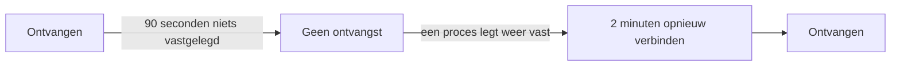

# Als OneUptime geen gegevens ontvangt

Terwijl OneUptime opnieuw start, wordt geüpgraded of een achterstand wegwerkt, kan niets van wat uw agents, collectors, sondes en heartbeat-afzenders sturen uw monitoren bereiken. OneUptime legt vast wanneer dat gebeurt en rekent die tijd nooit aan een server, een host of een andere resource toe: die tijd is niet bewaakt, dus het is geen downtime.

## Hoe het werkt

Elk OneUptime-proces dat gegevens binnenkrijgt, legt elke 30 seconden vast dat het ontvangt, zolang het de databases kan bereiken waarin het gegevens bewaart. OneUptime laat drie soorten tijd buiten beschouwing:

- Geen ontvangst: geen enkel proces heeft langer dan 90 seconden iets vastgelegd. OneUptime was gestopt, werd herstart of geüpgraded, of kon een van zijn databases niet bereiken.
- Opnieuw verbinden: de eerste 2 minuten nadat OneUptime weer ontvangt, terwijl agents opnieuw verbinden en versturen wat ze hebben bewaard.
- Inhalen: zolang de wachtrij met nog te verwerken gegevens meer dan een minuut achterloopt, de tijd sinds de oudste gegevens die er nog in wachten.



Een herstart die korter duurt dan 90 seconden is geen onderbreking: collectors sturen opnieuw wat ze niet konden afleveren.

## Wat er in die tijd verandert

| Waar | Wat OneUptime doet |
| --- | --- |
| Server- / VM-monitoren | **Is Online** telt alleen de minuten waarin OneUptime ontving: standaard is een server offline na 3 minuten stilte die OneUptime had kunnen horen. |
| Monitoren voor inkomende verzoeken en inkomende e-mail | **Recieved In Minutes** en **Not Recieved In Minutes** tellen alleen de minuten waarin OneUptime ontving. Wanneer zo'n criterium is vervuld, vermeldt de reden hoeveel van die minuten buiten beschouwing bleven. |
| Host-, Kubernetes-, Docker-, metriek-, log- en trace-monitoren en de andere monitoren die telemetrie lezen | Een controle waarvan het venster tijd zonder ontvangst bevat, wacht tot die tijd het venster heeft verlaten, en nooit langer dan 15 minuten nadat die eindigde. Tot dan verandert er niets: geen statuswijziging, en geen incident of waarschuwing wordt geopend of opgelost. Zolang de wachtrij achterloopt, leest een controle tot waar de wachtrij is in plaats van tot nu. |
| Hosts, clusters en de rest van de inventaris | Een resource krijgt pas **Verbinding verbroken** nadat de stiltedrempel, voor de meeste 15 minuten, is verstreken terwijl OneUptime ontving. |
| Sondes en AI-agenten | Krijgen **Verbinding verbroken** na 3 minuten stilte terwijl OneUptime ontving. |
| **Beschikbaarheid**-grafieken van hosts, Docker- en Podman-hosts en Kubernetes-clusters | Die tijd wordt gearceerd als **Niet bewaakt**, en de lijn wordt daar onderbroken in plaats van naar down te zakken. De uptime-badge laat die tijd buiten beschouwing; een interval met gegevens telt nog steeds als up. |
| Uptime op statuspagina's en SLO's | Beide worden berekend uit monitorstatussen: zonder valse statuswijziging geen valse downtime. |

> [!NOTE]
> Tijd buiten beschouwing laten is niet hetzelfde als die invullen. Een resource wordt nooit als up getoond voor tijd waarin OneUptime haar niet kon horen: die tijd wordt gewoon niet beoordeeld. Zodra OneUptime weer ontvangt, wordt een resource die echt down is vanaf dat moment beoordeeld op wat ze stuurt, of niet stuurt.

## Zelf gehoste installaties

### Bij het opstarten

Terwijl een OneUptime-proces opstart, beantwoordt het elk verzoek behalve zijn statuscontroles met `503 Service Unavailable` en `Retry-After: 5`, en een browser krijgt een pagina die zichzelf herlaadt. OpenTelemetry-collectors en -SDK's sturen zo'n verzoek opnieuw in plaats van de gegevens te laten vallen. `/status/ready` faalt tot het proces gereed is, zodat Kubernetes het daarvoor geen verkeer stuurt.

### Worker-replica's

Een proces legt alleen vast dat OneUptime ontvangt als inkomend verkeer het kan bereiken. Als u replica's draait die alleen wachtrijen verwerken, zonder ingress ervoor, zet `RECEIVES_INGRESS_TRAFFIC` daar dan op `false`. Anders blijven ze vastleggen terwijl alle replica's die verkeer aannemen down zijn, en telt die storing weer mee tegen uw resources. De Helm-chart zet dit al op zijn worker-pods, en een enkele OneUptime-container heeft niets nodig.

```yaml title="Worker-container"
env:
  - name: RECEIVES_INGRESS_TRAFFIC
    value: "false"
```

### Wat er wordt vastgelegd

OneUptime begint deze registratie bij te houden wanneer u upgradet naar een versie die haar bevat; tijd daarvoor wordt beoordeeld zoals altijd. Zolang geen proces vastlegt dat het ontvangt, geldt de tijd sinds de laatste registratie hooguit een uur als onderbreking; daarna telt stilte weer, zodat een registratie die niet meer wordt geschreven een storing van uw resources niet lang kan verbergen. Registraties worden 400 dagen bewaard, en wanneer OneUptime ze niet kan lezen, beoordeelt het stilte alsof het de hele tijd heeft ontvangen.

## Volgende stappen

:::cards
- [Host-monitor](/docs/monitor/host-monitor): Waarschuwen op de metrieken van een host.
- [Server- / VM-monitor](/docs/monitor/server-monitor): Weten wanneer de agent van een server stopt met rapporteren.
- [Inkomende-verzoek-monitor](/docs/monitor/incoming-request-monitor): Een heartbeat in een dodemansknop veranderen.
- [Upgraden](/docs/installation/upgrading): Een zelf gehoste installatie upgraden.
:::
