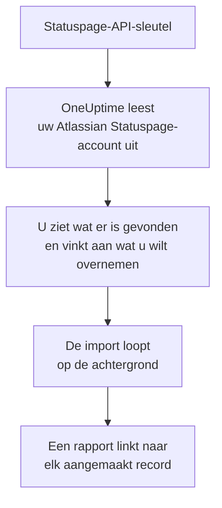

# Overstappen van Atlassian Statuspage

**Importeren uit een andere tool** haalt uw Atlassian Statuspage-pagina's in een paar minuten over naar OneUptime. Met een Statuspage-API-sleutel leest OneUptime uw pagina's, hun componenten en groepen en hun e-mailabonnees uit, laat zien wat het heeft gevonden en maakt aan wat u aanvinkt. In Statuspage verandert niets.

:::cards
- [Uw account importeren](#uw-atlassian-statuspage-account-importeren): Maak een sleutel, lees uw account uit en vink aan wat u wilt overnemen.
- [Wat wordt overgenomen](#wat-wordt-overgenomen): Wat elke Statuspage-pagina, elk component en elke abonnee in OneUptime wordt.
- [Rond de overstap af](#rond-de-overstap-af): Wat u doet als de import klaar is.
:::

## Hoe het werkt

- **De sleutel wordt één keer gebruikt.** Hij wordt versleuteld bewaard zolang OneUptime uw account uitleest en verwijderd zodra het uitlezen klaar is, of het nu gelukt is of niet. Hij wordt nooit meer getoond en nooit in een log geschreven.
- **OneUptime leest alleen.** Het roept alleen de API van Atlassian Statuspage aan: `api.statuspage.io`. Het doet één verzoek per seconde, het maximum dat Statuspage een sleutel toestaat. Als Atlassian Statuspage vraagt om het rustiger aan te doen, wacht het en probeert het opnieuw.
- **Er wordt niets aangemaakt voordat u de import start.** Het voorbeeld laat voor elk item zien of het nieuw is, al in OneUptime staat (en wordt gebruikt zoals het is), door een eerdere import is overgenomen, of waarom het niet kan worden overgenomen.
- **Opnieuw uitvoeren maakt nooit iets dubbel aan.** OneUptime onthoudt wat elke import heeft overgenomen, op het Atlassian Statuspage-ID. Voer de import opnieuw uit nadat u in Atlassian Statuspage pagina's of componenten hebt toegevoegd, en alleen de nieuwe worden aangemaakt.

## Voordat u begint

- **Een OneUptime-project en het recht om aan te maken wat u overneemt.** Projecteigenaren en projectbeheerders kunnen alles overnemen. Andere rollen kunnen ook een import uitvoeren en de soorten records overnemen die ze mogen aanmaken. De rest wordt getoond als niet overgenomen, met de reden.
- **Een Statuspage-API-sleutel.** Alleen een accounteigenaar kan er een maken. De import schrijft nooit naar Statuspage en leest elke pagina die de sleutel kan zien.
- **Ruimte voor uw pagina's, in OneUptime Cloud.** Uw abonnement heeft ruimte voor een bepaald aantal statuspagina's en abonnees. Wat niet past, wordt getoond als niet overgenomen. De componenten worden handmatige monitoren, en die zijn gratis.

## Uw Atlassian Statuspage-account importeren

:::steps
### Maak een API-sleutel in Statuspage
Selecteer in Statuspage linksonder uw avatar en daarna **API info**. Kies **Create key**, noem hem `OneUptime import` en kopieer hem.

### Open de importpagina
Ga in OneUptime naar **Projectinstellingen** > **Importeren uit een andere tool** en kies **Atlassian Statuspage**.

### Koppel Atlassian Statuspage
Plak de sleutel in **Atlassian Statuspage-API-sleutel** en kies **Mijn Atlassian Statuspage-account uitlezen**. Een groot account duurt een paar minuten, en u kunt de pagina verlaten terwijl het wordt uitgelezen.

### Vink aan wat u wilt overnemen
Het voorbeeld toont wat er is gevonden, met één sectie per soort. Alles wat zou worden aangemaakt, is aan het begin aangevinkt, behalve abonnees. Onder elk item zegt OneUptime wat niet precies zo wordt overgenomen als het was. Als een aangevinkte statuspagina een monitor toont die u niet hebt aangevinkt, zegt het dat, en **Deze ook aanvinken** vinkt hem aan. Om abonnees over te nemen, vinkt u ze aan en bevestigt u eronder dat ze ermee hebben ingestemd uw updates te ontvangen en dat u ze mag overzetten. Er wordt niemand gemaild.

### Start de import
Kies **Import starten**. De import loopt op de achtergrond: u kunt de pagina verlaten, en het rapport wacht daar op u.
:::

Het rapport telt wat is aangemaakt en niet overgenomen, en toont elk item met een link naar het record dat het is geworden, mislukte eerst. Eerdere imports staan onder **Eerdere imports** op dezelfde pagina.

## Wat wordt overgenomen

| In Atlassian Statuspage | In OneUptime | Hoe |
| --- | --- | --- |
| Components | Handmatige monitoren | Elk component wordt een handmatige monitor die de statuspagina toont. Niets controleert hem: u stelt de status in OneUptime in, zoals u in Statuspage deed. Een componentgroep wordt een groep op de pagina. |
| Pages | Statuspagina's | Elke pagina wordt overgenomen met haar naam en beschrijving, haar componenten in hun groepen, en beschikbaarheid en geschiedenis voor de componenten die ze uitlicht. Een pagina die alleen sommige mensen mogen zien, wordt privé overgenomen. |
| Email subscribers | Statuspagina-abonnees | Bevestigde e-mailabonnees worden overgenomen zodra u bevestigt dat u ze mag overzetten, en volgen dezelfde componenten. Er wordt niemand gemaild, en elke update die ze van OneUptime krijgen, bevat een link om zich af te melden. |

Componenten worden als operationeel overgenomen. Het voorbeeld noemt elk component dat nu in Statuspage niet operationeel is, zodat u de status na de import kunt instellen.

## Wat niet wordt overgenomen

- **Incidenten, gepland onderhoud en hun geschiedenis.** Een incident in OneUptime is een levend record dat mensen oproept, dus eerdere incidenten blijven in Statuspage.
- **Abonnees via sms, webhook, Slack of Microsoft Teams.** Het voorbeeld telt ze. Alleen e-mailabonnees worden overgenomen.
- **Incidentsjablonen en systeemmetrieken.** Voeg in OneUptime toe wat u nog nodig hebt.
- **Het eigen domein en de huisstijl van een statuspagina.** Voeg in OneUptime het domein toe onder **Aangepaste domeinen** en het logo onder **Huisstijl**.

## Limieten

Eén import maakt hooguit 2.000 records aan: hooguit 1.000 monitoren en 50 statuspagina's. Abonnees tellen daar niet bij: één import neemt hooguit 5.000 abonnees over. Alles boven een limiet wordt getoond als niet overgenomen. Voer de import opnieuw uit om de rest over te nemen.

In OneUptime Cloud worden statuspagina's en abonnees waarvoor uw abonnement geen ruimte meer heeft, getoond als niet overgenomen, met wat ze nodig hebben.

Een voorbeeld wordt een dag bewaard. Alleen wie het account heeft uitgelezen, kan items aanvinken en de import starten. Projecteigenaren en projectbeheerders zien de voortgang en het rapport van elke import.

## Rond de overstap af

:::steps
### Controleer uw statuspagina's
Open elke pagina onder **Statuspagina's** en vergelijk die met de pagina in Statuspage. Elk component is een handmatige monitor: wijzig de status in OneUptime als er iets verandert.

### Laat het adres van uw statuspagina naar OneUptime wijzen
Open de pagina onder **Statuspagina's**, voeg uw domein toe onder **Aangepaste domeinen** en wijzig daarna het DNS-record. Uw bezoekers en abonnees komen dan op de nieuwe pagina.

### Schakel uw pagina in Atlassian Statuspage uit
Zodra uw domein naar OneUptime wijst, sluit u de pagina in Statuspage, zodat de abonnees niet twee keer bericht krijgen.
:::

## Problemen oplossen

:::details Atlassian Statuspage heeft de API-sleutel niet geaccepteerd
Controleer of u de hele sleutel hebt gekopieerd en of een accounteigenaar hem onder **API info** heeft gemaakt. Een sleutel hoort bij één Statuspage-organisatie en leest alleen haar pagina's. Kies daarna **Opnieuw proberen**.
:::

:::details De abonnees kunnen niet worden overgenomen
Vink het vakje eronder aan dat bevestigt dat ze met uw updates hebben ingestemd en dat u ze mag overzetten: **Import starten** wacht daarop. Abonnees die hun abonnement in Statuspage nooit hebben bevestigd, blijven daar.
:::

:::details Sommige items kunnen niet worden aangevinkt
Bij elk item staat waarom: een naam die het project al heeft, iets wat een eerdere import heeft overgenomen, of een record dat u niet mag aanmaken of dat uw abonnement niet bevat.
:::

## Volgende stappen

:::cards
- [Statuspagina's – Overzicht](/docs/status-pages/index): Wat een statuspagina toont en wie hem kan zien.
- [Abonnees en aankondigingen](/docs/status-pages/subscribers): Hoe abonnees over incidenten horen.
- [Handmatige monitor](/docs/monitor/manual-monitor): Een monitor waarvan u zelf de status instelt.
:::
