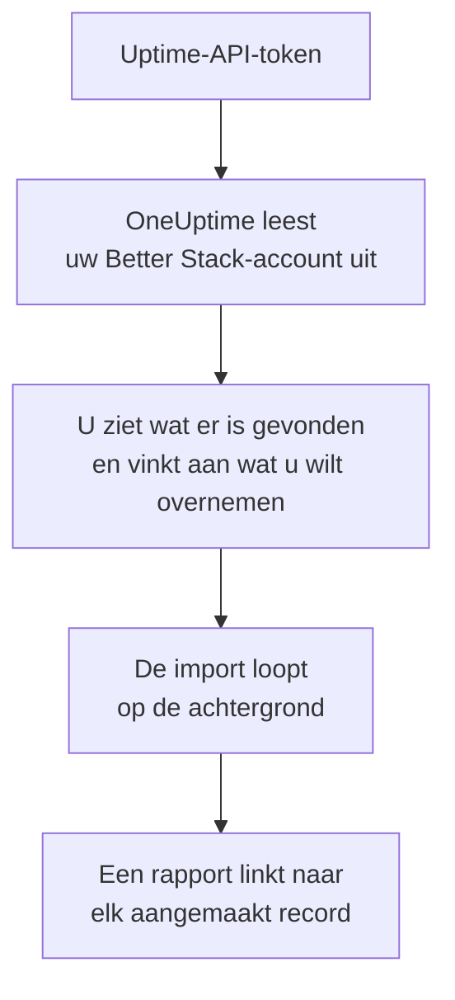

# Overstappen van Better Stack

**Importeren uit een andere tool** haalt uw Better Stack Uptime-monitoren, heartbeats en statuspagina's in een paar minuten over naar OneUptime. Met een Uptime-API-token van Better Stack leest OneUptime uw monitoren, heartbeats, statuspagina's en hun e-mailabonnees uit, laat zien wat het heeft gevonden en maakt aan wat u aanvinkt. In Better Stack verandert niets.

:::cards
- [Uw account importeren](#uw-better-stack-account-importeren): Maak een token, lees uw account uit en vink aan wat u wilt overnemen.
- [Wat wordt overgenomen](#wat-wordt-overgenomen): Wat elke Better Stack-monitor, -heartbeat en -statuspagina in OneUptime wordt.
- [Rond de overstap af](#rond-de-overstap-af): Wat u doet als de import klaar is.
:::

## Hoe het werkt

- **De sleutel wordt één keer gebruikt.** Hij wordt versleuteld bewaard zolang OneUptime uw account uitleest en verwijderd zodra het uitlezen klaar is, of het nu gelukt is of niet. Hij wordt nooit meer getoond en nooit in een log geschreven.
- **OneUptime leest alleen.** Het roept alleen de API van Better Stack aan: `incidents.betterstack.com`. Als Better Stack vraagt om het rustiger aan te doen, wacht het en probeert het opnieuw.
- **Er wordt niets aangemaakt voordat u de import start.** Het voorbeeld laat voor elk item zien of het nieuw is, al in OneUptime staat (en wordt gebruikt zoals het is), door een eerdere import is overgenomen, of waarom het niet kan worden overgenomen.
- **Opnieuw uitvoeren maakt nooit iets dubbel aan.** OneUptime onthoudt wat elke import heeft overgenomen, op het Better Stack-ID. Voer de import opnieuw uit nadat u in Better Stack monitoren of heartbeats hebt toegevoegd, en alleen de nieuwe worden aangemaakt.

## Voordat u begint

- **Een OneUptime-project en het recht om aan te maken wat u overneemt.** Projecteigenaren en projectbeheerders kunnen alles overnemen. Andere rollen kunnen ook een import uitvoeren en de soorten records overnemen die ze mogen aanmaken. De rest wordt getoond als niet overgenomen, met de reden.
- **Een Uptime-API-token van Better Stack.** Gebruik een teamgebonden Uptime-token: het leest de monitoren, heartbeats en statuspagina's van dat team. De import schrijft nooit naar Better Stack.
- **Een betaalmethode, in OneUptime Cloud.** Monitoren die controles uitvoeren, worden naar gebruik gefactureerd, ook met het Free-abonnement. Voeg er daarom vóór de import een toe onder **Projectinstellingen** > **Facturering**. Zonder betaalmethode worden die monitoren getoond als niet overgenomen.

## Uw Better Stack-account importeren

:::steps
### Maak een API-token in Better Stack
Ga in Better Stack naar **API tokens** > **Team-based tokens** en selecteer uw team. Maak onder **Uptime API tokens** een token met de naam `OneUptime import` en kopieer het.

### Open de importpagina
Ga in OneUptime naar **Projectinstellingen** > **Importeren uit een andere tool** en kies **Better Stack**.

### Koppel Better Stack
Plak het token in **Better Stack-API-sleutel** en kies **Mijn Better Stack-account uitlezen**. Een groot account duurt een paar minuten, en u kunt de pagina verlaten terwijl het wordt uitgelezen.

### Vink aan wat u wilt overnemen
Het voorbeeld toont wat er is gevonden, met één sectie per soort. Alles wat zou worden aangemaakt, is aan het begin aangevinkt, behalve gepauzeerde monitoren, die gepauzeerd worden overgenomen als u ze aanvinkt, en abonnees. Onder elk item zegt OneUptime wat niet precies zo wordt overgenomen als het was. Als een aangevinkte statuspagina een monitor toont die u niet hebt aangevinkt, zegt het dat, en **Deze ook aanvinken** vinkt hem aan. Om abonnees over te nemen, vinkt u ze aan en bevestigt u eronder dat ze ermee hebben ingestemd uw updates te ontvangen en dat u ze mag overzetten. Er wordt niemand gemaild.

### Start de import
Kies **Import starten**. De import loopt op de achtergrond: u kunt de pagina verlaten, en het rapport wacht daar op u.
:::

Het rapport telt wat is aangemaakt en niet overgenomen, en toont elk item met een link naar het record dat het is geworden, mislukte eerst. Eerdere imports staan onder **Eerdere imports** op dezelfde pagina.

## Wat wordt overgenomen

| In Better Stack | In OneUptime | Hoe |
| --- | --- | --- |
| Monitors and heartbeats | Monitoren | Elke monitor wordt een monitor van hetzelfde soort, met hetzelfde adres, interval en dezelfde time-out. Elke heartbeat wordt een inkomende-verzoekmonitor. |
| Status pages | Statuspagina's | Elke pagina wordt overgenomen met haar secties als groepen en de monitoren en heartbeats die ze toont. Een item dat u met de hand bijhoudt, wordt een handmatige monitor. Een pagina met een wachtwoord of een IP-allowlist wordt privé overgenomen. |
| Email subscribers | Statuspagina-abonnees | Bevestigde e-mailabonnees worden overgenomen zodra u bevestigt dat u ze mag overzetten, en volgen dezelfde bronnen. Er wordt niemand gemaild, en elke update die ze van OneUptime krijgen, bevat een link om zich af te melden. |

- **Status-, expected-status-code-, keyword- en keyword-absence-monitoren** worden websitemonitoren, of API-monitoren als ze een andere methode, headers of een JSON-body sturen. Een statusmonitor is beschikbaar bij elk 2xx-antwoord, en een expected-status-code-monitor bij de codes die hij noemt.
- **Ping- en TCP-monitoren** worden ping- en poortmonitoren. **SMTP-, POP- en IMAP-monitoren** worden poortmonitoren op hun poort: OneUptime controleert of de poort antwoordt, niet het mailgesprek.
- **DNS-monitoren** worden DNS-monitoren voor de naam die ze opvragen, bij dezelfde server.
- **Heartbeats** worden inkomende-verzoekmonitoren, die uitvallen als er gedurende de periode en de respijttijd geen verzoek is gekomen. Elk heeft een nieuw adres in OneUptime.
- **SSL-vervalwaarschuwingen.** Een monitor die waarschuwt voordat zijn certificaat verloopt, krijgt ook een SSL-certificaatmonitor, naar hem genoemd, die evenveel dagen vooraf waarschuwt.

Elke monitor wordt gecontroleerd vanaf de sondes van uw project, net als een monitor die u zelf aanmaakt. Een interval dat OneUptime niet biedt, wordt het dichtstbijzijnde dat het wel biedt, en een time-out van meer dan een minuut wordt één minuut. Het voorbeeld zegt wanneer een van beide verandert.

## Wat niet wordt overgenomen

- **De beschikbaarheidsgeschiedenis, responstijden en incidenten.** OneUptime begint met controleren als de import klaar is.
- **Waarschuwingscontacten en integraties.** Kies in OneUptime wie er bericht krijgt, zoals beschreven in [Rond de overstap af](#rond-de-overstap-af).
- **Wachtwoorden, en headers die een geheim kunnen bevatten.** Een monitor die zich aanmeldt, of die een `Authorization`-, cookie- of tokenheader stuurt, wordt zonder overgenomen: voeg die toe met een [monitorgeheim](/docs/monitor/monitor-secrets).
- **UDP- en Playwright-monitoren.** OneUptime heeft geen monitor die hetzelfde doet, en het voorbeeld noemt ze allemaal.
- **Abonnees die hun abonnement nooit hebben bevestigd.** Die blijven in Better Stack.
- **Wat een statuspagina toont naast monitoren, heartbeats en met de hand bijgehouden items.** Het voorbeeld noemt ze allemaal.
- **Het eigen domein en de huisstijl van een statuspagina.** Voeg in OneUptime het domein toe onder **Aangepaste domeinen** en het logo onder **Huisstijl**.

## Limieten

Eén import maakt hooguit 2.000 records aan: hooguit 1.000 monitoren en 50 statuspagina's. Abonnees tellen daar niet bij: één import neemt hooguit 5.000 abonnees over. Alles boven een limiet wordt getoond als niet overgenomen. Voer de import opnieuw uit om de rest over te nemen.

In OneUptime Cloud hebben monitoren die controles uitvoeren een betaalmethode nodig, en wat niet meer in uw abonnement past, wordt getoond als niet overgenomen, met wat het nodig heeft.

Een voorbeeld wordt een dag bewaard. Alleen wie het account heeft uitgelezen, kan items aanvinken en de import starten. Projecteigenaren en projectbeheerders zien de voortgang en het rapport van elke import.

## Rond de overstap af

:::steps
### Controleer uw monitoren
Open elke monitor onder **Monitoren** en controleer de eerste resultaten. Een heartbeatmonitor heeft een nieuw adres: laat de taak die hem aanroept daarnaar wijzen.

### Kies wie er bericht krijgt
Voeg eigenaren toe aan uw monitoren, of bereikbaarheidsbeleid onder **Bereikbaarheidsdienst** > **Bereikbaarheidsbeleid** aan de incidenten die ze openen, zodat de juiste mensen het horen als er iets uitvalt.

### Laat het adres van uw statuspagina naar OneUptime wijzen
Open de pagina onder **Statuspagina's**, voeg uw domein toe onder **Aangepaste domeinen** en wijzig daarna het DNS-record. Uw bezoekers en abonnees komen dan op de nieuwe pagina.

### Schakel de controles in Better Stack uit
Zodra OneUptime hetzelfde controleert, pauzeert u de controles in Better Stack, zodat niemand twee keer bericht krijgt.
:::

## Problemen oplossen

:::details Better Stack heeft de API-sleutel niet geaccepteerd
Controleer of u het hele token hebt gekopieerd en of het het token van het team uit **Uptime API tokens** is, geen Telemetry-token. Kies daarna **Opnieuw proberen**.
:::

:::details Een monitor wordt getoond als niet overgenomen
Er staat bij waarom: een soort monitor die OneUptime niet heeft, een adres dat OneUptime niet kan lezen, of een project zonder ruimte of zonder betaalmethode ervoor. Een monitor die OneUptime al uitvoert, met dezelfde naam, hetzelfde type en hetzelfde adres, wordt gebruikt zoals hij is.
:::

:::details Sommige items kunnen niet worden aangevinkt
Bij elk item staat waarom: een naam die het project al heeft, iets wat een eerdere import heeft overgenomen, of een record dat u niet mag aanmaken of dat uw abonnement niet bevat.
:::

## Volgende stappen

:::cards
- [Inkomende-verzoek-monitor](/docs/monitor/incoming-request-monitor): Hoe een heartbeat werkt in OneUptime.
- [Statuspagina's – Overzicht](/docs/status-pages/index): Wat een statuspagina toont en wie hem kan zien.
- [Overstappen van UptimeRobot](/docs/moving-to-oneuptime/uptimerobot): Haal uw controles over uit UptimeRobot.
:::
