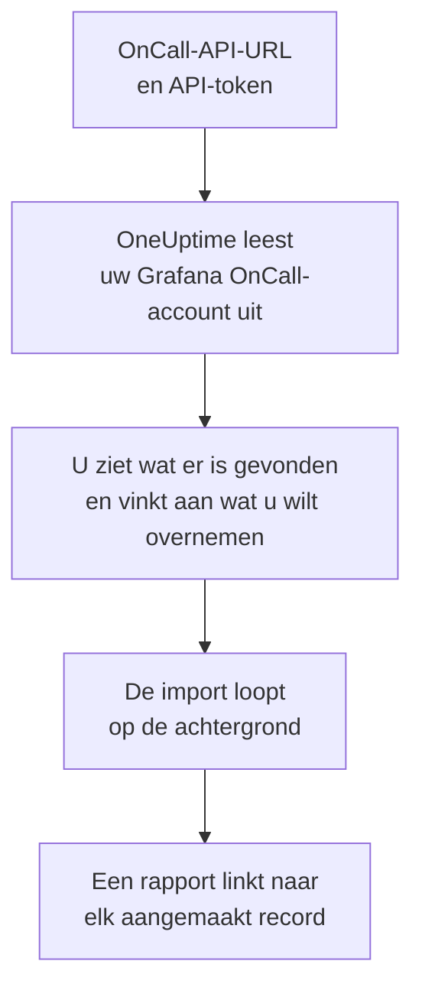

# Overstappen van Grafana OnCall

Grafana Labs heeft de opensourceversie van Grafana OnCall in maart 2026 gearchiveerd, en in Grafana Cloud leeft het voort als onderdeel van Grafana Cloud IRM. Waar de uwe ook draait, **Importeren uit een andere tool** haalt uw bereikbaarheidsinrichting in een paar minuten over naar OneUptime. Met uw OnCall-API-URL en een API-token leest OneUptime uw gebruikers, teams, schema's en escalatieketens uit, laat zien wat het heeft gevonden en maakt aan wat u aanvinkt. In Grafana OnCall verandert niets.

:::cards
- [Uw account importeren](#uw-grafana-oncall-account-importeren): Maak een token, lees uw account uit en vink aan wat u wilt overnemen.
- [Wat wordt overgenomen](#wat-wordt-overgenomen): Wat elk Grafana OnCall-record in OneUptime wordt.
- [Rond de overstap af](#rond-de-overstap-af): Wat u doet als de import klaar is.
:::

## Hoe het werkt

- **Het token wordt één keer gebruikt.** Het wordt samen met de API-URL versleuteld bewaard zolang OneUptime uw account uitleest en verwijderd zodra het uitlezen klaar is, of het nu gelukt is of niet. Het wordt nooit meer getoond en nooit in een log geschreven.
- **OneUptime leest alleen, en alleen van het adres dat u opgeeft.** Het roept alleen de OnCall-API-URL aan die u plakt, hooguit één keer per seconde, en blijft daarmee binnen de limiet van Grafana OnCall van 300 verzoeken per token in vijf minuten. Als Grafana OnCall vraagt om het rustiger aan te doen, wacht het en probeert het opnieuw.
- **Het adres wordt voor elk verzoek gecontroleerd.** OneUptime roept nooit de machine aan waarop het draait of een metadataservice van een cloud, en volgt nooit een omleiding. In OneUptime Cloud moet het adres bovendien openbaar zijn en beginnen met `https://`. Een zelf gehoste OneUptime kan ook een Grafana OnCall in uw eigen netwerk uitlezen, tenzij de beheerder dat heeft uitgeschakeld, zoals beschreven in [Private Network Access](/docs/self-hosted/private-network-access).
- **Er wordt niets aangemaakt voordat u de import start.** Het voorbeeld laat voor elk item zien of het nieuw is, al in OneUptime staat (en wordt gebruikt zoals het is), door een eerdere import is overgenomen, of waarom het niet kan worden overgenomen.
- **Opnieuw uitvoeren maakt nooit iets dubbel aan.** OneUptime onthoudt wat elke import heeft overgenomen, op het Grafana OnCall-ID. Voer de import opnieuw uit nadat u in Grafana OnCall personen of schema's hebt toegevoegd, en alleen de nieuwe worden aangemaakt.

## Voordat u begint

- **Een OneUptime-project en het recht om aan te maken wat u overneemt.** Projecteigenaren en projectbeheerders kunnen alles overnemen. Andere rollen kunnen ook een import uitvoeren en de soorten records overnemen die ze mogen aanmaken. De rest wordt getoond als niet overgenomen, met de reden.
- **Een API-token van Grafana OnCall.** Gebruik een OnCall-API-token, geen token van een Grafana-serviceaccount. De import schrijft nooit naar Grafana OnCall. Verwijder het token zodra de import klaar is.
- **Uw OnCall-API-URL.** De instellingen van OnCall tonen die naast de API-tokens. In Grafana Cloud ziet die eruit als `https://oncall-prod-us-central-0.grafana.net/oncall`. Bij een eigen installatie is het het adres van uw OnCall-engine.

## Uw Grafana OnCall-account importeren

:::steps
### Maak een API-token in Grafana OnCall
Open in Grafana **OnCall** > **Settings**. Open in Grafana Cloud **IRM** > **Settings** > **Admin & API**. Kopieer de OnCall-API-URL die daar staat. Maak onder **API tokens** een token met de naam `OneUptime import` en kopieer het.

### Open de importpagina
Ga in OneUptime naar **Projectinstellingen** > **Importeren uit een andere tool** en kies **Grafana OnCall**.

### Koppel Grafana OnCall
Plak het adres in **Grafana OnCall-API-URL** en het token in **Grafana OnCall-API-sleutel**, en kies **Mijn Grafana OnCall-account uitlezen**. Een groot account duurt een paar minuten, en u kunt de pagina verlaten terwijl het wordt uitgelezen.

### Vink aan wat u wilt overnemen
Het voorbeeld toont wat er is gevonden, met één sectie per soort. Alles wat zou worden aangemaakt, is aan het begin aangevinkt, behalve personen die in geen team, schema of escalatieketen zitten. Onder elk item zegt OneUptime wat niet precies zo wordt overgenomen als het was. Als een aangevinkt item iets gebruikt dat u niet hebt aangevinkt, zegt het dat, en **Deze ook aanvinken** vinkt het aan.

### Start de import
Als er personen worden uitgenodigd, kiest u onder **Nieuwe personen uitnodigen voor** het team waar ze bij komen. Kies daarna **Import starten**. De import loopt op de achtergrond: u kunt de pagina verlaten, en het rapport wacht daar op u.
:::

Het rapport telt wat is aangemaakt, uitgenodigd en niet overgenomen, en toont elk item met een link naar het record dat het is geworden, mislukte eerst. Eerdere imports staan onder **Eerdere imports** op dezelfde pagina.

## Wat wordt overgenomen

| In Grafana OnCall | In OneUptime | Hoe |
| --- | --- | --- |
| Gebruikers | Projectleden | Gekoppeld op e-mailadres. Wie nog niet in het project zit, wordt uitgenodigd voor het team dat u kiest. |
| Teams | Teams | Aangemaakt met hun leden. Een team waarvan het project de naam al heeft, wordt gebruikt zoals het is, en de leden blijven ongewijzigd. |
| Schema's | Bereikbaarheidsschema's | Elke rotatie wordt een laag met dezelfde personen, hetzelfde begin, dezelfde overdracht en dezelfde uren van dienst, in de tijdzone van het schema, met het team van het schema als eigenaar. Een rotatie op een hogere laag gaat nog steeds voor de lagen eronder. |
| Escalatieketens | Bereikbaarheidsbeleid | De stappen die personen, een team of wie in een schema dienst heeft waarschuwen, worden escalatieregels, en een wachtstap wordt de wachttijd voor de volgende regel. Een stap die de keten herhaalt, wordt de herhalingen van het beleid. |

Rotaties op dezelfde laag die tegelijk dienst hebben, en een rotatie die meerdere personen tegelijk dienst geeft, worden elk een eigen OneUptime-schema, omdat een OneUptime-schema één persoon tegelijk met dienst heeft. Elk bereikbaarheidsbeleid dat het schema opriep, roept ze allemaal op.

## Wat niet wordt overgenomen

- **Waarschuwingsgroepen en hun geschiedenis.** OneUptime begint met uw inrichting, niet met uw eerdere waarschuwingen.
- **Integraties, routes en uitgaande webhooks.** Richt in plaats daarvan uw monitoren en bronnen van waarschuwingen op OneUptime, zoals beschreven in [Rond de overstap af](#rond-de-overstap-af).
- **Overschrijvingen, eenmalige diensten en rotaties die al zijn afgelopen.** Voeg na de import in OneUptime de overschrijvingen toe die u nog nodig hebt.
- **Diensten uit een agendalink.** Een schema waarvan de diensten uit een iCal-link komen, wordt zonder lagen overgenomen, dus voeg die toe in OneUptime.
- **De meldingsregels van elke persoon.** Iedereen kiest in de eigen **Gebruikersinstellingen** hoe hij wordt opgeroepen, zodra hij de uitnodiging accepteert.
- **Stappen waarvoor OneUptime geen exacte tegenhanger heeft.** Een stap die een Slack-gebruikersgroep of -kanaal waarschuwt, een webhook aanroept, een incident uitroept of de waarschuwing oplost, wordt weggelaten. Een stap die personen een voor een waarschuwt, roept iedereen tegelijk op, een stap die alleen op bepaalde tijden of bij een bepaald aantal waarschuwingen doorgaat, gaat altijd door, en het voorbeeld zegt wat er verandert.

## Limieten

Eén import maakt hooguit 2.000 records aan: hooguit 500 personen, 200 teams, 200 bereikbaarheidsschema's en 200 bereikbaarheidsbeleidsregels. Alles boven een limiet wordt getoond als niet overgenomen. Voer de import opnieuw uit om de rest over te nemen.

In OneUptime Cloud worden records die uw abonnement niet bevat, getoond als niet overgenomen, met het abonnement dat ze nodig hebben.

Een voorbeeld wordt een dag bewaard. Alleen wie het account heeft uitgelezen, kan items aanvinken en de import starten. Projecteigenaren en projectbeheerders zien de voortgang en het rapport van elke import.

## Rond de overstap af

:::steps
### Controleer de bereikbaarheidsschema's
Open elk schema onder **Bereikbaarheidsdienst** > **Bereikbaarheidsschema's** en controleer wie nu dienst heeft en wie daarna.

### Zorg dat iedereen kan worden opgeroepen
Uitgenodigde personen accepteren hun uitnodiging en voegen dan een telefoonnummer, een e-mailadres of de mobiele app toe om op te worden opgeroepen. **Bereikbaarheidsdienst** > **Gereedheid** laat zien wie nog niet bereikbaar is.

### Stuur uw waarschuwingen naar OneUptime
Richt uw monitoren en de tools die waarschuwingen geven op OneUptime, en roep uzelf eenmaal op om het te testen.

### Schakel oproepen in Grafana OnCall uit
Zodra OneUptime de juiste personen oproept, schakelt u de meldingen in Grafana OnCall uit, zodat niemand twee keer wordt opgeroepen.
:::

## Problemen oplossen

:::details Grafana OnCall heeft de API-sleutel niet geaccepteerd
Controleer of u het hele token hebt gekopieerd, of het een OnCall-API-token is en geen token van een Grafana-serviceaccount, en of de API-URL de URL is die ernaast staat. Kies daarna **Opnieuw proberen**.
:::

:::details OneUptime heeft de API-URL niet aangeroepen
Plak de OnCall-API-URL precies zoals de instellingen van OnCall die tonen. In OneUptime Cloud moet die beginnen met `https://` en bereikbaar zijn vanaf internet. Een zelf gehoste OneUptime kan ook een adres in uw eigen netwerk bereiken, tenzij de beheerder dat heeft uitgeschakeld, maar nooit een adres op de machine waarop OneUptime draait.
:::

:::details Een soort record ontbreekt in het voorbeeld
Het token kon het niet lezen, en het voorbeeld zegt dat bovenaan. Een token leest wat de persoon die het heeft gemaakt mag zien, dus maak het aan als beheerder van Grafana OnCall en lees het account opnieuw uit.
:::

:::details Sommige items kunnen niet worden aangevinkt
Bij elk item staat waarom: een naam die het project al heeft, iets wat een eerdere import heeft overgenomen, of een record dat u niet mag aanmaken of dat uw abonnement niet bevat.
:::

## Volgende stappen

:::cards
- [Bereikbaarheidsschema's](/docs/on-call/schedules): Lagen, beperkingen en overdrachten.
- [Escalatieregels](/docs/on-call/escalation-rules): Hoe bereikbaarheidsbeleid personen oproept.
- [Overstappen van PagerDuty](/docs/moving-to-oneuptime/pagerduty): Haal een team over uit PagerDuty.
:::
