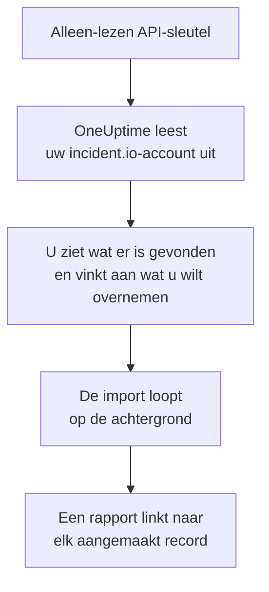

# Overstappen van incident.io

**Importeren uit een andere tool** haalt uw incident.io-inrichting in een paar minuten naar OneUptime. Met een alleen-lezen incident.io-API-sleutel leest OneUptime uw gebruikers, teams, schema's, escalatiepaden, services en incidentinstellingen uit, laat zien wat het heeft gevonden en maakt aan wat u aanvinkt. In incident.io verandert niets.

:::cards
- [Uw account importeren](#uw-incidentio-account-importeren): Maak een sleutel, lees uw account uit en vink aan wat u wilt overnemen.
- [Wat wordt overgenomen](#wat-wordt-overgenomen): Wat elk incident.io-record in OneUptime wordt.
- [Rond de overstap af](#rond-de-overstap-af): Wat u doet als de import klaar is.
:::

## Hoe het werkt

- **De sleutel wordt één keer gebruikt.** Hij wordt versleuteld bewaard zolang OneUptime uw account uitleest en verwijderd zodra het uitlezen klaar is, of het nu gelukt is of niet. Hij wordt nooit meer getoond en nooit in een log geschreven.
- **OneUptime leest alleen.** Het roept alleen de API van incident.io aan, `api.incident.io`. Als incident.io vraagt om het rustiger aan te doen, wacht het en probeert het opnieuw.
- **Er wordt niets aangemaakt voordat u de import start.** Het voorbeeld laat voor elk item zien of het nieuw is, al in OneUptime staat (en wordt gebruikt zoals het is), door een eerdere import is overgenomen, of waarom het niet kan worden overgenomen.
- **Opnieuw uitvoeren maakt nooit iets dubbel aan.** OneUptime onthoudt wat elke import heeft overgenomen, op het incident.io-ID. Voer de import opnieuw uit nadat u in incident.io personen of schema's hebt toegevoegd, en alleen de nieuwe worden aangemaakt.

## Voordat u begint

- **Een OneUptime-project en het recht om aan te maken wat u overneemt.** Projecteigenaren en projectbeheerders kunnen alles overnemen. Andere rollen kunnen ook een import uitvoeren en de soorten records overnemen die ze mogen aanmaken. De rest wordt getoond als niet overgenomen, met de reden.
- **Een incident.io-API-sleutel die alleen gegevens kan bekijken.** De import schrijft nooit naar incident.io, dus de sleutel heeft geen recht nodig om iets aan te maken, te bewerken of te beheren.

## Uw incident.io-account importeren

:::steps
### Maak een API-sleutel in incident.io
Ga in incident.io naar **Settings** > **API keys** en kies **Add new**. Noem hem `OneUptime import`, geef hem alleen rechten om gegevens te bekijken, geen om aan te maken, te bewerken of te beheren, en kopieer de sleutel.

### Open de importpagina
Ga in OneUptime naar **Projectinstellingen** > **Importeren uit een andere tool** en kies **incident.io**.

### Koppel incident.io
Plak de sleutel in **incident.io-API-sleutel** en kies **Mijn incident.io-account uitlezen**. Een groot account duurt een paar minuten, en u kunt de pagina verlaten terwijl het wordt uitgelezen.

### Vink aan wat u wilt overnemen
Het voorbeeld toont wat er is gevonden, met één sectie per soort. Alles wat zou worden aangemaakt, is aan het begin aangevinkt, behalve personen die in geen team, schema of escalatiepad zitten. Onder elk item zegt OneUptime wat niet precies zo wordt overgenomen als het was. Als een aangevinkt item iets gebruikt dat u niet hebt aangevinkt, zegt het dat, en **Deze ook aanvinken** vinkt het aan.

### Start de import
Als er personen worden uitgenodigd, kiest u onder **Nieuwe personen uitnodigen voor** het team waar ze bij komen. Kies daarna **Import starten**. De import loopt op de achtergrond: u kunt de pagina verlaten, en het rapport wacht daar op u.
:::

Het rapport telt wat is aangemaakt, uitgenodigd en niet overgenomen, en toont elk item met een link naar het record dat het is geworden, mislukte eerst. Eerdere imports staan onder **Eerdere imports** op dezelfde pagina.

## Wat wordt overgenomen

| In incident.io | In OneUptime | Hoe |
| --- | --- | --- |
| Gebruikers | Projectleden | Gekoppeld op e-mailadres. Wie nog niet in het project zit, wordt uitgenodigd voor het team dat u kiest. Gedeactiveerde gebruikers worden niet overgenomen. |
| Teams | Teams | Aangemaakt met hun leden. Een team waarvan het project de naam al heeft, wordt gebruikt zoals het is, en de leden blijven ongewijzigd. |
| Schema's | Bereikbaarheidsschema's | Elke rotatie wordt een laag met dezelfde personen, hetzelfde begin, dezelfde beurtlengte en dezelfde werktijden, in de tijdzone van het schema. De versie van de rotatie die nu geldt, wordt overgenomen. |
| Escalatiepaden | Bereikbaarheidsbeleid | Elk niveau wordt een escalatieregel die dezelfde schema's, gebruikers en teams oproept, na dezelfde wachttijd. Een herhaling wordt de herhalingen van het beleid, en van een vertakking wordt het eerste pad overgenomen. |
| Catalogusservices | Services | De items van uw catalogustypen in de categorie service, aangemaakt in de servicecatalogus. Gearchiveerde items worden weggelaten. |
| Ernstniveaus | Incidenternsten | Aangemaakt in de volgorde van incident.io, de ernstigste eerst. Een ernstniveau waarvan het project de naam al heeft, wordt gebruikt zoals het is. |
| Statussen | Incidentstatussen | Een triagestatus komt overeen met de status waarin OneUptime incidenten start, en een gesloten status met de status waarin incidenten zijn opgelost. Actieve en gepauzeerde statussen worden aangemaakt tussen Bevestigd en Opgelost. |
| Incidentrollen | Incidentrollen | De leidende rol komt overeen met de incidentleider van OneUptime, en de andere rollen worden aangemaakt. OneUptime legt vast wie elk incident heeft gemeld, dus de rol van melder is niet nodig. |
| Aangepaste velden | Aangepaste incidentvelden | Velden met één keuze worden vervolgkeuzelijsten, velden met meerdere keuzes vervolgkeuzelijsten met meerdere keuzes, tekst- en linkvelden tekst en numerieke velden getallen, met hun opties. |

Een rotatie waarin meerdere personen tegelijk dienst hebben, wordt één OneUptime-schema per persoon met dienst, omdat een OneUptime-schema één persoon tegelijk met dienst heeft. Elk bereikbaarheidsbeleid dat het schema opriep, roept ze allemaal op.

## Wat niet wordt overgenomen

- **Incidenten, waarschuwingen en hun geschiedenis.** OneUptime begint met uw inrichting, niet met uw eerdere incidenten.
- **Workflows, statuspagina's, alert routes en integraties.** Richt in plaats daarvan uw monitoren en bronnen van waarschuwingen op OneUptime, zoals beschreven in [Rond de overstap af](#rond-de-overstap-af).
- **Aangepaste velden waarvan de opties uit de catalogus komen,** en statussen waarvoor OneUptime geen status heeft: declined, merged, canceled en learning.
- **Overschrijvingen van schema's en wijzigingen in een rotatie die voor later gepland staan.** Het voorbeeld noemt elke geplande wijziging, zodat u die in OneUptime kunt doen als het zover is.
- **Escalatiestappen waarvoor OneUptime geen exacte tegenhanger heeft.** Een stap die in een Slack- of Microsoft Teams-kanaal post, wordt weggelaten, omdat in OneUptime de meldingsregels van de werkruimte dat doen, en dat geldt ook voor een stap die doorgeeft aan een ander escalatiepad. Een stap die oproept wie hierna dienst heeft, wordt overgenomen als het dichtstbijzijnde dat OneUptime heeft, en het voorbeeld zegt wat er verandert.

## Limieten

Eén import maakt hooguit 2.000 records aan: hooguit 500 personen, 200 teams, 200 bereikbaarheidsschema's, 200 bereikbaarheidsbeleidsregels, 500 services, 100 aangepaste incidentvelden en van incidenternsten, incidentstatussen en incidentrollen elk 25. Alles boven een limiet wordt getoond als niet overgenomen. Voer de import opnieuw uit om de rest over te nemen.

In OneUptime Cloud worden records die uw abonnement niet bevat, getoond als niet overgenomen, met het abonnement dat ze nodig hebben.

Een voorbeeld wordt een dag bewaard. Alleen wie het account heeft uitgelezen, kan items aanvinken en de import starten. Projecteigenaren en projectbeheerders zien de voortgang en het rapport van elke import.

## Rond de overstap af

:::steps
### Controleer de bereikbaarheidsschema's
Open elk schema onder **Bereikbaarheidsdienst** > **Bereikbaarheidsschema's** en controleer wie nu dienst heeft en wie daarna.

### Zorg dat iedereen kan worden opgeroepen
Uitgenodigde personen accepteren hun uitnodiging en voegen dan een telefoonnummer, een e-mailadres of de mobiele app toe om op te worden opgeroepen. **Bereikbaarheidsdienst** > **Gereedheid** laat zien wie nog niet bereikbaar is.

### Stuur uw waarschuwingen naar OneUptime
Richt uw monitoren en de tools die waarschuwingen geven op OneUptime, en roep uzelf eenmaal op om het te testen.

### Schakel oproepen in incident.io uit
Zodra OneUptime de juiste personen oproept, schakelt u de meldingen in incident.io uit, zodat niemand twee keer wordt opgeroepen.
:::

## Problemen oplossen

:::details incident.io heeft de API-sleutel niet geaccepteerd
Controleer of u de hele sleutel hebt gekopieerd en of hij niet is verwijderd onder **Settings** > **API keys**. Kies daarna **Opnieuw proberen**.
:::

:::details Een soort record ontbreekt in het voorbeeld
De sleutel kon het niet lezen, en het voorbeeld zegt dat bovenaan. Geef de sleutel het recht om die soort gegevens te bekijken en lees het account opnieuw uit.
:::

:::details Sommige items kunnen niet worden aangevinkt
Bij elk item staat waarom: een gedeactiveerde gebruiker, een naam die het project al heeft, iets wat een eerdere import heeft overgenomen, of een record dat u niet mag aanmaken of dat uw abonnement niet bevat.
:::

## Volgende stappen

:::cards
- [Bereikbaarheidsschema's](/docs/on-call/schedules): Lagen, beperkingen en overdrachten.
- [Incidentstatussen en -ernsten](/docs/incidents/states-and-severities): De statussen en ernstniveaus die incidenten doorlopen.
- [Overstappen van Opsgenie](/docs/moving-to-oneuptime/opsgenie): Haal een team over uit Opsgenie.
:::
