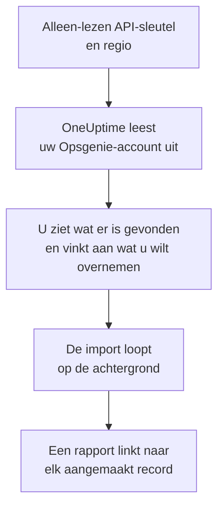

# Overstappen van Opsgenie

Atlassian stopt met Opsgenie: sinds juni 2025 wordt Opsgenie niet meer verkocht, en in april 2027 eindigt de ondersteuning. OneUptime is een nieuw thuis voor uw bereikbaarheidsteam, en **Importeren uit een andere tool** haalt het in een paar minuten over. Met een alleen-lezen Opsgenie-API-sleutel leest OneUptime uw gebruikers, teams, schema's, escalaties en services uit, laat zien wat het heeft gevonden en maakt aan wat u aanvinkt. In Opsgenie verandert niets.

:::cards
- [Uw account importeren](#uw-opsgenie-account-importeren): Maak een sleutel, lees uw account uit en vink aan wat u wilt overnemen.
- [Wat wordt overgenomen](#wat-wordt-overgenomen): Wat elk Opsgenie-record in OneUptime wordt.
- [Rond de overstap af](#rond-de-overstap-af): Wat u doet als de import klaar is.
:::

## Hoe het werkt

- **De sleutel wordt één keer gebruikt.** Hij wordt versleuteld bewaard zolang OneUptime uw account uitleest en verwijderd zodra het uitlezen klaar is, of het nu gelukt is of niet. Hij wordt nooit meer getoond en nooit in een log geschreven.
- **OneUptime leest alleen.** Het roept alleen de API van Opsgenie aan: `api.opsgenie.com`, of `api.eu.opsgenie.com` voor een account in Europa. Als Opsgenie vraagt om het rustiger aan te doen, wacht het en probeert het opnieuw.
- **Er wordt niets aangemaakt voordat u de import start.** Het voorbeeld laat voor elk item zien of het nieuw is, al in OneUptime staat (en wordt gebruikt zoals het is), door een eerdere import is overgenomen, of waarom het niet kan worden overgenomen.
- **Opnieuw uitvoeren maakt nooit iets dubbel aan.** OneUptime onthoudt wat elke import heeft overgenomen, op het Opsgenie-ID. Voer de import opnieuw uit nadat u in Opsgenie personen of schema's hebt toegevoegd, en alleen de nieuwe worden aangemaakt.

## Voordat u begint

- **Een OneUptime-project en het recht om aan te maken wat u overneemt.** Projecteigenaren en projectbeheerders kunnen alles overnemen. Andere rollen kunnen ook een import uitvoeren en de soorten records overnemen die ze mogen aanmaken. De rest wordt getoond als niet overgenomen, met de reden.
- **Een Opsgenie-API-sleutel met de rechten Read en Configuration access.** Met Configuration access kan een sleutel gebruikers, teams, schema's en escalaties lezen. De import schrijft nooit naar Opsgenie.
- **Uw Opsgenie-regio.** Als u zich aanmeldt op `app.eu.opsgenie.com`, staat uw account in Europa. Anders staat het in de Verenigde Staten.

## Uw Opsgenie-account importeren

:::steps
### Maak een API-sleutel in Opsgenie
Ga in Opsgenie naar **Settings** > **API key management** en kies **Add new API key**. Noem hem `OneUptime import`, geef hem alleen **Read** en **Configuration access** en kopieer de sleutel.

### Open de importpagina
Ga in OneUptime naar **Projectinstellingen** > **Importeren uit een andere tool** en kies **Opsgenie**.

### Koppel Opsgenie
Kies onder **Waar staat uw Opsgenie-account?** **Verenigde Staten** of **Europa**. Plak de sleutel in **Opsgenie-API-sleutel** en kies **Mijn Opsgenie-account uitlezen**. Een groot account duurt een paar minuten, en u kunt de pagina verlaten terwijl het wordt uitgelezen.

### Vink aan wat u wilt overnemen
Het voorbeeld toont wat er is gevonden, met één sectie per soort. Alles wat zou worden aangemaakt, is aan het begin aangevinkt, behalve schema's die in Opsgenie zijn uitgeschakeld en personen die in geen team, schema of escalatie zitten. Onder elk item zegt OneUptime wat niet precies zo wordt overgenomen als het was. Als een aangevinkt item iets gebruikt dat u niet hebt aangevinkt, zegt het dat, en **Deze ook aanvinken** vinkt het aan.

### Start de import
Als er personen worden uitgenodigd, kiest u onder **Nieuwe personen uitnodigen voor** het team waar ze bij komen. Kies daarna **Import starten**. De import loopt op de achtergrond: u kunt de pagina verlaten, en het rapport wacht daar op u.
:::

Het rapport telt wat is aangemaakt, uitgenodigd en niet overgenomen, en toont elk item met een link naar het record dat het is geworden, mislukte eerst. Eerdere imports staan onder **Eerdere imports** op dezelfde pagina.

## Wat wordt overgenomen

| In Opsgenie | In OneUptime | Hoe |
| --- | --- | --- |
| Gebruikers | Projectleden | Gekoppeld op e-mailadres. Wie nog niet in het project zit, wordt uitgenodigd voor het team dat u kiest. Geblokkeerde gebruikers worden niet overgenomen. |
| Teams | Teams | Aangemaakt met hun leden. Een team waarvan het project de naam al heeft, wordt gebruikt zoals het is, en de leden blijven ongewijzigd. |
| Schema's | Bereikbaarheidsschema's | Elke rotatie wordt een laag met dezelfde personen, hetzelfde begin, dezelfde beurtlengte en dezelfde tijdbeperking, in de tijdzone van het schema, met het team van het schema als eigenaar. |
| Escalaties | Bereikbaarheidsbeleid | Elke regel wordt een escalatieregel die hetzelfde schema, dezelfde gebruiker of hetzelfde team oproept. Regels met dezelfde vertraging roepen samen op, en de wachttijd voor de volgende escalatieregel is het verschil tussen de vertragingen. De herhalingen van de escalatie worden de herhalingen van het beleid. |
| Services | Services | Aangemaakt in de servicecatalogus, met hun team als eigenaar. |

Een schema waarvan de rotaties twee personen tegelijk dienst laten hebben, wordt één OneUptime-schema per rotatie, omdat een OneUptime-schema één persoon tegelijk met dienst heeft. Elk bereikbaarheidsbeleid dat het schema opriep, roept ze allemaal op.

## Wat niet wordt overgenomen

- **Waarschuwingen, incidenten en hun geschiedenis.** OneUptime begint met uw inrichting, niet met uw eerdere waarschuwingen.
- **Integraties, heartbeats, waarschuwingsbeleid en routeringsregels.** Richt in plaats daarvan uw monitoren en bronnen van waarschuwingen op OneUptime, zoals beschreven in [Rond de overstap af](#rond-de-overstap-af).
- **Overschrijvingen van schema's en rotaties die al zijn afgelopen.** Voeg na de import in OneUptime de overschrijvingen toe die u nog nodig hebt.
- **De meldingsregels van elke persoon.** Iedereen kiest in de eigen **Gebruikersinstellingen** hoe hij wordt opgeroepen, zodra hij de uitnodiging accepteert.
- **Stappen waarvoor OneUptime geen exacte tegenhanger heeft.** Een regel die oproept wie hierna dienst heeft, of de beheerders van een team, wordt overgenomen als het dichtstbijzijnde dat OneUptime heeft, en het voorbeeld zegt wat er verandert.

## Limieten

Eén import maakt hooguit 2.000 records aan: hooguit 500 personen, 200 teams, 200 bereikbaarheidsschema's, 200 bereikbaarheidsbeleidsregels en 500 services. Alles boven een limiet wordt getoond als niet overgenomen. Voer de import opnieuw uit om de rest over te nemen.

In OneUptime Cloud worden records die uw abonnement niet bevat, getoond als niet overgenomen, met het abonnement dat ze nodig hebben.

Een voorbeeld wordt een dag bewaard. Alleen wie het account heeft uitgelezen, kan items aanvinken en de import starten. Projecteigenaren en projectbeheerders zien de voortgang en het rapport van elke import.

## Rond de overstap af

:::steps
### Controleer de bereikbaarheidsschema's
Open elk schema onder **Bereikbaarheidsdienst** > **Bereikbaarheidsschema's** en controleer wie nu dienst heeft en wie daarna.

### Zorg dat iedereen kan worden opgeroepen
Uitgenodigde personen accepteren hun uitnodiging en voegen dan een telefoonnummer, een e-mailadres of de mobiele app toe om op te worden opgeroepen. **Bereikbaarheidsdienst** > **Gereedheid** laat zien wie nog niet bereikbaar is.

### Stuur uw waarschuwingen naar OneUptime
Richt uw monitoren en de tools die waarschuwingen geven op OneUptime, en roep uzelf eenmaal op om het te testen.

### Schakel oproepen in Opsgenie uit
Zodra OneUptime de juiste personen oproept, schakelt u de meldingen in Opsgenie uit, zodat niemand twee keer wordt opgeroepen.
:::

## Problemen oplossen

:::details Opsgenie heeft de API-sleutel niet geaccepteerd
Controleer of u de hele sleutel hebt gekopieerd, of het een sleutel uit **API key management** is en niet de sleutel van een integratie, of hij **Read** en **Configuration access** heeft, en of u de regio van uw account hebt gekozen. Kies daarna **Opnieuw proberen**.
:::

:::details Een soort record ontbreekt in het voorbeeld
De sleutel kon het niet lezen, en het voorbeeld zegt dat bovenaan. Geef de sleutel **Configuration access** en lees het account opnieuw uit.
:::

:::details Sommige items kunnen niet worden aangevinkt
Bij elk item staat waarom: een geblokkeerde gebruiker, een naam die het project al heeft, iets wat een eerdere import heeft overgenomen, of een record dat u niet mag aanmaken of dat uw abonnement niet bevat.
:::

## Volgende stappen

:::cards
- [Bereikbaarheidsschema's](/docs/on-call/schedules): Lagen, beperkingen en overdrachten.
- [Escalatieregels](/docs/on-call/escalation-rules): Hoe bereikbaarheidsbeleid personen oproept.
- [Overstappen van incident.io](/docs/moving-to-oneuptime/incident-io): Haal een team over uit incident.io.
:::
