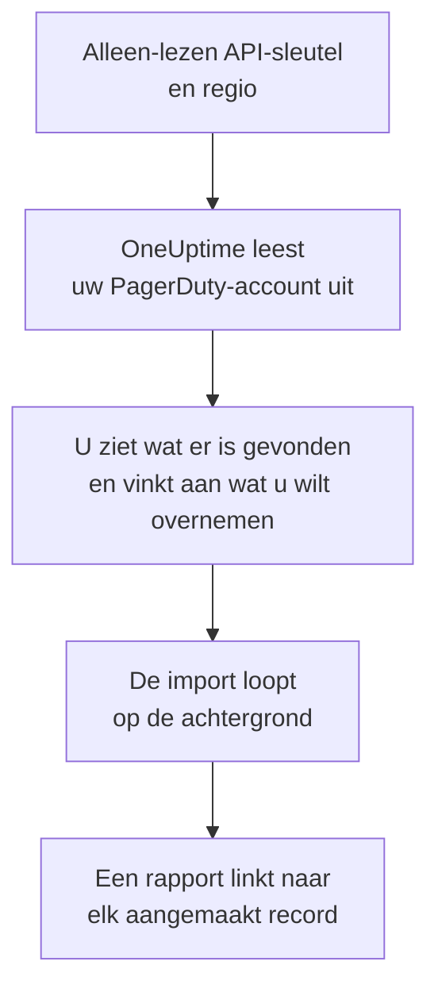

# Overstappen van PagerDuty

**Importeren uit een andere tool** haalt uw PagerDuty-inrichting in een paar minuten over naar OneUptime. Met een alleen-lezen PagerDuty-API-sleutel leest OneUptime uw gebruikers, teams, schema's, escalatiebeleid en services uit, laat zien wat het heeft gevonden en maakt aan wat u aanvinkt. In PagerDuty verandert niets.

:::cards
- [Uw account importeren](#uw-pagerduty-account-importeren): Maak een sleutel, lees uw account uit en vink aan wat u wilt overnemen.
- [Wat wordt overgenomen](#wat-wordt-overgenomen): Wat elk PagerDuty-record in OneUptime wordt.
- [Rond de overstap af](#rond-de-overstap-af): Wat u doet als de import klaar is.
:::

## Hoe het werkt

- **De sleutel wordt één keer gebruikt.** Hij wordt versleuteld bewaard zolang OneUptime uw account uitleest en verwijderd zodra het uitlezen klaar is, of het nu gelukt is of niet. Hij wordt nooit meer getoond en nooit in een log geschreven.
- **OneUptime leest alleen.** Het roept alleen de REST-API van PagerDuty aan: `api.pagerduty.com`, of `api.eu.pagerduty.com` voor een account in Europa. Als PagerDuty vraagt om het rustiger aan te doen, wacht het en probeert het opnieuw.
- **Er wordt niets aangemaakt voordat u de import start.** Het voorbeeld laat voor elk item zien of het nieuw is, al in OneUptime staat (en wordt gebruikt zoals het is), door een eerdere import is overgenomen, of waarom het niet kan worden overgenomen.
- **Opnieuw uitvoeren maakt nooit iets dubbel aan.** OneUptime onthoudt wat elke import heeft overgenomen, op het PagerDuty-ID. Voer de import opnieuw uit nadat u in PagerDuty personen of schema's hebt toegevoegd, en alleen de nieuwe worden aangemaakt.

## Voordat u begint

- **Een OneUptime-project en het recht om aan te maken wat u overneemt.** Projecteigenaren en projectbeheerders kunnen alles overnemen. Andere rollen kunnen ook een import uitvoeren en de soorten records overnemen die ze mogen aanmaken. De rest wordt getoond als niet overgenomen, met de reden.
- **Een alleen-lezen REST-API-sleutel van PagerDuty.** Beheerders en accounteigenaren in PagerDuty kunnen er een maken. De import schrijft nooit naar PagerDuty, dus de sleutel heeft alleen leestoegang nodig.
- **Uw PagerDuty-regio.** Als u zich aanmeldt op een adres dat eindigt op `eu.pagerduty.com`, staat uw account in Europa. Anders staat het in de Verenigde Staten.

## Uw PagerDuty-account importeren

:::steps
### Maak een API-sleutel in PagerDuty
Ga in PagerDuty naar **Integrations** > **Developer Tools** > **API Access Keys** en kies **Create New API Key**. Beschrijf hem als `OneUptime import`, vink **Read-only API Key** aan, kies **Create Key** en kopieer de sleutel.

### Open de importpagina
Ga in OneUptime naar **Projectinstellingen** > **Importeren uit een andere tool** en kies **PagerDuty**.

### Koppel PagerDuty
Kies onder **Waar staat uw PagerDuty-account?** **Verenigde Staten** of **Europa**. Plak de sleutel in **PagerDuty-API-sleutel** en kies **Mijn PagerDuty-account uitlezen**. Een groot account duurt een paar minuten, en u kunt de pagina verlaten terwijl het wordt uitgelezen.

### Vink aan wat u wilt overnemen
Het voorbeeld toont wat er is gevonden, met één sectie per soort. Alles wat zou worden aangemaakt, is aan het begin aangevinkt, behalve services die in PagerDuty zijn uitgeschakeld en personen die in geen team, schema of escalatiebeleid zitten. Onder elk item zegt OneUptime wat niet precies zo wordt overgenomen als het was. Als een aangevinkt item iets gebruikt dat u niet hebt aangevinkt, zegt het dat, en **Deze ook aanvinken** vinkt het aan.

### Start de import
Als er personen worden uitgenodigd, kiest u onder **Nieuwe personen uitnodigen voor** het team waar ze bij komen. Kies daarna **Import starten**. De import loopt op de achtergrond: u kunt de pagina verlaten, en het rapport wacht daar op u.
:::

Het rapport telt wat is aangemaakt, uitgenodigd en niet overgenomen, en toont elk item met een link naar het record dat het is geworden, mislukte eerst. Eerdere imports staan onder **Eerdere imports** op dezelfde pagina.

## Wat wordt overgenomen

| In PagerDuty | In OneUptime | Hoe |
| --- | --- | --- |
| Gebruikers | Projectleden | Gekoppeld op e-mailadres. Wie nog niet in het project zit, wordt uitgenodigd voor het team dat u kiest. |
| Teams | Teams | Aangemaakt met hun leden. Een team waarvan het project de naam al heeft, wordt gebruikt zoals het is, en de leden blijven ongewijzigd. |
| Schema's | Bereikbaarheidsschema's | Elke laag wordt een laag met dezelfde personen, hetzelfde begin, dezelfde beurtlengte en dezelfde beperkingen, in de tijdzone van het schema, met het team van het schema als eigenaar. De lagen houden hun volgorde, dus een hogere laag gaat nog steeds voor de lagen eronder. |
| Escalatiebeleid | Bereikbaarheidsbeleid | Elke escalatieregel wordt een escalatieregel die dezelfde schema's en gebruikers oproept en na dezelfde vertraging escaleert. De herhalingen van het beleid worden de herhalingen van het bereikbaarheidsbeleid. |
| Services | Services | Aangemaakt in de servicecatalogus, met hun team als eigenaar. Een service die in PagerDuty is uitgeschakeld, is aan het begin niet aangevinkt. |

Een PagerDuty-schema blijft één OneUptime-schema: de lagen gaan voor elkaar zoals in PagerDuty. Een laag waarvan de beurten geen hele aantallen uren duren, wordt overgenomen met beurten afgerond op het uur, en het voorbeeld zegt dat.

## Wat niet wordt overgenomen

- **Incidenten, waarschuwingen en hun geschiedenis.** OneUptime begint met uw inrichting, niet met uw eerdere incidenten.
- **Integraties, Event Orchestrations, Incident Workflows en statuspagina's.** Richt in plaats daarvan uw monitoren en bronnen van waarschuwingen op OneUptime, zoals beschreven in [Rond de overstap af](#rond-de-overstap-af).
- **Overschrijvingen van schema's en lagen die al zijn afgelopen.** Voeg na de import in OneUptime de overschrijvingen toe die u nog nodig hebt.
- **Schema's op basis van diensten.** De import leest de schema's met lagen van PagerDuty, niet de nieuwere schema's op basis van diensten (shift-based schedules). Als uw account die heeft, zegt het voorbeeld dat bovenaan, en een escalatieregel die er een oproept, wordt zonder dat schema overgenomen. Maak ze aan in OneUptime.
- **De meldingsregels van elke persoon.** Iedereen kiest in de eigen **Gebruikersinstellingen** hoe hij wordt opgeroepen, zodra hij de uitnodiging accepteert.
- **Regels waarvoor OneUptime geen exacte tegenhanger heeft.** Een escalatieregel die zijn personen om de beurt (round robin) toewijst, roept in OneUptime iedereen tegelijk op, en het voorbeeld zegt wat er verandert.

## Limieten

Eén import maakt hooguit 2.000 records aan: hooguit 500 personen, 200 teams, 200 bereikbaarheidsschema's, 200 bereikbaarheidsbeleidsregels en 500 services. Alles boven een limiet wordt getoond als niet overgenomen. Voer de import opnieuw uit om de rest over te nemen.

In OneUptime Cloud worden records die uw abonnement niet bevat, getoond als niet overgenomen, met het abonnement dat ze nodig hebben.

Een voorbeeld wordt een dag bewaard. Alleen wie het account heeft uitgelezen, kan items aanvinken en de import starten. Projecteigenaren en projectbeheerders zien de voortgang en het rapport van elke import.

## Rond de overstap af

:::steps
### Controleer de bereikbaarheidsschema's
Open elk schema onder **Bereikbaarheidsdienst** > **Bereikbaarheidsschema's** en controleer wie nu dienst heeft en wie daarna.

### Zorg dat iedereen kan worden opgeroepen
Uitgenodigde personen accepteren hun uitnodiging en voegen dan een telefoonnummer, een e-mailadres of de mobiele app toe om op te worden opgeroepen. **Bereikbaarheidsdienst** > **Gereedheid** laat zien wie nog niet bereikbaar is.

### Stuur uw waarschuwingen naar OneUptime
Richt uw monitoren en de tools die waarschuwingen geven op OneUptime, en roep uzelf eenmaal op om het te testen.

### Schakel oproepen in PagerDuty uit
Zodra OneUptime de juiste personen oproept, schakelt u de meldingen in PagerDuty uit, zodat niemand twee keer wordt opgeroepen.
:::

## Problemen oplossen

:::details PagerDuty heeft de API-sleutel niet geaccepteerd
Controleer of u de hele sleutel hebt gekopieerd, of het een REST-API-sleutel uit **API Access Keys** is en geen integratiesleutel, en of u de regio van uw account hebt gekozen. Kies daarna **Opnieuw proberen**.
:::

:::details Een soort record ontbreekt in het voorbeeld
De sleutel kon het niet lezen, en het voorbeeld zegt dat bovenaan. Sommige soorten bestaan alleen in PagerDuty-abonnementen die ze bevatten, bijvoorbeeld teams. Lees het account opnieuw uit met een sleutel die ze kan lezen.
:::

:::details Sommige items kunnen niet worden aangevinkt
Bij elk item staat waarom: een naam die het project al heeft, iets wat een eerdere import heeft overgenomen, of een record dat u niet mag aanmaken of dat uw abonnement niet bevat.
:::

## Volgende stappen

:::cards
- [Bereikbaarheidsschema's](/docs/on-call/schedules): Lagen, beperkingen en overdrachten.
- [Escalatieregels](/docs/on-call/escalation-rules): Hoe bereikbaarheidsbeleid personen oproept.
- [Overstappen van Opsgenie](/docs/moving-to-oneuptime/opsgenie): Haal een team over uit Opsgenie.
:::
