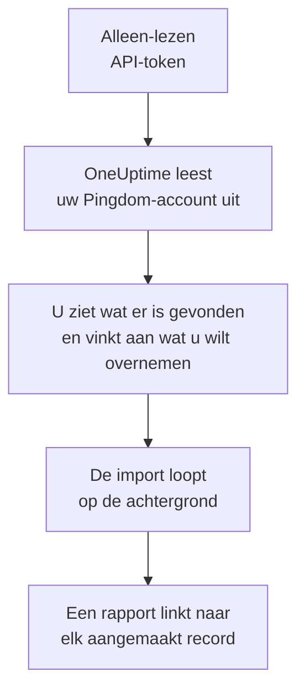

# Overstappen van Pingdom

**Importeren uit een andere tool** haalt uw Pingdom-beschikbaarheidscontroles in een paar minuten over naar OneUptime. Met een alleen-lezen Pingdom-API-token leest OneUptime uw controles uit, laat zien wat het heeft gevonden en maakt aan wat u aanvinkt. In Pingdom verandert niets.

:::cards
- [Uw account importeren](#uw-pingdom-account-importeren): Maak een token, lees uw account uit en vink aan wat u wilt overnemen.
- [Wat wordt overgenomen](#wat-wordt-overgenomen): Welke OneUptime-monitor elke Pingdom-controle wordt.
- [Rond de overstap af](#rond-de-overstap-af): Wat u doet als de import klaar is.
:::

## Hoe het werkt

- **De sleutel wordt één keer gebruikt.** Hij wordt versleuteld bewaard zolang OneUptime uw account uitleest en verwijderd zodra het uitlezen klaar is, of het nu gelukt is of niet. Hij wordt nooit meer getoond en nooit in een log geschreven.
- **OneUptime leest alleen.** Het roept alleen de API van Pingdom aan: `api.pingdom.com`. Pingdom rekent elk verzoek af op het tegoed van het token, dus OneUptime leest de instellingen van een controle alleen als die er heeft, één verzoek tegelijk. Als Pingdom vraagt om het rustiger aan te doen, wacht het en probeert het opnieuw.
- **Er wordt niets aangemaakt voordat u de import start.** Het voorbeeld laat voor elk item zien of het nieuw is, al in OneUptime staat (en wordt gebruikt zoals het is), door een eerdere import is overgenomen, of waarom het niet kan worden overgenomen.
- **Opnieuw uitvoeren maakt nooit iets dubbel aan.** OneUptime onthoudt wat elke import heeft overgenomen, op het Pingdom-ID. Voer de import opnieuw uit nadat u in Pingdom controles hebt toegevoegd, en alleen de nieuwe worden aangemaakt.

## Voordat u begint

- **Een OneUptime-project en het recht om aan te maken wat u overneemt.** Projecteigenaren en projectbeheerders kunnen alles overnemen. Andere rollen kunnen ook een import uitvoeren en de soorten records overnemen die ze mogen aanmaken. De rest wordt getoond als niet overgenomen, met de reden.
- **Een Pingdom-API-token met Read access.** De import schrijft nooit naar Pingdom.
- **Een betaalmethode, in OneUptime Cloud.** Monitoren die controles uitvoeren, worden naar gebruik gefactureerd, ook met het Free-abonnement. Voeg er daarom vóór de import een toe onder **Projectinstellingen** > **Facturering**. Zonder betaalmethode worden die monitoren getoond als niet overgenomen.

## Uw Pingdom-account importeren

:::steps
### Maak een API-token in Pingdom
Open in My Pingdom **Settings** > **Pingdom API** en kies **Add API token**. Noem het `OneUptime import`, kies **Read access** en kopieer het token.

### Open de importpagina
Ga in OneUptime naar **Projectinstellingen** > **Importeren uit een andere tool** en kies **Pingdom**.

### Koppel Pingdom
Plak het token in **Pingdom-API-sleutel** en kies **Mijn Pingdom-account uitlezen**. Een groot account duurt een paar minuten, en u kunt de pagina verlaten terwijl het wordt uitgelezen.

### Vink aan wat u wilt overnemen
Het voorbeeld toont wat er is gevonden, met één sectie per soort. Alles wat zou worden aangemaakt, is aan het begin aangevinkt, behalve controles die in Pingdom zijn gepauzeerd. Die worden gepauzeerd overgenomen als u ze aanvinkt. Onder elk item zegt OneUptime wat niet precies zo wordt overgenomen als het was.

### Start de import
Kies **Import starten**. De import loopt op de achtergrond: u kunt de pagina verlaten, en het rapport wacht daar op u.
:::

Het rapport telt wat is aangemaakt en niet overgenomen, en toont elk item met een link naar het record dat het is geworden, mislukte eerst. Eerdere imports staan onder **Eerdere imports** op dezelfde pagina.

## Wat wordt overgenomen

| In Pingdom | In OneUptime | Hoe |
| --- | --- | --- |
| Uptime checks | Monitoren | Elke controle wordt een monitor van hetzelfde soort, met hetzelfde adres, interval en de tekst die een pagina wel, of niet, moet bevatten. |

- **HTTP-controles** worden websitemonitoren, of API-monitoren als ze gegevens posten of headers sturen.
- **Ping- en TCP-controles** worden ping- en poortmonitoren. **SMTP-, POP3- en IMAP-controles** worden poortmonitoren op hun poort: OneUptime controleert of de poort antwoordt, niet het mailgesprek.
- **DNS-controles** worden DNS-monitoren die dezelfde nameserver vragen.
- **Certificaatcontroles.** Een HTTP-controle die een verlopend certificaat als storing ziet, krijgt ook een SSL-certificaatmonitor, naar haar genoemd, die evenveel dagen vooraf waarschuwt.

Elke monitor wordt gecontroleerd vanaf de sondes van uw project, net als een monitor die u zelf aanmaakt. Een interval dat OneUptime niet biedt, wordt het dichtstbijzijnde dat het wel biedt, en een time-out van meer dan een minuut wordt één minuut. Het voorbeeld zegt wanneer een van beide verandert.

## Wat niet wordt overgenomen

- **De beschikbaarheidsgeschiedenis, responstijden en incidenten.** OneUptime begint met controleren als de import klaar is.
- **Waarschuwingscontacten en integraties.** Kies in OneUptime wie er bericht krijgt, zoals beschreven in [Rond de overstap af](#rond-de-overstap-af).
- **Wachtwoorden, en headers die een geheim kunnen bevatten.** Een monitor die zich aanmeldt, of die een `Authorization`-, cookie- of tokenheader stuurt, wordt zonder overgenomen: voeg die toe met een [monitorgeheim](/docs/monitor/monitor-secrets).
- **UDP-, custom-HTTP- en transactiecontroles.** OneUptime heeft geen monitor die hetzelfde doet, en het voorbeeld noemt ze allemaal. Een [synthetische monitor](/docs/monitor/synthetic-monitor) kan een pagina doorlopen zoals een transactiecontrole dat doet.
- **Het adres dat een DNS-controle verwacht.** Voeg het in OneUptime toe als criterium.
- **Onderhoudsvensters.** Het voorbeeld telt ze: plan ze in OneUptime als gepland onderhoud.

## Limieten

Eén import maakt hooguit 2.000 records aan, en hooguit 1.000 monitoren. Alles boven een limiet wordt getoond als niet overgenomen. Voer de import opnieuw uit om de rest over te nemen.

In OneUptime Cloud hebben monitoren die controles uitvoeren een betaalmethode nodig, en wat niet meer in uw abonnement past, wordt getoond als niet overgenomen, met wat het nodig heeft.

Een voorbeeld wordt een dag bewaard. Alleen wie het account heeft uitgelezen, kan items aanvinken en de import starten. Projecteigenaren en projectbeheerders zien de voortgang en het rapport van elke import.

## Rond de overstap af

:::steps
### Controleer uw monitoren
Open elke monitor onder **Monitoren** en controleer de eerste resultaten. Een heartbeatmonitor heeft een nieuw adres: laat de taak die hem aanroept daarnaar wijzen.

### Kies wie er bericht krijgt
Voeg eigenaren toe aan uw monitoren, of bereikbaarheidsbeleid onder **Bereikbaarheidsdienst** > **Bereikbaarheidsbeleid** aan de incidenten die ze openen, zodat de juiste mensen het horen als er iets uitvalt.

### Schakel de controles in Pingdom uit
Zodra OneUptime hetzelfde controleert, pauzeert u de controles in Pingdom, zodat niemand twee keer bericht krijgt.
:::

## Problemen oplossen

:::details Pingdom heeft de API-sleutel niet geaccepteerd
Controleer of u het hele token hebt gekopieerd en of het een API 3.1-token uit **Pingdom API** met **Read access** is. Kies daarna **Opnieuw proberen**.
:::

:::details Een monitor wordt getoond als niet overgenomen
Er staat bij waarom: een soort monitor die OneUptime niet heeft, een adres dat OneUptime niet kan lezen, of een project zonder ruimte of zonder betaalmethode ervoor. Een monitor die OneUptime al uitvoert, met dezelfde naam, hetzelfde type en hetzelfde adres, wordt gebruikt zoals hij is.
:::

:::details Sommige items kunnen niet worden aangevinkt
Bij elk item staat waarom: een naam die het project al heeft, iets wat een eerdere import heeft overgenomen, of een record dat u niet mag aanmaken of dat uw abonnement niet bevat.
:::

## Volgende stappen

:::cards
- [Website-monitor](/docs/monitor/website-monitor): Wat een website-monitor controleert, en hoe.
- [Poort-monitor](/docs/monitor/port-monitor): Wat een poortmonitor controleert, en hoe.
- [Overstappen van StatusCake](/docs/moving-to-oneuptime/statuscake): Haal uw controles over uit StatusCake.
:::
