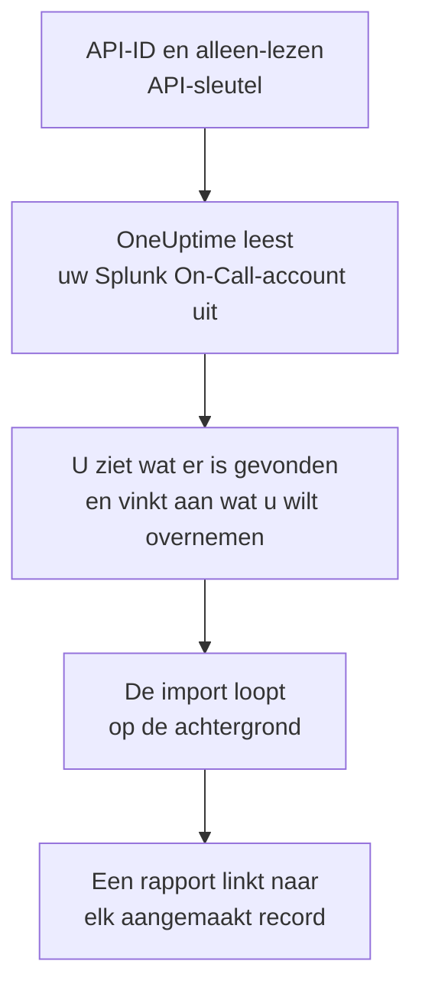

# Overstappen van Splunk On-Call

**Importeren uit een andere tool** haalt uw Splunk On-Call-inrichting (voorheen VictorOps) in een paar minuten over naar OneUptime. Met uw API-ID en een alleen-lezen API-sleutel leest OneUptime uw gebruikers, teams, rotaties en escalatiebeleid uit, laat zien wat het heeft gevonden en maakt aan wat u aanvinkt. In Splunk On-Call verandert niets.

:::cards
- [Uw account importeren](#uw-splunk-on-call-account-importeren): Maak een sleutel, lees uw account uit en vink aan wat u wilt overnemen.
- [Wat wordt overgenomen](#wat-wordt-overgenomen): Wat elk Splunk On-Call-record in OneUptime wordt.
- [Rond de overstap af](#rond-de-overstap-af): Wat u doet als de import klaar is.
:::

## Hoe het werkt

- **De sleutel wordt één keer gebruikt.** Hij wordt samen met de API-ID versleuteld bewaard zolang OneUptime uw account uitleest en verwijderd zodra het uitlezen klaar is, of het nu gelukt is of niet. Hij wordt nooit meer getoond en nooit in een log geschreven.
- **OneUptime leest alleen.** Het roept alleen de API van Splunk On-Call aan, `api.victorops.com`. Splunk On-Call beantwoordt elke soort verzoek hooguit twee keer per seconde, dus OneUptime houdt dat tempo aan, en als Splunk On-Call vraagt om het rustiger aan te doen, wacht het en probeert het opnieuw.
- **Er wordt niets aangemaakt voordat u de import start.** Het voorbeeld laat voor elk item zien of het nieuw is, al in OneUptime staat (en wordt gebruikt zoals het is), door een eerdere import is overgenomen, of waarom het niet kan worden overgenomen.
- **Opnieuw uitvoeren maakt nooit iets dubbel aan.** OneUptime onthoudt wat elke import heeft overgenomen, op het Splunk On-Call-ID. Voer de import opnieuw uit nadat u in Splunk On-Call personen of rotaties hebt toegevoegd, en alleen de nieuwe worden aangemaakt.

## Voordat u begint

- **Een OneUptime-project en het recht om aan te maken wat u overneemt.** Projecteigenaren en projectbeheerders kunnen alles overnemen. Andere rollen kunnen ook een import uitvoeren en de soorten records overnemen die ze mogen aanmaken. De rest wordt getoond als niet overgenomen, met de reden.
- **Uw Splunk On-Call-API-ID en een alleen-lezen API-sleutel.** Beide staan in Splunk On-Call onder **Integrations** > **API**. De import schrijft nooit naar Splunk On-Call, dus een alleen-lezen sleutel is genoeg.

## Uw Splunk On-Call-account importeren

:::steps
### Maak een API-sleutel in Splunk On-Call
Ga in Splunk On-Call naar **Integrations** > **API**. Uw API-ID staat boven uw API-sleutels. Maak een nieuwe API-sleutel met de naam `OneUptime import`, vink **Read-only** aan en kopieer de API-ID en de sleutel.

### Open de importpagina
Ga in OneUptime naar **Projectinstellingen** > **Importeren uit een andere tool** en kies **Splunk On-Call**.

### Koppel Splunk On-Call
Plak de API-ID in **Splunk On-Call-API-ID** en de sleutel in **Splunk On-Call-API-sleutel**, en kies **Mijn Splunk On-Call-account uitlezen**. Een groot account duurt een paar minuten, en u kunt de pagina verlaten terwijl het wordt uitgelezen.

### Vink aan wat u wilt overnemen
Het voorbeeld toont wat er is gevonden, met één sectie per soort. Alles wat zou worden aangemaakt, is aan het begin aangevinkt, behalve personen die in geen team, rotatie of escalatiebeleid zitten. Onder elk item zegt OneUptime wat niet precies zo wordt overgenomen als het was. Als een aangevinkt item iets gebruikt dat u niet hebt aangevinkt, zegt het dat, en **Deze ook aanvinken** vinkt het aan.

### Start de import
Als er personen worden uitgenodigd, kiest u onder **Nieuwe personen uitnodigen voor** het team waar ze bij komen. Kies daarna **Import starten**. De import loopt op de achtergrond: u kunt de pagina verlaten, en het rapport wacht daar op u.
:::

Het rapport telt wat is aangemaakt, uitgenodigd en niet overgenomen, en toont elk item met een link naar het record dat het is geworden, mislukte eerst. Eerdere imports staan onder **Eerdere imports** op dezelfde pagina.

## Wat wordt overgenomen

| In Splunk On-Call | In OneUptime | Hoe |
| --- | --- | --- |
| Gebruikers | Projectleden | Gekoppeld op e-mailadres. Wie nog niet in het project zit, wordt uitgenodigd voor het team dat u kiest. |
| Teams | Teams | Aangemaakt met hun leden. Een team waarvan het project de naam al heeft, wordt gebruikt zoals het is, en de leden blijven ongewijzigd. |
| Rotaties | Bereikbaarheidsschema's | Elke rotatie wordt een schema met haar team als eigenaar, en elke dienst ervan een laag met dezelfde personen, hetzelfde begin, dezelfde overdracht en dezelfde dagen en uren van dienst. Wie nu dienst heeft in Splunk On-Call, heeft ook dienst in OneUptime. |
| Escalatiebeleid | Bereikbaarheidsbeleid | Met het team van het beleid als eigenaar. Elke stap wordt een escalatieregel die dezelfde rotaties en gebruikers oproept. De time-out van een stap wordt de wachttijd ervoor, en stappen zonder time-out ertussen roepen samen op. |

Diensten van één rotatie die tegelijk dienst hebben, worden elk een eigen OneUptime-schema, omdat een OneUptime-schema één persoon tegelijk met dienst heeft. Elk bereikbaarheidsbeleid dat de rotatie opriep, roept ze allemaal op. Het schema houdt de tijdzone van de eerste dienst van de rotatie, en bij een dienst in een andere tijdzone worden de uren daarin omgerekend.

## Wat niet wordt overgenomen

- **Incidenten, waarschuwingen en hun geschiedenis.** OneUptime begint met uw inrichting, niet met uw eerdere incidenten.
- **Integraties, routing keys en alert rules.** Richt in plaats daarvan uw monitoren en bronnen van waarschuwingen op OneUptime, zoals beschreven in [Rond de overstap af](#rond-de-overstap-af).
- **Geplande overschrijvingen.** Voeg na de import in OneUptime de overschrijvingen toe die u nog nodig hebt.
- **Het oproepbeleid van elke persoon.** Iedereen kiest in de eigen **Gebruikersinstellingen** hoe hij wordt opgeroepen, zodra hij de uitnodiging accepteert.
- **Stappen waarvoor OneUptime geen exacte tegenhanger heeft.** Een stap die een webhook aanroept of doorverwijst naar ander escalatiebeleid wordt weggelaten, net als een stap die mailt naar een adres van niemand die wordt overgenomen. Een stap die oproept wie hierna dienst heeft, of wie daarvoor dienst had, roept op wie nu dienst heeft, en het voorbeeld zegt wat er verandert.

## Limieten

Eén import maakt hooguit 2.000 records aan: hooguit 500 personen, 200 teams, 200 bereikbaarheidsschema's en 200 bereikbaarheidsbeleidsregels. Alles boven een limiet wordt getoond als niet overgenomen. Voer de import opnieuw uit om de rest over te nemen.

In OneUptime Cloud worden records die uw abonnement niet bevat, getoond als niet overgenomen, met het abonnement dat ze nodig hebben.

Een voorbeeld wordt een dag bewaard. Alleen wie het account heeft uitgelezen, kan items aanvinken en de import starten. Projecteigenaren en projectbeheerders zien de voortgang en het rapport van elke import.

## Rond de overstap af

:::steps
### Controleer de bereikbaarheidsschema's
Open elk schema onder **Bereikbaarheidsdienst** > **Bereikbaarheidsschema's** en controleer wie nu dienst heeft en wie daarna.

### Zorg dat iedereen kan worden opgeroepen
Uitgenodigde personen accepteren hun uitnodiging en voegen dan een telefoonnummer, een e-mailadres of de mobiele app toe om op te worden opgeroepen. **Bereikbaarheidsdienst** > **Gereedheid** laat zien wie nog niet bereikbaar is.

### Stuur uw waarschuwingen naar OneUptime
Richt uw monitoren en de tools die waarschuwingen geven op OneUptime, en roep uzelf eenmaal op om het te testen.

### Schakel oproepen in Splunk On-Call uit
Zodra OneUptime de juiste personen oproept, schakelt u de meldingen in Splunk On-Call uit, zodat niemand twee keer wordt opgeroepen.
:::

## Problemen oplossen

:::details Splunk On-Call heeft de API-ID en API-sleutel niet geaccepteerd
Controleer of u de API-ID en de hele sleutel uit **Integrations** > **API** hebt gekopieerd, en of de sleutel daar niet is verwijderd. Kies daarna **Opnieuw proberen**.
:::

:::details Een soort record ontbreekt in het voorbeeld
De sleutel kon het niet lezen, en het voorbeeld zegt dat bovenaan. Controleer de sleutel onder **Integrations** > **API** en lees het account opnieuw uit.
:::

:::details Sommige items kunnen niet worden aangevinkt
Bij elk item staat waarom: een naam die het project al heeft, iets wat een eerdere import heeft overgenomen, of een record dat u niet mag aanmaken of dat uw abonnement niet bevat.
:::

## Volgende stappen

:::cards
- [Bereikbaarheidsschema's](/docs/on-call/schedules): Lagen, beperkingen en overdrachten.
- [Escalatieregels](/docs/on-call/escalation-rules): Hoe bereikbaarheidsbeleid personen oproept.
- [Overstappen van PagerDuty](/docs/moving-to-oneuptime/pagerduty): Haal een team over uit PagerDuty.
:::
