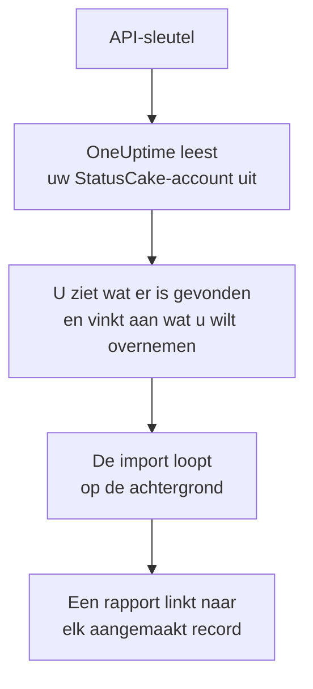

# Overstappen van StatusCake

**Importeren uit een andere tool** haalt uw StatusCake-controles in een paar minuten over naar OneUptime. Met een StatusCake-API-sleutel leest OneUptime uw beschikbaarheids-, SSL- en heartbeatcontroles uit, laat zien wat het heeft gevonden en maakt aan wat u aanvinkt. In StatusCake verandert niets.

:::cards
- [Uw account importeren](#uw-statuscake-account-importeren): Maak een sleutel, lees uw account uit en vink aan wat u wilt overnemen.
- [Wat wordt overgenomen](#wat-wordt-overgenomen): Welke OneUptime-monitor elke StatusCake-controle wordt.
- [Rond de overstap af](#rond-de-overstap-af): Wat u doet als de import klaar is.
:::

## Hoe het werkt

- **De sleutel wordt één keer gebruikt.** Hij wordt versleuteld bewaard zolang OneUptime uw account uitleest en verwijderd zodra het uitlezen klaar is, of het nu gelukt is of niet. Hij wordt nooit meer getoond en nooit in een log geschreven.
- **OneUptime leest alleen.** Het roept alleen de API van StatusCake aan: `api.statuscake.com`. Het doet één verzoek per seconde, binnen de 60 per minuut die StatusCake een Free-account toestaat. Als StatusCake vraagt om het rustiger aan te doen, wacht het en probeert het opnieuw.
- **Er wordt niets aangemaakt voordat u de import start.** Het voorbeeld laat voor elk item zien of het nieuw is, al in OneUptime staat (en wordt gebruikt zoals het is), door een eerdere import is overgenomen, of waarom het niet kan worden overgenomen.
- **Opnieuw uitvoeren maakt nooit iets dubbel aan.** OneUptime onthoudt wat elke import heeft overgenomen, op het StatusCake-ID. Voer de import opnieuw uit nadat u in StatusCake controles hebt toegevoegd, en alleen de nieuwe worden aangemaakt.

## Voordat u begint

- **Een OneUptime-project en het recht om aan te maken wat u overneemt.** Projecteigenaren en projectbeheerders kunnen alles overnemen. Andere rollen kunnen ook een import uitvoeren en de soorten records overnemen die ze mogen aanmaken. De rest wordt getoond als niet overgenomen, met de reden.
- **Een StatusCake-API-sleutel.** De import schrijft nooit naar StatusCake.
- **Een betaalmethode, in OneUptime Cloud.** Monitoren die controles uitvoeren, worden naar gebruik gefactureerd, ook met het Free-abonnement. Voeg er daarom vóór de import een toe onder **Projectinstellingen** > **Facturering**. Zonder betaalmethode worden die monitoren getoond als niet overgenomen.

## Uw StatusCake-account importeren

:::steps
### Maak een API-sleutel in StatusCake
Open in StatusCake uw accountpaneel en ga naar **API Keys**. Maak een sleutel met de naam `OneUptime import` en kopieer hem.

### Open de importpagina
Ga in OneUptime naar **Projectinstellingen** > **Importeren uit een andere tool** en kies **StatusCake**.

### Koppel StatusCake
Plak de sleutel in **StatusCake-API-sleutel** en kies **Mijn StatusCake-account uitlezen**. Een groot account duurt een paar minuten, en u kunt de pagina verlaten terwijl het wordt uitgelezen.

### Vink aan wat u wilt overnemen
Het voorbeeld toont wat er is gevonden, met één sectie per soort. Alles wat zou worden aangemaakt, is aan het begin aangevinkt, behalve controles die in StatusCake zijn gepauzeerd. Die worden gepauzeerd overgenomen als u ze aanvinkt. Onder elk item zegt OneUptime wat niet precies zo wordt overgenomen als het was.

### Start de import
Kies **Import starten**. De import loopt op de achtergrond: u kunt de pagina verlaten, en het rapport wacht daar op u.
:::

Het rapport telt wat is aangemaakt en niet overgenomen, en toont elk item met een link naar het record dat het is geworden, mislukte eerst. Eerdere imports staan onder **Eerdere imports** op dezelfde pagina.

## Wat wordt overgenomen

| In StatusCake | In OneUptime | Hoe |
| --- | --- | --- |
| Uptime, SSL and heartbeat checks | Monitoren | Elke controle wordt een monitor van hetzelfde soort, met hetzelfde adres, interval, dezelfde time-out en de tekst die een pagina wel, of niet, moet bevatten. |

- **HTTP- en HEAD-controles** worden websitemonitoren, of API-monitoren als ze gegevens posten of headers sturen. StatusCake noemt de statuscodes die een waarschuwing geven: elke andere code telt ook in OneUptime als beschikbaar.
- **Ping- en TCP-controles** worden ping- en poortmonitoren. **SMTP- en SSH-controles** worden poortmonitoren op hun poort: OneUptime controleert of de poort antwoordt, niet het gesprek erop.
- **DNS-controles** worden DNS-monitoren die dezelfde server vragen.
- **SSL-controles** worden SSL-certificaatmonitoren die even ver vooruit waarschuwen als de eerste waarschuwing. Een beschikbaarheidscontrole met SSL-waarschuwingen krijgt er ook een.
- **Heartbeatcontroles** worden inkomende-verzoekmonitoren, die uitvallen als er gedurende de periode geen verzoek is gekomen. Elk heeft een nieuw adres in OneUptime.

Elke monitor wordt gecontroleerd vanaf de sondes van uw project, net als een monitor die u zelf aanmaakt. Een interval dat OneUptime niet biedt, wordt het dichtstbijzijnde dat het wel biedt, en een time-out van meer dan een minuut wordt één minuut. Het voorbeeld zegt wanneer een van beide verandert.

## Wat niet wordt overgenomen

- **De beschikbaarheidsgeschiedenis, responstijden en incidenten.** OneUptime begint met controleren als de import klaar is.
- **Waarschuwingscontacten en integraties.** Kies in OneUptime wie er bericht krijgt, zoals beschreven in [Rond de overstap af](#rond-de-overstap-af).
- **Wachtwoorden, en headers die een geheim kunnen bevatten.** Een monitor die zich aanmeldt, of die een `Authorization`-, cookie- of tokenheader stuurt, wordt zonder overgenomen: voeg die toe met een [monitorgeheim](/docs/monitor/monitor-secrets).
- **De adressen die een DNS-controle verwacht.** Voeg ze in OneUptime toe als criteria.
- **Paginasnelheids-, domein- en servercontroles.** OneUptime heeft zijn eigen [domeinmonitor](/docs/monitor/domain-monitor) en servermonitoring om in plaats daarvan in te stellen.
- **Onderhoudsvensters.** Het voorbeeld telt ze: plan ze in OneUptime als gepland onderhoud.

## Limieten

Eén import maakt hooguit 2.000 records aan, en hooguit 1.000 monitoren. Alles boven een limiet wordt getoond als niet overgenomen. Voer de import opnieuw uit om de rest over te nemen.

In OneUptime Cloud hebben monitoren die controles uitvoeren een betaalmethode nodig, en wat niet meer in uw abonnement past, wordt getoond als niet overgenomen, met wat het nodig heeft.

Een voorbeeld wordt een dag bewaard. Alleen wie het account heeft uitgelezen, kan items aanvinken en de import starten. Projecteigenaren en projectbeheerders zien de voortgang en het rapport van elke import.

## Rond de overstap af

:::steps
### Controleer uw monitoren
Open elke monitor onder **Monitoren** en controleer de eerste resultaten. Een heartbeatmonitor heeft een nieuw adres: laat de taak die hem aanroept daarnaar wijzen.

### Kies wie er bericht krijgt
Voeg eigenaren toe aan uw monitoren, of bereikbaarheidsbeleid onder **Bereikbaarheidsdienst** > **Bereikbaarheidsbeleid** aan de incidenten die ze openen, zodat de juiste mensen het horen als er iets uitvalt.

### Schakel de controles in StatusCake uit
Zodra OneUptime hetzelfde controleert, pauzeert u de controles in StatusCake, zodat niemand twee keer bericht krijgt.
:::

## Problemen oplossen

:::details StatusCake heeft de API-sleutel niet geaccepteerd
Controleer of u de hele sleutel uit **API Keys** hebt gekopieerd en of hij niet is verwijderd. Kies daarna **Opnieuw proberen**.
:::

:::details Een monitor wordt getoond als niet overgenomen
Er staat bij waarom: een soort monitor die OneUptime niet heeft, een adres dat OneUptime niet kan lezen, of een project zonder ruimte of zonder betaalmethode ervoor. Een monitor die OneUptime al uitvoert, met dezelfde naam, hetzelfde type en hetzelfde adres, wordt gebruikt zoals hij is.
:::

:::details Sommige items kunnen niet worden aangevinkt
Bij elk item staat waarom: een naam die het project al heeft, iets wat een eerdere import heeft overgenomen, of een record dat u niet mag aanmaken of dat uw abonnement niet bevat.
:::

## Volgende stappen

:::cards
- [Website-monitor](/docs/monitor/website-monitor): Wat een website-monitor controleert, en hoe.
- [SSL-certificaat-monitor](/docs/monitor/ssl-certificate-monitor): Hoe OneUptime waarschuwt voordat een certificaat verloopt.
- [Overstappen van Uptime Kuma](/docs/moving-to-oneuptime/uptime-kuma): Haal uw controles over uit Uptime Kuma.
:::
