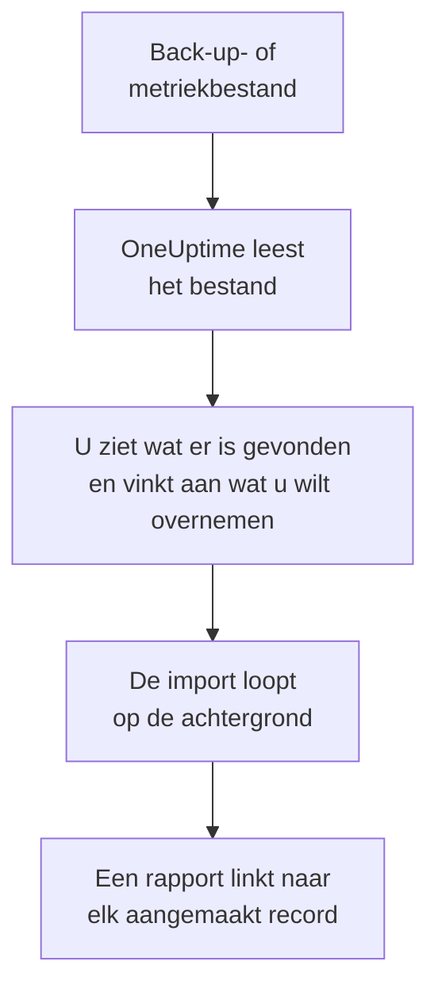

# Overstappen van Uptime Kuma

Uptime Kuma draait op uw eigen machines, dus **Importeren uit een andere tool** leest het uit een bestand in plaats van met een sleutel: de back-up die Uptime Kuma 1 exporteert, of de metriekpagina die elke versie aanbiedt. OneUptime leest uw monitoren daaruit, laat zien wat het heeft gevonden en maakt aan wat u aanvinkt. In Uptime Kuma verandert niets.

:::cards
- [Uw monitoren importeren](#uw-uptime-kuma-monitoren-importeren): Sla het bestand op, lees het en vink aan wat u wilt overnemen.
- [Wat wordt overgenomen](#wat-wordt-overgenomen): Wat elke Uptime Kuma-monitor in OneUptime wordt.
- [Rond de overstap af](#rond-de-overstap-af): Wat u doet als de import klaar is.
:::

## Hoe het werkt

- **Het bestand wordt één keer gelezen.** OneUptime leest het tijdens het uploaden, om uw monitoren te vinden, en bewaart het nooit. Wachtwoorden, tokens en push-sleutels erin worden nooit gekopieerd.
- **OneUptime maakt nooit verbinding met Uptime Kuma.** Alles komt uit het bestand. Een bestand dat geen back-up of metriekpagina van Uptime Kuma is, wordt geweigerd, met de reden.
- **Er wordt niets aangemaakt voordat u de import start.** Het voorbeeld laat voor elk item zien of het nieuw is, al in OneUptime staat (en wordt gebruikt zoals het is), door een eerdere import is overgenomen, of waarom het niet kan worden overgenomen.
- **Opnieuw uitvoeren maakt nooit iets dubbel aan.** OneUptime onthoudt wat elke import heeft overgenomen, op het Uptime Kuma-ID. Lees een nieuwer bestand nadat u monitoren hebt toegevoegd, en alleen de nieuwe worden aangemaakt.

## Voordat u begint

- **Een OneUptime-project en het recht om aan te maken wat u overneemt.** Projecteigenaren en projectbeheerders kunnen alles overnemen. Andere rollen kunnen ook een import uitvoeren en de soorten records overnemen die ze mogen aanmaken. De rest wordt getoond als niet overgenomen, met de reden.
- **Een bestand uit Uptime Kuma.** In Uptime Kuma 1 bevat de JSON-back-up elke monitor met zijn instellingen. Uptime Kuma 2 heeft geen back-up, dus sla in plaats daarvan de metriekpagina op: die noemt de naam, het type en het adres van elke monitor, maar niet hoe vaak hij wordt gecontroleerd of waar hij naar zoekt.
- **Een betaalmethode, in OneUptime Cloud.** Monitoren die controles uitvoeren, worden naar gebruik gefactureerd, ook met het Free-abonnement. Voeg er daarom vóór de import een toe onder **Projectinstellingen** > **Facturering**. Zonder betaalmethode worden die monitoren getoond als niet overgenomen.

## Uw Uptime Kuma-monitoren importeren

:::steps
### Sla het bestand op in Uptime Kuma
Ga in Uptime Kuma 1 naar **Settings** > **Backup** en kies **Export**. Voeg in Uptime Kuma 2 een sleutel toe onder **Settings** > **API Keys**, open `/metrics` op uw Uptime Kuma, meld u aan zonder gebruikersnaam met de sleutel als wachtwoord en sla de pagina op als tekstbestand.

### Open de importpagina
Ga in OneUptime naar **Projectinstellingen** > **Importeren uit een andere tool** en kies **Uptime Kuma**.

### Lees het bestand
Kies onder **Back-up- of metriekbestand van Uptime Kuma** de knop **Bestand kiezen**, kies het opgeslagen bestand en kies **Bestand lezen**. OneUptime leest het meteen en toont wat het heeft gevonden.

### Vink aan wat u wilt overnemen
Het voorbeeld toont wat er is gevonden, met één sectie per soort. Alles wat zou worden aangemaakt, is aan het begin aangevinkt, behalve monitoren die in Uptime Kuma zijn gepauzeerd. Die worden gepauzeerd overgenomen als u ze aanvinkt. Onder elk item zegt OneUptime wat niet precies zo wordt overgenomen als het was.

### Start de import
Kies **Import starten**. De import loopt op de achtergrond: u kunt de pagina verlaten, en het rapport wacht daar op u.
:::

Het rapport telt wat is aangemaakt en niet overgenomen, en toont elk item met een link naar het record dat het is geworden, mislukte eerst. Eerdere imports staan onder **Eerdere imports** op dezelfde pagina.

## Wat wordt overgenomen

| In Uptime Kuma | In OneUptime | Hoe |
| --- | --- | --- |
| Monitors | Monitoren | Uit een back-up wordt elke monitor een monitor van hetzelfde soort, met hetzelfde adres, interval, dezelfde time-out en dezelfde statuscodes die als beschikbaar gelden. Uit de metriekpagina wordt elke monitor overgenomen met een controle om de vijf minuten: controleer ze na de import een voor een. |

- **HTTP(S)- en trefwoordmonitoren** worden websitemonitoren, of API-monitoren als ze een andere methode, headers of een JSON-body sturen, met het trefwoord waar het hoort.
- **JSON-querymonitoren** worden API-monitoren, zonder de query: voeg die in OneUptime toe als criterium.
- **Ping-, poort- en DNS-monitoren** worden ping-, poort- en DNS-monitoren.
- **Pushmonitoren** worden inkomende-verzoekmonitoren, die uitvallen als er gedurende het interval en de nieuwe pogingen geen verzoek is gekomen. Elk heeft een nieuw adres in OneUptime.
- **Handmatige monitoren** blijven handmatige monitoren. **Groepen** zijn mappen, dus hun monitoren worden los overgenomen.
- **Certificaatverloop.** Een monitor die waarschuwt voordat zijn certificaat verloopt, krijgt ook een SSL-certificaatmonitor, naar hem genoemd.

Elke monitor wordt gecontroleerd vanaf de sondes van uw project, net als een monitor die u zelf aanmaakt. Een interval dat OneUptime niet biedt, wordt het dichtstbijzijnde dat het wel biedt, en een time-out van meer dan een minuut wordt één minuut. Het voorbeeld zegt wanneer een van beide verandert.

## Wat niet wordt overgenomen

- **De beschikbaarheidsgeschiedenis, responstijden en incidenten.** OneUptime begint met controleren als de import klaar is.
- **Meldingen.** Kies in OneUptime wie er bericht krijgt, zoals beschreven in [Rond de overstap af](#rond-de-overstap-af).
- **Wachtwoorden, en headers die een geheim kunnen bevatten.** Een monitor die zich aanmeldt, of die een `Authorization`-, cookie- of tokenheader stuurt, wordt zonder overgenomen: voeg die toe met een [monitorgeheim](/docs/monitor/monitor-secrets).
- **Omgekeerde monitoren**, die als beschikbaar gelden als hun controle mislukt. OneUptime heeft geen monitor die dat doet.
- **Docker-, database-, gameserver-, MQTT- en andere monitoren waarvoor OneUptime geen tegenhanger heeft.** Het voorbeeld noemt ze allemaal.
- **Statuspagina's en onderhoud.** Maak in OneUptime de statuspagina's die u nodig hebt en toon de geïmporteerde monitoren daarop.

## Limieten

Eén import maakt hooguit 2.000 records aan, en hooguit 1.000 monitoren. Een bestand mag hooguit 10 MB groot zijn. Alles boven een limiet wordt getoond als niet overgenomen. Voer de import opnieuw uit om de rest over te nemen.

In OneUptime Cloud hebben monitoren die controles uitvoeren een betaalmethode nodig, en wat niet meer in uw abonnement past, wordt getoond als niet overgenomen, met wat het nodig heeft.

Een voorbeeld wordt een dag bewaard. Alleen wie het bestand heeft uitgelezen, kan items aanvinken en de import starten. Projecteigenaren en projectbeheerders zien de voortgang en het rapport van elke import.

## Rond de overstap af

:::steps
### Controleer uw monitoren
Open elke monitor onder **Monitoren** en controleer de eerste resultaten. Een heartbeatmonitor heeft een nieuw adres: laat de taak die hem aanroept daarnaar wijzen.

### Kies wie er bericht krijgt
Voeg eigenaren toe aan uw monitoren, of bereikbaarheidsbeleid onder **Bereikbaarheidsdienst** > **Bereikbaarheidsbeleid** aan de incidenten die ze openen, zodat de juiste mensen het horen als er iets uitvalt.

### Schakel de controles in Uptime Kuma uit
Zodra OneUptime hetzelfde controleert, pauzeert u de controles in Uptime Kuma, zodat niemand twee keer bericht krijgt.
:::

## Problemen oplossen

:::details Het bestand is geweigerd
OneUptime zegt waarom: een bestand groter dan 10 MB, een bestand dat geen geldige JSON is, of een bestand dat geen back-up en geen metriekpagina van Uptime Kuma is. Exporteer de back-up opnieuw, of sla `/metrics` opnieuw op als platte tekst, en kies het opnieuw.
:::

:::details Een monitor wordt getoond als niet overgenomen
Er staat bij waarom: een soort monitor die OneUptime niet heeft, een adres dat OneUptime niet kan lezen, of een project zonder ruimte of zonder betaalmethode ervoor. Een monitor die OneUptime al uitvoert, met dezelfde naam, hetzelfde type en hetzelfde adres, wordt gebruikt zoals hij is.
:::

:::details Sommige items kunnen niet worden aangevinkt
Bij elk item staat waarom: een naam die het project al heeft, iets wat een eerdere import heeft overgenomen, of een record dat u niet mag aanmaken of dat uw abonnement niet bevat.
:::

## Volgende stappen

:::cards
- [Website-monitor](/docs/monitor/website-monitor): Wat een website-monitor controleert, en hoe.
- [Inkomende-verzoek-monitor](/docs/monitor/incoming-request-monitor): Hoe een heartbeat werkt in OneUptime.
- [Overstappen van UptimeRobot](/docs/moving-to-oneuptime/uptimerobot): Haal uw controles over uit UptimeRobot.
:::
