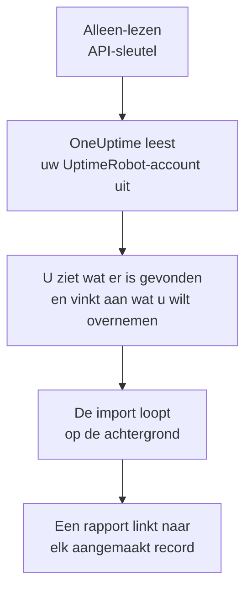

# Overstappen van UptimeRobot

**Importeren uit een andere tool** haalt uw UptimeRobot-monitoren en -statuspagina's in een paar minuten over naar OneUptime. Met een alleen-lezen UptimeRobot-API-sleutel leest OneUptime uw monitoren en openbare statuspagina's uit, laat zien wat het heeft gevonden en maakt aan wat u aanvinkt. In UptimeRobot verandert niets.

:::cards
- [Uw account importeren](#uw-uptimerobot-account-importeren): Maak een sleutel, lees uw account uit en vink aan wat u wilt overnemen.
- [Wat wordt overgenomen](#wat-wordt-overgenomen): Wat elke UptimeRobot-monitor en -statuspagina in OneUptime wordt.
- [Rond de overstap af](#rond-de-overstap-af): Wat u doet als de import klaar is.
:::

## Hoe het werkt

- **De sleutel wordt één keer gebruikt.** Hij wordt versleuteld bewaard zolang OneUptime uw account uitleest en verwijderd zodra het uitlezen klaar is, of het nu gelukt is of niet. Hij wordt nooit meer getoond en nooit in een log geschreven.
- **OneUptime leest alleen.** Het roept alleen de API van UptimeRobot aan: `api.uptimerobot.com`. Het doet elke zes seconden één verzoek, binnen de tien per minuut die UptimeRobot een Free-account toestaat, dus een groot account duurt een paar minuten. Als UptimeRobot vraagt om het rustiger aan te doen, wacht het en probeert het opnieuw.
- **Er wordt niets aangemaakt voordat u de import start.** Het voorbeeld laat voor elk item zien of het nieuw is, al in OneUptime staat (en wordt gebruikt zoals het is), door een eerdere import is overgenomen, of waarom het niet kan worden overgenomen.
- **Opnieuw uitvoeren maakt nooit iets dubbel aan.** OneUptime onthoudt wat elke import heeft overgenomen, op het UptimeRobot-ID. Voer de import opnieuw uit nadat u in UptimeRobot monitoren hebt toegevoegd, en alleen de nieuwe worden aangemaakt.

## Voordat u begint

- **Een OneUptime-project en het recht om aan te maken wat u overneemt.** Projecteigenaren en projectbeheerders kunnen alles overnemen. Andere rollen kunnen ook een import uitvoeren en de soorten records overnemen die ze mogen aanmaken. De rest wordt getoond als niet overgenomen, met de reden.
- **Een UptimeRobot-API-sleutel.** De Read-only API key is genoeg: de import schrijft nooit naar UptimeRobot. De Main API key werkt ook, maar een sleutel voor één monitor leest alleen die monitor.
- **Een betaalmethode, in OneUptime Cloud.** Monitoren die controles uitvoeren, worden naar gebruik gefactureerd, ook met het Free-abonnement. Voeg er daarom vóór de import een toe onder **Projectinstellingen** > **Facturering**. Zonder betaalmethode worden die monitoren getoond als niet overgenomen.

## Uw UptimeRobot-account importeren

:::steps
### Maak een API-sleutel in UptimeRobot
Ga in UptimeRobot naar **Integrations & API** > **API**. Maak een **Read-only API key**, of kopieer de sleutel die u al hebt.

### Open de importpagina
Ga in OneUptime naar **Projectinstellingen** > **Importeren uit een andere tool** en kies **UptimeRobot**.

### Koppel UptimeRobot
Plak de sleutel in **UptimeRobot-API-sleutel** en kies **Mijn UptimeRobot-account uitlezen**. Een groot account duurt een paar minuten, en u kunt de pagina verlaten terwijl het wordt uitgelezen.

### Vink aan wat u wilt overnemen
Het voorbeeld toont wat er is gevonden, met één sectie per soort. Alles wat zou worden aangemaakt, is aan het begin aangevinkt, behalve monitoren die in UptimeRobot zijn gepauzeerd. Die worden gepauzeerd overgenomen als u ze aanvinkt. Onder elk item zegt OneUptime wat niet precies zo wordt overgenomen als het was. Als een aangevinkte statuspagina een monitor toont die u niet hebt aangevinkt, zegt het dat, en **Deze ook aanvinken** vinkt hem aan.

### Start de import
Kies **Import starten**. De import loopt op de achtergrond: u kunt de pagina verlaten, en het rapport wacht daar op u.
:::

Het rapport telt wat is aangemaakt en niet overgenomen, en toont elk item met een link naar het record dat het is geworden, mislukte eerst. Eerdere imports staan onder **Eerdere imports** op dezelfde pagina.

## Wat wordt overgenomen

| In UptimeRobot | In OneUptime | Hoe |
| --- | --- | --- |
| Monitors | Monitoren | Elke monitor wordt een monitor van hetzelfde soort, met hetzelfde adres, interval en dezelfde time-out, en dezelfde statuscodes die als beschikbaar gelden. |
| Public status pages | Statuspagina's | Elke pagina toont dezelfde monitoren: de monitoren die ze noemt, die met haar tags, of allemaal, met beschikbaarheid en geschiedenisbalken zoals ze die toonde. Een pagina met een wachtwoord wordt privé overgenomen. |

- **HTTP(S)- en trefwoordmonitoren** worden websitemonitoren, of API-monitoren als ze een andere methode, headers of een JSON-body sturen. Een trefwoordmonitor valt uit als zijn trefwoord verschijnt of ontbreekt, zoals in UptimeRobot, en zoekt het exact, inclusief hoofdletters.
- **Ping- en poortmonitoren** worden ping- en poortmonitoren.
- **Heartbeatmonitoren** worden inkomende-verzoekmonitoren, die uitvallen als er gedurende het interval en de respijtperiode geen verzoek is gekomen. Elk heeft een nieuw adres in OneUptime.
- **DNS- en API-monitoren** worden DNS- en API-monitoren.
- **SSL-vervalherinneringen.** Een monitor die waarschuwt voordat zijn certificaat verloopt, krijgt ook een SSL-certificaatmonitor, naar hem genoemd, die evenveel dagen vooraf waarschuwt.

Elke monitor wordt gecontroleerd vanaf de sondes van uw project, net als een monitor die u zelf aanmaakt. Een interval dat OneUptime niet biedt, wordt het dichtstbijzijnde dat het wel biedt, en een time-out van meer dan een minuut wordt één minuut. Het voorbeeld zegt wanneer een van beide verandert.

## Wat niet wordt overgenomen

- **De beschikbaarheidsgeschiedenis, responstijden en incidenten.** OneUptime begint met controleren als de import klaar is.
- **Waarschuwingscontacten en integraties.** Kies in OneUptime wie er bericht krijgt, zoals beschreven in [Rond de overstap af](#rond-de-overstap-af).
- **Wachtwoorden, en headers die een geheim kunnen bevatten.** Een monitor die zich aanmeldt, of die een `Authorization`-, cookie- of tokenheader stuurt, wordt zonder overgenomen: voeg die toe met een [monitorgeheim](/docs/monitor/monitor-secrets).
- **UDP-, visual-comparison- en dependency-monitoren.** OneUptime heeft geen monitor die hetzelfde doet, en het voorbeeld noemt ze allemaal.
- **Poortmonitoren die waarschuwen zolang de poort open is.** Die werken andersom dan de poortmonitoren van OneUptime.
- **De antwoorden die een DNS-monitor verwacht en de asserties van een API-monitor.** Voeg ze in OneUptime toe als criteria.
- **Onderhoudsvensters.** Het voorbeeld telt ze: plan ze in OneUptime als gepland onderhoud.
- **Het eigen domein en de huisstijl van een statuspagina.** Voeg in OneUptime het domein toe onder **Aangepaste domeinen** en het logo onder **Huisstijl**.

## Limieten

Eén import maakt hooguit 2.000 records aan: hooguit 1.000 monitoren en 50 statuspagina's. Alles boven een limiet wordt getoond als niet overgenomen. Voer de import opnieuw uit om de rest over te nemen.

In OneUptime Cloud hebben monitoren die controles uitvoeren een betaalmethode nodig, en wat niet meer in uw abonnement past, wordt getoond als niet overgenomen, met wat het nodig heeft.

Een voorbeeld wordt een dag bewaard. Alleen wie het account heeft uitgelezen, kan items aanvinken en de import starten. Projecteigenaren en projectbeheerders zien de voortgang en het rapport van elke import.

## Rond de overstap af

:::steps
### Controleer uw monitoren
Open elke monitor onder **Monitoren** en controleer de eerste resultaten. Een heartbeatmonitor heeft een nieuw adres: laat de taak die hem aanroept daarnaar wijzen.

### Kies wie er bericht krijgt
Voeg eigenaren toe aan uw monitoren, of bereikbaarheidsbeleid onder **Bereikbaarheidsdienst** > **Bereikbaarheidsbeleid** aan de incidenten die ze openen, zodat de juiste mensen het horen als er iets uitvalt.

### Laat het adres van uw statuspagina naar OneUptime wijzen
Open de pagina onder **Statuspagina's**, voeg uw domein toe onder **Aangepaste domeinen** en wijzig daarna het DNS-record. Uw bezoekers en abonnees komen dan op de nieuwe pagina.

### Schakel de controles in UptimeRobot uit
Zodra OneUptime hetzelfde controleert, pauzeert u de controles in UptimeRobot, zodat niemand twee keer bericht krijgt.
:::

## Problemen oplossen

:::details UptimeRobot heeft de API-sleutel niet geaccepteerd
Controleer of u de hele sleutel hebt gekopieerd en of het de Read-only of Main API key van het account uit **Integrations & API** is, geen sleutel voor één monitor. Kies daarna **Opnieuw proberen**.
:::

:::details Een monitor wordt getoond als niet overgenomen
Er staat bij waarom: een soort monitor die OneUptime niet heeft, een adres dat OneUptime niet kan lezen, of een project zonder ruimte of zonder betaalmethode ervoor. Een monitor die OneUptime al uitvoert, met dezelfde naam, hetzelfde type en hetzelfde adres, wordt gebruikt zoals hij is.
:::

:::details Sommige items kunnen niet worden aangevinkt
Bij elk item staat waarom: een naam die het project al heeft, iets wat een eerdere import heeft overgenomen, of een record dat u niet mag aanmaken of dat uw abonnement niet bevat.
:::

## Volgende stappen

:::cards
- [Website-monitor](/docs/monitor/website-monitor): Wat een website-monitor controleert, en hoe.
- [Inkomende-verzoek-monitor](/docs/monitor/incoming-request-monitor): Hoe een heartbeat werkt in OneUptime.
- [Overstappen van Pingdom](/docs/moving-to-oneuptime/pingdom): Haal uw controles over uit Pingdom.
:::
