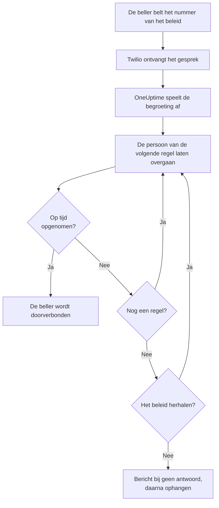
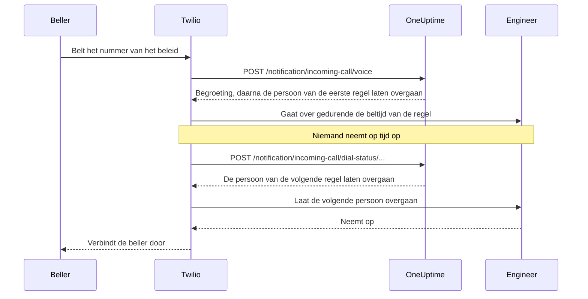

# Beleid voor inkomende oproepen

Een beleid voor inkomende oproepen geeft uw team een telefoonnummer dat bij de dienstdoende persoon uitkomt. Wanneer iemand het belt, laat OneUptime de mensen uit de escalatieregels van het beleid een voor een overgaan tot iemand opneemt, en verbindt de beller door. De nummers en de gesprekken lopen via uw eigen Twilio-account.

:::cards
- [Een beleid instellen](#een-beleid-instellen): Van uw Twilio-account tot een testoproep, in zeven stappen.
- [Hoe een gesprek wordt gerouteerd](#hoe-een-gesprek-wordt-gerouteerd): Wie er wordt gebeld, hoe lang, en wat de beller hoort.
- [Gemiste oproepen](#gemiste-oproepen): Wie het hoort, en hoe u er in een workflow op reageert.
- [Probleemoplossing](#probleemoplossing): Gesprekken die nooit aankomen, of nooit een engineer bereiken.
:::

## Voordat u begint

| U hebt nodig | Waarom |
| --- | --- |
| Een Twilio-account, met de Account SID en het Auth Token ervan | De nummers en gesprekken van het beleid lopen erover, en Twilio brengt ze daarop in rekening. |
| Het abonnement **Growth**, op OneUptime Cloud | Een project heeft het nodig voor een eigen Twilio-configuratie. |
| Een OneUptime-server die Twilio kan bereiken, als u die zelf host | Twilio stuurt elk gesprek naar `https://<your host>/notification/incoming-call/voice`. |
| **SMS** aan in het project | Het nummer van elke engineer wordt geverifieerd met een code die per sms wordt verstuurd. |
| Een geverifieerd nummer voor elke engineer | Een regel laat alleen mensen overgaan die in het project een nummer voor inkomende oproepen hebben toegevoegd en geverifieerd. |

## Een beleid instellen

:::steps
### Voeg uw Twilio-account toe

Ga naar **Projectinstellingen** > **Meldingen** > **Meldingsinstellingen**. Klik in de kaart **Twilio-configuratie** op **Create Twilio Config** en vul het formulier in:

- **Naam** en **Beschrijving**: waar het account voor is, zoals "Supportlijn".
- **Twilio Account SID**: uit de Twilio Console. Hij begint met `AC`.
- **Twilio Auth Token**: uit de Twilio Console.
- **Twilio primair telefoonnummer**: een nummer van dat account, voor de sms'jes en gesprekken die het verstuurt.
- **Twilio secundaire telefoonnummers**: optioneel. Nummers die in plaats van het primaire nummer versturen naar ontvangers in hun land.
- **Instellen als projectstandaard**: aan voor de eerste Twilio-configuratie van het project, zodat ook de sms'jes en gesprekken naar de leden van het project via dit account gaan. Zet het uit als dit account alleen voor inkomende oproepen is.

### Maak het beleid aan

Ga naar **Bereikbaarheidsdienst** > **Beleid inkomende gesprekken** en klik op **Beleid inkomend gesprek aanmaken**. Geef het een **Naam**, zoals "Supportlijn", en desgewenst een **Beschrijving** en **Labels**. Open het daarna vanuit de lijst.

### Kies het Twilio-account

Het **Overzicht** van het beleid toont een kaart **Instellen** met drie genummerde stappen. Klik in de eerste op **Selecteren**, kies het account onder **Twilio-configuratie** en klik op **Opslaan**.

### Voeg een telefoonnummer toe

Klik in de tweede stap op **Add Phone Number**. Kies **Use Existing Phone Number** om een nummer mee te nemen dat uw Twilio-account al heeft, of **Reserve New Phone Number** om een nieuw nummer te krijgen. OneUptime laat het nummer naar zichzelf wijzen, dus in Twilio hoeft u niets in te stellen. Zie [Telefoonnummers](#telefoonnummers).

### Voeg escalatieregels toe

Klik in de derde stap op **Regels beheren**. Voeg een regel toe voor elk bereikbaarheidsschema of elke persoon die moet overgaan, in de volgorde waarin ze moeten overgaan. Zie [Escalatieregels](#escalatieregels).

### Verifieer het nummer van elke engineer

Iedereen die een regel kan laten overgaan, voegt zijn eigen nummer voor inkomende oproepen toe en verifieert het. Zie [Telefoonnummers van engineers](#telefoonnummers-van-engineers).

### Bel het nummer

Wanneer alle drie de stappen klaar zijn, wordt de kaart **Phone Numbers & Twilio Configuration**. Bel het nummer vanaf een willekeurige telefoon en open daarna de **Belogboeken** van het beleid om te zien wie er is gebeld.
:::

## Hoe een gesprek wordt gerouteerd

1. Twilio stuurt het gesprek naar OneUptime, dat het **Begroetingsbericht** van het beleid voorleest.
2. OneUptime laat de persoon overgaan die de eerste escalatieregel noemt: die persoon, of wie er op dat moment dienst heeft in het bereikbaarheidsschema van de regel, overrides van gebruikers inbegrepen. Diens telefoon toont het nummer van het beleid als beller.
3. Neemt die persoon op binnen de tijd **Overgaan gedurende** van de regel, dan wordt de beller doorverbonden, en het belogboek legt vast wie opnam.
4. Zo niet, dan hoort de beller "Connecting you to the next available engineer.", en gaat de persoon van de volgende regel over.
5. Na de laatste regel begint het beleid opnieuw bij de eerste regel als **Herhaalbeleid als niemand antwoordt** aan staat, zo vaak als **Aantal keren herhaalbeleid** zegt. Anders hoort de beller het **Bericht bij geen antwoord**, en eindigt het gesprek.

Een regel wordt overgeslagen, zonder iemand te laten overgaan, wanneer er op dit moment niemand voor kan worden gebeld: het schema ervan heeft niemand van dienst, de persoon heeft in dit project geen geverifieerd nummer voor inkomende oproepen, of is geen lid van het project meer. Heeft geen enkele regel iemand om te laten overgaan, dan hoort de beller het **Bericht bij niemand beschikbaar**. Een uitgeschakeld beleid beantwoordt elk gesprek met "Sorry, this service is currently disabled." en hangt op.

OneUptime controleert de handtekening van Twilio bij elk verzoek met het Auth Token van de Twilio-configuratie, en weigert een verzoek dat het niet kan verifiëren.

> [!TIP]
> Sla het nummer van het beleid op als contact op uw telefoon, zoals "Supportlijn", zodat u een doorgeschakeld gesprek herkent wanneer het overgaat.

## Escalatieregels

Escalatieregels bepalen wie er wordt gebeld wanneer iemand het nummer van het beleid belt, van boven naar beneden in de lijst. Open het beleid, kies **Escalatieregels** in het zijmenu ervan en klik op **Escalatieregel toevoegen**. Een regel is één korte stap:

- **Wie er gebeld wordt**: een bereikbaarheidsschema of één persoon. Een schema laat overgaan wie er dienst in heeft wanneer het gesprek binnenkomt. Personen zijn de leden van uw project.
- **Overgaan gedurende (in seconden)**: hoe lang de telefoon overgaat voordat het gesprek naar de volgende regel gaat. Het begint op 20 seconden, en Twilio accepteert 5 tot 600.
- **Naam** en **Beschrijving** zijn optioneel, onder **Meer velden**. Een regel zonder naam staat in de lijst onder zijn plaats: **Level 1**, **Level 2**.

Regels worden van boven naar beneden in de lijst gebeld, en een nieuwe regel komt onderaan. Om de volgorde te wijzigen, sleept u een regel aan de greep linksboven. Met het toetsenbord zet u de focus op de greep, drukt u op Spatie, verplaatst u hem met de pijltoetsen en drukt u nogmaals op Spatie.

> [!WARNING]
> **Let op de voicemail**: houd **Overgaan gedurende** korter dan de tijd waarna de telefoon van de persoon een onbeantwoord gesprek naar de voicemail stuurt. Neemt de voicemail eerst op, dan wordt de beller ermee verbonden en gaat het gesprek niet naar de volgende regel. Twilio telt bij elke keer overgaan een paar eigen seconden op. Daarom begint een nieuwe regel op 20 seconden. Regels die zijn toegevoegd toen de standaard 30 seconden was, houden hun 30: eindigen hun gesprekken in de voicemail, verlaag dan **Overgaan gedurende** op die regels.

Bijvoorbeeld drie regels die twee rotaties proberen en daarna een leidinggevende:

| Niveau | Wie er gebeld wordt | Overgaan gedurende |
| --- | --- | --- |
| Level 1 | Primair bereikbaarheidsschema | 20 seconden |
| Level 2 | Secundair bereikbaarheidsschema | 20 seconden |
| Level 3 | Engineering lead (één persoon) | 20 seconden |

## Telefoonnummers

Een beleid kan meerdere nummers hebben, en elk ervan laat dezelfde regels overgaan. Elk nummer hoort bij één beleid. Voeg ze toe met **Add Phone Number** op het **Overzicht** van het beleid:

:::tabs
@tab Een nummer gebruiken dat u al hebt
1. Klik op **Add Phone Number** en daarna op **Use Existing Phone Number**. OneUptime toont de nummers van het Twilio-account van het beleid.
2. Klik op **Selecteren** naast het nummer en daarna op **Nummer toewijzen**.

Een nummer dat zijn gesprekken al ergens anders heen stuurt, meldt "Currently has a webhook configured". Toewijzen stuurt de gesprekken ervan voortaan naar OneUptime.
@tab Een nieuw nummer reserveren
1. Klik op **Add Phone Number**, daarna op **Reserve New Phone Number** en **Zoek naar nummers**.
2. Kies een **Land**. Vul desgewenst **Netnummer (optioneel)** in, zoals 415, of **Bevat (optioneel)** met cijfers die het nummer moet bevatten. Klik op **Zoeken**: er worden tot 10 lokale nummers getoond.
3. Klik op **Reserveren** naast een nummer en bevestig met **Reserveren**. Twilio brengt het nummer in rekening op uw Twilio-account.
:::

OneUptime stelt de voice-webhook van het nummer in op `https://<your host>/notification/incoming-call/voice`, opgebouwd uit `HOST` en `HTTP_PROTOCOL` op een zelfgehoste installatie. Om een beleid naar een ander Twilio-account te verhuizen, geeft u eerst de nummers ervan vrij: het account kan alleen wijzigen zolang het beleid er geen heeft.

Om een nummer vrij te geven, klikt u op **Vrijgeven** ernaast en bevestigt u met **Nummer vrijgeven**.

> [!CAUTION]
> Een nummer vrijgeven geeft het terug aan Twilio, ook een nummer dat u met **Use Existing Phone Number** hebt meegenomen, en u krijgt het misschien niet terug. Een beleid verwijderen, of de Twilio-configuratie die het gebruikt, geeft de nummers ervan ook vrij.

## Telefoonnummers van engineers

Een regel laat een persoon overgaan op het nummer dat die persoon in dit project voor inkomende oproepen heeft geverifieerd, en slaat iedereen over die er geen heeft. Iedereen voegt zijn eigen nummer toe:

:::steps
1. Open **Gebruikersinstellingen** > **Beleid inkomend gesprek** > **Inkomende telefoonnummers**. **Beleid inkomend gesprek** is een sectie van het zijmenu die ingeklapt begint.
2. Klik in de kaart **Telefoonnummers voor inkomende oproeproutering** op **Telefoonnummer voor inkomende oproeproutering toevoegen** en vul het nummer in met de landcode, zoals `+15551234567`.
3. Vul de 6-cijferige code die OneUptime per SMS naar het nummer stuurt in onder **Verificatiecode**, en klik op **Verifiëren**. **Send a new code** stuurt een nieuwe.
:::

Iedereen kan één geverifieerd nummer per project hebben. Om het te wijzigen, verwijdert u eerst het oude nummer. Deze nummers staan los van de telefoonnummers onder **Meldingsmethoden**, die oproepen voor bereikbaarheidsdiensten gebruiken.

Nummers voor inkomende oproepen worden per sms geverifieerd, dus **SMS** moet eerst aan staan voor het project. Een projecteigenaar, een **Billing Admin** of iemand met **Manage Billing** zet het aan in de kaart **Meldingskanalen** op **Projectinstellingen > Meldingen > Meldingsinstellingen**.

## Spraakberichten en beleidsinstellingen

Open het beleid en kies **Instellingen** onder **Geavanceerd** in het zijmenu ervan. **Edit Messages** op de kaart **Spraakberichten** wijzigt wat bellers horen; **Edit Policy Settings** op de kaart **Beleidsinstellingen** wijzigt de rest.

| Instelling | Wat het doet | Bij een nieuw beleid |
| --- | --- | --- |
| **Begroetingsbericht** | Wordt voorgelezen wanneer het gesprek wordt aangenomen, voordat de eerste persoon wordt gebeld. | "Please wait while we connect you to the on-call engineer." |
| **Bericht bij geen antwoord** | Wordt voorgelezen wanneer elke regel is geprobeerd en niemand heeft opgenomen. | "No one is available. Please try again later." |
| **Bericht bij niemand beschikbaar** | Wordt voorgelezen wanneer geen enkele regel iemand heeft om te laten overgaan. | "We are sorry, but no on-call engineer is currently available. Please try again later or contact support." |
| **Ingeschakeld** | Een uitgeschakeld beleid weigert elk gesprek. | Aan |
| **Herhaalbeleid als niemand antwoordt** | Begint na de laatste regel opnieuw bij de eerste. | Uit |
| **Aantal keren herhaalbeleid** | Hoe vaak er opnieuw wordt begonnen. | 1 |

Twilio leest de berichten voor met een tekst-naar-spraakstem, dus schrijf ze zoals u wilt dat ze klinken.

## Belogboeken

Elk gesprek staat op de pagina **Belogboeken** van het beleid, onder **Logboeken** in het zijmenu ervan: de **Beller**, het **Number Called**, de **Status** ervan, wie het aannam (**Beantwoord door**), de **Duur**, en wanneer het begon (**Gestart op**). Klik op **View Timeline** bij een gesprek om de **Oproeptijdlijn** ervan te zien: elke persoon die is gebeld, op welk nummer, en hoe elke poging eindigde.

| Status | Wat er gebeurde |
| --- | --- |
| **Initiated**, **Escalated** | Het gesprek loopt nog: het kwam binnen en een telefoon gaat over, of het ging naar een latere regel. |
| **Voltooid** | Iemand nam op, en de beller werd doorverbonden. |
| **Geen antwoord** | Elke escalatieregel is geprobeerd en niemand nam op. De beller hoorde uw **Bericht bij geen antwoord**. |
| **Caller Hung Up** | De beller hing op terwijl de telefoon van een engineer overging. |
| **Mislukt** | Niemand kon worden gebeld: geen enkele escalatieregel had een dienstdoende gebruiker met een geverifieerd nummer voor inkomende oproepen (de beller hoorde uw **Bericht bij niemand beschikbaar**), of het beleid is uitgeschakeld. |

## Gemiste oproepen

Een gesprek is gemist wanneer het eindigt zonder iemand te bereiken: de status ervan is **Geen antwoord**, **Caller Hung Up** of **Mislukt**.

### Wie een melding krijgt

Wanneer een gesprek is gemist, stelt OneUptime de eigenaren van het beleid op de hoogte: de gebruikers en de leden van de teams die op de pagina **Eigenaren** van het beleid zijn toegevoegd. Heeft het beleid geen eigenaren, dan krijgen in plaats daarvan de eigenaren van het project een melding.

De melding zegt wie er belde, welk nummer werd gekozen, waarom niemand opnam, en wie er is gebeld en hoe elke poging eindigde. Ze linkt naar het gesprek in het belogboek.

Eigenaren krijgen standaard een e-mail. Iedereen kan andere kanalen kiezen (sms, oproep, push en meer) of de melding uitzetten in **Gebruikersinstellingen** > **Meldingsinstellingen**, onder **Bereikbaarheid** > **Beleid inkomende gesprekken** > **Gemiste oproep**.

### Op gemiste oproepen reageren in een workflow

Logboeken van inkomende oproepen zijn beschikbaar als workflowtriggers:

- **On Create Incoming Call Log** wordt uitgevoerd wanneer een gesprek binnenkomt.
- **On Update Incoming Call Log** wordt uitgevoerd terwijl het gesprek verloopt. De update die **Ended At** invult, is het einde van het gesprek.

Om alleen op gemiste oproepen te reageren, bijvoorbeeld om ze in Slack of Microsoft Teams te plaatsen of een ticket te openen:

:::steps
1. Voeg de trigger **On Update Incoming Call Log** toe. Stel **Listen on** in op **Ended At**, en selecteer de velden die u wilt gebruiken, zoals **Status**, **Caller Phone Number** en **Routing Phone Number**.
2. Voeg een stap **If / Else** toe. Controleer de **Status** van de trigger, met de vergelijking **is not equal to** en `Completed`.
3. Verbind uw stappen met de poort **Yes**.
:::

Een workflow kan belogboeken lezen met **Find One** en **Find Many**, maar kan ze niet aanmaken of wijzigen.

## Wie telefoonnummers kan toevoegen en vrijgeven

De telefoonnummers van een beleid volgen dezelfde rollen als het beleid zelf:

- **Nummers opzoeken** - in Twilio zoeken naar een nummer om te reserveren, of de nummers tonen die uw Twilio-account al heeft - vereist de machtiging om beleid voor inkomende oproepen te lezen en om configuraties voor gesprekken en sms te lezen, omdat het uw Twilio-account via zo'n configuratie leest. **Project Owner**, **Project Admin**, **Project Member**, **Viewer**, **Settings Admin**, **Settings Member** en **Settings Viewer** hebben beide. In een aangepaste rol zijn dat **Read Incoming Call Policy** en **Read Call and SMS**.
- **Een nummer reserveren, een bestaand nummer gebruiken en een nummer vrijgeven** vereisen de machtiging om beleid voor inkomende oproepen te bewerken: **Project Owner**, **Project Admin**, **Project Member**, **Settings Admin** en **Settings Member**, of **Edit Incoming Call Policy** in een aangepaste rol. Ze wijzigen de nummers van een beleid dat u mag bewerken: met een rol die tot bepaalde labels is beperkt, het beleid met die labels.

Een blokkade van een team zonder labels op een van deze machtigingen neemt die weg. Voor alle anderen blijven **Add Phone Number** en **Vrijgeven** op de pagina staan, vergrendeld, en hun tooltip zegt wat ervoor nodig is. De API weigert hun verzoek met een zin die zegt wat ervoor nodig is: "Looking up phone numbers needs permission to read incoming call policies and call and SMS settings." of "Adding or releasing a phone number needs permission to edit incoming call policies." Een nummer reserveren wordt in rekening gebracht op uw eigen Twilio-account, niet op uw OneUptime-saldo, dus daar is geen factureringsmachtiging voor nodig.

## Beleid maken met de API of Terraform

| Resource | API-route |
| --- | --- |
| Beleid voor inkomende oproepen | `/api/incoming-call-policy` |
| De escalatieregels ervan | `/api/incoming-call-policy-escalation-rule` |
| De telefoonnummers ervan, alleen lezen | `/api/incoming-call-policy-phone-number` |
| Belogboeken, alleen lezen | `/api/incoming-call-log` |

Een regel die via de API zonder `escalateAfterSeconds` wordt gemaakt, gaat 20 seconden over, en dat geldt ook voor een regel die Terraform zonder `escalate_after_seconds` maakt.

### Instellingen van een escalatieregel

| Instelling | API-veld | Wat het bevat |
| --- | --- | --- |
| Wie er gebeld wordt | `onCallDutyPolicyScheduleId` of `userId` | Een van beide, nooit allebei: het schema waarvan de dienstdoende persoon wordt gebeld, of de persoon. |
| Overgaan gedurende (in seconden) | `escalateAfterSeconds` | Hoe lang de telefoon overgaat voordat het gesprek verdergaat (standaard: 20; van 5 tot 600). |
| Naam en Beschrijving | `name`, `description` | Optioneel. Een regel zonder naam staat in de lijst als Level 1, Level 2 enzovoort, naar zijn plaats in de lijst. |
| Volgorde | `order` | Waar de regel in de lijst staat: regels worden van boven naar beneden gebeld. Een nieuwe regel zonder volgorde komt onderaan. |

## Probleemoplossing

:::details Gesprekken bereiken OneUptime niet
- Open het nummer in de Twilio Console: **A call comes in** moet de webhook `https://<your host>/notification/incoming-call/voice` zijn, met HTTP POST. OneUptime stelt die in wanneer het nummer wordt toegevoegd, uit `HOST` en `HTTP_PROTOCOL`. Zijn die sindsdien gewijzigd, corrigeer de webhook dan in Twilio.
- Een zelfgehoste OneUptime moet vanaf internet bereikbaar zijn via https. Het belogboek van het nummer in de Twilio Console, en de **Debugger** van Twilio, tonen wat OneUptime antwoordde.
- Een antwoord `403` betekent dat de handtekening van het verzoek niet klopte. Controleer of de Twilio-configuratie het huidige **Twilio Auth Token** van het account bevat, en of een proxy vóór OneUptime de host en het schema doorgeeft die Twilio aanriep (`X-Forwarded-Host` en `X-Forwarded-Proto`).
:::

:::details Het gesprek wordt aangenomen, maar niemand wordt gebeld
Het belogboek zegt **Mislukt**. Controleer of het beleid **Ingeschakeld** is, of het bereikbaarheidsschema van elke regel nu iemand van dienst heeft, en of de mensen die de regels laten overgaan een geverifieerd nummer hebben onder **Gebruikersinstellingen** > **Beleid inkomend gesprek** > **Inkomende telefoonnummers**, in dit project. Regels bellen alleen leden van het project.
:::

:::details Gesprekken eindigen in de voicemail
Eindigen gesprekken in de voicemail van een engineer, stel dan **Overgaan gedurende** van de regel in op minder dan de tijd waarna diens telefoon naar de voicemail gaat. Een voicemail die opneemt, telt als opnemen, en het gesprek stopt daar.
:::

:::details Een nieuw nummer kan niet worden gereserveerd
Twilio heeft in veel landen een goedgekeurde regulatory bundle nodig voordat het lokale nummers verkoopt, en sommige nummers vereisen een positief Twilio-saldo. Regel dat in de Twilio Console, of haal het nummer daar en voeg het toe met **Use Existing Phone Number**.
:::

:::details Het Twilio-account van het beleid kan niet worden gewijzigd
Het account kan alleen wijzigen zolang het beleid geen telefoonnummers heeft: de pagina zegt "Remove all phone numbers to change". De nummers vrijgeven geeft ze terug aan Twilio, dus plan de overstap eerst.
:::

:::details De code voor het nummer van een engineer komt niet aan
SMS moet aan staan voor het project. Op OneUptime Cloud betaalt een project zonder eigen standaard-Twilio-configuratie de sms'jes uit zijn saldo, dat boven 1 USD moet liggen. Codes kunnen een minuut onderweg zijn; klik op **Send a new code** om een nieuwe te sturen, en **Projectinstellingen** > **Meldingen** > **Meldingslogboeken** toont wat ermee is gebeurd.
:::

## Volgende stappen

:::cards
- [Escalatieregels](/docs/on-call/escalation-rules): Hoe een bereikbaarheidsbeleid mensen oproept, niveau na niveau.
- [Bereikbaarheidsschema's](/docs/on-call/schedules): Bouw de rotaties die uw regels laten overgaan.
- [Workflows](/docs/workflows/index): Reageer op gemiste oproepen: plaats ze in een kanaal of open een ticket.
- [Twilio-integratie voor sms en spraak](/docs/self-hosted/twilio-integration): Stel Twilio in voor een zelfgehoste installatie.
:::
