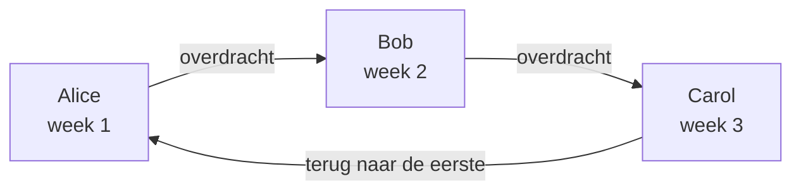

# Bereikbaarheidsschema's

Een bereikbaarheidsschema bepaalt wie er op elk moment dienst heeft. Mensen wisselen elkaar erin af: elk heeft een tijd dienst, daarna neemt de volgende het over. Voeg een schema toe aan de escalatieregels van een bereikbaarheidsbeleid, en het beleid roept op wie er dienst in heeft wanneer dat niveau wordt uitgevoerd.

> [!NOTE]
> Op OneUptime Cloud horen bereikbaarheidsschema's bij het abonnement **Growth** en hoger. Een schema dat een project nog heeft, blijft de mensen erin oproepen, via de escalatieregels die het noemen, nadat een Growth-proefperiode afloopt of het abonnement omlaag gaat. Onder **Growth** toont de pagina **Bereikbaarheidsschema's** daarom de opmerking over het abonnement met de schema's die nog zijn ingesteld eronder, waar u ze kunt verwijderen. Een schema maken of wijzigen vereist **Growth**.

:::cards
- [Wie elkaar afwisselen](#wie-elkaar-afwisselen): Maak een schema met zijn eerste rotatie.
- [Lagen](#lagen): Stapel rotaties, beperk de diensturen en voeg een vangnet toe.
- [API en Terraform](#schemas-maken-met-de-api-of-terraform): Maak schema's en hun rotaties als code.
:::

## Wie elkaar afwisselen

Wanneer u op de pagina **Bereikbaarheidsschema's** een schema maakt, vraagt het formulier om de **Naam** en **Wie wisselen elkaar af?**. De mensen die u kiest, vormen de eerste laag van het schema, **Layer 1**, de klok rond van dienst.

:::steps
1. Ga naar **Bereikbaarheidsdienst** > **Bereikbaarheidsschema's** en klik op **Bereikbaarheidsschema maken**.
2. Vul een **Naam** in.
3. Klik onder **Wie wisselen elkaar af?** op **Gebruiker toevoegen** en kies de mensen, in de volgorde waarin ze elkaar afwisselen.
4. Open desgewenst **Meer velden** om te wijzigen hoe lang elke beurt duurt, de tijdzone, de beschrijving of de labels.
5. Klik op **Bereikbaarheidsschema maken**. Het nieuwe schema opent daarna op de pagina **Lagen** ervan, waar u de rotatie kunt wijzigen of meer lagen kunt toevoegen.
:::

De mensen wisselen elkaar één voor één af, en de eerste heeft dienst zodra het schema is gemaakt:



**Wie wisselen elkaar af?** is optioneel. Laat u het leeg, dan begint het schema zonder lagen: het zet niemand van dienst totdat u op de pagina **Lagen** ervan een laag toevoegt. De vraag wordt alleen gesteld aan wie lagen mag toevoegen.

Al het andere staat onder **Meer velden**, ingeklapt tot u het opent:

| Veld | Wat het doet |
| --- | --- |
| **Elke beurt duurt** | **1 dag**, **1 week**, **2 weken** of **1 maand**, en **1 week** als u het niet wijzigt. Het wordt gevraagd zodra iemand elkaar afwisselt. Elke persoon heeft zo lang dienst, daarna neemt de volgende het over, op het tijdstip van de dag waarop het schema is gemaakt. |
| **Tijdzone** | De tijdzone waarin overdrachtstijden en diensturen worden bijgehouden. Hij begint op de uwe. |
| **Beschrijving** | Notities over het schema. |
| **Labels** | Labels om het schema te vinden en te groeperen. |

Zolang iemand elkaar afwisselt en niets onder **Meer velden** is gewijzigd, zegt de ingeklapte kop wat er gebeurt: elke persoon heeft een week dienst, daarna neemt de volgende het over.

## Lagen

De rotatie van een schema bestaat uit lagen, op de pagina **Lagen** ervan. Lagen worden van boven naar beneden gelezen: de hoogste laag met iemand van dienst is degene die oproept, dus zet de hoofdrotatie bovenaan en het vangnet eronder.

```mermaid title="De hoogste laag met iemand van dienst is degene die oproept"
flowchart TB
    start["Een niveau roept het schema op"] --> first{"Iemand van dienst<br/>in de bovenste laag?"}
    first -->|"Ja"| pageTop["Die persoon oproepen"]
    first -->|"Nee"| next{"Iemand van dienst<br/>in de volgende laag?"}
    next -->|"Ja"| pageNext["Die persoon oproepen"]
    next -->|"Nee"| gap["Niemand wordt opgeroepen<br/>een dekkingsgat"]
```

**Laag toevoegen** voegt een laag toe die begint zoals de eerste: van dienst vanaf nu, elke persoon een week, de klok rond. Klap een laag uit om er mensen aan toe te voegen, en om te wijzigen wanneer hij begint, hoe vaak hij overdraagt, wanneer hij voor het eerst overdraagt en de uren waarop hij dienst heeft:

| Veld | Wat het instelt |
| --- | --- |
| **Layer name** | Wat de laag dekt, zoals "Primair op werkdagen". |
| **Rotation starts at** | De datum en tijd waarop de rotatie van de laag begint. |
| **Rotate every** | Hoe vaak de dienst overgaat naar de volgende persoon in de laag. |
| **First hand-off time** | De eerste overdracht aan de volgende persoon, bij of na het begin. Latere overdrachten volgen elk rotatie-interval. |
| **Restrictions** | De uren waarop de laag dienst heeft: **Geen beperkingen**, **Specifieke tijdstippen van de dag** of **Specifieke tijdstippen van de week**, in de tijdzone van het schema. Daarbuiten nemen lagere lagen het over. |

Om te wijzigen welke laag eerst komt, gebruikt u **Move layer up (higher priority)** of **Move layer down (lower priority)** in het menu van een laag.

Elke persoon houdt overal één kleur, zodat u hem of haar in één oogopslag kunt volgen: in elke laag, in het uiteindelijke schema en de overrides ervan, en op de **Tijdlijn van bereikbaarheidsschema's**.

## Schema's maken met de API of Terraform

Bereikbaarheidsschema's zijn de resource `/api/on-call-duty-policy-schedule`; hun lagen en de mensen daarin zijn de resources `/api/on-call-duty-schedule-layer` en `/api/on-call-duty-schedule-layer-user`.

- Een schema maken met `firstLayerUsers` (een lijst met gebruikers-id's, in de volgorde waarin ze elkaar afwisselen) in de `miscDataProps` geeft het zijn eerste laag, net als in het dashboard: **Layer 1**, van dienst vanaf nu, de klok rond. `firstLayerRotation` zegt hoe lang elke beurt duurt, als een rotatie zoals `{"_type": "Recurring", "value": {"intervalType": "Week", "intervalCount": 1}}`; zonder deze waarde een week. Elke gebruiker moet lid van het project zijn en de aanroeper moet lagen mogen maken; anders wordt het schema niet gemaakt.
- Een schema dat zonder deze waarden wordt gemaakt, heeft zoals voorheen geen lagen; de Terraform-resource voor schema's stuurt ze niet mee.
- Een laag die zonder `rotation` wordt gemaakt, draagt dagelijks over, zoals altijd.

```bash
curl -X POST https://oneuptime.com/api/on-call-duty-policy-schedule \
  -H "apikey: $ONEUPTIME_API_KEY" \
  -H "Content-Type: application/json" \
  -d '{
    "data": {
      "projectId": "<project-id>",
      "name": "Primary on-call",
      "timezone": "Europe/Berlin"
    },
    "miscDataProps": {
      "firstLayerUsers": ["<user-id-1>", "<user-id-2>", "<user-id-3>"],
      "firstLayerRotation": {"_type": "Recurring", "value": {"intervalType": "Week", "intervalCount": 1}}
    }
  }'
```

## Volgende stappen

:::cards
- [Escalatieregels](/docs/on-call/escalation-rules): Laat een niveau van een bereikbaarheidsbeleid dit schema oproepen.
- [Tijdlijn van bereikbaarheidsschema's](/docs/on-call/schedule-timeline): Bekijk alle schema's naast elkaar, met de dekkingsgaten.
- [Agendafeeds](/docs/on-call/calendar-feeds): Zet diensten in Google Agenda, Outlook of Apple Agenda.
:::
