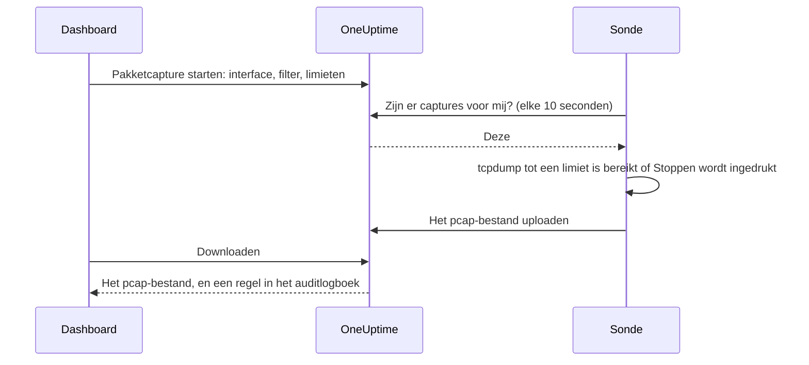

# Pakketcapture

Capture het verkeer dat een van uw sondes ziet rechtstreeks vanuit het dashboard, en open het bestand in Wireshark. De sonde staat al in het netwerk waarin u zoekt: geen VPN om te openen en geen jumphost om op in te loggen.

Captures staan op elke sonde uit totdat degene die de sonde beheert ze aanzet, en ze draaien alleen op de eigen sondes van uw project.

:::cards
- [Hoe het werkt](#hoe-het-werkt): Van 'Pakketcapture starten' tot een bestand in Wireshark.
- [Pakketcapture aanzetten](#pakketcapture-aanzetten): Wat degene die de sonde beheert instelt, voor Docker, Docker Compose en Kubernetes.
- [Een capture starten](#een-capture-starten): Kies een interface, beperk tot wat u nodig hebt, download het bestand.
- [Referentie](#referentie): Limieten, filters, machtigingen, het auditlogboek en hoe lang bestanden bewaard blijven.
- [Probleemoplossing](#probleemoplossing): Wat de melding van een mislukte capture betekent.
:::

## Hoe het werkt



1. **Starten.** Iemand die captures mag starten, kiest de interface van de sonde, een filter en de limieten, en klikt op **Capture starten**. OneUptime toetst het filter en de limieten aan wat de sonde toestaat voordat de capture wordt opgeslagen.
2. **Oppakken.** De sonde vraagt OneUptime elke tien seconden om werk, zoals ze om monitoren vraagt. Ze neemt de capture over en start `tcpdump`.
3. **Capturen.** De capture stopt bij de eerste van haar limieten: de duur, de pakketlimiet of de bestandsgrootte. **Stoppen** beëindigt haar eerder en bewaart wat al is vastgelegd.
4. **Uploaden.** De sonde uploadt het pcap-bestand. OneUptime slaat het op als privébestand van het project.
5. **Downloaden.** De capture toont **Voltooid** met een knop **Downloaden**. Het bestand opent in Wireshark, tcpdump of elk ander programma dat pcap-bestanden leest.

## Voordat u begint

- **Een eigen sonde van uw project.** Globale sondes vervoeren het verkeer van andere projecten, dus ze capturen nooit. Hoe u een eigen sonde installeert, leest u in [Aangepaste probes](/docs/probe/custom-probe).
- **Een sonde uit deze release of nieuwer.** Oudere sondes melden niet waarop ze kunnen capturen.
- **De juiste machtigingen.** Een capture starten en stoppen vraagt **Start Packet Capture**, en een bestand downloaden **Download Packet Capture**. Projecteigenaren en -beheerders hebben beide. Zie [Machtigingen](#machtigingen).
- **Een gespiegelde poort, voor verkeer dat de sonde niet bereikt.** Een sonde ziet alleen het verkeer op de interfaces van haar eigen host. Om verkeer tussen andere apparaten te capturen, spiegelt u hun switchpoort (SPAN) naar een vrije interface van de host van de sonde.

## Pakketcapture aanzetten

Degene die de sonde beheert, zet captures aan waar de sonde draait: het dashboard kan dat bewust niet. De sonde heeft drie dingen nodig:

| Instelling | Waarom |
| --- | --- |
| `PROBE_PACKET_CAPTURE_ENABLED=true` | Zet captures aan. Elke andere waarde, of geen, laat ze uit. |
| Hostnetwerk | Laat de sonde de eigen interfaces van de host zien, en een gespiegelde poort. Zonder hostnetwerk ziet de sonde alleen het netwerk van haar container. |
| De capability `NET_RAW` | Laat tcpdump capturen. Docker geeft deze standaard. De Pod Security-standaard 'restricted' van Kubernetes haalt haar weg, dus voeg haar toe. |

:::tabs
@tab Docker
```bash
docker run --name oneuptime-probe --network host \
  --cap-add NET_RAW \
  -e PROBE_KEY=<probe-key> \
  -e PROBE_ID=<probe-id> \
  -e ONEUPTIME_URL=https://oneuptime.com \
  -e PROBE_PACKET_CAPTURE_ENABLED=true \
  -d oneuptime/probe:release
```
@tab Docker Compose
```yaml
services:
  oneuptime-probe:
    image: oneuptime/probe:release
    container_name: oneuptime-probe
    network_mode: host
    cap_add:
      - NET_RAW
    environment:
      - PROBE_KEY=<probe-key>
      - PROBE_ID=<probe-id>
      - ONEUPTIME_URL=https://oneuptime.com
      - PROBE_PACKET_CAPTURE_ENABLED=true
    restart: always
```
@tab Kubernetes
```yaml
apiVersion: apps/v1
kind: Deployment
metadata:
  name: oneuptime-probe
spec:
  selector:
    matchLabels:
      app: oneuptime-probe
  template:
    metadata:
      labels:
        app: oneuptime-probe
    spec:
      hostNetwork: true
      dnsPolicy: ClusterFirstWithHostNet
      containers:
        - name: oneuptime-probe
          image: oneuptime/probe:release
          securityContext:
            capabilities:
              add: ["NET_RAW"]
          env:
            - name: PROBE_KEY
              value: "<probe-key>"
            - name: PROBE_ID
              value: "<probe-id>"
            - name: ONEUPTIME_URL
              value: "https://oneuptime.com"
            - name: PROBE_PACKET_CAPTURE_ENABLED
              value: "true"
```
:::

Bij het starten meldt het logboek van de sonde `Packet capture is on: captures of up to 30 minutes and 25 MB can be started on this probe from the dashboard.` Binnen een minuut biedt de pagina van de sonde in het dashboard **Pakketcapture starten** aan.

Om op deze sonde een lager plafond in te stellen dan het plafond waaraan elke sonde zich houdt, voegt u een van deze variabelen toe:

| Variabele | Standaard | Wat het doet |
| --- | --- | --- |
| `PROBE_PACKET_CAPTURE_MAX_DURATION_IN_SECONDS` | `1800` | De langste capture die deze sonde uitvoert, van 5 tot 1800 seconden. |
| `PROBE_PACKET_CAPTURE_MAX_FILE_SIZE_IN_MB` | `25` | Het grootste capturebestand dat deze sonde maakt, van 1 tot 25 MB. |

> [!NOTE]
> De sondes die bij een zelf gehoste OneUptime-installatie horen, via Docker Compose of de Helm-chart, zijn globale sondes en capturen dus nooit. Draai een aangepaste sonde in het netwerk waarin u wilt capturen.

## Een capture starten

:::steps
### Open de sonde of het apparaat

Open **Monitoren → Instellingen → Sondes** en klik op uw sonde: de kaart **Pakketcaptures** toont haar captures. Of open een netwerkapparaat en ga naar de pagina **Traffic**: captures daar draaien op de eigen sonde van het apparaat en starten gefilterd op zijn adres.

### Klik op Pakketcapture starten

Het formulier zegt wat een capture bevat voordat u er een start: wachtwoorden, tokens en persoonsgegevens die over de lijn gaan, komen in het bestand terecht.

### Kies de interface

**Alle interfaces (any)** capturet op elke interface van de sonde. Kies de interface waarnaar een switch het verkeer spiegelt als u gespiegeld verkeer capturet.

### Kies welke pakketten

Vul **Host of netwerk**, **Poort** en **Protocol** in om de capture te beperken, of laat ze leeg om elk pakket te bewaren. Het formulier toont het filter dat ze vormen, zoals `host 10.0.0.5 and tcp port 443`. Klik op **In plaats daarvan een BPF-filter schrijven** om uw eigen filter te schrijven.

### Controleer de limieten

**Meer velden** bevat **Duur**, **Pakketlimiet** en **Limiet bestandsgrootte (MB)**. De samenvatting zegt wanneer de capture stopt: `Stopt na 1 minuut, 100.000 pakketten of 10 MB, wat het eerst komt.`

### Klik op Capture starten

De capture toont **In behandeling** totdat de sonde haar oppakt, en daarna **Actief**, met haar voortgang. Klik op **Stoppen** om haar eerder te beëindigen.
:::

Als de capture **Voltooid** toont, klikt u op **Downloaden** en opent u het `.pcap`-bestand in Wireshark. Een capture op **Alle interfaces (any)** is een 'Linux cooked capture', die Wireshark leest zoals elke andere.

## Referentie

### Limieten

| Limiet | Standaard | Bereik |
| --- | --- | --- |
| Duur | 1 minuut | 5 seconden tot 30 minuten |
| Pakketlimiet | 100.000 | 1 tot 1.000.000 |
| Limiet bestandsgrootte | 10 MB | 1 tot 25 MB |

- Een capture stopt bij de eerste limiet die ze bereikt. Een bestand dat zijn groottelimiet bereikt, wordt afgekapt na het laatste volledige pakket, zodat het altijd opent.
- Een sonde voert hoogstens 2 captures tegelijk uit.
- Een capture die de sonde niet binnen 5 minuten oppakt, mislukt, en zegt dat ook.
- De sonde houdt elke capture opnieuw aan deze limieten, en aan haar eigen, lagere.

### Filters

De velden van het formulier vormen een [BPF-filter](https://www.tcpdump.org/manpages/pcap-filter.7.html), de capturefiltertaal van tcpdump en Wireshark:

| Host of netwerk | Poort | Protocol | Filter |
| --- | --- | --- | --- |
| `10.0.0.5` | | Elk protocol | `host 10.0.0.5` |
| `10.0.0.0/24` | `443` | TCP | `net 10.0.0.0/24 and tcp port 443` |
| | `5060` | UDP | `udp port 5060` |
| | `8000-8080` | Elk protocol | `portrange 8000-8080` |
| `10.0.0.5` | | ICMP | `host 10.0.0.5 and (icmp or icmp6)` |

Een filter dat u zelf schrijft, is één regel van hoogstens 500 tekens, gemaakt van letters, cijfers, spaties en `. : / ( ) [ ] ! & | < > = + - * % ^ _`. OneUptime controleert het voordat het wordt opgeslagen, en tcpdump compileert het op de sonde. De sonde geeft het aan tcpdump door als één argument, nooit via een shell.

### Machtigingen

| Machtiging | Laat iemand | Wie heeft het standaard |
| --- | --- | --- |
| **Start Packet Capture** | Captures starten en stoppen | Project Owner, Project Admin |
| **Download Packet Capture** | Capturebestanden downloaden | Project Owner, Project Admin |
| **Delete Packet Capture** | Captures en hun bestanden verwijderen | Project Owner, Project Admin |
| **Read Packet Capture** | Captures zien: wanneer ze draaiden, op welke sonde en met welk filter | Project Owner, Project Admin, Project Member, Viewer |

Om een team **Start Packet Capture** of **Download Packet Capture** te geven, opent u het onder **Instellingen → Teams** en voegt u de machtiging toe op de pagina **Machtigingen**. Zie [Machtigingen](/docs/permissions/index).

### Auditlogboek en privacy

- Het starten van een capture wordt in het auditlogboek vastgelegd als een **Create** van de **Packet Capture**, en het verwijderen als een **Delete**. Elke download wordt vastgelegd als een **Download**, met wie welke capture downloadde.
- Het bestand is een privébestand van het project. Alleen de knop **Downloaden**, met **Download Packet Capture**, geeft het vrij.
- Captures en hun bestanden worden 7 dagen na de start verwijderd. Wie een capture verwijdert, verwijdert ook direct het bestand.

## Probleemoplossing

:::details 'Pakketcapture staat uit op deze sonde'
De sonde draait zonder `PROBE_PACKET_CAPTURE_ENABLED=true`. Start haar opnieuw met de instellingen uit [Pakketcapture aanzetten](#pakketcapture-aanzetten).
:::

:::details "The probe is not allowed to capture packets on eth0"
tcpdump kon de interface niet openen. Geef de container van de sonde de capability `NET_RAW`: `--cap-add NET_RAW` met Docker, `cap_add` met Docker Compose, `securityContext.capabilities.add` met Kubernetes.
:::

:::details "The interface does not exist on the probe"
De interface is verdwenen sinds de sonde haar meldde, of de sonde draait zonder hostnetwerk en ziet alleen de interfaces van haar container. Draai haar met hostnetwerk en kies de interface opnieuw.
:::

:::details "tcpdump could not use the filter"
tcpdump kon het filter niet compileren. De melding bevat de woorden van tcpdump zelf, zoals `syntax error`. Controleer het filter met de [pcap-filter-handleiding](https://www.tcpdump.org/manpages/pcap-filter.7.html).
:::

:::details "The probe did not pick up this capture within 5 minutes"
De sonde is niet verbonden, of pakketcapture is erop uitgezet nadat de capture was gestart. Controleer de **Verbindingsstatus** van de sonde, en haar logboek.
:::

:::details 'Geen enkel pakket kwam overeen met het filter.'
De capture draaide, en niets op de interface kwam overeen met het filter. Controleer of het verkeer over deze interface loopt: verkeer tussen andere apparaten bereikt de sonde alleen via een gespiegelde poort.
:::

:::details "This probe is already running 2 packet captures"
Een sonde voert 2 captures tegelijk uit. Wacht tot er een klaar is, of stop er een, en start de uwe opnieuw.
:::

## Volgende stappen

:::cards
- [Aangepaste probes](/docs/probe/custom-probe): Installeer een sonde in het netwerk waarin u wilt capturen.
- [Netwerkapparaat-monitor](/docs/monitor/network-device-monitor): Bewaak de apparaten waarvan u het verkeer capturet.
- [Machtigingen](/docs/permissions/index): Geef een team de machtigingen voor pakketcapture.
:::
