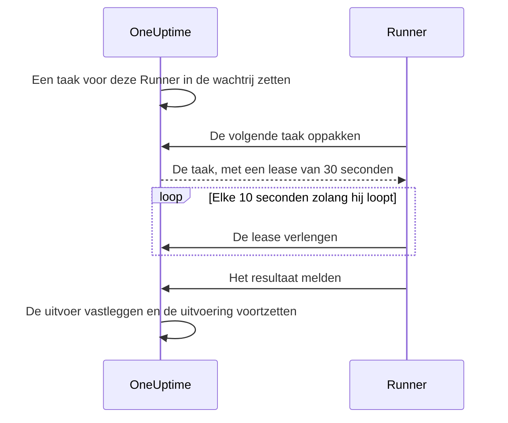

# Runbook-agenten

Een **runbook-agent**, in het dashboard **Runner** genoemd, is een klein zelf gehost proces dat de JavaScript-, Bash-, SSH- en Kubernetes-stappen van uw runbooks **in uw eigen infrastructuur** uitvoert. De OneUptime Worker voert uw scripts nooit uit: hij zet ze in de wachtrij, en de Runner die de schrijver van de stap koos, pakt elk script op, voert het uit en meldt het resultaat terug. Deze pagina is voor wie Runners installeert en beheert.

:::cards
- [Een Runner installeren](#een-runner-installeren): Van het dashboard naar een verbonden container, in vijf stappen.
- [Een stap op een Runner richten](#een-stap-op-een-runner-richten): Een stap koppelen aan de Runner die hem moet uitvoeren.
- [Time-outs](#time-outs): Claim- en uitvoeringstime-outs, en hoe ze samenwerken.
- [Omgevingsvariabelen](#omgevingsvariabelen): Wat de container bij het starten leest.
:::

## Hoe het werkt

```mermaid title="Wat er over het netwerk gaat tussen een Runner en OneUptime"
flowchart TB
    subgraph yours["Uw infrastructuur"]
        direction LR
        runner["Runner-container"]
        targets["Hosts, clusters, interne diensten"]
    end
    subgraph cloud["OneUptime"]
        direction LR
        worker["Worker zet de stap in de wachtrij"]
        ingest["Runner-API"]
    end
    worker --> ingest
    runner -->|"Uitgaand HTTPS, Runner-ID en sleutel"| ingest
    ingest -->|"Opgepakte taak, met zijn geheimen of inloggegeven"| runner
    runner -->|"Script, SSH of Kubernetes-API"| targets
```

1. U maakt een Runner in OneUptime. OneUptime genereert er een ID en een geheime sleutel voor.
2. U draait de Runner-container op een host in uw infrastructuur, met dat ID, die sleutel en uw OneUptime-URL.
3. De Runner vraagt OneUptime elke 5 seconden om werk en meldt elke 60 seconden dat hij leeft.
4. Wanneer u een JavaScript-, Bash-, SSH- of Kubernetes-stap schrijft, kiest u de Runner uit een vervolgkeuzelijst. De stap is aan die Runner gekoppeld.
5. Wanneer de stap loopt, zet de Worker een taak in de wachtrij waarvan `targetAgentId` naar die Runner wijst. Alleen die Runner kan hem oppakken.
6. De Runner voert de taak lokaal uit — `bash -c <script>` voor Bash, een `isolated-vm`-sandbox voor JavaScript, een SSH-verbinding of een aanroep van de API-server van het cluster met het inloggegeven van de stap —, legt het resultaat vast en meldt het terug. De Worker zet het runbook voort met het resultaat.

De Runner heeft alleen **uitgaand HTTPS** naar uw OneUptime-instantie nodig. Hij accepteert geen inkomende verbindingen.

Een Runner bewaart alleen zijn ID en sleutel. Al het andere krijgt hij met de taak die hij oppakt: een script, met de [runbook-geheimen](/docs/runbooks/credentials#geheimen-voor-scripts) die aan hem zijn toegewezen al ingevuld, of het [inloggegeven](/docs/runbooks/credentials) dat een SSH- of Kubernetes-stap noemt. Daarom kan iedereen met de sleutel van een Runner als die Runner optreden: behandel de sleutel als de inloggegevens die eraan zijn toegewezen.

## Waarom scripts op een Runner lopen

Scripts op de OneUptime Worker uitvoeren gaf twee problemen:

- **Vertrouwensgrens.** Iedereen die een runbook kon schrijven, kon code op de Worker uitvoeren, met toegang tot alles wat de Worker kon bereiken.
- **Bereik.** De meeste nuttige stappen werken op _uw_ infrastructuur ("herstart deze dienst", "zoek een record op in onze interne database"), niet op die van OneUptime.

Met Runners lopen die stappen op een host die u beheert, en bepaalt u wat die host mag doen. HTTP-verzoek- en AI-stappen lopen nog steeds op de Worker, omdat ze niets uit uw netwerk nodig hebben.

## Voordat u begint

- **Een host met Docker** in uw infrastructuur, die uw OneUptime-URL via HTTPS bereikt en de systemen waarop uw stappen werken.
- **Een rol die Runners maakt.** Project Owner, Project Admin, Project Member en Runbook Admin kunnen er een maken. Alleen een Project Owner, Project Admin of Runbook Admin ziet de sleutel van een Runner, die in de installatieopdracht staat.

## Een Runner installeren

### 1. Het agentrecord maken

Ga naar **Runbooks → Runbook-agenten** en maak een nieuwe agent. Klik op **Runner aanmaken** en vul de twee stappen in:

| Veld | Stap | Opmerkingen |
| --- | --- | --- |
| **Naam** | **Runner** | Een duidelijke naam, meestal waar hij draait en wat hij bereikt, zoals `prod-eu-west-1`. Dit kiest u wanneer u een stap schrijft. |
| **Beschrijving** | **Runner** | Optioneel. Een zin over wat deze host bereikt. |
| **Labels** | **Runner** (onder **Meer velden**) | Optioneel. |
| **Voert Runbooks uit** | **Mogelijkheden** | Standaard aan. Laat deze Runner runbook-stappen oppakken. |
| **Voert AI-codecorrecties uit** | **Mogelijkheden** | Standaard uit. Laat hem pull requests met AI-codecorrecties openen; zie [Fix Tasks](/docs/ai/ai-agent). |
| **Voert AI-herstelopdrachten uit** | **Mogelijkheden** | Standaard uit. Laat automatisch AI-herstel er beleidsgecontroleerde opdrachten op uitvoeren. Dit aanzetten voor een Runner met SSH-inloggegevens vereist de machtiging om runbook-inloggegevens te lezen; zie [Runners die de opdrachten van OneUptime AI uitvoeren](/docs/runbooks/credentials#runners-die-de-opdrachten-van-oneuptime-ai-uitvoeren). |

Een Runner neemt een wijziging van zijn mogelijkheden over bij zijn volgende heartbeat; opnieuw starten is niet nodig.

### 2. De installatieopdracht kopiëren

Klik in de rij van de Runner op **Installatie-instructies weergeven**. Het dialoogvenster **Configuratie van runbook-agent** toont een `docker run`-opdracht met het ID en de sleutel van deze Runner al ingevuld. Dezelfde opdracht staat op de eigen pagina van de Runner, onder **Installatie-instructies**.

Alleen een Project Owner, Project Admin of Runbook Admin kan de sleutel lezen. Anderen zien "U hebt geen toestemming om de sleutel van deze runbook-agent te bekijken" in plaats van de opdracht.

### 3. Hem draaien op een host in uw infrastructuur

Voer de opdracht uit op een host in uw omgeving die:

- uw OneUptime-instantie via HTTPS bereikt, en
- kan doen wat uw stappen nodig hebben, zoals andere hosts via SSH bereiken, de API-server van een cluster aanroepen of met een database praten.

```bash
docker run --name oneuptime-runner --restart unless-stopped \
  -e ONEUPTIME_RUNNER_ID=<runner-id> \
  -e ONEUPTIME_RUNNER_KEY=<runner-key> \
  -e ONEUPTIME_URL=https://oneuptime.yourdomain.com \
  -d oneuptime/runner:release
```

### 4. Controleren dat de agent verbonden is

Ga terug naar **Runbooks → Runbook-agenten**. Binnen een minuut na het starten van de container moet de **Status** van de Runner **Verbonden** tonen, met een recente **Laatst gezien**. Op de eigen pagina van de Runner toont de kaart **Status van runbook-agent** zijn **Versie van runbook-agent** en **Host**. Blijft hij op **Nooit verbonden** of **Verbinding verbroken** staan, zie dan [Problemen oplossen](#problemen-oplossen).

### 5. De agent bijwerken

Draait een agent een oudere versie dan uw OneUptime, dan verschijnt op zijn pagina een waarschuwingsteken naast zijn **Versie van runbook-agent**. Kies het om te zien hoe u bijwerkt: haal de nieuwe image op en verwijder de container, en voer dan de installatieopdracht uit stap 2 opnieuw uit. Een agent die de Kubernetes-agentchart installeerde, wordt in plaats daarvan met de chart bijgewerkt.

```bash
docker pull oneuptime/runner:release
docker rm -f oneuptime-runner
```

## Een stap op een Runner richten

:::steps
### Een stap toevoegen die op een Runner loopt

Voeg in de **Stappen** van uw runbook een JavaScript-, Bash-, SSH- of Kubernetes-stap toe.

### De Runner kiezen

De vervolgkeuzelijst **Runner** van de stap toont elke Runner in het project, en of hij verbonden is. Heeft het project er nog geen, dan zegt de stap dat en verwijst hij u naar **Runbooks › Runners**.

### De stappen opslaan

Klik op **Save Steps**. Wanneer een uitvoering de stap bereikt, zet de Worker een taak in de wachtrij voor het ID van die Runner, en alleen die Runner kan hem oppakken.
:::

Bash wordt uitgevoerd met `bash -c`. JavaScript loopt in een `isolated-vm`-sandbox op de Runner, zonder toegang tot het bestandssysteem of processen; het kan openbare HTTP-API's aanroepen met `axios`, maar geen adressen in een privénetwerk. SSH- en Kubernetes-stappen gebruiken het [inloggegeven](/docs/runbooks/credentials) dat de stap noemt, dat aan dezelfde Runner moet zijn toegewezen.

Meer dan één Runner nodig? Maak ze en richt elke stap op de juiste. Voor redundantie draait u een tweede Runner en verdeelt u de stappen over beide, of houdt u een reserve-runbook bij waarvan de stappen op de andere Runner zijn gericht.

## Beheernotities

### Time-outs

Voor elke stap die op een Runner loopt, gelden twee time-outs:

| Time-out | Standaard | Wat het regelt |
| --- | --- | --- |
| **Claim timeout** | 2 minuten | Hoe lang de Worker wacht tot de gekozen Runner de taak oppakt. Pakt de Runner hem niet op tijd op, dan mislukt de stap door een time-out en gaat het runbook verder (of stopt het, afhankelijk van **Doorgaan bij fout**). |
| **Execution timeout** | 30 seconden | Hoe lang de Runner de stap laat lopen voordat hij hem stopt. Bash krijgt `SIGKILL`; de sandbox van JavaScript wordt afgebroken. |

Beide zijn per stap in te stellen. Open **Runbooks › uw runbook › Stappen**, klap de stap uit en stel **Execution timeout** en **Claim timeout** (in seconden) in bij de instellingen ervan. Laat een veld leeg om de standaard te gebruiken. Elk accepteert 1 seconde tot 1 uur; waarden buiten dat bereik worden bij het uitvoeren van de stap begrensd.

Het totale wachtvenster van de Worker is `claim timeout + execution timeout + a few seconds`. Kies waarden die bij de stap passen.

Twee dingen om op te letten als u de claim timeout verlaagt:

- De Runner vraagt om werk in een pollingcyclus (`ONEUPTIME_RUNNER_POLL_INTERVAL_MS`, standaard 5 seconden). Een claim timeout korter dan één cyclus kan verlopen voordat een volkomen gezonde Runner de taak zelfs maar heeft gezien, en de stap mislukt dan met dezelfde melding als bij een offline Runner.
- Een Runner voert standaard één taak tegelijk uit (`ONEUPTIME_RUNNER_CONCURRENCY`). Terwijl een lange stap hem bezighoudt, wachten andere stappen die op dezelfde Runner zijn gericht hun eigen claim timeouts af. Verhoogt u een execution timeout tot minuten, verhoog dan ook de claim timeout van de stappen die die Runner delen, of geef ze een andere Runner.

### Lease en heartbeat



Wanneer een Runner een taak oppakt, krijgt hij een korte lease (standaard 30 seconden). Terwijl de stap loopt, verlengt de Runner de lease elke 10 seconden. Valt de Runner uit of verliest hij midden in een script zijn netwerk, dan verloopt de lease en markeert de Worker de taak als `TimedOut` in plaats van eeuwig te wachten.

Kindprocessen van Bash worden **niet** automatisch geannuleerd wanneer de lease verloopt (een JavaScript-sandbox mag ook afmaken, als hij ooit klaar is), maar de Worker wacht er niet meer op, en de Runner kan geen resultaat meer indienen zodra een andere claim het heeft overgenomen. Ontwerp scripts zo dat ze veilig opnieuw kunnen lopen als exact één keer uitvoeren voor u belangrijk is.

### Als de OneUptime Worker midden in een stap herstart

Een runbook-uitvoering loopt van begin tot eind op één Worker, dus een deploy of een crash kan haar onderbreken terwijl een stap bezig is. Wat daarna gebeurt, hangt ervan af of de uitvoering weer wordt opgepakt:

- **Ze wordt hervat.** De Worker die haar oppakt, vindt de taak die uw stap al had gemaakt en **koppelt zich er opnieuw aan**. Hij wacht op die taak in plaats van uw Runner een tweede kopie van het script te sturen. Was de Runner al klaar, dan wordt het vastgelegde resultaat ongewijzigd gebruikt. Een stap wordt per uitvoering hooguit één keer naar een Runner gestuurd.
- **Ze wordt niet hervat.** Wordt de uitvoering nooit meer opgepakt, dan markeert een opruimronde haar als `Failed` zodra ze het claim- en uitvoeringsvenster van haar huidige stap heeft overschreden, met een melding die die stap noemt. Een uitvoering blijft nooit in `Running` hangen.

Het enige wat dit u niet kan vertellen, is hoe ver een script kwam voordat de Worker verdween. Een stap die halverwege was, wordt als mislukt gemeld met een notitie dat hij mogelijk deels is uitgevoerd: controleer het doelsysteem voordat u het runbook opnieuw uitvoert.

### Geen agent online

Is de gekozen Runner offline wanneer de stap loopt, dan wacht de taak als `Pending` tot de claim timeout verstrijkt, en mislukt de stap vervolgens met "No runbook agent picked up this step before the wait window expired." Op de pagina **Runbook-agenten** controleert u de dekking voordat u een runbook in een echte situatie uitvoert.

### Uitvoerlimiet

stdout en stderr samen zijn per stap beperkt tot **50 KB**. Langere uitvoer wordt afgekapt met een markering. Hebt u een volledig log nodig, schrijf het dan vanuit het script naar uw logopslag of objectopslag en geef de URL weer met `echo`.

### Annulering

Een runbook-uitvoering annuleren, vanaf de uitvoeringspagina of via de API, markeert meteen al haar taken in `Pending`, `Claimed` en `Running` als `Cancelled`. Een Runner die al midden in een script zit, maakt zijn werk af, maar de server accepteert het resultaat niet, en geen latere stap van het runbook wordt verstuurd.

### Gelijktijdigheid

Elke Runner voert standaard één taak tegelijk uit. Stel `ONEUPTIME_RUNNER_CONCURRENCY` in op de container om er meer toe te staan, maar bedenk dat de Runner de host deelt met al het andere dat er draait.

## Omgevingsvariabelen

De Runner leest deze variabelen bij het starten:

| Variabele | Verplicht | Standaard | Opmerkingen |
| --- | --- | --- | --- |
| `ONEUPTIME_URL` | ja | — | Basis-URL van uw OneUptime-instantie, zoals `https://oneuptime.yourdomain.com`. |
| `ONEUPTIME_RUNNER_ID` | ja | — | Het ID van de Runner, uit de installatieopdracht. |
| `ONEUPTIME_RUNNER_KEY` | ja | — | De geheime sleutel van de Runner, uit de installatieopdracht. |
| `ONEUPTIME_RUNNER_POLL_INTERVAL_MS` | nee | `5000` | Hoe vaak de Runner om nieuwe taken vraagt. Een waarde onder `1000` valt terug op de standaard. |
| `ONEUPTIME_RUNNER_HEARTBEAT_INTERVAL_MS` | nee | `60000` | Hoe vaak de Runner meldt dat hij leeft. Een waarde onder `5000` valt terug op de standaard. |
| `ONEUPTIME_RUNNER_JOB_HEARTBEAT_INTERVAL_MS` | nee | `10000` | Hoe vaak de Runner de lease van een lopende taak verlengt. Een waarde onder `1000` valt terug op de standaard. |
| `ONEUPTIME_RUNNER_CONCURRENCY` | nee | `1` | Maximaal aantal gelijktijdige taken op deze Runner. |
| `ONEUPTIME_RUNNER_ENABLE_RUNBOOKS` | nee | — | Zet op `false` zodat deze Runner geen runbook-stappen meer oppakt, wat het dashboard ook zegt. Kan de mogelijkheid alleen uitzetten. |
| `ONEUPTIME_RUNNER_ENABLE_CODE_FIXES` | nee | — | Zet op `false` zodat deze Runner geen AI-codecorrecties meer oppakt, wat het dashboard ook zegt. |
| `ONEUPTIME_RUNNER_ENABLE_AI_COMMANDS` | nee | — | Zet op `false` zodat deze Runner geen AI-herstelopdrachten meer uitvoert, wat het dashboard ook zegt. |

## Een agentsleutel vervangen

Lekt een sleutel uit, stel hem dan opnieuw in. De oude sleutel werkt meteen niet meer.

:::steps
### De sleutel opnieuw instellen

Open de Runner via **Runbooks → Runbook-agenten**, klik op **Runbook-agentsleutel opnieuw instellen** en bevestig. De Runner maakt geen verbinding meer tot hij de nieuwe sleutel heeft.

### De container met de nieuwe sleutel draaien

Kopieer de nieuwe opdracht uit de **Installatie-instructies** van de Runner, verwijder de oude container en voer de nieuwe opdracht uit op dezelfde host:

```bash
docker rm -f oneuptime-runner
```

### Controleren dat hij opnieuw verbindt

Onder **Runbooks → Runbook-agenten** springt de **Status** van de Runner binnen een minuut terug naar **Verbonden**.
:::

## Machtigingen

Het beheer van agenten valt onder de bestaande machtigingsgroep Runbooks:

- `CreateRunner`, `EditRunner`, `DeleteRunner`, `ReadRunner` — agentrecords beheren.
- `RunbookAdmin`, `RunbookMember`, `RunbookViewer` (rollen) — `RunbookAdmin` bouwt runbooks, hun regels en de Runners waarop ze lopen, en voert ze uit. `RunbookMember` opent runbooks en hun uitvoeringen en voert ze uit — start een uitvoering, voltooit of slaat stappen over en annuleert haar — maar maakt, wijzigt en verwijdert geen runbook of Runner. `RunbookViewer` leest runbooks en hun uitvoeringen en voert niets uit. `RunbookAdmin` bundelt alle gedetailleerde machtigingen hierboven.

Een runbook starten (en zo zijn stappen naar Runners sturen) vereist een rol die runbooks uitvoert — `ProjectOwner`, `ProjectAdmin`, `ProjectMember`, `RunbookAdmin` of `RunbookMember` — of `CreateRunbookExecution`; een uitvoering voltooien, overslaan of annuleren accepteert ook `EditRunbookExecution`. Een rol voert alleen de runbooks uit die binnen zijn bereik vallen.

De sleutel van een Runner is alleen leesbaar voor Project Owners, Project Admins en Runbook Admins.

## API voor agenten

Voor wie het wil weten: de Runner gebruikt deze endpoints, gekoppeld onder `/runner-ingest`. Het pad van vóór de samenvoeging, `/runbook-agent-ingest`, wordt nog steeds bediend voor agenten die nog niet opnieuw zijn uitgerold, zodat een serverupgrade ze niet breekt. Ze worden geauthenticeerd met het ID en de sleutel van de Runner in de JSON-body (`agentId` en `agentKey`), of in de headers `x-agent-id` en `x-agent-key`.

| Endpoint | Doel |
| --- | --- |
| `POST /heartbeat` | Levensteken. Werkt de laatst-gezien-tijd, versie en hostinformatie van de Runner bij en geeft de mogelijkheden terug die het project hem gaf. |
| `POST /claim-next-job` | Atomair de oudste taak in `Pending` oppakken die op het ID van deze Runner is gericht. Geeft `{ job: null }` terug als er niets te doen is. |
| `POST /job/:jobId/heartbeat` | De lease van de taak vernieuwen. Geeft 404 terug zodra de lease is verlopen of de taak klaar is. |
| `POST /job/:jobId/result` | Het eindresultaat indienen. Wordt genegeerd als de lease al is doorgegaan. |
| `POST /disconnect` | Afmelden bij een nette afsluiting. |

U zou ze niet met de hand hoeven aan te roepen: de meegeleverde Runner doet dat. Ze staan hier zodat u uw eigen agent kunt bouwen als u een beperking hebt waar de onze niet in past.

## Problemen oplossen

:::details De Runner blijft op Nooit verbonden of Verbinding verbroken staan
- Controleer de containerlogs met `docker logs oneuptime-runner` op authenticatie- of netwerkfouten.
- Controleer dat de host uw OneUptime-URL bereikt, bijvoorbeeld met `curl`.
- Controleer dat het ID en de sleutel zonder spaties zijn gekopieerd, en dat `ONEUPTIME_URL` het adres is waarop u OneUptime opent.

**Nooit verbonden** betekent dat de Runner zich nooit heeft gemeld. **Verbinding verbroken** betekent dat hij dat wel deed, maar niet in de laatste 5 minuten.
:::

:::details Stappen mislukken met "No runbook agent picked up this step before the wait window expired."
De Runner van de stap pakte de taak niet op binnen zijn claim timeout. Controleer dat de Runner **Verbonden** is, dat **Voert Runbooks uit** voor hem aan staat en dat hij niet bezig is met een lange stap: hij voert één taak tegelijk uit, tenzij u `ONEUPTIME_RUNNER_CONCURRENCY` verhoogt. Een claim timeout korter dan het pollinginterval mislukt op dezelfde manier.
:::

:::details Stappen mislukken met "The runbook agent stopped responding while this step was running."
De Runner pakte de taak op en stopte toen met het verlengen van zijn lease: hij crashte, herstartte of verloor zijn netwerk. Controleer dat hij online is en controleer dan het doelsysteem voordat u het runbook opnieuw uitvoert.
:::

:::details De Runner logt "No capability is enabled"
Elke mogelijkheid staat uit voor deze Runner. Zet **Voert Runbooks uit** aan op de pagina van de Runner in OneUptime. Hij neemt de wijziging over bij zijn volgende heartbeat.
:::

## Volgende stappen

:::cards
- [Een runbook schrijven](/docs/runbooks/authoring): De stappen schrijven die op uw Runner lopen.
- [Runbook-inloggegevens](/docs/runbooks/credentials): SSH- en Kubernetes-stappen beheerde toegang geven.
- [Runbook-configuratie & veiligheid](/docs/runbooks/configuration): Limieten, machtigingen en beveiliging.
:::
