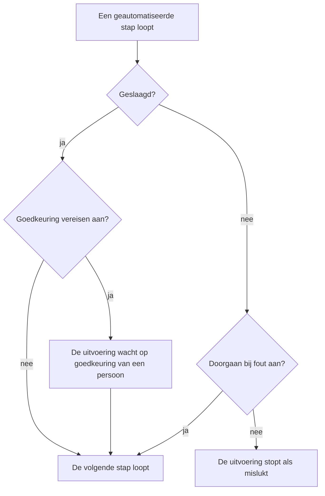

# Een runbook schrijven

U schrijft een runbook als een geordende lijst stappen op de pagina **Stappen** ervan. Deze pagina laat zien hoe u een runbook maakt, hoe u elk van de zeven staptypen instelt en hoe fouten en goedkeuringen het verloop van een uitvoering veranderen.

:::cards
- [Een runbook maken](#een-runbook-maken): Van een leeg runbook naar opgeslagen stappen.
- [Staptypen](#staptypen): Manual, JavaScript, HTTP request, Bash, SSH, Kubernetes en AI.
- [Foutafhandeling en goedkeuringen](#foutafhandeling-en-goedkeuringen): Wat er gebeurt nadat een stap mislukt of slaagt.
- [Een uitgewerkt voorbeeld](#een-uitgewerkt-voorbeeld): Een database-failover in vijf stappen.
:::

## Voordat u begint

- **Een rol die runbooks schrijft.** Project Owner, Project Admin en Runbook Admin maken runbooks en slaan de stappen op. Met gedetailleerde machtigingen hebt u **Create Runbook** en **Edit Runbook** nodig. Zie [Machtigingen](/docs/runbooks/configuration#machtigingen).
- **Een Runner, voor JavaScript-, Bash-, SSH- en Kubernetes-stappen.** Deze stappen lopen op een [Runner](/docs/runbooks/agents) in uw eigen infrastructuur, nooit op de OneUptime Worker. Installeer er eerst een.
- **Een inloggegeven, voor SSH- en Kubernetes-stappen, en de machtiging om het te lezen.** Zie [Runbook-inloggegevens](/docs/runbooks/credentials). Een stap kan alleen een inloggegeven noemen als u runbook-inloggegevens mag lezen: Project Owner, Project Admin of **Read Runbook Credential**. Runbook Admin bevat dat niet.
- **Een LLM-provider, voor AI-stappen.** Zie [LLM-providers](/docs/ai/llm-provider).

## Een runbook maken

:::steps
### Runbooks openen

Open **Producten → Runbooks**. Runbooks staat in de groep **Dashboards & automatisering**.

### Het runbook maken

Klik op **Runbook aanmaken**, voer een **Naam** in en eventueel een **Beschrijving** van waar het runbook voor dient. Onder **Meer velden** staan de schakelaar **Ingeschakeld**, standaard aan, en **Labels**. Het nieuwe runbook verschijnt in de lijst: open het.

### Stappen toevoegen

Ga naar **Stappen**. Kies onder **Start your runbook** het type van de eerste stap; onder de laatste stap biedt **Add another step** dezelfde zeven typen. Elke stap opent met zijn **Titel**, zijn **Beschrijving** (Markdown, zichtbaar voor wie reageert) en de instellingen van zijn type. Zodra het runbook een stap heeft, voegt **Stap toevoegen** bovenaan de kaart een Manual-stap toe.

### De stappen ordenen

Stappen lopen **op volgorde**. Sleep een stap aan de greep links in de kop om de volgorde te wijzigen; met het toetsenbord zet u de focus op de greep, drukt u op Spatie, verplaatst u de stap met de pijltjestoetsen en drukt u opnieuw op Spatie.

### De stappen opslaan

Klik op **Save Steps**. Tot u dat doet, toont de editor **Niet-opgeslagen wijzigingen**. Na het opslaan ziet u **Opgeslagen**, en is het runbook klaar om te [uitvoeren](/docs/runbooks/running).
:::

## Opbouw van een stap

Elke stap heeft deze velden:

| Veld | Doel |
| --- | --- |
| **Titel** | Een kort label, zichtbaar in de stappenlijst en in elke uitvoering. |
| **Beschrijving** | Optionele context voor wie reageert, in Markdown. Bij een Manual-stap is dit de instructie die die persoon leest. |
| **Doorgaan bij fout** | Alleen geautomatiseerde stappen. Als dit aan staat, stopt een mislukte stap de uitvoering niet: de volgende stap loopt toch. |
| **Goedkeuring vereisen** | Alleen geautomatiseerde stappen. Als dit aan staat, pauzeert het runbook na deze stap en wacht het tot iemand goedkeurt voordat de volgende stap loopt. De schakelaar heet **Goedkeuring vereisen voordat de volgende stap wordt uitgevoerd**. |
| Typespecifieke instellingen | Het script, de URL, de Runner, het inloggegeven of de prompt. Zie [Staptypen](#staptypen). |

## Staptypen

| Type | Loopt op | Heeft nodig |
| --- | --- | --- |
| [Manual](#manual) | Een persoon | Niets |
| [JavaScript](#javascript) | Een Runner | Een Runner |
| [HTTP request](#http-request) | De OneUptime Worker | Niets |
| [Bash](#bash) | Een Runner | Een Runner |
| [SSH](#ssh) | Een Runner | Een Runner en een SSH-inloggegeven |
| [Kubernetes](#kubernetes) | Een Runner | Een Runner en een Kubernetes-inloggegeven |
| [AI](#ai) | De OneUptime Worker | Een LLM-provider |

### Manual

Een checklistpunt voor een persoon. De uitvoering pauzeert wanneer ze een Manual-stap bereikt en blijft in `WaitingForManualStep` (**Wacht op u**) tot iemand op **Mark complete** of **Overslaan** klikt. Een uitvoering die op een persoon wacht, verloopt nooit.

Gebruik dit voor wat alleen een mens kan controleren of doen: "Bevestig in het dashboard van de load balancer dat het verkeer naar de secundaire regio is verplaatst."

### JavaScript

Een stukje JavaScript, uitgevoerd in een `isolated-vm`-sandbox op een [runbook-agent](/docs/runbooks/agents) in uw eigen infrastructuur, niet op de OneUptime Worker.

| Veld | Wat het doet | Standaard |
| --- | --- | --- |
| **Runner** | De Runner die de stap uitvoert. Alleen die Runner mag de taak oppakken. | — |
| **Script** | Het JavaScript dat wordt uitgevoerd. Geef met `return` een waarde terug om die vast te leggen; elke regel van `console.log` wordt ook vastgelegd. Een gegooide fout laat de stap mislukken. | — |
| **Execution timeout** | Hoe lang de Runner het stukje laat lopen voordat hij de sandbox afbreekt. | 30 seconden |
| **Claim timeout** | Hoe lang de Worker wacht tot de Runner de taak oppakt. | 2 minuten |

```javascript
const start = Date.now();
// ... your logic ...
console.log("replica lag checked");
return { durationMs: Date.now() - start };
```

De sandbox heeft 128 MB geheugen en geen toegang tot het bestandssysteem of processen. Hij kan HTTP-verzoeken doen met `axios`, maar alleen naar openbare adressen: een verzoek naar een privénetwerk, naar de host van de Runner zelf of naar een metadata-endpoint van een cloud wordt geweigerd. Gebruik een [Bash](#bash)-stap met `curl` om een dienst in uw netwerk te bereiken.

### HTTP request

Een uitgaande HTTP-aanroep, gedaan door de OneUptime Worker. Er is geen Runner nodig.

| Veld | Wat het doet | Standaard |
| --- | --- | --- |
| **Method** | `GET`, `POST`, `PUT`, `PATCH`, `DELETE` of `HEAD`. | `GET` |
| **URL** | Het endpoint dat wordt aangeroepen. | Leeg |
| **Headers (JSON)** | Een JSON-object, zoals `{ "Authorization": "Bearer ..." }`. Headers die geen geldige JSON zijn, laten de stap mislukken. | Geen |
| **Body** | Verzonden als JSON wanneer het als JSON te lezen is, anders als tekst. | Geen |
| **Request timeout** | Hoe lang op het antwoord van het endpoint wordt gewacht voordat de stap mislukt. | 30 seconden |

De stap slaagt bij een `2xx`- of `3xx`-antwoord en mislukt bij al het andere, met `HTTP <status>` als fout. Doorverwijzingen worden niet gevolgd. De status, headers en body van het antwoord worden vastgelegd, tot 50 KB.

> [!NOTE]
> De Worker roept nooit loopback- of link-local-adressen aan, zoals een metadata-endpoint van een cloud. In OneUptime Cloud roept hij alleen openbare adressen aan. Een zelf gehoste OneUptime bereikt ook privénetwerken, tenzij `DATA_SOURCE_BLOCK_PRIVATE_ADDRESSES` `true` is. Gebruik een [Bash](#bash)-stap met `curl` om vanuit OneUptime Cloud een dienst in uw netwerk aan te roepen.

Handig voor: een PagerDuty-incident openen, naar een Slack-webhook posten, de openbare API van uw cloudprovider of uw eigen API aanroepen.

### Bash

Een bashscript, uitgevoerd met `bash -c <script>` op een [runbook-agent](/docs/runbooks/agents) in uw eigen infrastructuur. Bash loopt nooit op de OneUptime Worker.

| Veld | Wat het doet | Standaard |
| --- | --- | --- |
| **Runner** | De Runner die de stap uitvoert. Alleen die Runner mag de taak oppakken. | — |
| **Bash-script** | Het script. De uitvoer (stdout en stderr) wordt tot 50 KB vastgelegd, en een exitcode anders dan nul laat de stap mislukken. | — |
| **Execution timeout** | Hoe lang de Runner het script laat lopen voordat hij het met `SIGKILL` stopt. Verhoog dit voor stappen die terecht minuten duren. | 30 seconden |
| **Claim timeout** | Hoe lang de Worker wacht tot de Runner de taak oppakt. | 2 minuten |

Het script loopt in de container van de Runner, met de tools die de image meebrengt, zoals `curl`, `wget` en de `ssh`-client, en met de netwerktoegang van de host waarop het draait. Bijvoorbeeld om een dienst te controleren die alleen uw netwerk bereikt:

```bash
set -euo pipefail
HTTP_CODE=$(curl -s -o /tmp/resp.txt -w "%{http_code}" "http://payments.internal:8080/health")
echo "HTTP $HTTP_CODE"
cat /tmp/resp.txt
if [[ "$HTTP_CODE" != "200" ]]; then
  echo "Health check failed"
  exit 1
fi
```

Is de gekozen Runner offline wanneer de uitvoering deze stap bereikt, dan wacht de stap tot de **claim timeout** (standaard 2 minuten) en mislukt dan door een time-out. Voeg een agent toe onder **Runbooks → Runbook-agenten** voordat u op een Bash-stap vertrouwt.

> [!TIP]
> Houd wachtwoorden en tokens uit het script. Sla ze op als runbook-geheimen en schrijf `{{runbookSecrets.NAME}}` in een Bash- of JavaScript-script: de Runner krijgt het script met de waarde al ingevuld. Zie [Geheimen voor scripts](/docs/runbooks/credentials#geheimen-voor-scripts).

### SSH

Eén opdracht uitvoeren op een host die de Runner via SSH bereikt. Anders dan `ssh host cmd` in een Bash-stap is de toegang een beheerd [inloggegeven](/docs/runbooks/credentials) in plaats van een privésleutel op de schijf van de Runner: versleuteld opgeslagen, toegewezen aan bepaalde Runners en nooit terug te lezen via de API.

| Veld | Wat het doet |
| --- | --- |
| **Runner** | De Runner die de verbinding opent. Hij moet de host via het netwerk kunnen bereiken. |
| **Credential** | Een SSH-inloggegeven met de host, poort, gebruiker en sleutel of wachtwoord. Het moet aan de gekozen Runner zijn toegewezen; anders mislukt de stap in plaats van met de verkeerde toegang te lopen. |
| **Command** | Uitgevoerd op de externe host als de gebruiker van het inloggegeven. De uitvoer wordt tot 50 KB vastgelegd, en een exitcode anders dan nul laat de stap mislukken. |
| **Execution timeout** | Omvat verbinden, authenticeren en de opdracht uitvoeren samen, zodat een opdracht die blijft hangen de stap niet open kan houden. Standaard 30 seconden. |
| **Claim timeout** | Hoe lang de Worker wacht tot de Runner de taak oppakt. Standaard 2 minuten. |

### Kubernetes

Een workload in een cluster herstarten of schalen. De acties zijn bewust een gesloten set: een stap die willekeurige objecten kan wijzigen, zou een cluster-admin-shell zijn, en dit staptype bestaat om de gangbare herstelacties veilig genoeg te maken voor automatisch herstel.

| Veld | Wat het doet |
| --- | --- |
| **Runner** | De Runner die de API-server van het cluster aanroept. Hij moet die kunnen bereiken. |
| **Credential** | Een Kubernetes-inloggegeven: de URL van de API-server, een serviceaccounttoken en de CA van het cluster. Koppel dat serviceaccount aan een rol die alleen toestaat wat uw runbooks nodig hebben. |
| **Actie** | **Restart workload** wijzigt het pod-sjabloon zodat de controller de pods opnieuw aanmaakt, zoals `kubectl rollout restart` doet. **Scale workload** stelt het aantal replica's in. |
| **Workload kind** | **Implementatie**, **StatefulSet** of **DaemonSet**. |
| **Naamruimte** en **Workload name** | De workload waarop wordt ingegrepen. |
| **Replica's** | Alleen bij schalen. Nul is toegestaan: een workload leeglopen is een legitieme herstelactie. Een DaemonSet draait één pod per node en kan niet worden geschaald; herstart hem in plaats daarvan. |
| **Execution timeout** | Hoe lang de Runner wacht tot de API-server de wijziging accepteert. Standaard 30 seconden. |
| **Claim timeout** | Hoe lang de Worker wacht tot de Runner de taak oppakt. Standaard 2 minuten. |

Weigert de API-server de wijziging, dan verschijnt zijn eigen melding bij de stap, zodat een machtigingsfout u vertelt welke rolkoppeling u moet verruimen.

### AI

Laat AI halverwege de uitvoering iets analyseren, samenvatten of beslissen. Het antwoord wordt de uitvoer van de stap op de uitvoering. AI-stappen lopen op de OneUptime Worker; er is geen Runner nodig.

| Veld | Wat het doet |
| --- | --- |
| **Prompt** | Wat de AI moet doen. Bijvoorbeeld: "Bekijk de uitvoer van de vorige stappen en zeg of het veilig is om met het herstel door te gaan." |
| **LLM provider** | Optioneel. **Project default** gebruikt de standaardprovider van het project. Leg een provider vast wanneer de stap een bepaald model nodig heeft, zoals een zelf gehost model voor gegevens die uw netwerk niet mogen verlaten. Zie [LLM-providers](/docs/ai/llm-provider). |
| **Include previous step context** | Als dit aan staat, ziet de AI alles over de stappen die vóór deze stap liepen: titel, type, status, uitvoer en foutmeldingen. Hij krijgt tot 4.000 tekens van de uitvoer van elke stap. |
| **Include trigger context** | Als dit aan staat, ziet de AI wat de uitvoering startte: het gekoppelde incident, de waarschuwing of het geplande onderhoudsevenement (beschrijving, ernst, huidige status, getroffen monitoren, grondoorzaak, statustijdlijn en openbare notities), of wie het runbook met de hand startte. |

Combineer een AI-stap met **Goedkeuring vereisen** om een mens erbij te houden: de AI analyseert, iemand leest het antwoord en keurt goed, en pas dan loopt de volgende (herstel)stap.

**Wat de AI nooit ziet.** Het antwoord van een AI-stap wordt als stapuitvoer op de uitvoering opgeslagen, en uitvoeringen zijn leesbaar voor iedereen met leesrechten op runbooks, een breder publiek dan dat van het incident. Daarom laat de triggercontext **privé interne notities** en **kanaalberichten uit Slack en Microsoft Teams** weg. De uitvoer van eerdere stappen wordt doorzocht op geheimen (tokens, sleutels, inloggegevens), die worden afgeschermd voordat ze naar het model gaan. Ingesloten afbeeldingen en lange gecodeerde gegevens, zoals een schermafbeelding die in de beschrijving van een incident is geplakt, worden ook weggelaten, met een korte notitie op hun plaats.

AI-stappen worden gemeten en gefactureerd zoals elke andere AI-functie. De stap mislukt, met een melding die zegt waarom, wanneer hij geen prompt heeft, wanneer AI-functies voor het project uit staan, wanneer er geen LLM-provider beschikbaar is of wanneer de vastgelegde provider niet meer beschikbaar is voor het project. Zet **Doorgaan bij fout** aan als de rest van het runbook toch moet lopen.

## Foutafhandeling en goedkeuringen



Standaard stopt een mislukte stap de uitvoering en markeert die als `Failed`, met de fout van de stap als reden. Met **Doorgaan bij fout** aan wordt de fout vastgelegd en loopt de volgende stap, wat past bij runbooks van het type "probeer deze drie dingen en waarschuw dan". **Goedkeuring vereisen** geldt nadat een stap slaagt: de uitvoering wacht op die stap tot iemand op **Approve & continue** of **Overslaan** klikt.

## Opslaan en bewerken

Wijzigingen in de stappen gaan in wanneer u op **Save Steps** klikt. Elke uitvoering werkt met de momentopname van het moment waarop ze startte, dus lopende uitvoeringen houden de stappen waarmee ze begonnen, en bewerken herschrijft nooit de geschiedenis van eerdere uitvoeringen.

## Een uitgewerkt voorbeeld

Een runbook voor "DB primary unreachable":

| # | Type | Wat het doet |
| --- | --- | --- |
| 1 | JavaScript | De huidige primary-host uit uw configuratiedienst ophalen en loggen. |
| 2 | Manual | "Bevestig dat de replicatievertraging op de secundaire onder de 5 seconden ligt." |
| 3 | HTTP request | `POST` naar de API van uw failover-orchestrator. |
| 4 | Manual | "Controleer dat schrijfacties nu naar de nieuwe primary gaan." |
| 5 | HTTP request | `POST` van een sein-veilig-bericht naar een Slack-webhook. |

Wie reageert, ziet stap 1 lopen, vinkt stap 2 af, ziet stap 3 lopen, vinkt stap 4 af, en de uitvoering eindigt met stap 5. De uitvoer van elke stap wordt vastgelegd voor de postmortem.

## Volgende stappen

:::cards
- [Een runbook uitvoeren](/docs/runbooks/running): Een uitvoering starten, en de stappen voltooien, goedkeuren of overslaan.
- [Runbook-regels](/docs/runbooks/rules): Dit runbook automatisch starten bij overeenkomende incidenten.
- [Runbook-agenten](/docs/runbooks/agents): De Runner installeren die uw scriptstappen nodig hebben.
- [Runbook-inloggegevens](/docs/runbooks/credentials): SSH- en Kubernetes-stappen beheerde toegang geven.
:::
