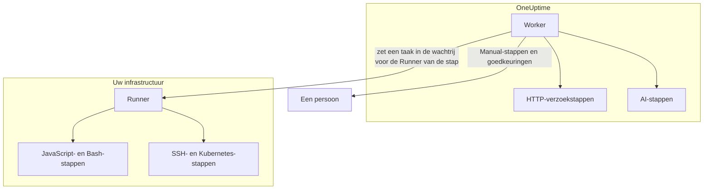

# Runbook-configuratie & veiligheid

Dit is het naslagwerk voor beheerders en securityreviewers: waar elk soort stap loopt, aan welke limieten en time-outs een stap gebonden is, wie wat mag en hoe runbooks zijn beveiligd.

:::cards
- [Waar elk staptype loopt](#waar-elk-staptype-loopt): De Worker, een Runner of een persoon.
- [Uitvoerlimieten en time-outs](#uitvoerlimieten-en-time-outs): Elke limiet waaraan een stap gebonden is.
- [Machtigingen](#machtigingen): Gedetailleerde machtigingen, de drie runbook-rollen en welke runbooks een rol bereikt.
- [Beveiligingsnotities](#beveiligingsnotities): Sandboxing, netwerktoegang en authenticatie van Runners.
:::

## Waar elk staptype loopt

| Staptype | Loopt op | Hoe |
| --- | --- | --- |
| Manual | Een persoon | De uitvoering wacht tot iemand de stap voltooit of overslaat. |
| JavaScript | Een Runner | In een `isolated-vm`-sandbox. |
| HTTP request | De OneUptime Worker | Een uitgaande HTTP-aanroep. |
| Bash | Een Runner | `bash -c <script>`. |
| SSH | Een Runner | Een SSH-verbinding, met een [inloggegeven](/docs/runbooks/credentials). |
| Kubernetes | Een Runner | Een aanroep van de API-server van het cluster, met een inloggegeven. |
| AI | De OneUptime Worker | Een aanroep van de LLM-provider van het project. |

## Hoe Runner-stappen worden verstuurd

JavaScript-, Bash-, SSH- en Kubernetes-stappen **lopen nooit op de OneUptime Worker**. Ze worden als taken verstuurd naar een bepaalde [runbook-agent](/docs/runbooks/agents): een klein proces dat u op een host in uw eigen infrastructuur installeert.

Het verzendmodel:

1. Wie de runbook-stap schrijft, kiest bij het schrijven een Runner uit de vervolgkeuzelijst.
2. Wanneer de stap loopt, voegt de Worker een rij toe aan `RunnerJob` met `targetAgentId` gelijk aan het ID van die Runner en status `Pending`.
3. Precies die Runner (en alleen die) pakt de taak atomair op, voert hem lokaal uit — Bash via `bash -c <script>`, JavaScript in een `isolated-vm`-sandbox, SSH en Kubernetes met het inloggegeven van de stap — en meldt het resultaat terug.
4. De Worker zet het runbook voort met het resultaat.

De omgevingsvlag `RUNBOOK_BASH_ENABLED` bestaat niet meer. Of deze stappen in een installatie werken, hangt er alleen van af of het project een verbonden Runner heeft met **Voert Runbooks uit** aan.

## Uitvoerlimieten en time-outs

| Limiet | Waarde | Geldt voor |
| --- | --- | --- |
| Uitvoer per stap | **50 KB**. Langere uitvoer wordt afgekapt met een markering. | Elke geautomatiseerde stap |
| Execution timeout | Standaard **30 seconden** | JavaScript-, Bash-, SSH- en Kubernetes-stappen |
| Request timeout | Standaard **30 seconden** | HTTP-verzoekstappen |
| Claim timeout | Standaard **2 minuten**: hoe lang de Worker wacht tot de gekozen Runner de taak oppakt voordat hij die laat mislukken | JavaScript-, Bash-, SSH- en Kubernetes-stappen |
| Bereik van time-outs | **1 seconde tot 1 uur** | Elke time-out |
| Wachten op een persoon | Geen limiet | Manual-stappen en goedkeuringen |

Stel de time-outs per stap in op de pagina **Stappen** van het runbook; laat een veld leeg om de standaard te houden. Een waarde buiten het bereik wordt bij het uitvoeren van de stap begrensd, zodat een verkeerd getypte configuratie de time-out niet kan uitschakelen en geen Worker-slot eindeloos kan bezetten.

## Machtigingen

Runbook-machtigingen staan in de machtigingsgroep `Runbook`:

- `CreateRunbook`, `EditRunbook`, `DeleteRunbook`, `ReadRunbook` — runbook-sjablonen beheren.
- `CreateRunbookExecution`, `EditRunbookExecution`, `DeleteRunbookExecution`, `ReadRunbookExecution` — uitvoeringen starten, afvinken, verwijderen en lezen.
- `CreateRunbookRule`, `EditRunbookRule`, `DeleteRunbookRule`, `ReadRunbookRule` — regels voor automatisch starten beheren.
- `CreateRunner`, `EditRunner`, `DeleteRunner`, `ReadRunner` — Runners beheren die stappen in uw eigen infrastructuur uitvoeren. (Vóór de hernoeming naar Runner heetten ze `*RunbookAgent`; bestaande toekenningen zijn gemigreerd, dus er hoeft niets opnieuw te worden toegewezen.)
- `RunbookAdmin`, `RunbookMember`, `RunbookViewer` (rollen) — `RunbookAdmin` bouwt runbooks, hun regels en de Runners waarop ze lopen, en voert ze uit. `RunbookMember` opent runbooks en hun uitvoeringen en voert ze uit — start een uitvoering, voltooit of slaat stappen over en annuleert haar — maar maakt, wijzigt en verwijdert geen runbook of Runner. `RunbookViewer` leest runbooks en hun uitvoeringen en voert niets uit. `RunbookAdmin` bundelt alle gedetailleerde machtigingen hierboven.

Een rol voert de runbooks uit die binnen zijn bereik vallen. Een toekenning van `RunbookMember`, `RunbookAdmin` of `ProjectMember` die tot bepaalde labels is beperkt, start en bevordert uitvoeringen van de runbooks met die labels, een toekenning beperkt tot **Owned** die van de runbooks die zijn team bezit, en de blokkering van een label door een team neemt die runbooks weg. `CreateRunbookExecution` en `EditRunbookExecution` gaan over uitvoeringen, die geen labels dragen, en bereiken dus elk runbook in het project. Het goedkeuren van een herstelvoorstel dat een runbook start, wordt op dezelfde manier gecontroleerd.

Inloggegevens en geheimen vallen buiten `RunbookAdmin`. Ze beheren vereist `ProjectOwner` of `ProjectAdmin`, of de machtigingen `CreateRunbookCredential`, `EditRunbookCredential`, `DeleteRunbookCredential`, `ReadRunbookCredential` en `CreateRunbookSecret`, `EditRunbookSecret`, `DeleteRunbookSecret`, `ReadRunbookSecret`. Zie [Runbook-inloggegevens](/docs/runbooks/credentials).

Ook de eigenaars- en labelregels onder **Runbooks → Instellingen** vallen buiten `RunbookAdmin`. Ze beheren vereist `ProjectOwner` of `ProjectAdmin`, of de machtigingen `CreateRunbookOwnerRule` en `CreateRunbookLabelRule` met hun tegenhangers voor bewerken, verwijderen en lezen.

Hoe rollen en gedetailleerde machtigingen samengaan, leest u in [Gebruikers, teams en machtigingen](/docs/permissions/index).

## Wachtrij & worker

Runbook-uitvoeringen lopen op de BullMQ-wachtrij `Runbook`. Elk Worker-proces voert maximaal 25 uitvoeringen tegelijk uit; het aantal ligt vast in de code, niet in een omgevingsvariabele.

Wanneer een handmatige stap via de API wordt afgevinkt, wordt de uitvoering opnieuw in de wachtrij gezet om bij de volgende stap verder te gaan. Ze wacht als `Scheduled` tot een Worker haar weer oppakt, en een uitvoering in de wachtrij mislukt nooit door het wachten.

## Beveiligingsnotities

- **JavaScript, Bash, SSH en Kubernetes** lopen op een Runner-host die u beheert, niet op de OneUptime Worker. JavaScript loopt in een eigen `isolated-vm`-isolaat met 128 MB geheugen en zonder toegang tot het bestandssysteem of de processen van de Runner; het kan HTTP-verzoeken doen met `axios`, maar verzoeken naar privénetwerken en loopback- en link-local-adressen worden geweigerd. Bash loopt via `bash -c`, met een time-out die op de Runner wordt afgedwongen.
- **HTTP-stappen** gebruiken een ruime statusvalidatie, zodat een 4xx- of 5xx-antwoord als mislukte stap wordt vastgelegd in plaats van een uitzondering te gooien, en de vastgelegde uitvoer weerspiegelt wat de andere kant echt teruggaf. Doorverwijzingen worden niet gevolgd. De Worker roept nooit loopback- of link-local-adressen aan, zoals een metadata-endpoint van een cloud; in OneUptime Cloud weigert hij ook privénetwerkadressen, en een zelf gehoste OneUptime weigert ze met `DATA_SOURCE_BLOCK_PRIVATE_ADDRESSES=true`.
- **AI-stappen** zien nooit privénotities van incidenten of berichten uit Slack en Microsoft Teams, en de uitvoer van eerdere stappen wordt doorzocht op geheimen, die worden afgeschermd voordat ze het model bereiken. Ingesloten afbeeldingen en lange gecodeerde gegevens blijven buiten de prompt. Zie [AI](/docs/runbooks/authoring#ai).
- **Runner-authenticatie** gebeurt met een ID en geheime sleutel, als omgevingsvariabelen op de Runner-container ingesteld. Aan de serverkant komt de geldende identiteit van de Runner uit de databaserij die hoort bij het getoonde ID en de sleutel: een client kan zich zelfs met een gelekte sleutel niet als een andere Runner voordoen.
- **Inloggegevens en geheimen** worden versleuteld opgeslagen, nooit door de API teruggegeven en alleen overhandigd aan de Runners waaraan ze zijn toegewezen, wanneer die een stap oppakken.

## Databasetabellen

| Tabel | Wat erin staat |
| --- | --- |
| `Runbook` | Het sjabloon: naam, slug, beschrijving, `isEnabled`, labels en de stappen als JSON. |
| `RunbookExecution` | Eén rij per uitvoering, met de optionele vreemde sleutels `incidentId`, `alertId` en `scheduledMaintenanceId` en een JSON-array `stepExecutions` die de stappen en de toestand van elke stap vastlegt. |
| `RunbookRule` | Regels voor automatisch starten, met een onderscheidingsveld `triggerEntityType` (Incident, Alert, ScheduledMaintenance), een veel-op-veel-relatie met de te starten runbooks, en waarop ze matchen: een JSON-kolom `criteria` (de voorwaarden) plus veel-op-veel-koppelingen met monitoren, incidenternsten, waarschuwingsernsten, labels en monitorlabels, en patronen voor titel, beschrijving, monitornaam en monitorbeschrijving. |
| `Runner` | Eén rij per geïnstalleerde Runner: naam, geheime sleutel, `lastAlive`, `connectionStatus`, hostinformatie en mogelijkheden. |
| `RunnerJob` | Eén rij per stap die naar een Runner is verstuurd: `targetAgentId` (de Runner die de schrijver van de stap koos), staptype, script of payload, status (`Pending` → `Claimed` → `Running` → `Succeeded`, `Failed`, `TimedOut` of `Cancelled`), claimdeadline, lease, uitvoer en exitcode. |
| `RunbookCredential` | SSH- en Kubernetes-inloggegevens, met versleutelde geheime velden, en de Runners waaraan ze zijn toegewezen. |
| `RunbookSecret` | Runbook-geheimen, versleuteld, en de Runners die ze mogen ontvangen. |

## Tips voor beheer

- **Zorg dat de Runner die u bij een stap kiest gezond is.** Hebt u redundantie nodig, draai dan een tweede Runner en verdeel de stappen over beide, of houd een reserve-runbook bij dat op de andere Runner is gericht.
- **Leg URL's vast, geen blobs.** Maakt een stap meer dan een paar KB uitvoer, schrijf die dan naar objectopslag of uw loggingstack en geef de URL terug.
- **Idempotentie telt.** Een HTTP-verzoek- of AI-stap loopt opnieuw als de Worker midden in de stap herstart en de uitvoering wordt hervat. Een stap op een Runner wordt per uitvoering hooguit één keer verstuurd, maar een script kan vóór een fout deels zijn gelopen, en misschien voert u het runbook opnieuw uit. Ontwerp stappen zo dat ze veilig opnieuw kunnen lopen.

## Volgende stappen

:::cards
- [Runbook-agenten](/docs/runbooks/agents): Runners installeren, beheren en problemen oplossen.
- [Runbook-inloggegevens](/docs/runbooks/credentials): Beheerde SSH- en Kubernetes-toegang, en geheimen voor scripts.
- [Gebruikers, teams en machtigingen](/docs/permissions/index): Hoe rollen, labels en teams bepalen wie wat uitvoert.
:::
