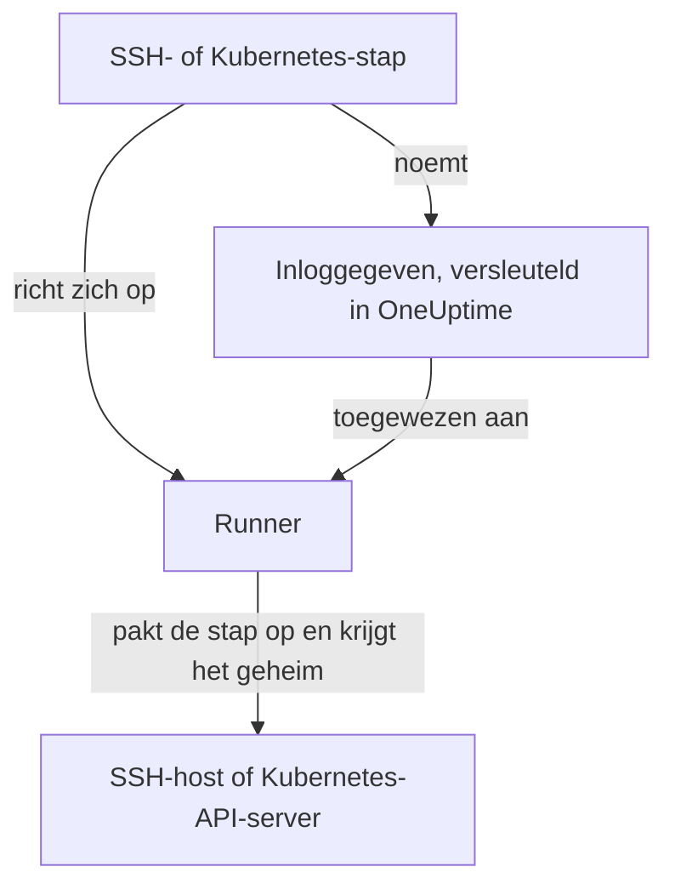

# Runbook-inloggegevens

Een inloggegeven is de manier waarop een runbook iets bereikt dat **niet** de eigen host van de Runner is: een server via SSH of een Kubernetes-cluster. Zonder inloggegeven betekent "herstart de dienst" dat u een shellscript schrijft en met de hand een sleutel of kubeconfig op de host van de Runner zet, waar die buiten de controle van OneUptime op schijf staat. Een inloggegeven is diezelfde toegang als beheerd object: versleuteld opgeslagen, toegewezen aan bepaalde Runners en vanuit een stap bij naam aangesproken.

Beheer ze onder **Runbooks → Runbook-agenten → Inloggegevens**.

:::cards
- [Een inloggegeven maken](#een-inloggegeven-maken): De toegang en de Runners die het mogen gebruiken.
- [Minimale rechten aan de andere kant](#minimale-rechten-aan-de-andere-kant): Beperken wat de sleutel of het token kan doen.
- [Geheimen voor scripts](#geheimen-voor-scripts): Een Bash- of JavaScript-script een wachtwoord of token geven.
:::

## Hoe een inloggegeven wordt gebruikt



Een SSH- of Kubernetes-stap noemt een inloggegeven en een Runner. Wanneer die Runner de stap oppakt, controleert OneUptime of het inloggegeven aan hem is toegewezen, ontsleutelt het geheim en geeft het alleen mee in het antwoord op die claim. Het geheim wordt nooit bij de taak opgeslagen en is nooit via de API leesbaar.

## Voordat u begint

- **Een rol die inloggegevens beheert.** Project Owner en Project Admin, of iedereen met de machtiging **Create Runbook Credential**. De rol Runbook Admin bevat die niet. Een SSH-inloggegeven toewijzen aan een Runner die de opdrachten van OneUptime AI uitvoert, vereist ook **Read Runbook Credential**; zie [Runners die de opdrachten van OneUptime AI uitvoeren](#runners-die-de-opdrachten-van-oneuptime-ai-uitvoeren).
- **Een abonnement dat ze bevat.** In OneUptime Cloud vereisen runbook-inloggegevens het abonnement **Growth** of hoger.
- **Een [Runner](/docs/runbooks/agents)** die de host of de API-server van het cluster via het netwerk bereikt.

## Een inloggegeven maken

:::steps
### Inloggegevens openen

Open **Runbooks → Runbook-agenten → Inloggegevens** en klik op **Runbook Credential aanmaken**.

### Een naam en type kiezen

Voer in de stap **Credential** een **Naam** in, zoals `prod-cluster`, een optionele **Beschrijving** en het **Type**: **SSH** of **Kubernetes**. Het type kan later niet worden gewijzigd; maak in plaats daarvan een nieuw inloggegeven.

### De toegang invoeren

:::tabs
@tab SSH
Voer onder **SSH-host** de **Hostnaam**, de **Poort** (22 als u die leeg laat) en de **Gebruikersnaam** in. Plak onder **SSH-authenticatie** een **Private Key (PEM)**, met de bijbehorende **Private Key Passphrase** als die er is, of voer een **Wachtwoord** in voor een host zonder sleuteltoegang. Een sleutel is de betere keuze als u kunt kiezen.
@tab Kubernetes
Voer onder **Kubernetes** de **API Server URL** in, zoals `https://10.0.0.1:6443`, het **Service Account Token** en het **CA Certificate (PEM)**, zodat de Runner de API-server kan verifiëren. Laat de CA alleen leeg als de API-server een certificaat toont dat de Runner al vertrouwt.
:::

### Aan Runners toewijzen

Kies in de stap **Runbook-agenten** de Runners die het inloggegeven mogen gebruiken en klik dan op **Runbook Credential aanmaken**. Een inloggegeven dat aan geen enkele Runner is toegewezen, kan door geen enkele stap worden gebruikt.

### In een stap gebruiken

Kies in een [SSH- of Kubernetes-stap](/docs/runbooks/authoring#staptypen) een van die Runners en dan het inloggegeven onder **Credential**. Een stap biedt alleen inloggegevens van zijn eigen type aan, en een stap opslaan die een inloggegeven noemt, vereist de machtiging om runbook-inloggegevens te lezen.
:::

## Wat er wordt opgeslagen

| Type | Velden |
| --- | --- |
| SSH | Hostnaam, poort (standaard 22), gebruikersnaam, en een PEM-privésleutel (met optionele wachtwoordzin) of een wachtwoord. |
| Kubernetes | URL van de API-server, een serviceaccounttoken en het CA-certificaat van het cluster. |

## Geheime waarden zijn alleen schrijfbaar

Privésleutels, wachtwoordzinnen, wachtwoorden en serviceaccounttokens worden versleuteld opgeslagen en de API **geeft ze nooit terug**: niet aan het dashboard, niet aan een workflow, niet aan een export. De tabel kan u laten zien wat een inloggegeven *is* zonder ooit te laten zien wat het bevat.

Er is dus geen "bekijken" voor een geheime waarde, alleen "vervangen": een waarde opnieuw invoeren is de manier om hem te vervangen. Bent u het origineel kwijt, geef dan op het doelsysteem een nieuwe sleutel uit en werk het inloggegeven bij.

## Een inloggegeven aan Runners toewijzen

Een inloggegeven is alleen bruikbaar voor de Runners waaraan u het toewijst, en een stap moet op een van die Runners gericht zijn. Noemt een stap een inloggegeven dat niet aan zijn Runner is toegewezen, dan **mislukt de stap in plaats van te lopen**: een Runner die stil niets doet, ziet er precies zo uit als een die werkte.

De toewijzing is de toegangsgrens, dus houd haar smal: een Runner die alleen ooit één cluster herstart, heeft de SSH-sleutel van uw databasehosts niet nodig.

### Runners die de opdrachten van OneUptime AI uitvoeren

Op een Runner met **Voert AI-herstelopdrachten uit** aan kiest OneUptime AI uit de SSH-inloggegevens die aan de Runner zijn toegewezen voor de opdrachten die het daar uitvoert. Een SSH-inloggegeven bereikt zo'n Runner dus alleen via iemand die runbook-inloggegevens mag lezen (**Read Runbook Credential**, of een Project Owner of Project Admin), wat er ook als eerste wordt opgeslagen:

- **Het inloggegeven toewijzen.** Een SSH-inloggegeven met zo'n Runner maken, of zo'n Runner aan een inloggegeven toevoegen, vereist die machtiging. Zonder de machtiging wordt het opslaan geweigerd en wordt de Runner genoemd: wijs het inloggegeven toe aan Runners die geen AI-herstelopdrachten uitvoeren, of vraag iemand met de machtiging om het toe te wijzen.
- **De schakelaar aanzetten.** **Voert AI-herstelopdrachten uit** aanzetten voor een Runner met SSH-inloggegevens vereist dezelfde machtiging.

Runners van een inloggegeven verwijderen, een inloggegeven opslaan met de Runners die het al heeft, en Kubernetes-inloggegevens vragen niets extra's: de kubectl-opdrachten van OneUptime AI lopen met het inloggegeven dat aan hun cluster is gekoppeld. Toewijzingen van inloggegevens en het aanzetten van de schakelaar door iemand zonder die machtiging worden in een project één voor één opgeslagen, zodat de twee hun controles niet samen kunnen doorstaan; een opslag die binnenkomt terwijl een andere bezig is, wacht daarop, en als dat te lang duurt, wordt hij geweigerd met *Try again in a moment*. Sla opnieuw op.

De stappen van een workflow handelen als Project Admin, maar krijgen het leesrecht op runbook-inloggegevens van een Project Admin niet geleend: een stap heeft het alleen als de persoon die de stappen van de workflow het laatst opsloeg het heeft. Zie [Wat workflowstappen mogen](/docs/workflows/configuration#wat-workflowstappen-mogen).

## Minimale rechten aan de andere kant

OneUptime kan niet beperken wat uw inloggegeven op het doelsysteem mag doen: dat is de taak van het doelsysteem, en het is de moeite waard:

- **SSH** — kies een sleutel boven een wachtwoord, geef de gebruiker alleen de opdrachten die hij nodig heeft (een afgedwongen opdracht of een beperkte shell waar dat kan) en hergebruik niet de persoonlijke sleutel van een beheerder.
- **Kubernetes** — koppel het serviceaccount aan een Role die `patch` toestaat op precies de workloads die uw runbooks raken, in precies de namespaces waarin ze draaien. **Restart workload** wijzigt de workload zelf, en **Scale workload** wijzigt de `scale`-subresource ervan: meer is niet nodig.

Bijvoorbeeld een serviceaccount dat één Deployment mag herstarten en schalen, en verder niets:

```yaml title="oneuptime-runbooks-rbac.yaml"
apiVersion: v1
kind: ServiceAccount
metadata:
  name: oneuptime-runbooks
  namespace: checkout
---
apiVersion: rbac.authorization.k8s.io/v1
kind: Role
metadata:
  name: oneuptime-runbooks
  namespace: checkout
rules:
  # Restart workload: patches the Deployment's pod template.
  - apiGroups: ["apps"]
    resources: ["deployments"]
    resourceNames: ["checkout-api"]
    verbs: ["patch"]
  # Scale workload: patches the Deployment's scale subresource.
  - apiGroups: ["apps"]
    resources: ["deployments/scale"]
    resourceNames: ["checkout-api"]
    verbs: ["patch"]
---
apiVersion: rbac.authorization.k8s.io/v1
kind: RoleBinding
metadata:
  name: oneuptime-runbooks
  namespace: checkout
subjects:
  - kind: ServiceAccount
    name: oneuptime-runbooks
    namespace: checkout
roleRef:
  apiGroup: rbac.authorization.k8s.io
  kind: Role
  name: oneuptime-runbooks
```

Gebruik voor een StatefulSet of DaemonSet in plaats daarvan `statefulsets` of `daemonsets`. Een DaemonSet kan niet worden geschaald, dus het heeft geen `scale`-regel nodig.

## Geheimen voor scripts

Bash- en JavaScript-stappen hebben geen veld **Credential**. Om een script een wachtwoord, token of API-sleutel te geven zonder die in het runbook te schrijven, slaat u hem op als **runbook-geheim**. Geheimen worden beheerd onder **Runbooks → Instellingen → Geheimen**, door Project Owners en Project Admins of met de machtiging **Create Runbook Secret**.

:::steps
### Het geheim maken

Klik op **Runbook Secret aanmaken**. Voer in de stap **Geheim** een **Naam** in (letters, cijfers, koppeltekens en underscores), een optionele **Beschrijving** en de **Geheime waarde**. Kies in de stap **Toegang** de Runners onder **Runbook-agents die toegang hebben tot dit geheim**.

### Het in een script gebruiken

Schrijf `{{runbookSecrets.NAME}}` waar de waarde moet staan:

```bash
curl -s -X POST \
  -H "Authorization: Bearer {{runbookSecrets.CDN_API_TOKEN}}" \
  "https://api.cdn.example.com/v1/purge"
```

Wanneer een Runner waaraan het geheim is toegewezen de stap oppakt, krijgt hij het script met de waarde al ingevuld.
:::

Net als de geheime velden van een inloggegeven wordt de waarde van een geheim versleuteld opgeslagen en geeft de API die nooit terug: **Geheime waarde bijwerken** vervangt haar. In OneUptime Cloud vereisen runbook-geheimen ook het abonnement **Growth** of hoger.

| | Inloggegeven | Runbook-geheim |
| --- | --- | --- |
| Gebruikt door | SSH- en Kubernetes-stappen | Bash- en JavaScript-scripts |
| Bevat | Een host en zijn sleutel, of de URL en het token van een cluster | Elke afzonderlijke waarde |
| Beheerd onder | **Runbooks → Runbook-agenten → Inloggegevens** | **Runbooks → Instellingen → Geheimen** |
| Bereikt de Runner | In het antwoord op de claim van een stap die het noemt | Ingevuld in het script van de stap die hij oppakt |
| Terug te lezen via de API | Alleen de niet-geheime velden | Nooit de waarde |

## Wie ze kan zien

Inloggegevens maken, bewerken en verwijderen vereist de machtigingen voor runbook-inloggegevens (of Project Owner/Admin). Een inloggegeven lezen toont alleen de niet-geheime velden.

Let op: de **agentsleutel** van een Runner staat gelijk aan de inloggegevens die aan die Runner zijn toegewezen: alles wat de sleutel heeft, kan als die Runner werk oppakken en inloggegevens ontvangen. Daarom zijn agentsleutels alleen leesbaar voor Project Owners, Project Admins en Runbook Admins: behandel ze zoals u de inloggegevens zelf zou behandelen.

## Volgende stappen

:::cards
- [Een runbook schrijven](/docs/runbooks/authoring): De SSH- en Kubernetes-stappen schrijven die een inloggegeven gebruiken.
- [Runbook-agenten](/docs/runbooks/agents): De Runner installeren waaraan een inloggegeven wordt toegewezen.
- [Runbook-configuratie & veiligheid](/docs/runbooks/configuration): Machtigingen en beveiliging voor de hele runbook-stack.
:::
