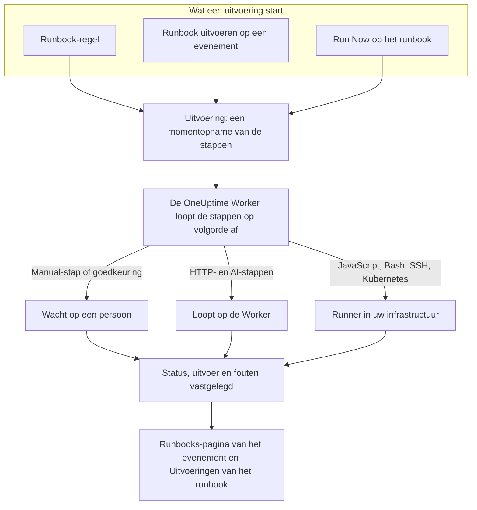

# Runbooks – Overzicht

Een runbook is een herbruikbare responsprocedure: een geordende lijst van handmatige en geautomatiseerde stappen die u uitvoert op een incident, een waarschuwing of een gepland onderhoudsevenement. Het maakt van de thread "wat doen we nu?" een checklist die iedereen met dienst om 3 uur 's nachts kan volgen, met de scripts, API-aanroepen en goedkeuringen al uitgeschreven. Runbooks zijn bedoeld voor de engineers met dienst die op incidenten reageren en voor de platformteams die die respons automatiseren.

:::cards
- [Een runbook schrijven](/docs/runbooks/authoring): Een runbook maken en de stappen schrijven.
- [Runbook-regels](/docs/runbooks/rules): Runbooks starten bij nieuwe incidenten, waarschuwingen en onderhoudsevenementen.
- [Een runbook uitvoeren](/docs/runbooks/running): Een uitvoering starten, de stappen voltooien en goedkeuren, de uitvoering annuleren.
- [Runbook-agenten](/docs/runbooks/agents): De Runner installeren die uw scripts in uw eigen infrastructuur uitvoert.
:::

## Hoe een runbook loopt



Elke run van een runbook is een **uitvoering**. Bij de start worden de stappen van het runbook erop gekopieerd en loopt OneUptime ze op volgorde af. Een Manual-stap, of een stap die goedkeuring nodig heeft, pauzeert de uitvoering tot iemand handelt.

HTTP- en AI-stappen lopen op de OneUptime Worker. JavaScript-, Bash-, SSH- en Kubernetes-stappen lopen op een [Runner](/docs/runbooks/agents) die u in uw eigen infrastructuur installeert, zodat uw scripts nooit op de servers van OneUptime draaien. De status, uitvoer en foutmelding van elke stap worden vastgelegd op de uitvoering, die bij het incident, de waarschuwing of het evenement blijft waarvoor ze liep.

## Kernbegrippen

| Begrip | Betekenis |
| --- | --- |
| **Runbook** | Het sjabloon. Een benoemde, herbruikbare procedure met een geordende lijst stappen en een schakelaar **Dit runbook uitvoeren**. |
| **Stap** | Eén onderdeel van een runbook. Een stap heeft een type (Manual, JavaScript, HTTP request, Bash, SSH, Kubernetes of AI), een titel, een beschrijving en typespecifieke instellingen. |
| **Runbook-regel** | Een regel die automatisch een of meer runbooks koppelt aan incidenten, waarschuwingen of geplande onderhoudsevenementen die aan de voorwaarden voldoen: hun monitoren, ernst, labels, monitorlabels, titel of beschrijving. |
| **Uitvoering** | Eén run van een runbook. Ontstaat wanneer een regel afgaat, wanneer iemand op een evenement op **Runbook uitvoeren** klikt, of wanneer iemand op het runbook zelf op **Run Now** klikt. Bevat een momentopname van de stappen en de status en uitvoer van elke stap. |
| **Momentopname** | De bevroren kopie van de stappen van het runbook die op elke uitvoering staat. U kunt het runbook later bewerken zonder de geschiedenis van eerdere uitvoeringen te herschrijven. |
| **Runner** | Een kleine agent die u op een host in uw eigen infrastructuur draait. Hij voert de JavaScript-, Bash-, SSH- en Kubernetes-stappen uit die hem noemen. Ook wel runbook-agent genoemd. |
| **Inloggegeven** | Beheerde SSH- of Kubernetes-toegang die SSH- en Kubernetes-stappen gebruiken. Versleuteld opgeslagen en alleen overhandigd aan de Runners waaraan u het toewijst. |
| **Geheim** | Eén waarde, zoals een API-token, die een Bash- of JavaScript-script gebruikt als `{{runbookSecrets.NAME}}`. Versleuteld opgeslagen en alleen overhandigd aan de Runners waaraan u het toewijst. |

## Staptypen

Kies voor elke stap het type dat past. [Een runbook schrijven](/docs/runbooks/authoring) beschrijft de instellingen van elk type.

| Staptype | Loopt op | Gebruik het als… | Voorbeeld |
| --- | --- | --- | --- |
| **Manual** | Een persoon | Iemand iets moet controleren, een afweging moet maken of moet handelen waar OneUptime dat niet kan. | "Bevestig dat het verkeer naar de secundaire regio is verplaatst." |
| **JavaScript** | Een Runner | U een kleine, afgebakende berekening nodig hebt, in een sandbox. | De replicatievertraging berekenen en beslissen of u doorgaat. |
| **HTTP request** | De OneUptime Worker | U een bestaande API aanroept: een cloudprovider, PagerDuty, een Slack-webhook, uw eigen dienst. | `POST` naar uw failover-orchestrator. |
| **Bash** | Een Runner | U shellopdrachten op uw eigen infrastructuur nodig hebt. | `kubectl rollout restart` of een herstelscript uitvoeren. |
| **SSH** | Een Runner | U één opdracht op een externe host nodig hebt, met een beheerd SSH-inloggegeven. | Een dienst op een webserver herstarten. |
| **Kubernetes** | Een Runner | U een Deployment, StatefulSet of DaemonSet moet herstarten of schalen. | `checkout-api` in `production` herstarten. |
| **AI** | De OneUptime Worker | U halverwege de uitvoering een analyse, samenvatting of oordeel wilt van de LLM-provider van uw project. | "Bekijk de diagnose hierboven. Is een failover veilig?" |

Een runbook kan ze allemaal combineren. De kracht van runbooks zit in het afwisselen van menselijke controles met automatisering en AI-analyse.

## Wat een uitvoering start

| Hoe | Waar | De uitvoering hangt aan |
| --- | --- | --- |
| Een runbook-regel | **Incidenten**, **Waarschuwingen** of **Geplande onderhoud** → **Regels** → **Runbook-regels** | Het nieuwe incident, de nieuwe waarschuwing of het nieuwe evenement |
| **Runbook uitvoeren** | De pagina **Runbooks** van een incident, een waarschuwing of een gepland onderhoudsevenement | Dat evenement |
| **Run Now** | De pagina **Overzicht** van het runbook | Niets: een losse uitvoering |
| Een regel voor automatisch herstel | Zie [AI SRE](/docs/ai/ai-sre) | Het incident of de waarschuwing |

Een runbook waarvan de schakelaar **Dit runbook uitvoeren** op de pagina **Instellingen** uit staat, wordt via geen van deze wegen gestart. Uitvoeringen die al begonnen zijn, lopen door.

## Waar runbooks in het dashboard staan

Runbooks staat onder **Producten**, in de groep **Dashboards & automatisering**.

| Pagina | Wat u daar doet |
| --- | --- |
| **Producten → Runbooks** | Runbooks bekijken, maken en openen. |
| De **Stappen** van een runbook | De stappen schrijven en herordenen, dan **Save Steps**. |
| Het **Overzicht** van een runbook | De laatste uitvoering en de resultaten zien, en op **Run Now** klikken. |
| De **Uitvoeringen** van een runbook | Elke uitvoering van dit runbook, gefilterd op status of startdatum. |
| De **Eigenaren** van een runbook | De mensen en teams toevoegen die ervoor verantwoordelijk zijn. |
| De **Instellingen** van een runbook | **Dit runbook uitvoeren** uitschakelen zonder het runbook te verwijderen. |
| **Runbooks → Uitvoeringen** | Elke uitvoering van elk runbook in het project. |
| **Runbooks → Runbook-agenten** en **Runbooks → Runbook-agenten → Inloggegevens** | [Runners](/docs/runbooks/agents) installeren en [inloggegevens](/docs/runbooks/credentials) beheren. |
| **Runbooks → Instellingen** | [Geheimen](/docs/runbooks/credentials#geheimen-voor-scripts) voor scripts beheren, en de **Eigenaarsregels** en **Labelregels** die eigenaren en labels aan nieuwe runbooks toevoegen. |
| **Incidenten / Waarschuwingen / Geplande onderhoud → Regels → Runbook-regels** | De regels maken die runbooks automatisch starten. |
| Een incident, waarschuwing of onderhoudsevenement → **Runbooks** | De gekoppelde uitvoeringen zien, en op **Runbook uitvoeren** klikken om er een te starten. |

## Een uitgewerkt voorbeeld

Stel dat u wilt dat elk incident met "db-primary" in de titel een database-failover-runbook van vijf stappen start.

:::steps
### Het runbook maken

Klik onder **Runbooks** op **Runbook aanmaken** en noem het "DB primary failover". Open het, ga naar **Stappen**, voeg deze stappen toe en klik dan op **Save Steps**:

| # | Type | Titel |
| --- | --- | --- |
| 1 | JavaScript | Replicatievertraging vóór de failover vastleggen |
| 2 | Manual | In het DBA-dashboard bevestigen dat de replica gezond is |
| 3 | HTTP request | `POST` naar de failover-orchestrator |
| 4 | Manual | Controleren dat schrijfacties naar de nieuwe primary gaan |
| 5 | HTTP request | Het sein veilig plaatsen in `#db-incidents` in Slack |

### Een regel toevoegen

Maak onder **Incidenten → Regels → Runbook-regels** een regel met één voorwaarde en het runbook dat moet starten:

```text
Conditions:  Incident Title starts with db-primary
Runbooks:    [DB primary failover]
```

### Laten lopen

Een monitor opent incident `INC-4821 · db-primary connection timeout`. De regel komt overeen en er start een uitvoering:

- Stap 1 (JavaScript) loopt op de Runner die u ervoor hebt gekozen. De returnwaarde, zoals `{ lagMs: 412 }`, wordt vastgelegd.
- Stap 2 (Manual) pauzeert de uitvoering, die **Wacht op u** toont. De persoon met dienst controleert het dashboard en klikt op **Mark complete**.
- Stap 3 (HTTP request) loopt, en het antwoord op de `POST` wordt vastgelegd.
- Stap 4 (Manual) pauzeert de uitvoering opnieuw tot iemand de stap voltooit.
- Stap 5 (HTTP request) loopt, en de uitvoering staat op **Voltooid**.

### Terugkijken

De uitvoering blijft op de pagina **Runbooks** van het incident. Wanneer u de postmortem schrijft, zijn de uitvoer, fouten en timing van elke stap één klik verwijderd.
:::

## Veelvoorkomende toepassingen

- **Database-failover**: de toestand vastleggen met JavaScript, de DBA met dienst de gezondheid van de replica laten bevestigen (Manual), de orchestrator aanroepen (HTTP request), DNS bevestigen (Manual), het sein veilig plaatsen (HTTP request).
- **Cache legen**: één HTTP-verzoek, daarna een Manual-stap "bevestig dat de cache-hitrate herstelt".
- **Incident met klantimpact**: Manual "plaats een update op de statuspagina", een HTTP-verzoek om het supportteam te waarschuwen, JavaScript om de lijst met getroffen accounts op te halen.
- **Voorcontrole van gepland onderhoud**: metrics vastleggen, het wijzigingsvenster met belanghebbenden bevestigen (Manual), de onderhoudsmodus op de load balancer inschakelen (HTTP request).
- **Eerst diagnosticeren, dan oplossen**: een Bash-stap verzamelt diagnosegegevens, een AI-stap met **Goedkeuring vereisen** leest ze en stelt een oplossing voor, en een Kubernetes-stap herstart de workload pas nadat een persoon heeft goedgekeurd.
- **Hygiëne die altijd loopt**: een regel zonder voorwaarden die bij elk incident de systeemtoestand vastlegt, voor de postmortem.

## Hoe runbooks in de rest van OneUptime passen

- **Monitoren** openen incidenten en waarschuwingen, en **runbook-regels** maken daar runbook-uitvoeringen van: detecteren, triggeren, reageren, vastleggen.
- **[Dienstbeleid](/docs/on-call/schedules)** bepaalt wie wordt opgeroepen. Runbooks bepalen wat die persoon doet zodra die wakker is.
- **[Werkruimteverbindingen](/docs/workspace-connections/slack)** zoals Slack en Microsoft Teams zijn logische doelen voor HTTP-verzoekstappen die updates plaatsen.
- **[Statuspagina's](/docs/status-pages/index)** worden vaak bijgewerkt als Manual-stap van een runbook richting klanten.

## Volgende stappen

:::cards
- [Een runbook schrijven](/docs/runbooks/authoring): Uw eerste runbook en de stappen maken.
- [Runbook-agenten](/docs/runbooks/agents): Een Runner installeren voordat u een JavaScript-, Bash-, SSH- of Kubernetes-stap schrijft.
- [Runbook-regels](/docs/runbooks/rules): Runbooks automatisch starten wanneer incidenten ontstaan.
- [Runbook-configuratie & veiligheid](/docs/runbooks/configuration): Limieten, time-outs, machtigingen en beveiliging.
:::
