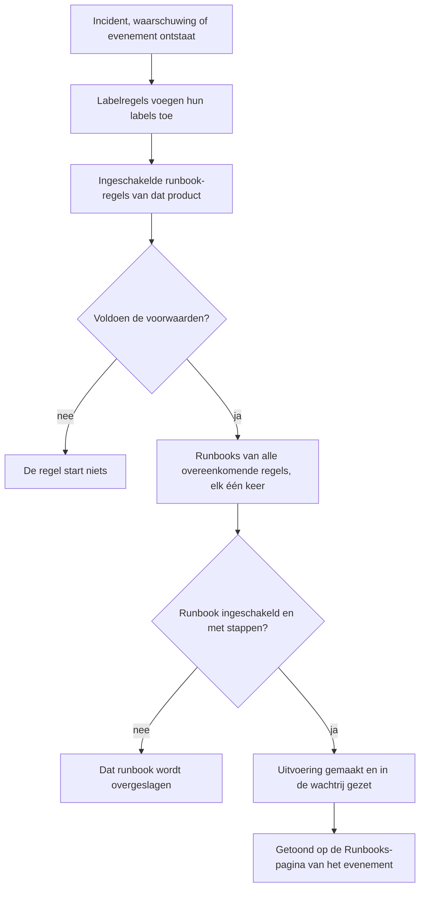

# Runbook-regels

Runbook-regels starten runbooks automatisch wanneer een **incident**, een **waarschuwing** of een **gepland onderhoudsevenement** ontstaat, zodat niemand er midden in een storing aan hoeft te denken om ze te starten. Elk product heeft een eigen regelpagina, in het menu **Regels**:

- Incidenten → Regels → **Runbook-regels**
- Waarschuwingen → Regels → **Runbook-regels**
- Geplande onderhoud → Regels → **Runbook-regels**

Alle drie de pagina's bewerken hetzelfde soort regel, gefilterd op de regels van dat product.

:::cards
- [Een runbook-regel maken](#een-runbook-regel-maken): Vier stappen: een naam, voorwaarden en de te starten runbooks.
- [Voorwaarden](#voorwaarden): Elk criterium en elke operator die een regel kan gebruiken.
- [Matchlogica](#matchlogica): Meerdere regels, monitorvoorwaarden en labelregels.
- [Voorbeelden](#voorbeelden): Drie regels om over te nemen.
:::

## Hoe een regel een runbook start



Wanneer een regel afgaat, gebeurt voor elk runbook dat hij noemt het volgende:

1. Het runbook wordt geladen.
2. De stappen worden als **momentopname** op een nieuwe runbook-uitvoering gekopieerd.
3. De uitvoering wordt in de wachtrij van de runbook-worker gezet.
4. De uitvoering wordt gekoppeld aan de bronentiteit: ze verschijnt op de pagina **Runbooks** van het incident, de waarschuwing of het geplande onderhoudsevenement en in de lijst **Uitvoeringen** van het runbook.

Elke uitvoering, door een regel gestart of niet, ziet u onder **Runbooks → Uitvoeringen**, gefilterd op status, runbook of startdatum.

## Voordat u begint

- **Een runbook dat kan lopen.** Het heeft minstens één stap nodig en **Dit runbook uitvoeren** aan, op de pagina **Instellingen** ervan. Zie [Een runbook schrijven](/docs/runbooks/authoring).
- **De machtiging om regels te beheren.** Project Owner, Project Admin en Runbook Admin maken runbook-regels, net als iedereen met de machtiging **Create Runbook Rule**.

## Een runbook-regel maken

:::steps
### Runbook-regels openen

Open in **Incidenten**, **Waarschuwingen** of **Geplande onderhoud** de pagina **Regels → Runbook-regels** en klik op **Runbook Rule aanmaken**.

### De regel een naam geven

Voer onder **Basisinformatie** een **Naam** in, zoals "DB-failover starten voor database-incidenten", en eventueel een **Beschrijving**.

### Voorwaarden toevoegen

Klik onder **Overeenkomstcriteria** op **Voorwaarde toevoegen**, kies een criterium en een operator en voer de waarde in of kies die. Voeg zo nodig meer voorwaarden toe en kies **Voldoet aan alle** of **Voldoet aan één**. Voeg er geen toe om de runbooks bij elk nieuw evenement van deze soort te starten.

### De runbooks kiezen

Kies onder **Runbooks** een of meer **Te starten runbooks** en klik op **Runbook Rule aanmaken**. De regel is actief zodra hij is gemaakt en verschijnt in de lijst met de status **Ingeschakeld**.
:::

## Opbouw van een regel

| Veld | Doel |
| --- | --- |
| **Naam** | Een korte, duidelijke naam voor de regel. |
| **Beschrijving** | Optionele context voor teamgenoten. |
| **Ingeschakeld** | Aan voor een nieuwe regel. Zet het uit in het bewerkformulier van de regel om haar te pauzeren zonder haar te verwijderen. |
| **Voorwaarden** | Waarop de regel matcht, in de stap **Overeenkomstcriteria**. Laat leeg om bij elk evenement van haar type te matchen. |
| **Te starten runbooks** | Een of meer runbooks die starten wanneer de regel afgaat. |

## Voorwaarden

Elke voorwaarde vergelijkt één eigenschap van het incident, de waarschuwing of het geplande onderhoudsevenement met een waarde die u opgeeft. Een runbook-regel biedt dezelfde criteria als de andere regels van haar product: een runbook-regel voor incidenten matcht op hetzelfde als een privacy- of dienstregel voor incidenten.

| Criterium | Wat het controleert |
| --- | --- |
| **Monitoren** | De monitoren die het incident of het geplande onderhoudsevenement raakt, of de monitor die de waarschuwing gaf. |
| **Incident Ernsten** / **Waarschuwing Ernsten** | De ernst van het incident of de waarschuwing. Geplande onderhoudsevenementen hebben geen ernst, dus hun regels bieden die niet aan. |
| **Incident-labels** / **Waarschuwingslabels** / **Gebeurtenislabels** | De labels van het incident, de waarschuwing of het evenement zelf, inclusief de labels die labelregels bij het aanmaken toevoegden. |
| **Monitorlabels** | De labels van de monitoren. Geef uw monitoren het label `production` of `staging` om een runbook voor één omgeving uit te voeren. |
| **Incidenttitel** / **Waarschuwingstitel** / **Gebeurtenistitel** | De titel. |
| **Incidentbeschrijving** / **Waarschuwingsbeschrijving** / **Gebeurtenisbeschrijving** | De beschrijving. |
| **Monitornaam** / **Monitorbeschrijving** | De naam of beschrijving van de monitoren. |

Kies voor elke voorwaarde een operator:

- Een lijstcriterium — **Monitoren**, de ernsten en de labels — gebruikt **Heeft een van**, **Heeft alle** of **Heeft geen van** de gekozen waarden.
- Een tekstcriterium gebruikt **Bevat** (waarmee een nieuwe voorwaarde begint), **Bevat niet**, **Is gelijk aan**, **Is niet gelijk aan**, **Begint met**, **Eindigt met**, of **Komt overeen met patroon** / **Komt niet overeen met patroon** voor een hoofdletterongevoelige reguliere expressie of een `*`-jokerteken. Tekstvergelijkingen negeren hoofdletters.

Kies bij twee of meer voorwaarden **Voldoet aan alle** (elke voorwaarde moet waar zijn) of **Voldoet aan één** (minstens één moet waar zijn).

## Matchlogica

- Een regel zonder voorwaarden geldt voor elk evenement van haar type (een globale "altijd uitvoeren"-regel).
- Meerdere regels kunnen bij hetzelfde evenement matchen. Elke match gaat af, en de vereniging van hun runbooks loopt: elk runbook krijgt een eigen uitvoering, en een runbook dat twee overeenkomende regels noemen, loopt één keer.
- Monitorvoorwaarden worden per monitor gecontroleerd. Met **Voldoet aan alle** hebben "**Monitornaam** bevat `api`" en "**Monitorlabels** heeft een van _Production_" één monitor nodig die aan beide voldoet, niet één monitor per voorwaarde.
- Runbook-regels lopen na de labelregels, dus een label dat een labelregel aan een nieuw incident, een nieuwe waarschuwing of een nieuw evenement hangt, kan een runbook starten.
- Een incident of waarschuwing dat al opgelost wordt aangemaakt, start geen runbook: het was voorbij voordat het werd vastgelegd. Zie [Al bevestigd of opgelost gemeld](/docs/incidents/declaring-incidents#al-bevestigd-of-opgelost-gemeld).
- Een voorwaarde op de ernst van een ander product — **Waarschuwing Ernsten** in een incidentregel, bijvoorbeeld — kan nooit waar zijn, dus de API weigert die op te slaan.
- Regels worden één keer geëvalueerd, wanneer het evenement ontstaat. De titel, ernst of labels van een incident later bewerken, laat de regels niet opnieuw afgaan.

## Voorbeelden

### DB-failover voor database-incidenten

```text
Name:        Start DB failover for DB incidents
Trigger:     Incident
Conditions:  Incident Title matches pattern (?:^|\b)(db|database|postgres|mysql|mongo)
Runbooks:    [DB failover playbook, Notify DBA team]
```

Dit maakt twee runbook-uitvoeringen telkens wanneer een incident met "db", "database", "postgres" enzovoort in de titel ontstaat.

### Alleen voor kritieke productie-incidenten

```text
Name:        Flush the CDN cache for critical production incidents
Trigger:     Incident
Conditions:  Match all
             Monitor Labels has any of Production
             Incident Severities has any of Critical
Runbooks:    [Flush CDN cache]
```

Loopt bij een kritiek incident op een monitor met het label _Production_, en bij niets op staging.

### Hygiëneregel die altijd loopt

```text
Name:        Always-run pre-flight check
Trigger:     Incident
Conditions:  (none)
Runbooks:    [Capture pre-incident state]
```

Gaat bij elk incident af: handig om momentopnamen van de systeemtoestand, metrics en dergelijke voor de postmortem vast te leggen.

## Uitgeschakelde runbooks

Noemt een regel een uitgeschakeld runbook (**Dit runbook uitvoeren** uit op de pagina **Instellingen** van het runbook, `isEnabled = false`), dan matcht de regel nog steeds, maar wordt de runbook-uitvoering overgeslagen. Zet de schakelaar weer aan om verder te gaan. Een runbook zonder stappen wordt op dezelfde manier overgeslagen.

## Een regel testen

Voordat u in productie op een regel vertrouwt, maakt u een testincident (of testwaarschuwing) dat aan de voorwaarden voldoet, en controleert u of de verwachte runbooks op de pagina **Runbooks** ervan verschijnen.

> [!NOTE]
> Runbook-regels werken alleen op nieuwe evenementen. Anders dan label- en eigenaarsregels kunnen ze niet [op bestaande records worden uitgevoerd](/docs/configuration/run-rules-now): dat zou runbooks starten voor incidenten die al voorbij zijn.

## Problemen oplossen

:::details Een regel matchte, maar er liep geen runbook
Controleer, in deze volgorde:

- De regel is **Ingeschakeld**.
- Elk runbook heeft **Dit runbook uitvoeren** aan, op de pagina **Instellingen** ervan, en minstens één opgeslagen stap.
- Het incident of de waarschuwing is niet al opgelost aangemaakt.
- De uitvoering van het runbook wacht niet gewoon: open haar via de pagina **Runbooks** van het evenement. Een Manual-stap of een goedkeuring toont **Wacht op u**.
:::

:::details Een regel matcht nooit
Regels zien het evenement zoals het werd aangemaakt, met de labels die labelregels op dat moment toevoegden. Een label, ernst of titel die later is gewijzigd, wordt niet gezien. Controleer bij meerdere voorwaarden **Voldoet aan alle** tegenover **Voldoet aan één**, en bedenk dat monitorvoorwaarden allemaal voor één monitor moeten gelden.
:::

:::details De API weigert een regel met "can only be used by"
Een ernstcriterium hoort bij één product. **Waarschuwing Ernsten** in een incidentregel, of **Incident Ernsten** in een waarschuwingsregel, zou nooit kunnen matchen, dus de regel wordt geweigerd met een melding als "Alert Severities can only be used by alert runbook rules." Verwijder die voorwaarde. Het dashboard biedt alleen de eigen criteria van elk product aan.
:::

## Volgende stappen

:::cards
- [Een runbook uitvoeren](/docs/runbooks/running): Wat wie reageert ziet zodra een regel een uitvoering start.
- [Een runbook schrijven](/docs/runbooks/authoring): De runbooks schrijven die uw regels starten.
- [Een incident melden](/docs/incidents/declaring-incidents): Hoe incidenten ontstaan, en wanneer regels ze zien.
:::
